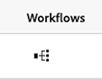

# Gestion des fragments de contenu {#managing-content-fragments}

Découvrez comment gérer vos **fragments de contenu** dans Adobe Experience Manager (AEM) as a Cloud Service, à l’aide de la [console Fragments de contenu](#content-fragments-console) et de l’[éditeur de fragment de contenu](/help/sites-cloud/administering/content-fragments/authoring.md#content-fragment-editor) dédiés. Ces fragments de contenu peuvent être utilisés comme base de votre contenu découplé ou pour la création de pages.

>[!NOTE]
>
>Cette page couvre la section de la console qui affiche (uniquement) les fragments de contenu. Pour les autres panneaux, voir :
>
>* [Gestion des modèles de fragment de contenu](/help/sites-cloud/administering/content-fragments/managing-content-fragment-models.md)
>* [Affichage et gestion d’Assets dans la console Fragments de contenu](/help/sites-cloud/administering/content-fragments/assets-content-fragments-console.md)

Après avoir défini vos [modèles de fragment de contenu](#creating-a-content-model) vous pouvez les utiliser pour :

* [Créer vos fragments de contenu](#creating-a-content-fragment).
* Ouvrez ensuite l’[Éditeur de fragment de contenu](#opening-the-fragment-editor) pour [créer votre contenu et gérer vos variations](#editing-the-content-of-your-fragment).
* [Gérer les balises](#manage-tags)
* [Affichage et modification des propriétés (métadonnées)](#viewing-and-editing-properties)
* [d’affcher l’arborescence de la structure ;](/help/sites-cloud/administering/content-fragments/authoring.md#structure-tree)

>[!NOTE]
>
>Il est possible d’utiliser les fragments de contenu comme suit :
>
>* pour [Diffusion de contenu découplée à l’aide de fragments de contenu avec GraphQL](/help/sites-cloud/administering/content-fragments/content-delivery-with-graphql.md),
>* lors de la création de pages ; voir [Création de pages avec des fragments de contenu](/help/sites-cloud/authoring/fragments/content-fragments.md).

>[!NOTE]
>
>Les fragments de contenu sont stockés sous forme de **ressources**. Ils sont principalement gérés à partir de la console **Fragments de contenu** mais peuvent également être gérés à partir de la console [Ressources](/help/assets/content-fragments/content-fragments-managing.md).

## Structure de base et gestion des fragments de contenu dans la console {#basic-structure-handling-content-fragments-console}

Vous pouvez utiliser le panneau tout à gauche de la console [Fragments de contenu](/help/sites-cloud/administering/content-fragments/overview.md#content-fragments-console) pour sélectionner **Fragments de contenu** comme type de ressource à afficher, parcourir et gérer :


Sélectionnez **Fragments de contenu** pour ouvrir la console dans un nouvel onglet.


Vous pouvez constater ici qu’il existe trois zones principales :

* La barre d’outils supérieure :
   * Fournit les fonctionnalités AEM standard.
   * Affiche également votre organisation IMS.
   * Fournit diverses [actions](#actions-unselected)
* Le panneau de gauche :
   * Vous pouvez y compresser ou développer des liens vers les panneaux
   * Ici, vous pouvez masquer ou afficher l’arborescence de dossiers.
   * Vous pouvez sélectionner une branche spécifique de l’arborescence.
   * Il peut être redimensionné pour afficher les dossiers imbriqués.
   * Outre les fragments de contenu, vous pouvez :
      * Afficher [Modèles de fragment de contenu](/help/sites-cloud/administering/content-fragments/managing-content-fragment-models.md) ou [Assets](/help/sites-cloud/administering/content-fragments/assets-content-fragments-console.md) ; vous pouvez également compresser ou développer des liens vers les panneaux
      * Créer et gérer des [lancements pour les fragments de contenu](/help/sites-cloud/administering/content-fragments/launches-for-content-fragments.md)
* Le panneau principal/droit, à partir duquel vous pouvez :
   * Voir la liste de tous les fragments de contenu dans la branche sélectionnée de l’arborescence :
      * Les fragments de contenu du dossier sélectionné et tous les dossiers enfants s’affichent :
         * L’emplacement est indiqué par les chemins de navigation. Ceux-ci peuvent également être utilisés pour modifier l’emplacement :
      * [Des informations s’affichent pour chaque fragment](#information-content-fragments)
         * [Vous pouvez sélectionner les colonnes à afficher](#select-columns-console)
      * [Plusieurs champs d’information](#information-content-fragments) à propos d’un fragment de contenu fournissent des liens ; en fonction du champ, ces éléments peuvent :
         * Ouvrir le fragment approprié dans l’éditeur
         * Afficher des informations à propos des références
         * Afficher des informations sur les versions linguistiques du fragment
      * [Certains autres champs d’information](#information-content-fragments) à propos d’un fragment de contenu peuvent être utilisés pour le [filtrage rapide](#fast-filtering) :
         * Sélectionnez une valeur dans la colonne pour l’appliquer immédiatement en tant que filtre
         * Le filtrage rapide est pris en charge pour les colonnes **Modèle**, **Statut**, **Modifié par**, **Balises** et **Publié par**.
      * Lorsque vous placez le pointeur de la souris sur les en-têtes de colonne, un sélecteur d’actions déroulant et des curseurs de largeur s’affichent. Ils vous permettent d’effectuer les opérations suivantes :
         * Trier : sélectionnez l’action appropriée pour trier par ordre croissant ou décroissant.
Le tableau entier sera trié en fonction de cette colonne. Le tri n’est disponible que sur les colonnes appropriées.
         * Redimensionnez la colonne à l’aide de l’action ou des curseurs de largeur.
      * Sélectionnez un ou plusieurs fragments pour effectuer d’autres [actions](#actions-selected-content-fragment)
   * Utiliser la zone [Rechercher](#searching-fragments)
   * Ouvrez le panneau [Filtre](#filtering-fragments)
   * Plusieurs [raccourcis clavier](/help/sites-cloud/administering/content-fragments/keyboard-shortcuts.md) sont disponibles dans cette console

## Les informations fournies sur vos fragments de contenu {#information-content-fragments}

Le panneau principal/droit (vue du tableau) de la console fournit diverses informations sur vos fragments de contenu. Certains éléments fournissent également des liens directs vers d’autres actions et/ou informations :

* **Nom**
   * Fournit un lien pour ouvrir le fragment dans l’éditeur.
* **Modèle**
   * Informations uniquement.
   * Peut être utilisé pour le [filtrage rapide](#fast-filtering)
* **Dossier**
   * Fournit un lien pour ouvrir le dossier dans la console.
Placez le pointeur de la souris sur le nom du dossier pour afficher le chemin d’accès JCR.
* **Statut**
   * Informations uniquement.
   * Peut être utilisé pour le [filtrage rapide](#fast-filtering)
* **Aperçu**
   * Informations uniquement :
      * **En synchronisation** : le fragment de contenu est synchronisé sur les servcies **Auteur** et **Aperçu**.
      * **Désynchronisé** : le fragment de contenu n’est pas synchronisé sur les services **Auteur** et **Aperçu**. Vous devez **Publier** pour avoir un **Aperçu** et vous assurer que les deux instances sont de nouveau synchronisées.
      * vide : le fragment de contenu n’existe pas sur le service **Aperçu**.
* **Modifié**
   * Informations uniquement.
* **Modifié par**
   * Informations uniquement.
   * Peut être utilisé pour le [filtrage rapide](#fast-filtering).
* **Balises**
   * Informations uniquement.
   * Affiche toutes les balises liées au fragment de contenu ; principales et éventuelles variations.
   * Peut être utilisé pour le [filtrage rapide](#fast-filtering).
* **Publié sur**
   * Informations uniquement.
* **Publié par**
   * Informations uniquement.
   * Peut être utilisé pour le [filtrage rapide](#fast-filtering).
* **Référencé par** :
   * Fournit un lien qui ouvre une boîte de dialogue répertoriant toutes les [références parentes](#parent-references-fragment) de ce fragment, y compris les références de fragments de contenu, de fragments d’expérience et de pages. Pour ouvrir une référence spécifique, cliquez sur le **Titre** dans la boîte de dialogue.

     

* **Langue** : indiquez les copies [Langue](#language-copies-fragment)

   * Indique les paramètres régionaux du fragment de contenu, ainsi que le nombre total de copies locales/[Langue](#language-copies-fragment) associées au fragment de contenu.

     

   * Sélectionnez le nombre pour ouvrir une boîte de dialogue qui affiche toutes les copies de langue. Pour ouvrir une copie de langue spécifique, cliquez sur le **Titre** dans la boîte de dialogue.

     

* **Workflows**

   * Informations uniquement

   * Sélectionnez l’icône d’un fragment spécifique :

     

     Pour ouvrir une boîte de dialogue contenant des informations détaillées sur les workflows (passés et actuels) du fragment.:

     

## Actions {#actions}

Dans la console, vous pouvez utiliser différentes actions, directement ou après la sélection d’un fragment spécifique :

* Diverses actions sont directement [disponibles à partir de la console](#actions-unselected).
* Vous pouvez [sélectionner un ou plusieurs fragments de contenu pour afficher les actions disponibles](#actions-selected-content-fragment).

### Actions (non sélectionnées) {#actions-unselected}

Certaines actions sont disponibles à partir de la console, sans sélectionner de fragment de contenu spécifique :

* **[Créer](#creating-a-content-fragment)** un fragment de contenu.
* [Filtrer](#filtering-fragments) les fragments de contenu en fonction d’une sélection de prédicats et enregistrer le filtre en vue d’une utilisation ultérieure.
* [Rechercher](#searching-fragments) les fragments de contenu.
* [Personnaliser la vue du tableau pour afficher les colonnes d’informations sélectionnées.](#select-columns-console)
* Utiliser **Ouvrir dans Assets** pour ouvrir directement l’emplacement actuel dans la console **Ressources**

  >[!NOTE]
  >
  >La console **Assets** permet d’accéder aux ressources, telles que les images, les vidéos, etc.  Il est possible d’accéder à cette console :
  >
  >* en utilisant le lien **Ouvrir dans Assets** (dans la console Fragments de contenu) ;
  >* directement à partir du volet **Navigation** global

### Actions pour un fragment de contenu (sélectionné) {#actions-selected-content-fragment}

La sélection d’un fragment spécifique ouvre une barre d’outils axée sur les actions disponibles pour ce fragment. Vous pouvez également sélectionner plusieurs fragments. La sélection des actions sera adaptée en conséquence.


* **[Ouvrir dans un nouvel éditeur](#editing-the-content-of-your-fragment)**
* **[Publier](#publishing-and-previewing-a-fragment)** (et **[Dépublier](#unpublishing-a-fragment)**)
* **[Gérer les balises](#manage-tags)**
* **[Copier](#copy-a-content-fragment)**
* **[Remplacer](#find-and-replace)**
* **Déplacer**
* **Renommer**
* **[Supprimer](#deleting-a-fragment)** (disponible uniquement pour les fragments dépubliés)


>[!NOTE]
>
>Utilisez **Ouvrir** pour ouvrir le fragment sélectionné dans l’éditeur *original*.

>[!NOTE]
>
>Des actions telles que Publier, Dépublier, Supprimer, Déplacer, Renommer et Copier déclenchent chacune une tâche asynchrone. Il est possible de surveiller la progression de ce traitement via l’interface utilisateur des traitements asynchrones AEM.

## Création de fragments de contenu {#creating-content-fragments}

Avant de créer votre fragment de contenu, vous devez créer le modèle de fragment de contenu sous-jacent.

### Création d’un modèle de contenu {#creating-a-content-model}

Les [modèles de fragment de contenu](/help/sites-cloud/administering/content-fragments/managing-content-fragment-models.md) doivent être activés et créés, avant de créer des fragments de contenu avec du contenu structuré.

### Création d’un fragment de contenu {#creating-a-content-fragment}

Pour créer un fragment de contenu :

1. Dans la console **Fragments de contenu**, sélectionnez **Créer** (en haut à droite).

   >[!NOTE]
   >
   >Pour prédéfinir l’emplacement du nouveau fragment, vous pouvez accéder au dossier dans lequel vous souhaitez créer le fragment ou spécifier l’emplacement pendant le processus de création.

1. La boîte de dialogue **Nouveau fragment de contenu** s’ouvre. À partir d’ici, vous pouvez spécifier les éléments suivants :

   * **Emplacement** - Saisie automatique de l’emplacement actuel, mais vous pouvez sélectionner un autre emplacement si nécessaire.
   * **Modèle de fragment de contenu** - Sélectionnez le modèle à utiliser comme base du fragment dans la liste déroulante.
   * **Balise automatique** - Lorsque vous sélectionnez cette option, toutes les balises affectées au modèle de fragment de contenu sont héritées par le nouveau fragment de contenu et lui sont ajoutées.
   * **Titre**
   * **Nom** - Saisie automatique en fonction du **Titre**, mais vous pouvez le modifier, si nécessaire.
   * **Description**

   

1. Sélectionnez **Créer** ou **Créer et ouvrir** pour conserver votre définition.

## Statuts des fragments de contenu {#statuses-content-fragments}

Au cours de son existence, un fragment de contenu peut avoir plusieurs statuts, comme indiqué dans la [Console Fragments de contenu](/help/sites-cloud/administering/content-fragments/overview.md#content-fragments-console) et l’[Éditeur de fragment de contenu](/help/sites-cloud/administering/content-fragments/authoring.md) :

* **Nouveau** (gris)
Un nouveau fragment de contenu a été créé, mais n’a aucun contenu, car il n’a jamais été modifié, ni ouvert, dans l’éditeur de fragment de contenu.
* **Brouillon** (bleu)
Quelqu’un a modifié ou ouvert le (nouveau) fragment de contenu dans l’éditeur de fragment de contenu, mais il n’a pas encore été publié.
* **Publié** (vert)
Le fragment de contenu a été publié.
* **Modifié** (orange)
Le fragment de contenu a été modifié après sa publication (mais avant de publier la modification).
* **Dépublié** (rouge)
La publication du fragment de contenu a été annulée.

## Modification du contenu du fragment (et de ses variations) {#editing-the-content-of-your-fragment}

>[!IMPORTANT]
>
>Pour plus d’informations, [voir Création de fragments de contenu](/help/sites-cloud/administering/content-fragments/authoring.md)

Pour ouvrir votre fragment à des fins de modification :

1. Utilisez la console **Fragments de contenu** afin de naviguer jusqu’à l’emplacement de votre fragment de contenu.
1. Ouvrez le fragment à modifier en le sélectionnant, puis en **Ouvrir dans un nouvel éditeur** dans la barre d’outils.

1. L’éditeur de fragment s’ouvre. Sélectionnez la **Variante** requise et apportez les modifications nécessaires (elles seront enregistrées automatiquement) :

   

## Copier un fragment de contenu {#copy-a-content-fragment}

**Copier** crée une copie du fragment sélectionné à son emplacement.

* Dans l’action **Copier**, vous pouvez choisir de **Copier également les fragments de contenu référencés**. Vous pouvez ainsi copier le fragment de contenu sélectionné et tous les fragments référencés. AEM :

   * Crée une copie du fragment de contenu sélectionné à son emplacement.
   * Crée des copies de tous les fragments référencés par le fragment sélectionné.

     Les [ emplacements vers lesquels les fragments référencés sont copiés](#locations-that-the-referenced-fragments-are-copied-to) dépendent de l’option sélectionnée :

      * **Copier dans le dossier sélectionné**
Lorsque cette option est sélectionnée, les fragments référencés sont copiés au même emplacement que le fragment sélectionné d’origine.

      * **Copiez dans leurs emplacements d’origine**
Les fragments référencés sont copiés au même emplacement que le fragment référencé d’origine. Il s’agit de la valeur par défaut, qui sera utilisée lorsqu’aucune option n’est sélectionnée.

* La copie du fragment sélectionné référencera les copies des fragments référencés.

* Une copie profonde est effectuée. Ainsi, si un fragment de contenu référencé fait également référence à des fragments, ceux-ci sont également copiés.

* L’action **Copy** n’affecte pas les autres contenus référencés, tels que les ressources ou les images. La référence (Référence de contenu) est copiée dans le cadre du nouveau fragment, mais pas le contenu de la ressource/de l’image lui-même.

### Emplacements vers lesquels les fragments référencés sont copiés {#locations-that-the-referenced-fragments-are-copied-to}

Lors de la copie de fragments de contenu, vous pouvez spécifier l’emplacement où les fragments référencés doivent être copiés avec l’option **Copier également les fragments de contenu référencés** et les options associées :


#### Copier dans leurs emplacements d’origine {#copy-to-their-original-locations}

Lorsque vous sélectionnez **Copier vers leur emplacement d’origine**, les fragments référencés sont copiés au même emplacement que le fragment référencé d’origine. Il s’agit également de l’action par défaut lorsqu’aucune sélection n’est effectuée.

Donc, si nous commençons par :

```xml
FolderA 
    FragmentA (inside FolderA)
    | 
    |___FolderB/FragmentB (referenced by FragmentA)

FolderB
   FragmentB
```

La copie du fragment A dans le dossier C entraînerait les éléments suivants :

```xml
FolderA 
    FragmentA (inside FolderA)
    | 
    |___FolderB/FragmentB (referenced by FragmentA)

FolderB
    FragmentB
    Copy_of_FragmentB

FolderC
    Copy_of_FragmentA
    | 
    |___FolderB/Copy_of_FragmentB (referenced by Copy_of_FragmentA)
```

#### Copier dans le dossier sélectionné {#copy-to-the-selected-folder}

Lorsque cette option est sélectionnée, les fragments référencés sont copiés au même emplacement que le fragment sélectionné d’origine.

Donc, si nous commençons par :

```xml
FolderA 
    FragmentA (inside FolderA)
    | 
    |___FolderB/FragmentB (referenced by FragmentA)


FolderB
   FragmentB
```

La copie du fragment A dans le dossier C entraînerait les éléments suivants :

```xml
FolderA 
    FragmentA (inside FolderA) 
    | 
    |___FolderB/FragmentB (referenced by FragmentA) 

FolderB 
    FragmentB


FolderC
   Copy_of_FragmentA
   | 
   |___./Copy_of_FragmentB (referenced by FragmentA)
   Copy_of_FragmentB
```

## Affichage et gestion des balises {#manage-tags}

Dans la console Fragments de contenu , vous pouvez afficher toutes les balises appliquées dans la colonne **Balises**, après vous être assuré que [la colonne s’affiche](#select-columns-console).

### Gérer Les Balises (Console) {#manage-tags-console}

Pour gérer les balises :

1. Accédez à la console Fragment de contenu .
1. Sélectionnez un fragment de contenu.
1. Sélectionnez **Gérer les balises** dans la barre d’outils.
1. Utilisez le sélecteur de balises pour sélectionner les balises à appliquer ou à supprimer :

   

1. Mises à jour **Enregistrer**. Vous revenez alors à la console.

### Affichage et modification des balises (éditeur) {#viewing-and-editing-tags}

Vous pouvez également afficher et modifier les balises appliquées à un fragment à l’aide de l’onglet [Propriétés](/help/sites-cloud/administering/content-fragments/authoring.md) de l’éditeur. Les informations affichées diffèrent entre **Principal** et les **Variations**.

## Affichage et modification des propriétés (éditeur) {#viewing-and-editing-properties}

Vous pouvez afficher et modifier les propriétés (métadonnées) d’un fragment à l’aide de l’onglet [Propriétés](/help/sites-cloud/administering/content-fragments/authoring.md) de l’éditeur. Les informations affichées diffèrent entre **Principal** et les **Variations**.

## Publication et prévisualisation d’un fragment {#publishing-and-previewing-a-fragment}

Vous pouvez publier vos fragments de contenu dans :

* le **[Service de publication](/help/headless/deployment/architecture.md)** - pour un accès public complet ;

* le **[Service de prévisualisation](/help/headless/deployment/architecture.md)** - pour [prévisualiser](/help/sites-cloud/administering/content-fragments/preview.md#preview-instance) le contenu avant sa disponibilité complète.

  >[!CAUTION]
  >
  >La publication de fragments de contenu dans le **service d’aperçu** n’est disponible qu’à partir de la console Fragments de contenu ; à l’aide de l’action **Publier**.

  >[!NOTE]
  >
  >Pour plus d’informations sur les environnements de prévisualisation, voir [Gérer les environnements](/help/implementing/cloud-manager/manage-environments.md#access-preview-service).

>[!CAUTION]
>
>Si votre fragment est basé sur un modèle, vous devez vous assurer que le [modèle a été publié](/help/sites-cloud/administering/content-fragments/managing-content-fragment-models.md#publishing-a-content-fragment-model).
>
>Si vous publiez un fragment de contenu pour lequel le modèle n’a pas encore été publié, une liste de sélection indique cela, ainsi que le fait que le modèle sera publié avec le fragment.

>[!TIP]
>
>Les fragments de contenu peuvent être [publiés sur Edge Delivery Services.](https://www.aem.live/developer/content-fragment-overlay)

### Publication {#publishing}

Vous pouvez publier vos fragments de contenu à l’aide de l’option **Publier** à partir de :

* la barre d’outils de la console [ Fragments de contenu ](#actions-selected-content-fragment)

   * Sélectionnez un ou plusieurs fragments dans la liste.

* la barre d’outils de l’[éditeur de fragments de contenu](/help/sites-cloud/administering/content-fragments/authoring.md#content-fragment-editor)

Après avoir sélectionné l’action **Publier** :

1. Sélectionnez l’une des options suivantes pour ouvrir la boîte de dialogue appropriée :

   * **Maintenant** - sélectionnez le service **Publication** ou le service **Aperçu** ; après confirmation, le fragment sera publié immédiatement
   * **Planification** - en plus du service requis, vous pouvez également sélectionner la date et l’heure de publication du fragment

1. Fournissez tous les détails dans la boîte de dialogue. Par exemple, pour une requête de publication planifiée :

   

   >[!NOTE]
   >
   >Si nécessaire, vous devrez spécifier les références à publier. Par défaut, les références sont également publiées dans le service d’aperçu pour s’assurer qu’il n’y a aucune interruption dans le contenu.

1. Confirmez l’action de publication.

Après publication, le statut du fragment est mis à jour et visible dans l’éditeur et la console. Si vous avez spécifié une publication planifiée, des informations s&#39;affichent.

>[!NOTE]
>
>De plus, lorsque vous [publiez une page qui utilise ce fragment](/help/sites-cloud/authoring/fragments/content-fragments.md#publishing), celui-ci est répertorié dans les références de la page.

## Annuler la publication d’un fragment {#unpublishing-a-fragment}

Vous pouvez dépublier des fragments de contenu :

* la barre d’outils de la console [ Fragments de contenu ](#actions-selected-content-fragment)

   * Sélectionnez un ou plusieurs fragments dans la liste.

* la barre d’outils de l’[éditeur de fragments de contenu](/help/sites-cloud/administering/content-fragments/authoring.md#content-fragment-editor)

Dans les deux cas, sélectionnez **Dépublier** dans la barre d’outils, puis **Maintenant** ou **Planifié**.

Lorsque la boîte de dialogue correspondante s’ouvre, vous pouvez sélectionner le service approprié :


>[!NOTE]
>
>L’action **Dépublier** n’est visible que lorsque des fragments publiés sont disponibles.

>[!CAUTION]
>
>Si le fragment est déjà référencé à partir d’un autre fragment ou d’une page, alors un message d’avertissement s’affiche et vous devez confirmer que vous souhaitez poursuivre.

## Rechercher et remplacer {#find-and-replace}

L’action **Remplacer** est disponible (dans la barre d’outils supérieure) pour rechercher et remplacer du texte spécifié dans les fragments de contenu sélectionnés.


Avant le remplacement, les critères de validation sont vérifiés et vous êtes informé des conflits, ce qui vous permet de modifier la chaîne de remplacement ou de remplacer uniquement les instances validées.

>[!NOTE]
>
>L’action de recherche et de remplacement ne peut être effectuée que sur un maximum de 20 fragments de contenu sélectionnés (à la fois).
>
>Si vous sélectionnez plus de 20 fragments de contenu, le message **Impossible de trouver et de remplacer** s’affiche.


## Suppression d’un fragment {#deleting-a-fragment}

Pour supprimer un fragment :

1. Dans la console **Fragments de contenu**, naviguez jusqu’à l’emplacement de votre fragment de contenu.
1. Sélectionnez le fragment.
1. Sélectionnez **Supprimer** dans la barre d’outils.
1. Confirmez l’action **Supprimer**.

>[!NOTE]
>
>L’option **Supprimer** n’est pas disponible pour les fragments actuellement publiés. Ils doivent d’abord être dépubliés.

## Recherche des références parentes du fragment {#parent-references-fragment}

Les détails des références parentes sont accessibles à partir du

* Colonne **Références** de la console Fragments de contenu
* le lien [références parentes) dans la barre d’outils supérieure de l’éditeur de fragments de contenu](/help/sites-cloud/administering/content-fragments/authoring.md#view-parent-references)

Les deux fournissent un lien qui ouvre une boîte de dialogue répertoriant toutes les références parentes de ce fragment. Cela inclut notamment le référencement de fragments de contenu, de fragments d’expérience et de pages. Pour ouvrir une référence spécifique, cliquez sur le **Titre** ou sur l’icône de lien dans la boîte de dialogue.

Par exemple :


## Recherche des copies de langue du fragment {#language-copies-fragment}

Les détails des copies de langue sont accessibles à partir de :

* la colonne **Langue** de la [Console Fragments de contenu](#information-content-fragments)
* l’onglet [ Copies de langue de l’éditeur de fragments de contenu](/help/sites-cloud/administering/content-fragments/authoring.md#view-language-copies)

L’icône indique les paramètres régionaux du fragment de contenu, ainsi que le nombre total de copies de langue/paramètres régionaux associées au fragment de contenu. Par exemple, à partir de la console :


Sélectionnez le nombre pour ouvrir une boîte de dialogue qui affiche toutes les copies de langue. Pour ouvrir une copie de langue spécifique, cliquez sur le **Titre** dans la boîte de dialogue.


## Sélectionner les colonnes affichées dans la console {#select-columns-console}

Comme pour d’autres consoles, vous pouvez configurer les colonnes visibles et disponibles pour une action :


Vous y trouverez une liste de colonnes que vous pouvez masquer ou afficher :


## Filtrer des fragments {#filtering-fragments}

Le panneau de filtrage offre les options suivantes :

* une sélection de prédicats ;
   * y compris les modèles de fragment de contenu, la localisation, les balises, les champs de statut, etc
   * un ou plusieurs prédicats peuvent être sélectionnés et combinés pour créer le filtre
* **Exclure les éléments de sous-dossier**, ce qui vous donne la possibilité d’exclure les fragments de contenu stockés dans des sous-dossiers
* l’opportunité d’**Enregistrer** votre configuration ;
* l’option permettant de récupérer un filtre de recherche enregistré pour réutilisation.

Une fois sélectionnées, les options **Filtrer par** s’affichent (sous la zone Rechercher). Ils peuvent être désélectionnés à partir de là. Par exemple :


### Filtrage rapide {#fast-filtering}

Vous pouvez également sélectionner un prédicat en cliquant sur une valeur de colonne spécifique dans la liste. Vous pouvez sélectionner une ou plusieurs valeurs pour combiner des prédicats.

Par exemple, sélectionnez **Publié** dans la colonne **Statut** :

>[!NOTE]
>
>Le filtrage rapide est uniquement pris en charge pour les colonnes **Modèle**, **Statut**, **Modifié par**, **Balises** et **Publié par**.


Une fois cette option sélectionnée, elle s’affiche sous forme de prédicat de filtre et la liste est filtrée en conséquence :


## Rechercher des fragments {#searching-fragments}

La zone de recherche prend en charge la recherche de texte intégral. Saisissez vos termes de recherche dans la zone de recherche :


Fournit les résultats sélectionnés :


La zone de recherche permet également d’accéder rapidement aux **Fragments de contenu récents** et aux **Recherches enregistrées** :


