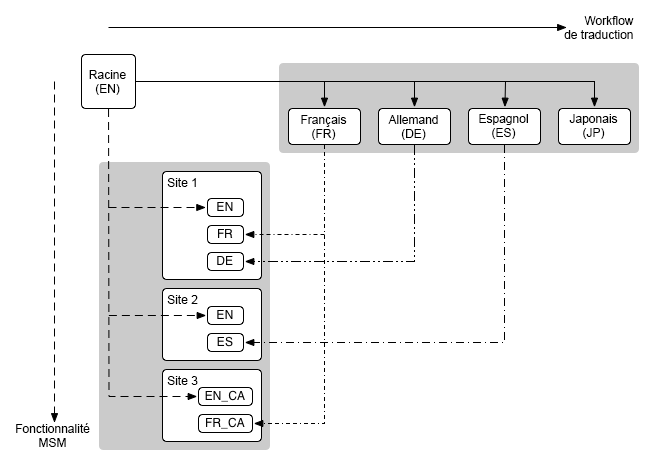

# Multi Site Manager et traduction {#msm-and-translation}

L’intégration de Multi Site Manager et d’outils de traduction à Adobe Experience Manager simplifie la localisation de votre contenu.

* Multi Site Manager (MSM) et ses fonctionnalités Live Copy vous permettent d’utiliser le même contenu de site à plusieurs emplacements, tout en permettant des variations :
   * [Réutilisation de contenu : Multi Site Manager et Live Copy](msm/overview.md)
* La traduction vous permet d’automatiser la traduction du contenu des pages pour créer et tenir à jour des sites web multilingues :
   * [Traduction de contenu pour les sites multilingues](translation/overview.md)

Ces deux fonctions peuvent être combinées pour gérer les sites web qui sont à la fois [internationaux et multilingues](#multinational-and-multilingual-sites).

>[!TIP]
>
>Si vous êtes un débutant dans la traduction de contenu, référez-vous à notre [Parcours de traduction de sites,](/help/journey-sites/translation/overview.md) qui vous guide sur le chemin de la traduction de votre contenu AEM Sites à l’aide des puissants outils de traduction d’AEM, idéaux pour ceux qui ne disposent pas d’une expérience concernant AEM ou la traduction.

## Sites internationaux et multilingues {#multinational-and-multilingual-sites}

Vous pouvez créer efficacement du contenu pour les sites internationaux et multilingues par l’utilisation conjointe de Multi Site Manager et du workflow de traduction.

Vous pouvez généralement créer un gabarit de site dans une langue, pour un pays spécifique, puis utiliser ce contenu comme base des autres sites, à l’aide de la traduction si nécessaire.

1. [Traduisez](translation/overview.md) le site de gabarit dans différentes langues.
1. Utilisez [Multi Site Manager](msm/overview.md) pour effectuer les tâches suivantes :
   1. Réutilisez le contenu du site de gabarit et ses traductions afin de créer des sites pour d’autres pays et cultures.
   1. Si nécessaire, désolidarisez les éléments des Live Copies pour ajouter les détails de localisation.

>[!TIP]
>
>Limitez l’utilisation de Multi Site Manager au contenu d’une seule langue.
>
>Par exemple, utilisez le gabarit anglais pour créer la version anglaise des pages pour les États-Unis, le Canada, la Grande-Bretagne, etc. et utilisez le gabarit français pour créer la version française des pages pour la France, la Suisse, le Canada, etc.

Le diagramme suivant illustre la manière dont les principaux concepts sont en corrélation (mais n’affiche pas tous les niveaux/éléments impliqués) :

Dans ces scénarios et dans d’autres scénarios comparables, MSM ne gère pas les différentes versions de langues en tant que telles.

* [MSM](msm/overview.md) gère le déploiement du contenu traduit d’un plan directeur (par exemple, un gabarit mondial) vers des Live Copies (par exemple, les sites locaux), dans les limites d’une langue.
* Les fonctionnalités d’intégration de [traduction](translation/overview.md) d’AEM, combinées aux services de gestion de traduction tiers, gèrent les langues et le contenu de traduction dans ces différentes langues.

Pour les cas d’utilisation plus avancés, MSM peut également être utilisé dans les gabarits de langue.

>[!TIP]
>
>Dans tous les cas, il est recommandé de lire les bonnes pratiques suivantes :
>
>* [Bonnes pratiques liées à MSM](msm/best-practices.md)
>* [Bonnes pratiques de traduction](translation/best-practices.md)

