# Création et synchronisation de Live Copies {#creating-and-synchronizing-live-copies}

Vous pouvez créer une Live Copy à partir d’une configuration de page ou de plan directeur afin d’utiliser ce contenu plusieurs fois sur votre site. En gérant l’héritage et la synchronisation, vous pouvez contrôler la propagation des modifications apportées au contenu.

## Gestion des configurations de plans directeurs {#managing-blueprint-configurations}

Une configuration de plan directeur identifie un site web existant que vous souhaitez utiliser comme source d’une ou plusieurs pages Live Copy.

>[!TIP]
>
>Les configurations de plan directeur permettent d’appliquer des modifications de contenu à des Live Copies. Voir [Live Copies – Source, plans directeurs et configurations de plan directeur](overview.md#source-blueprints-and-blueprint-configurations).

Lorsque vous créez une configuration de plan directeur, vous sélectionnez un modèle qui définit la structure interne du plan directeur. Le modèle de plan directeur par défaut suppose que le site web source présente les caractéristiques suivantes :

* Le site web comporte une page racine.
* Les pages enfants immédiates de la racine sont des branches de langue du site web. Lors de la création d’une Live Copy, les langues sont présentées sous forme de contenu facultatif à inclure dans la copie.
* La racine de chaque branche de langue possède une ou plusieurs pages enfants. Lors de la création d’une Live Copy, les pages enfants sont présentées sous forme de chapitres que vous pouvez inclure dans la Live Copy.

>[!NOTE]
>
>Une structure différente requiert un modèle de plan directeur différent.

Après avoir créé la configuration de plan directeur, configurez les propriétés suivantes :

* **Nom** : le nom de la configuration de plan directeur
* **Chemin source** : le chemin d’accès de la page racine du site que vous utilisez comme source (plan directeur)
* **Description**. (Facultatif) Description de la configuration de plan directeur qui s’affiche dans la liste des configurations de plans directeurs à choisir lors de la création d’un site.

Lorsque votre configuration de plan directeur est utilisée, vous pouvez l’associer à une configuration de déploiement qui détermine comment les Live Copies de la source ou du plan directeur sont synchronisées. Voir [Spécification des configurations de déploiement à utiliser](live-copy-sync-config.md#specifying-the-rollout-configurations-to-use).

### Création et modification de configurations de plans directeurs {#creating-editing-blueprint-configurations}

Les configurations de plans directeurs sont considérées comme des données non modifiables et ne sont donc pas modifiables au moment de l’exécution. Toutes les modifications de configuration doivent donc être déployées via Git à l’aide du pipeline CI/CD.

Vous trouverez plus d’informations dans l’article [Modifications notables apportées à Adobe Experience Manager (AEM) as a Cloud Service](/help/release-notes/aem-cloud-changes.md).

Les étapes suivantes ne sont mises à la disposition d’un administrateur sur une instance de développement locale qu’à des fins de test et de développement. Ces options ne sont disponibles dans aucune instance cloud AEMaaCS.

#### Création d’une configuration de plan directeur locale {#creating-a-blueprint-configuration}

Pour créer une configuration de plan directeur :

1. [Accédez](/help/sites-cloud/authoring/basic-handling.md#global-navigation) au menu **Outils**, puis sélectionnez le menu **Sites**.
1. Sélectionnez **Plans directeurs** pour ouvrir la console **Configurations de plans directeurs** :

   

1. Sélectionnez **Créer**.
1. Sélectionnez le modèle de plan directeur, puis **Suivant** pour continuer.
1. Sélectionnez la page source à utiliser comme plan directeur, puis cliquez sur **Suivant** pour continuer.
1. Définissez ce qui suit :

   * **Titre** : titre du plan directeur obligatoire
   * **Description** : description facultative pour fournir plus de détails.

1. L’option **Créer** permet de créer la configuration de plan directeur en fonction de votre spécification.

### Modification ou suppression locale d’une configuration de plan directeur{#editing-or-deleting-a-blueprint-configuration}

Vous pouvez modifier ou supprimer une configuration de plan directeur existante :

1. [Accédez](/help/sites-cloud/authoring/basic-handling.md#global-navigation) au menu **Outils**, puis sélectionnez le menu **Sites**.
1. Sélectionnez **Plans directeurs** pour ouvrir la console **Configurations de plans directeurs** :

   

1. Sélectionnez la configuration de plan directeur requise. Les actions appropriées deviennent disponibles dans la barre d’outils :

   * **Propriétés** : permet d’afficher et de modifier les propriétés de la configuration.
   * **Supprimer**

## Création d’une Live Copy {#creating-a-live-copy}

Il existe plusieurs façons de créer une Live Copy.

### Création d’une Live Copy d’une page {#creating-a-live-copy-of-a-page}

Vous pouvez créer une Live Copy de n’importe quelle page ou branche. Lorsque vous créez la Live Copy, vous pouvez spécifier les configurations de déploiement à utiliser pour synchroniser le contenu :

* Les configurations de déploiement sélectionnées s’appliquent à la page Live Copy et ses pages enfants.
* Si vous ne spécifiez aucune configuration de déploiement, MSM détermine les configurations de déploiement à utiliser. Voir [Spécification de la configuration de déploiement à utiliser](live-copy-sync-config.md#specifying-the-rollout-configurations-to-use).

Vous pouvez créer une Live Copy de n’importe quelle page :

* Des pages qui sont référencées à l’aide d’une [configuration de plan directeur](#creating-a-blueprint-configuration)
* Des pages n’ayant aucune connexion avec une configuration
* Live Copy dans les pages d’une autre Live Copy ([Live Copies imbriquées](overview.md#nested-live-copies))

La seule différence est que la disponibilité de la commande **Déployer** sur les pages source/de plan directeur dépend du référencement ou non de la source par une configuration de plan directeur :

* Si vous créez la Live Copy à partir d’une page source qui **est** référencée dans une configuration de plan directeur, la commande Déployer sera disponible sur la ou les pages source/de plan directeur.
* Si vous créez la Live Copy à partir d’une page source qui n’est **pas** référencée dans une configuration de plan directeur, la commande Déployer ne sera pas disponible sur la ou les pages source/de plan directeur.

Pour créer une Live Copy :

1. Dans la console **Sites**, sélectionnez **Créer**, puis **Live Copy**.

   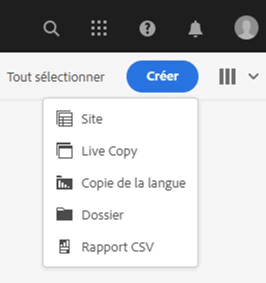

1. Sélectionnez la page source, puis sélectionnez **Suivant**. Par exemple :

   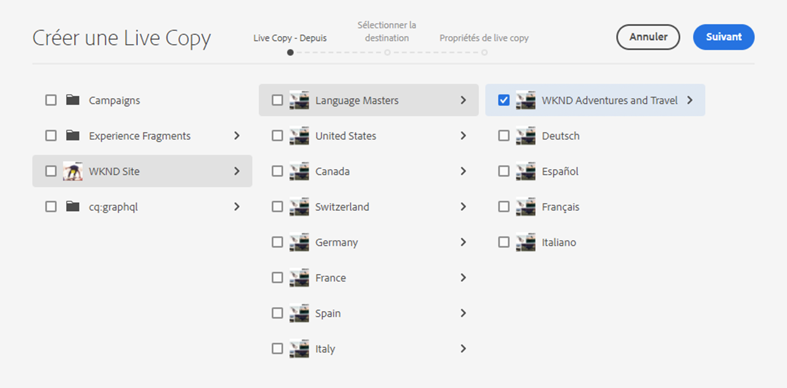 ;

1. Spécifiez le chemin de destination de la Live Copy (ouvrez le dossier/la page parent de la Live Copy), puis sélectionnez **Suivant**.

   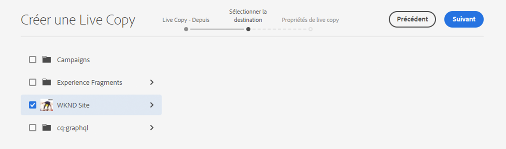

   >[!NOTE]
   >
   >Le chemin de destination ne peut pas se trouver dans le chemin source.

1. Enter :

   * un **titre** pour la page ;
   * un **nom**, utilisé dans l’URL.

   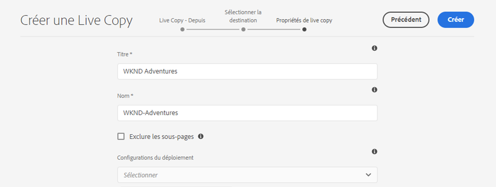

1. Utilisez la case **Exclure les sous-pages** :

   * Cochée : crée une Live Copy de la page sélectionnée uniquement (Live Copy superficielle)
   * Non cochée : crée une Live Copy qui comprend tous les descendants de la page sélectionnée (Live Copy profonde)

1. (Facultatif) Pour spécifier une ou plusieurs configurations de déploiement à utiliser pour la Live Copy, utilisez la liste déroulante **Configurations de déploiement** pour les sélectionner. Les configurations sélectionnées s’affichent sous le sélecteur déroulant.
1. Sélectionnez **Créer**. Un message de confirmation s’affiche où vous pouvez sélectionner **Ouvrir** ou **Terminé**.

   >[!NOTE]
   >
   >Une boîte de dialogue d’erreur peut s’afficher avec le message « Échec de l’envoi du formulaire ». Cela se produit en raison d’un délai d’expiration du réseau. Cependant, le processus de création de la Live Copy s’exécute en arrière-plan. Patientez quelques minutes et vérifiez que les pages de la Live Copy ont été correctement créées.

### Création d’une Live Copy d’un site à partir d’une configuration de plan directeur {#creating-a-live-copy-of-a-site-from-a-blueprint-configuration}

Créez une Live Copy à l’aide d’une configuration de plan directeur pour créer un site en fonction du contenu de plan directeur (source). Lorsque vous créez une Live Copy à partir d’une configuration de plan directeur, vous sélectionnez une ou plusieurs branches de langue de la source de plan directeur à copier, puis vous sélectionnez les chapitres à copier à partir des branches de langue. Consultez [Création d’une configuration de plan directeur](#creating-a-blueprint-configuration).

Si vous avez oublié certaines branches de langue pour la Live Copy, vous pouvez les ajouter ultérieurement. Pour plus d’informations, consultez [Création d’une Live Copy dans une Live Copy (configuration de plan directeur)](#creating-a-live-copy-inside-a-live-copy-blueprint-configuration).

>[!CAUTION]
>
>Lorsque la source de plan directeur contient des liens et des références qui ciblent un paragraphe dans une autre branche, les cibles ne sont pas mises à jour dans les pages Live Copy, mais continuent à désigner l’emplacement d’origine.

Lorsque vous créez le site, saisissez des valeurs pour les propriétés suivantes :

* **Langues initiales** : branches de langue de la source de plan directeur à inclure dans la Live Copy
* **Chapitres initiaux** : pages enfants des branches de langue de plan directeur à inclure dans la Live Copy
* **Chemin de destination** : emplacement de la page racine du site Live Copy
* **Titre** : titre de la page racine du site Live Copy
* **Nom** : (facultatif) nom du nœud JCR qui stocke la page racine de la Live Copy (la valeur par défaut est basée sur le titre)
* **Propriétaire du site** : (facultatif) informations sur le responsable de la Live Copy
* **Live Copy** : sélectionnez cette option pour établir une relation en direct avec le site source. Si vous ne sélectionnez pas cette option, une copie du plan directeur est créée, mais n’est pas synchronisée ultérieurement avec la source.
* **Configurations de déploiement** : (facultatif) sélectionnez une ou plusieurs configurations de déploiement à utiliser pour synchroniser la Live Copy. Par défaut, les configurations de déploiement sont héritées du plan directeur. Pour plus d’informations](live-copy-sync-config.md#specifying-the-rollout-configurations-to-use) voir [ Spécification des configurations de déploiement à utiliser .

Pour créer une Live Copy d’un site à partir d’une configuration de plan directeur :

1. Dans la console **Sites**, sélectionnez **Créer**, puis **Site** dans le sélecteur déroulant.
1. Sélectionnez la configuration de plan directeur à utiliser comme source de la Live Copy et cliquez sur **Suivant** :

   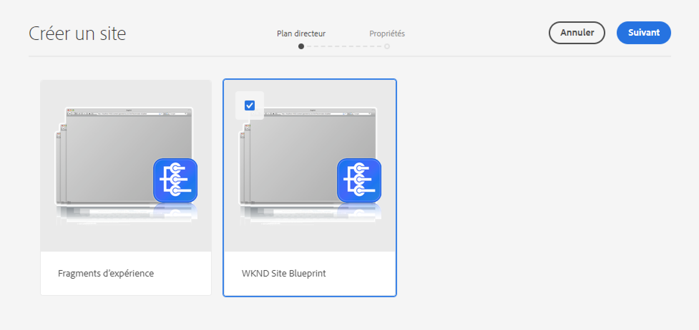

1. Utilisez le sélecteur **Langues initiales** pour spécifier les langues du site de plan directeur à utiliser pour la Live Copy.

   Toutes les langues disponibles sont sélectionnées par défaut. Pour supprimer une langue, sélectionnez la **X** qui s’affiche en regard de la langue.

   Par exemple :

   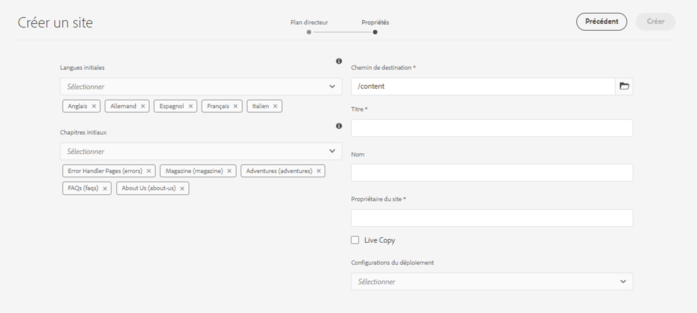

1. Utilisez la liste déroulante **Chapitres initiaux** pour sélectionner les sections du plan directeur à inclure dans la Live Copy. Tous les chapitres disponibles sont inclus par défaut mais peuvent être supprimés.
1. Saisissez les valeurs des propriétés restantes, puis sélectionnez **Créer**. Dans la boîte de dialogue de confirmation, sélectionnez **Terminé** pour revenir à la console **Sites**, ou **Ouvrir le site** pour ouvrir la page racine du site.

### Création d’une Live Copy dans une Live Copy (configuration de plan directeur) {#creating-a-live-copy-inside-a-live-copy-blueprint-configuration}

Lorsque vous créez une Live Copy à l’intérieur de la Live Copy existante (créée avec une configuration de plan directeur), vous pouvez insérer n’importe quelle copie de langue ou n’importe quel chapitre qui n’était pas inclus lors de la création initiale de la Live Copy.

## Surveillance de votre Live Copy {#monitoring-your-live-copy}

### Affichage du statut d’une Live Copy {#seeing-the-status-of-a-live-copy}

Les propriétés d’une page Live Copy affichent les informations suivantes sur la Live Copy :

* **Source** : page source de la page Live Copy
* **Statut** : statut de synchronisation de la Live Copy, y compris si la Live Copy est à jour avec la source, la date de la dernière synchronisation et l’auteur de la synchronisation.
* **Configuration** :

   * Si la page est encore soumise à l’héritage Live Copy
   * Si la configuration est héritée de la page parent
   * Toutes les configurations de déploiement utilisées par la Live Copy

Pour afficher les propriétés :

1. Dans la console **Sites**, sélectionnez la page Live Copy et ouvrez les propriétés.
1. Sélectionnez l’onglet **Live Copy**.

   Par exemple :

   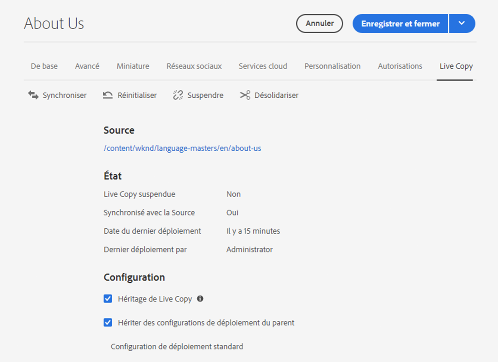

   Pour plus d’informations, consultez la section [Utilisation de la fonction Aperçu de la Live Copy](live-copy-overview.md#using-the-live-copy-overview) dans l’article Console Aperçu de la Live Copy.

### Affichage des Live Copies d’une page de plan directeur {#seeing-the-live-copies-of-a-blueprint-page}

Les pages de plan directeur (référencées dans la configuration de plan directeur) fournissent une liste des pages Live Copy qui utilisent la page (plan directeur) actuelle comme source. Utilisez cette liste pour conserver la trace des Live Copies. La liste s’affiche dans l’onglet **Plan directeur** des [propriétés de page](/help/sites-cloud/authoring/sites-console/page-properties.md).

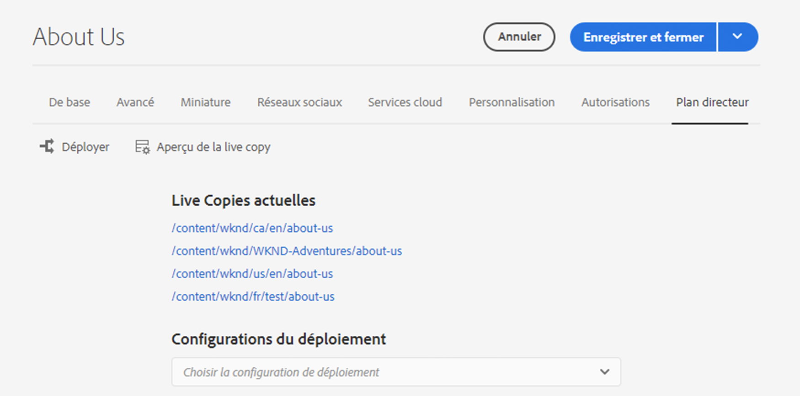

## Synchronisation de votre Live Copy {#synchronizing-your-live-copy}

Il existe plusieurs façons de synchroniser votre Live Copy.

### Déploiement d’un plan directeur {#rolling-out-a-blueprint}

Déployez une page de plan directeur pour pousser les modifications de contenu vers les Live Copies. L’action **Déployer** exécute les configurations de déploiement qui utilisent le déclencheur [En cas de déploiement](live-copy-sync-config.md#rollout-triggers).

>[!NOTE]
>
>Des conflits peuvent apparaître si de nouvelles pages portant le même nom de page sont créées dans la branche de plan directeur et dans une branche de Live Copy dépendante.
>
>Ces [conflits doivent être traités et résolus lors du déploiement](rollout-conflicts.md).

#### Déploiement d’un plan directeur à partir des propriétés de page {#rolling-out-a-blueprint-from-page-properties}

1. Dans la console **Sites**, sélectionnez la page dans le plan directeur et ouvrez les propriétés.
1. Ouvrez l’onglet **Plan directeur**.
1. Sélectionnez **Déploiement**.

   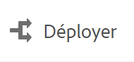

1. Spécifiez les pages et les sous-pages puis confirmez en cochant :

   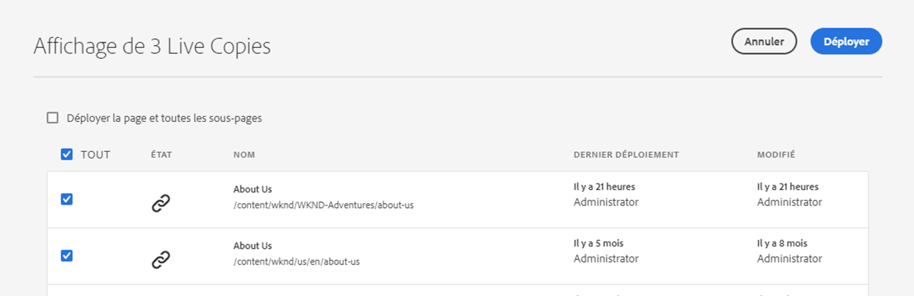

1. Indiquez si la tâche de déploiement doit être exécutée immédiatement (**Maintenant**) ou à un autre moment (**Ultérieurement**).

   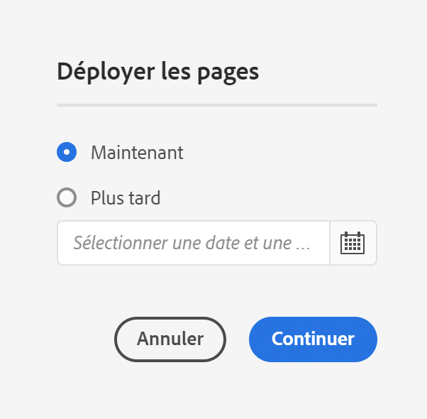

Les déploiements sont traités comme des tâches asynchrones et peuvent être vérifiés sur la page [***Statut des tâches asynchrones**](/help/operations/asynchronous-jobs.md#monitor-the-status-of-asynchronous-operations).

#### Déploiement d’un plan directeur à partir du rail de référence {#roll-out-a-blueprint-from-the-reference-rail}

1. Dans la console **Sites**, sélectionnez la page dans la Live Copy et ouvrez le panneau **[Références](/help/sites-cloud/authoring/basic-handling.md#references)** (via la barre d’outils).
1. Sélectionnez l’option **Plans directeurs** dans la liste pour afficher les plans directeurs associés à cette page.
1. Sélectionnez le plan directeur requis dans la liste.
1. Sélectionnez **Déploiement**.

   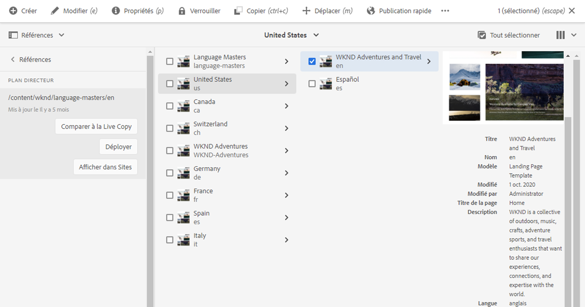

1. Le système vous invite à confirmer les détails du déploiement :

   * **Étendue du déploiement** :

     indique si l’étendue correspond à la page sélectionnée seule ou doit inclure les sous-pages.

   * **Planification** :

     indique si la tâche de déploiement doit être exécutée immédiatement (**Maintenant**) ou à un autre moment (**Ultérieurement**).

     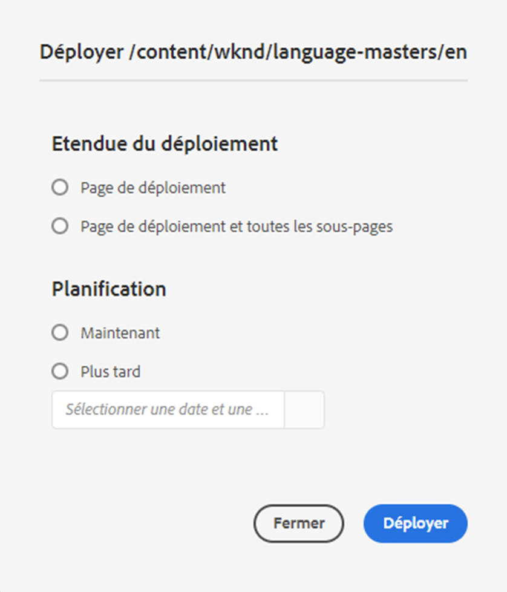

1. Après avoir défini ces détails, sélectionnez **Déployer** pour exécuter l’opération.

Les déploiements sont traités comme des tâches asynchrones et peuvent être vérifiés sur la page [**Statut des tâches asynchrones**](/help/operations/asynchronous-jobs.md#monitor-the-status-of-asynchronous-operations).

#### Déploiement d’un plan directeur de l’aperçu de la Live Copy {#roll-out-a-blueprint-from-the-live-copy-overview}

L’action [**Déployer** est également disponible dans l’aperçu de la Live Copy](live-copy-overview.md#using-the-live-copy-overview) lorsqu’une page Plan directeur est sélectionnée.

1. Ouvrez la [vue d’ensemble de la Live Copy](live-copy-overview.md#using-the-live-copy-overview) et sélectionnez une page de plan directeur.
1. Sélectionnez **Déploiement** dans la barre d’outils.

   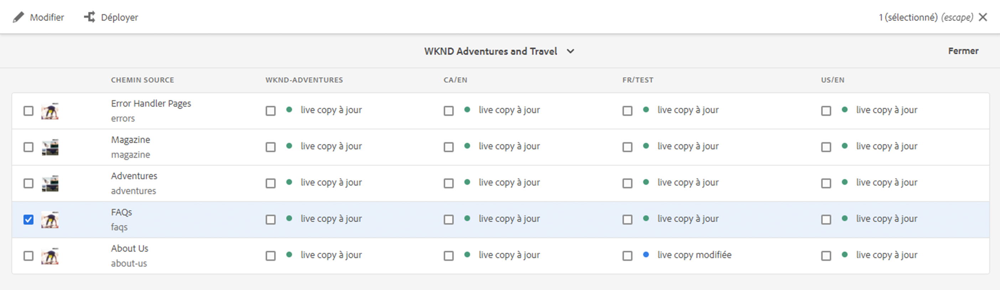

1. Spécifiez les pages et les sous-pages puis confirmez en cochant :

   

1. Indiquez si la tâche de déploiement doit être exécutée immédiatement (**Maintenant**) ou à un autre moment (**Ultérieurement**).

   

Les déploiements sont traités comme des tâches asynchrones et peuvent être vérifiés sur la page [**Statut des tâches asynchrones**](/help/operations/asynchronous-jobs.md#monitor-the-status-of-asynchronous-operations).

### Synchronisation d’une Live Copy {#synchronizing-a-live-copy}

Synchronisez une page de Live Copy pour extraire des modifications de contenu de la source vers la Live Copy.

#### Synchronisation d’une Live Copy à partir des propriétés de page {#synchronize-a-live-copy-from-page-properties}

Synchronisez une Live Copy pour extraire des modifications de la source vers la Live Copy.

>[!NOTE]
>
>La synchronisation effectue les configurations de déploiement qui utilisent le déclencheur [En cas de déploiement](live-copy-sync-config.md#rollout-triggers).

1. Dans la console **Sites**, sélectionnez la page Live Copy et ouvrez les propriétés.
1. Ouvrez l’onglet **Live Copy**.
1. Sélectionnez **Synchroniser**.

   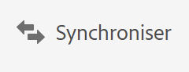

   Une confirmation est demandée ; utilisez **Synchroniser** pour continuer.

#### Synchroniser une Live Copy à partir de l’aperçu de la Live Copy {#synchronize-a-live-copy-from-the-live-copy-overview}

L’[action Syncroniser est également disponible dans la vue d’ensemble de la Live Copy](live-copy-overview.md#using-the-live-copy-overview), lorsqu’une page Live Copy est sélectionnée.

1. Ouvrez l’[aperçu de la Live Copy](live-copy-overview.md#using-the-live-copy-overview) et sélectionnez une page Live Copy.
1. Sélectionnez **Synchroniser** dans la barre d’outils.
1. Confirmez l’action **Déployer** dans la boîte de dialogue après avoir indiqué si vous souhaitez inclure :

   * **une page et des sous-pages** ;
   * **une page seulement**.

   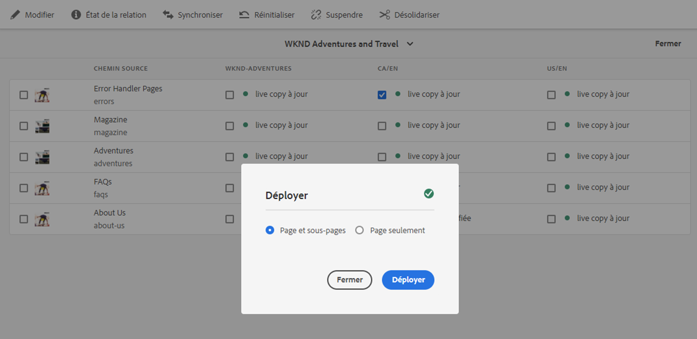

## Modification du contenu de Live Copy {#changing-live-copy-content}

Pour modifier le contenu de Live Copy, vous pouvez :

* ajouter des paragraphes à la page ;
* mettre le contenu existant à jour en rompant l’héritage de Live Copy pour une page ou un composant.

>[!TIP]
>
>Si vous créez manuellement une page dans la Live Copy, la nouvelle page est locale à la Live Copy, ce qui signifie qu’elle n’a pas de page source correspondante à laquelle être rattachée.
>
>Une bonne pratique vous permettant de créer une page locale qui fait partie de la relation, consiste à créer la page locale dans la source et d’effectuer un déploiement en profondeur. Ceci a pour effet de créer la page localement en tant que Live Copies.

>[!NOTE]
>
>Des conflits peuvent apparaître si de nouvelles pages portant le même nom de page sont créées dans la branche de plan directeur et dans une branche de Live Copy dépendante.
>
>Ces [conflits doivent être traités et résolus lors du déploiement](rollout-conflicts.md).

### Ajout de composants à une page Live Copy {#adding-components-to-a-live-copy-page}

Vous pouvez ajouter des composants à une page Live Copy à tout moment. Le statut d’héritage de la Live Copy et de son système de paragraphes ne conditionne pas votre capacité à ajouter des composants.

Lorsque la page Live Copy est synchronisée avec la page source, les composants ajoutés demeurent inchangés. Consultez également la section [Modification de l’ordre des composants sur une page Live Copy](#changing-the-order-of-components-on-a-live-copy-page).

>[!TIP]
>
>Les modifications apportées localement à un composant marqué en tant que conteneur ne sont pas remplacées par le contenu du plan directeur lors d’un déploiement. Consultez [Bonnes pratiques liées à MSM](best-practices.md#components-and-container-synchronization) pour plus d’informations.

### Suspension de l’héritage pour une page {#suspending-inheritance-for-a-page}

Lorsque vous créez une Live Copy, sa configuration est enregistrée sur la page racine des pages copiées. Toutes les pages enfants de la page racine héritent des configurations de la Live Copy. Les composants sur les pages Live Copy héritent également de la configuration de la Live Copy.

Vous pouvez suspendre l’héritage de Live Copy d’une page Live Copy afin de pouvoir modifier les propriétés et les composants de la page. Lorsque vous suspendez l’héritage, les propriétés et les composants de la page ne sont plus synchronisés avec la source.

>[!TIP]
>
>Vous pouvez également [désolidariser une Live Copy](#detaching-a-live-copy) de son plan directeur pour supprimer toutes les connexions. Contrairement à la suspension de l’héritage, l’action de désolidarisation est permanente et non réversible.

#### Suspension de l’héritage à partir des propriétés de page {#suspending-inheritance-from-page-properties}

Pour suspendre l’héritage sur une page, procédez comme suit :

1. Ouvrez les propriétés de la page Live Copy à l’aide de la commande **Afficher les propriétés** de la console **Sites** ou des **Informations sur la page** de la barre d’outils de la page.
1. Sélectionnez l’onglet **Live Copy**.
1. Sélectionnez **Suspendre** dans la barre d’outils. Vous pouvez ensuite sélectionner l’une des options suivantes :

   * **Suspendre** : pour suspendre uniquement la page active.
   * **Suspendre avec pages enfants** : pour suspendre la page en cours avec toutes ses pages enfants.

1. Sélectionnez **Suspendre** dans la boîte de dialogue de confirmation.

#### Suspension de l’héritage à partir de l’aperçu de la Live Copy {#suspending-inheritance-from-the-live-copy-overview}

L’[action Suspendre est également disponible dans la vue d’ensemble de la Live Copy](live-copy-overview.md#using-the-live-copy-overview), lorsqu’une page Live Copy est sélectionnée.

1. Ouvrez l’[aperçu de la Live Copy](live-copy-overview.md#using-the-live-copy-overview) et sélectionnez une page Live Copy.
1. Sélectionnez **Suspendre** dans la barre d’outils.
1. Sélectionnez l’option appropriée parmi :

   * **Suspendre**
   * **Suspendre avec enfants**

   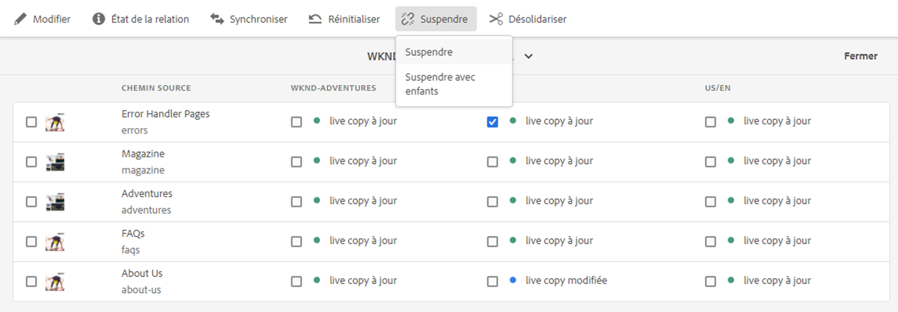

1. Confirmez l’action **Suspendre** dans la boîte de dialogue **Suspendre la Live Copy** :

   

### Reprise de l’héritage pour une page {#resuming-inheritance-for-a-page}

La suspension de l’héritage de Live Copy pour une page est une action temporaire. Une fois l’héritage suspendu, l’action **Reprendre** devient disponible, ce qui vous permet de rétablir la relation en direct.

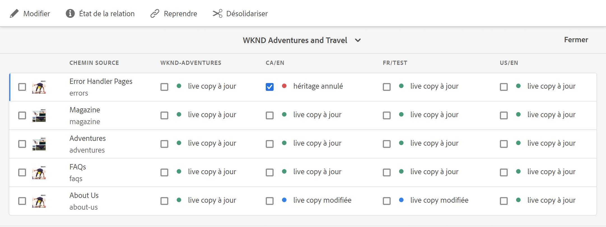

Lorsque vous réactivez l’héritage, la page n’est pas automatiquement synchronisée avec la source. Vous pouvez demander une synchronisation si nécessaire :

* Dans la boîte de dialogue **Réactiver**/**Rétablir**, par exemple :

  

* Ultérieurement, en sélectionnant manuellement l’action de synchronisation.

>[!NOTE]
>
>Lorsque vous réactivez l’héritage, la page n’est pas automatiquement synchronisée avec la source. Si nécessaire, vous pouvez demander une synchronisation manuellement au moment de la réactivation ou plus tard.

#### Reprise de l’héritage à partir des propriétés de page {#resuming-inheritance-from-page-properties}

Une fois l’héritage [suspendu](#suspending-inheritance-from-page-properties), l’action **Reprendre** devient disponible dans la barre d’outils des propriétés de page :

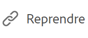

Lorsque cette option est sélectionnée, la boîte de dialogue s’affiche. Vous pouvez sélectionner une synchronisation, si nécessaire, puis confirmer l’action.

#### Reprise d’une page Live Copy à partir de l’aperçu de la Live Copy {#resume-a-live-copy-page-from-the-live-copy-overview}

L’[action Reprendre est également disponible dans l’aperçu de la Live Copy](live-copy-overview.md#using-the-live-copy-overview), lorsqu’une page Live Copy est sélectionnée.

1. Ouvrez l’[aperçu de la Live Copy](live-copy-overview.md#using-the-live-copy-overview) et sélectionnez une page Live Copy suspendue. La page affichera **HÉRITAGE ANNULÉ**.
1. Sélectionnez **Reprendre** dans la barre d’outils.
1. Indiquez si vous souhaitez synchroniser la page après le rétablissement de l’héritage, puis confirmez l’action **Reprendre** dans la boîte de dialogue **Reprendre la Live Copy**.

### Changement de la profondeur d’héritage (superficielle/profonde) {#changing-inheritance-depth-shallow-deep}

Sur une Live Copy existante, vous pouvez changer la profondeur d’une page, c’est-à-dire indiquer si les pages enfants sont incluses.

* Le passage à une Live Copy superficielle :

   * prend immédiatement effet et est irréversible.

   * Détache explicitement les pages enfants de la Live Copy. Les autres modifications des pages enfants ne peuvent pas être préservées si elles sont annulées.

   * Supprime tous les descendants `LiveRelationships` même s’il s’agit de `LiveCopies` imbriquées.

* Le passage à une Live Copy profonde :

   * n’affecte pas les pages enfants.
   * Pour visualiser l’effet de la transition, vous pouvez procéder à un déploiement ; toutes les modifications de contenu sont appliquées en fonction de la configuration de déploiement.

* Le passage à une Live Copy superficielle puis le retour à une Live Copy profonde :

   * traite tous les enfants de la Live Copy (anciennement) peu profonde comme s’ils avaient été créés manuellement et les déplace donc en utilisant `[oldname]_msm_moved name`.

Pour spécifier ou changer la profondeur :

1. Ouvrez les propriétés de la page Live Copy à l’aide de la commande **Afficher les propriétés** de la console **Sites** ou des **Informations sur la page** de la barre d’outils de la page.
1. Sélectionnez l’onglet **Live Copy**.
1. Dans la section **Configuration**, définissez ou effacez l’option **Héritage de Live Copy** selon l’inclusion ou non des pages enfants :

   * Cochée : Live Copy profonde (les pages enfants sont incluses)
   * Décochée : Live Copy superficielle (les pages enfants sont exclues)

   >[!CAUTION]
   >
   >Le passage à une Live Copy superficielle prend effet immédiatement et est irréversible.
   >
   >Voir [Live Copies – Composition](overview.md#live-copies-composition) pour plus d’informations.

1. Sélectionnez **Enregistrer** pour conserver vos mises à jour.

### Annulation de l’héritage pour un composant {#cancelling-inheritance-for-a-component}

Annulez l’héritage Live Copy d’un composant afin que ce composant ne soit plus synchronisé avec le composant source. Vous pouvez activer l’héritage ultérieurement, si nécessaire.

>[!NOTE]
>
>Lorsque vous réactivez l’héritage, le composant n’est pas automatiquement synchronisé avec la source. Vous pouvez demander manuellement une synchronisation si nécessaire.

Annulez l’héritage pour modifier le contenu du composant ou supprimer le composant :

1. Sélectionnez le composant pour lequel vous souhaitez annuler l’héritage.

   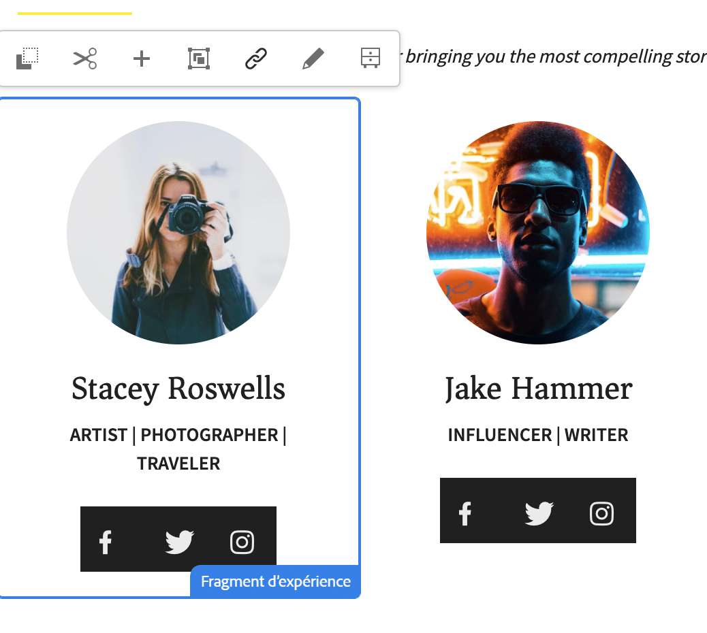

1. Dans la barre d’outils du composant, sélectionnez l’icône **Annuler l’héritage**.

   

1. Dans la boîte de dialogue Annuler l’héritage, confirmez l’action par **Oui**.

   La barre d’outils du composant est mise à jour afin d’inclure toutes les commandes d’édition (appropriées).

### Réactivation de l’héritage pour un composant {#re-enabling-inheritance-for-a-component}

Pour activer l’héritage pour un composant, sélectionnez l’icône **Réactiver l’héritage** dans la barre d’outils du composant.

### Modification de l’ordre des composants sur une page Live Copy {#changing-the-order-of-components-on-a-live-copy-page}

Si une Live Copy contient des composants faisant partie d’un système de paragraphes, l’héritage de ce système de paragraphes suit les règles suivantes :

* L’ordre des composants dans un système de paragraphes hérité peut être modifié, même si l’héritage est établi.
* Sur le déploiement, l’ordre des composants est restauré à partir du plan directeur. Si de nouveaux composants ont été ajoutés à la Live Copy avant le déploiement, ils sont réorganisés avec les composants au-dessus desquels ils ont été ajoutés.
* Si l’héritage du système de paragraphes est annulé, l’ordre des composants n’est pas restauré lors du déploiement et reste inchangé dans la Live Copy.

>[!NOTE]
>
>Lors de la restauration d’un héritage annulé sur un système de paragraphes, l’ordre des composants **n’est pas automatiquement restauré** à partir du plan directeur. Vous pouvez demander manuellement une synchronisation si nécessaire.

Utilisez la procédure suivante pour annuler l’héritage du système de paragraphes.

1. Ouvrez la page Live Copy.
1. Faites glisser un composant existant vers un nouvel emplacement sur la page.
1. Dans la boîte de dialogue **Annuler l’héritage**, confirmez l’action par **Oui**.

### Remplacement des propriétés d’une page Live Copy {#overriding-properties-of-a-live-copy-page}

Par défaut, les propriétés de page d’une page Live Copy sont héritées de la page source et ne sont pas modifiables.

Vous pouvez annuler l’héritage pour une propriété lorsque vous devez modifier la valeur de la propriété pour la Live Copy. Une icône de lien indique que l’héritage est activé pour la propriété.

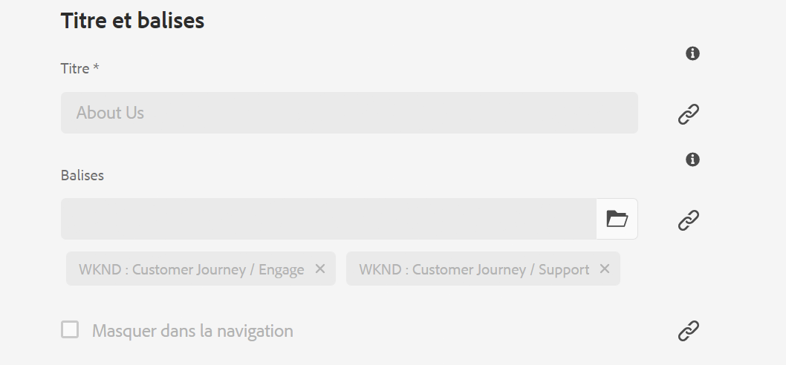

Lorsque vous annulez l’héritage, vous pouvez modifier la valeur de la propriété. Une icône de lien rompu indique que l’héritage est annulé.

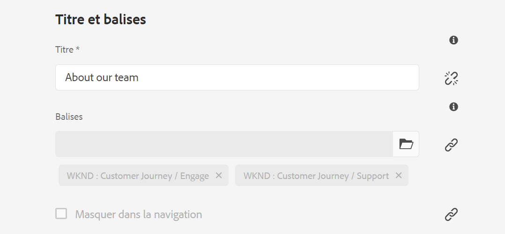

Vous pourrez par la suite réactiver l’héritage pour une propriété, si nécessaire.

>[!NOTE]
>
>Lorsque vous réactivez l’héritage, la propriété de page de la Live Copy n’est pas automatiquement synchronisée avec la propriété source. Vous pouvez demander manuellement une synchronisation si nécessaire.

1. Ouvrez les propriétés de la page Live Copy à l’aide de l’option **Afficher les propriétés** de la console **Sites** ou de l’icône **Informations sur la page** de la barre d’outils de la page.
1. Pour annuler l’héritage d’une propriété, sélectionnez l’icône de lien qui s’affiche à droite de la propriété.

   

1. Dans la boîte de dialogue de confirmation **Annuler l’héritage**, sélectionnez **Oui**.

### Rétablissement des propriétés d’une page Live Copy {#revert-properties-of-a-live-copy-page}

Pour activer l’héritage d’une propriété, sélectionnez l’icône **Inverser l’héritage** qui s’affiche en regard de la propriété.

### Réinitialisation d’une page Live Copy {#resetting-a-live-copy-page}

Vous pouvez réinitialiser une page Live Copy pour effectuer les opérations suivantes :

* supprimer toutes les annulations d’héritage ;
* restaurer la page au même statut que la page source.

La réinitialisation affecte les modifications que vous avez apportées aux propriétés de la page, au système de paragraphes et aux composants.

#### Réinitialisation d’une page Live Copy à partir des propriétés de la page {#reset-a-live-copy-page-from-the-page-properties}

1. Dans la console **Sites**, sélectionnez la page Live Copy, puis sélectionnez **Afficher les propriétés**.
1. Ouvrez l’onglet **Live Copy**.
1. Sélectionnez **Réinitialiser** dans la barre d’outils.

   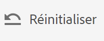

1. Dans la boîte de dialogue **Réinitialiser la Live Copy**, confirmez en cliquant sur **Réinitialiser**.

#### Réinitialisation d’une page Live Copy à partir de l’aperçu de la Live Copy {#reset-a-live-copy-page-from-the-live-copy-overview}

L’action [**Réinitialiser** est également disponible dans l’aperçu de la Live Copy](live-copy-overview.md#using-the-live-copy-overview), lorsqu’une page Live Copy est sélectionnée.

1. Ouvrez l’[aperçu de la Live Copy](live-copy-overview.md#using-the-live-copy-overview) et sélectionnez une page Live Copy.
1. Sélectionnez **Réinitialiser** dans la barre d’outils.
1. Confirmez l’action **Réinitialiser** dans la boîte de dialogue **Réinitialiser la Live Copy** :

   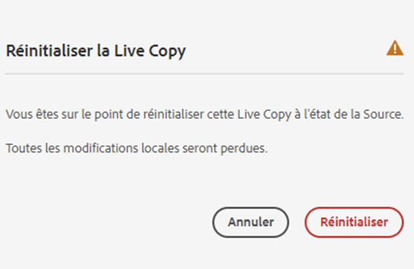

## Comparaison d’une page Live Copy à une page de plan directeur {#comparing-a-live-copy-page-with-a-blueprint-page}

Pour suivre les modifications que vous avez apportées, vous pouvez afficher la page de plan directeur dans la section **Références** et la comparer à sa page Live Copy :

1. Dans la console **Sites**, [accédez à une page Live Copy ou de plan directeur et sélectionnez-la](/help/sites-cloud/authoring/basic-handling.md#viewing-and-selecting-resources).
1. Ouvrez le panneau **[Références](/help/sites-cloud/authoring/basic-handling.md#references)** et, selon le contexte, sélectionnez l’une des options suivantes :

   * **Plan directeur**
   * **Live Copies**

1. Sélectionnez la Live Copy en fonction du contexte et sélectionnez l’une des options suivantes :

   * **Comparer au plan directeur**
   * **Comparer à la Live Copy**

   Par exemple :

   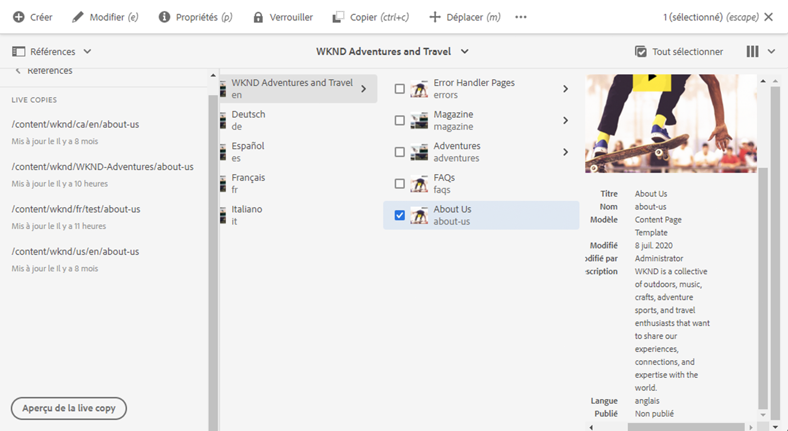

1. Les pages Live Copy et les pages du plan directeur s’ouvrent côte à côte.

   Pour obtenir des informations complètes sur l’utilisation de cette fonctionnaité, consultez [Différence entre les pages](/help/sites-cloud/authoring/sites-console/page-diff.md).

## Désolidarisation d’une Live Copy {#detaching-a-live-copy}

L’action Désolidariser supprime définitivement les relations en direct entre une Live Copy et sa page source ou de plan directeur. Toutes les propriétés MSM sont supprimées de la Live Copy et les pages Live Copy deviennent une copie autonome.

>[!CAUTION]
>
>Vous ne pouvez pas rétablir les relations en direct après avoir désolidarisé la Live Copy.
>
>Pour supprimer les relations en direct avec la possibilité de les rétablir ultérieurement, vous pouvez [annuler l’héritage de la Live Copy](#suspending-inheritance-for-a-page) pour la page.

Il existe des implications liées à l’endroit dans l’arborescence où vous utilisez l’option **Désolidariser** :

* **Désolidariser sur la page racine d’une Live Copy**

  Lorsque cette opération est effectuée sur la page racine d’une Live Copy, elle supprime les relations en direct entre toutes les pages du plan directeur et sa Live Copy.

  Les futures modifications apportées aux pages du plan directeur **n’auront pas** d’impact sur la Live Copy.

* **Désolidarisation sur une sous-page d’une Live Copy**

  Lorsque cette opération est effectuée sur une sous-page (ou branche) dans une Live Copy :

   * les relations en direct sont supprimées pour cette sous-page (ou branche) ;
   * les sous-pages ou pages dans la branche Live Copy sont traitées comme si elles avaient été créées manuellement.

  Toutefois, les sous-pages étant encore soumises aux relations en direct de la branche parent, un autre déploiement de la ou des pages de plan directeur aura à la fois pour effet :

   1. De renommer les pages désolidarisées :

      * En effet, MSM les considère comme des pages créées manuellement provoquant un conflit, car portant le même nom que les pages Live Copy qu’il tente de créer.

   1. De créer une page Live Copy avec le nom d’origine et contenant les modifications du déploiement.

  >[!NOTE]
  >
  >Consultez la section [Conflits de déploiement MSM](rollout-conflicts.md) pour obtenir des détails sur ces situations.

### Désolidarisation d’une page Live Copy à partir des propriétés de la page {#detach-a-live-copy-page-from-the-page-properties}

Pour désolidariser une Live Copy :

1. Dans la console **Sites**, sélectionnez la page Live Copy, puis sélectionnez **Afficher les propriétés**.
1. Ouvrez l’onglet **Live Copy**.
1. Dans la barre d’outils, sélectionnez **Désolidariser**.

   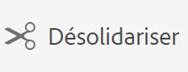

1. Une boîte de dialogue de confirmation s’affiche. Sélectionnez **Désolidariser** pour terminer l’action.

### Dissocier une page Live Copy de l’aperçu de la Live Copy {#detach-a-live-copy-page-from-the-live-copy-overview}

L’[action Désolidariser est également disponible dans la vue d’ensemble de la Live Copy](live-copy-overview.md#using-the-live-copy-overview), lorsqu’une page Live Copy est sélectionnée.

1. Ouvrez l’[aperçu de la Live Copy](live-copy-overview.md#using-the-live-copy-overview) et sélectionnez une page Live Copy.
1. Sélectionnez **Désolidariser** dans la barre d’outils.
1. Confirmez l’action **Désolidariser** dans la boîte de dialogue **Désolidariser une Live Copy** :

   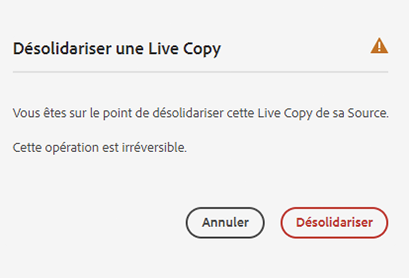
