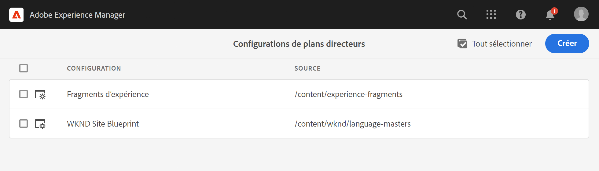

# Création et synchronisation de Live Copies {#creating-and-synchronizing-live-copies}

Vous pouvez créer une Live Copy à partir d’une configuration de page ou de plan directeur afin de réutiliser ce contenu sur votre site. Gérez l’héritage et la synchronisation, vous pouvez contrôler la propagation des modifications apportées au contenu.

## Gestion des configurations de plans directeurs {#managing-blueprint-configurations}

Une configuration de plan directeur identifie un site web existant que vous souhaitez utiliser comme source pour une ou plusieurs pages Live Copy.

>[!TIP]
>
>Les configurations de plan directeur vous permettent de pousser les modifications de contenu vers les Live Copies. Voir [Live Copies - Source, plans directeurs et configurations de plan directeur](overview.md#source-blueprints-and-blueprint-configurations).

Lorsque vous créez une configuration de plan directeur, vous sélectionnez un modèle qui définit la structure interne du plan directeur. Le modèle de plan directeur par défaut suppose que le site web source présente les caractéristiques suivantes :

* Le site web possède une page racine.
* Les pages enfants immédiates de la racine sont des branches de langue du site web. Lors de la création d’une Live Copy, les langues sont présentées comme du contenu facultatif à inclure dans la copie.
* La racine de chaque branche de langue possède une ou plusieurs pages enfants. Lors de la création d’une Live Copy, les pages enfants sont présentées afin que vous puissiez les inclure dans la Live Copy.

>[!NOTE]
>
>Une structure différente nécessite un modèle de plan directeur différent.

Après avoir créé la configuration de plan directeur, configurez les propriétés suivantes :

* **Nom** : le nom de la configuration de plan directeur
* **Chemin source** : le chemin d’accès de la page racine du site que vous utilisez comme source (plan directeur)
* **Description**. (Facultatif) Une description de la configuration de plan directeur, qui apparaît dans la liste des configurations de plan directeur parmi lesquelles choisir lors de la création d’un site.

Lorsque votre configuration de plan directeur est utilisée, vous pouvez l’associer à une configuration de déploiement qui détermine la manière dont les Live Copies de la source/du plan directeur sont synchronisées. Voir [Spécification des configurations de déploiement à utiliser](live-copy-sync-config.md#specifying-the-rollout-configurations-to-use).

### Création et modification de configurations de plan directeur {#creating-editing-blueprint-configurations}

Les configurations de plan directeur sont considérées comme des données non modifiables et ne sont donc pas modifiables au moment de l’exécution. Pour cette raison, toutes les modifications de configuration doivent être déployées via Git à l’aide du pipeline CI/CD.

Vous trouverez plus d’informations dans l’article [Modifications notables apportées à Adobe Experience Manager (AEM) en tant que Cloud Service.](/help/release-notes/aem-cloud-changes.md)

Les étapes suivantes sont disponibles pour un administrateur sur une instance de développement locale uniquement à des fins de test et de développement. Ces options ne sont disponibles dans aucune instance cloud AEMaaCS.

#### Création locale d’une configuration de plan directeur {#creating-a-blueprint-configuration}

Pour créer une configuration de plan directeur :

1. [Accédez](/help/sites-cloud/authoring/getting-started/basic-handling.md#global-navigation) au menu **Outils**, puis sélectionnez le menu **Sites**.
1. Sélectionnez **Plans directeurs** pour ouvrir la console **Configurations de plans directeurs** :

   

1. Sélectionnez **Créer**.
1. Sélectionnez le modèle de plan directeur, puis **Suivant** pour continuer.
1. Choisissez la page source à utiliser comme plan directeur, puis cliquez sur **Suivant** pour continuer.
1. Définissez les éléments suivants :

   * **Titre** : titre obligatoire du plan directeur
   * **Description** : description facultative pour fournir plus de détails.

1. L’option **Créer** crée la configuration de plan directeur selon votre spécification.

### Modification ou suppression d’une configuration de plan directeur Localement{#editing-or-deleting-a-blueprint-configuration}

Vous pouvez modifier ou supprimer une configuration de plan directeur existante :

1. [Accédez](/help/sites-cloud/authoring/getting-started/basic-handling.md#global-navigation) au menu **Outils**, puis sélectionnez le menu **Sites**.
1. Sélectionnez **Plans directeurs** pour ouvrir la console **Configurations de plans directeurs** :

   

1. Sélectionnez la configuration de plan directeur requise ; les actions appropriées deviennent disponibles dans la barre d’outils :

   * **Propriétés** : vous pouvez utiliser cette option pour afficher puis modifier les propriétés de la configuration.
   * **Supprimer**

## Création d’une Live Copy {#creating-a-live-copy}

Il existe plusieurs façons de créer une Live Copy.

### Création d’une Live Copy d’une page {#creating-a-live-copy-of-a-page}

Vous pouvez créer une Live Copy d’une page ou d’une branche. Lorsque vous créez la Live Copy, vous pouvez spécifier les configurations de déploiement à utiliser pour synchroniser le contenu :

* Les configurations de déploiement sélectionnées s’appliquent à la page Live Copy et à ses pages enfants.
* Si vous ne spécifiez aucune configuration de déploiement, MSM détermine les configurations de déploiement à utiliser. Voir [Spécification de la configuration de déploiement à utiliser](live-copy-sync-config.md#specifying-the-rollout-configurations-to-use).

Vous pouvez créer une Live Copy d’une page :

* Pages référencées par une [configuration de plan directeur](#creating-a-blueprint-configuration)
* Et des pages n’ayant aucune connexion avec une configuration
* Live Copy dans les pages d’une autre Live Copy ([Live Copies imbriquées](overview.md#nested-live-copies))

La seule différence est que la disponibilité de la commande **Déployer** sur les pages source/de plan directeur dépend du référencement ou non de la source par une configuration de plan directeur :

* Si vous créez la Live Copy à partir d’une page source **qui est** référencée dans une configuration de plan directeur, la commande Déployer sera disponible sur la ou les pages source/de plan directeur.
* Si vous créez la Live Copy à partir d’une page source qui **n’est pas** référencée dans une configuration de plan directeur, la commande Déployer ne sera pas disponible sur la ou les pages source/de plan directeur.

Pour créer une Live Copy :

1. Dans la console **Sites**, sélectionnez **Créer**, puis **Live Copy**.

   

1. Sélectionnez la page source et appuyez ou cliquez sur **Suivant**. Par exemple :

   

1. Spécifiez le chemin de destination de la Live Copy (ouvrez le dossier/la page parent de la Live Copy), puis cliquez ou appuyez sur **Suivant**.

   

   >[!NOTE]
   >
   >Le chemin de destination ne peut pas être dans le chemin source.

1. Entrer :

   * Le **Titre** de la page.
   * Le **Nom** utilisé dans l’URL.

   

1. Utilisez la case **Exclure les sous-pages** :

   * Sélectionné : créer une Live Copy de la page sélectionnée uniquement (Live Copy superficielle) ;
   * Non sélectionné : créer une Live Copy qui comprend tous les descendants de la page sélectionnée (Live Copy profonde) ;

1. (Facultatif) Pour spécifier une ou plusieurs configurations de déploiement à utiliser pour la Live Copy, utilisez la liste déroulante **Configurations de déploiement** pour les sélectionner. Les configurations sélectionnées s’affichent sous le sélecteur déroulant.
1. Cliquez ou appuyez sur **Créer**. Un message de confirmation s’affiche, dans lequel vous pouvez sélectionner **Ouvrir** ou **Terminé**.

### Création d’une Live Copy d’un site à partir d’une configuration de plan directeur {#creating-a-live-copy-of-a-site-from-a-blueprint-configuration}

Créez une Live Copy à l’aide d’une configuration de plan directeur pour créer un site basé sur le contenu (source) du plan directeur. Lorsque vous créez une Live Copy à partir d’une configuration de plan directeur, vous sélectionnez une ou plusieurs branches de langue de la source de plan directeur à copier, puis vous sélectionnez les chapitres à copier dans les branches de langue. Voir [Création d’une configuration de plan directeur](#creating-a-blueprint-configuration).

Si vous omettez certaines branches de langue de la Live Copy, vous pouvez les ajouter ultérieurement. Voir [Création d’une Live Copy dans une Live Copy (configuration de plan directeur)](#creating-a-live-copy-inside-a-live-copy-blueprint-configuration) pour plus d’informations.

>[!CAUTION]
>
>Lorsque la source du plan directeur contient des liens et des références qui ciblent un paragraphe dans une autre branche, les cibles ne sont pas mises à jour dans les pages Live Copy, mais restent pointées vers la destination d’origine.

Lorsque vous créez le site, saisissez des valeurs pour les propriétés suivantes :

* **Langues initiales** : Les branches de langue de la source de plan directeur à inclure dans la Live Copy
* **Chapitres** initiaux : Pages enfants des branches de langue de plan directeur à inclure dans la Live Copy
* **Chemin de destination** : Emplacement de la page racine du site Live Copy.
* **Titre** : Titre de la page racine du site Live Copy
* **Nom** : (Facultatif) Nom du noeud JCR qui stocke la page racine de la Live Copy (la valeur par défaut est basée sur le titre).
* **Propriétaire du site** : (Facultatif) Informations sur le responsable de la Live Copy
* **Live Copy** : sélectionnez cette option pour établir une relation en direct avec le site source. Si vous ne sélectionnez pas cette option, une copie du plan directeur est créée, mais n’est pas ensuite synchronisée avec la source.
* **Configurations de déploiement** : (Facultatif) Sélectionnez une ou plusieurs configurations de déploiement à utiliser pour synchroniser la Live Copy. Par défaut, les configurations de déploiement sont héritées du plan directeur. Voir [Spécification des configurations de déploiement à utiliser](live-copy-sync-config.md#specifying-the-rollout-configurations-to-use) pour plus d’informations.

Pour créer une Live Copy d’un site à partir d’une configuration de plan directeur :

1. Dans la console **Sites**, sélectionnez **Créer**, puis **Site** dans le sélecteur déroulant.
1. Sélectionnez la configuration de plan directeur à utiliser comme source de la Live Copy et passez à **Suivant** :

   

1. Utilisez le sélecteur **Langues initiales** pour spécifier la ou les langues du site de plan directeur à utiliser pour la Live Copy.

   Toutes les langues disponibles sont sélectionnées par défaut. Pour supprimer une langue, appuyez ou cliquez sur le **X** qui apparaît en regard de la langue.

   Par exemple :

   

1. Utilisez la liste déroulante **Chapitres initiaux** pour sélectionner les sections du plan directeur à inclure dans la Live Copy. Tous les chapitres disponibles sont inclus par défaut, mais peuvent être supprimés.
1. Saisissez les valeurs des propriétés restantes, puis sélectionnez **Créer**. Dans la boîte de dialogue de confirmation, sélectionnez **Terminé** pour retourner à la console **Sites** ou **Ouvrir le site** pour ouvrir la page racine du site.

### Création d’une Live Copy dans une Live Copy (configuration de plan directeur)  {#creating-a-live-copy-inside-a-live-copy-blueprint-configuration}

Lorsque vous créez une Live Copy dans la Live Copy existante (créée à l’aide d’une configuration de plan directeur), vous pouvez insérer une copie de langue ou des chapitres qui n’ont pas été inclus lors de la création initiale de la Live Copy.

## Surveillance de votre Live Copy {#monitoring-your-live-copy}

### Affichage de l’état d’une Live Copy {#seeing-the-status-of-a-live-copy}

Les propriétés d’une page Live Copy affichent les informations suivantes sur la Live Copy :

* **Source** : Page source de la page Live Copy
* **État** : État de synchronisation de la Live Copy, y compris si la Live Copy est à jour avec la source, le moment de la dernière synchronisation et qui a effectué la synchronisation.
* **Configuration**:

   * Si la page est toujours soumise à l’héritage de la Live Copy
   * Si la configuration est héritée de la page parent
   * Toutes les configurations de déploiement utilisées par la Live Copy

Pour afficher les propriétés :

1. Dans la console **Sites**, sélectionnez la page Live Copy et ouvrez les propriétés.
1. Sélectionnez l’onglet **Live Copy**.

   Par exemple :

   

   Pour plus d’informations, consultez la section [Utilisation de l’aperçu de la Live Copy](live-copy-overview.md#using-the-live-copy-overview) dans l’article Console Aperçu de la Live Copy .

### Affichage des Live Copies d’une page de plan directeur {#seeing-the-live-copies-of-a-blueprint-page}

Les pages de plan directeur (qui sont référencées dans une configuration de plan directeur) vous fournissent une liste des pages Live Copy qui utilisent la page actuelle (plan directeur) comme source. Utilisez cette liste pour effectuer le suivi des Live Copies. La liste s’affiche dans l’onglet **Plan directeur** des [propriétés de page](/help/sites-cloud/authoring/fundamentals/page-properties.md).

## Synchronisation de votre Live Copy {#synchronizing-your-live-copy}

Il existe plusieurs façons de synchroniser votre Live Copy.

### Déploiement d’un plan directeur {#rolling-out-a-blueprint}

Déployez une page de plan directeur pour pousser les modifications de contenu vers les Live Copies. L’action **Déployer** exécute les configurations de déploiement qui utilisent le déclencheur [En cas de déploiement](live-copy-sync-config.md#rollout-triggers).

>[!NOTE]
>
>Des conflits peuvent se produire si de nouvelles pages portant le même nom de page sont créées à la fois dans la branche de plan directeur et dans une branche Live Copy dépendante.
>
>Ces [conflits doivent être traités et résolus lors du déploiement](rollout-conflicts.md).

#### Déploiement d’un plan directeur à partir des propriétés de page  {#rolling-out-a-blueprint-from-page-properties}

1. Dans la console **Sites** , sélectionnez la page dans le plan directeur et ouvrez les propriétés.
1. Ouvrez l’onglet **Plan directeur**.
1. Sélectionnez **Déployer**.

   

1. Spécifiez les pages et les sous-pages, puis validez à l’aide de la coche :

   

1. Indiquez si la tâche de déploiement doit être exécutée immédiatement (**Maintenant**) ou à une autre date/heure (**Plus tard**).

   

Les déploiements sont traités comme des tâches asynchrones et peuvent être vérifiés sur la page [***État des tâches asynchrones**.](/help/operations/asynchronous-jobs.md#monitor-the-status-of-asynchronous-operations)

#### Déploiement d’un plan directeur à partir du rail de référence {#roll-out-a-blueprint-from-the-reference-rail}

1. Dans la console **Sites** , sélectionnez la page dans la Live Copy et ouvrez le panneau **[Références](/help/sites-cloud/authoring/getting-started/basic-handling.md#references)** (dans la barre d’outils).
1. Sélectionnez l’option **Plan directeur** dans la liste pour afficher les plans directeurs associés à cette page.
1. Sélectionnez le plan directeur requis dans la liste.
1. Cliquez ou appuyez sur **Déployer**.

   

1. Vous êtes invité à confirmer les détails du déploiement :

   * **Etendue du déploiement**:

      Indiquez si la portée est uniquement définie pour la page sélectionnée ou si elle doit inclure des sous-pages.

   * **Planification** :

      Indiquez si la tâche de déploiement doit être exécutée immédiatement (**Maintenant**) ou à une date/heure ultérieure (**Plus tard**).

      

1. Après avoir défini ces détails, sélectionnez **Déployer** pour exécuter l’opération.

Les déploiements sont traités comme des tâches asynchrones et peuvent être vérifiés sur la page [**État des tâches asynchrones**.](/help/operations/asynchronous-jobs.md#monitor-the-status-of-asynchronous-operations)

#### Déploiement d’un plan directeur de l’aperçu de la Live Copy {#roll-out-a-blueprint-from-the-live-copy-overview}

L’[**** action Déployer est également disponible dans l’aperçu de la Live Copy](live-copy-overview.md#using-the-live-copy-overview) lorsqu’une page Plan directeur est sélectionnée.

1. Ouvrez l’[aperçu de la Live Copy](live-copy-overview.md#using-the-live-copy-overview) et sélectionnez une page Plan directeur.
1. Sélectionnez **Déployer** dans la barre d’outils.

   

1. Spécifiez les pages et les sous-pages, puis validez à l’aide de la coche :

   

1. Indiquez si la tâche de déploiement doit être exécutée immédiatement (**Maintenant**) ou à une autre date/heure (**Plus tard**).

   

Les déploiements sont traités comme des tâches asynchrones et peuvent être vérifiés sur la page [**État des tâches asynchrones**.](/help/operations/asynchronous-jobs.md#monitor-the-status-of-asynchronous-operations)

### Synchronisation d’une Live Copy {#synchronizing-a-live-copy}

Synchronisez une page Live Copy pour extraire les modifications de contenu de la source vers la Live Copy.

#### Synchronisation d’une Live Copy à partir des propriétés de page {#synchronize-a-live-copy-from-page-properties}

Synchronisez une Live Copy pour extraire les modifications de la source vers la Live Copy.

>[!NOTE]
>
>La synchronisation effectue les configurations de déploiement qui utilisent le déclencheur [En cas de déploiement](live-copy-sync-config.md#rollout-triggers).

1. Dans la console **Sites**, sélectionnez la page Live Copy et ouvrez les propriétés.
1. Ouvrez l’onglet **Live Copy**.
1. Cliquez ou appuyez sur **Synchroniser**.

   

   Une confirmation est demandée ; utilisez **Synchroniser** pour continuer.

#### Synchronisation d’une Live Copy à partir de l’aperçu de la Live Copy  {#synchronize-a-live-copy-from-the-live-copy-overview}

L’[action Synchroniser est également disponible dans l’aperçu de la Live Copy](live-copy-overview.md#using-the-live-copy-overview), lorsqu’une page Live Copy est sélectionnée.

1. Ouvrez l’[aperçu de la Live Copy](live-copy-overview.md#using-the-live-copy-overview) et sélectionnez une page Live Copy.
1. Sélectionnez **Synchroniser** dans la barre d’outils.
1. Confirmez l’action **Déploiement** dans la boîte de dialogue après avoir indiqué si vous souhaitez inclure :

   * **Page et sous-pages**
   * **Page seulement**

   

## Modification du contenu de Live Copy {#changing-live-copy-content}

Pour modifier le contenu d’une Live Copy, vous pouvez :

* Ajoutez des paragraphes à la page.
* Mettez à jour le contenu existant en rompant l’héritage de la Live Copy pour n’importe quel composant ou page.

>[!TIP]
>
>Si vous créez manuellement une page dans la Live Copy, la nouvelle page est locale à la Live Copy, ce qui signifie qu’elle ne comporte pas de page source correspondante à laquelle elle est jointe.
>
>Pour créer une page locale faisant partie de la relation, il est recommandé de créer la page locale dans la source et d’effectuer un déploiement profond. La page sera ainsi créée localement en tant que Live Copies.

>[!NOTE]
>
>Des conflits peuvent se produire si de nouvelles pages portant le même nom de page sont créées à la fois dans la branche de plan directeur et dans une branche Live Copy dépendante.
>
>Ces [conflits doivent être traités et résolus lors du déploiement](rollout-conflicts.md).

### Ajout de composants à une page Live Copy  {#adding-components-to-a-live-copy-page}

Vous pouvez ajouter des composants à une page Live Copy à tout moment. L’état d’héritage de la Live Copy et de son système de paragraphes ne contrôle pas votre capacité à ajouter des composants.

Lorsque la page Live Copy est synchronisée avec la page source, les composants ajoutés restent inchangés. Voir également [Modification de l’ordre des composants sur une page Live Copy.](#changing-the-order-of-components-on-a-live-copy-page)

>[!TIP]
>
>Les modifications apportées localement à un composant marqué en tant que conteneur ne sont pas remplacées par le contenu du plan directeur lors d’un déploiement. Voir [Meilleures pratiques MSM](best-practices.md#components-and-container-synchronization) pour plus d’informations.

### Suspension de l’héritage pour une page {#suspending-inheritance-for-a-page}

Lorsque vous créez une Live Copy, la configuration de cette dernière est enregistrée sur la page racine des pages copiées. Toutes les pages enfants de la page racine héritent des configurations Live Copy. Les composants des pages Live Copy héritent également de la configuration Live Copy.

Vous pouvez suspendre l’héritage de la Live Copy pour une page Live Copy afin de pouvoir modifier les propriétés et les composants de la page. Lorsque vous suspendez l’héritage, les propriétés et les composants de la page ne sont plus synchronisés avec la source.

>[!TIP]
>
>Vous pouvez également [désolidariser une Live Copy](#detaching-a-live-copy) de son plan directeur pour supprimer toutes les connexions. Contrairement à la suspension de l’héritage, l’action de désolidarisation est permanente et irréversible.

#### Suspension de l’héritage à partir des propriétés de page {#suspending-inheritance-from-page-properties}

Pour suspendre l’héritage sur une page :

1. Ouvrez les propriétés de la page Live Copy à l’aide de la commande **Afficher les propriétés** de la console **Sites** ou à l’aide de **Informations sur la page** dans la barre d’outils de la page.
1. Cliquez ou appuyez sur l’onglet **Live Copy**.
1. Sélectionnez **Suspendre** dans la barre d’outils. Vous pouvez ensuite sélectionner, au choix :

   * **Suspendre** : pour suspendre uniquement la page active.
   * **Suspendre avec enfants** : pour suspendre la page active avec toute page enfant.

1. Sélectionnez **Suspendre** dans la boîte de dialogue de confirmation.

#### Suspension de l’héritage à partir de l’aperçu de la Live Copy {#suspending-inheritance-from-the-live-copy-overview}

L’[action Suspendre est également disponible dans l’aperçu de la Live Copy](live-copy-overview.md#using-the-live-copy-overview), lorsqu’une page Live Copy est sélectionnée.

1. Ouvrez l’[aperçu de la Live Copy](live-copy-overview.md#using-the-live-copy-overview) et sélectionnez une page Live Copy.
1. Sélectionnez **Suspendre** dans la barre d’outils.
1. Sélectionnez l’option appropriée parmi les deux actions suivantes :

   * **Suspendre**
   * **Suspendre avec enfants**

   

1. Confirmez l’action **Suspendre** dans la boîte de dialogue **Suspendre la Live Copy** :

   

### Reprise de l’héritage pour une page {#resuming-inheritance-for-a-page}

La suspension de l’héritage de la Live Copy pour une page est une action temporaire. Une fois l’héritage suspendu, l’action **Reprendre** devient disponible, ce qui vous permet de rétablir la relation en direct.

Lorsque vous réactivez l’héritage, la page n’est pas automatiquement synchronisée avec la source. Si nécessaire, vous pouvez demander une synchronisation, soit :

* Dans la boîte de dialogue **Reprendre**/**Rétablir**, par exemple :

   

* Par la suite, en sélectionnant manuellement l’action de synchronisation.

>[!NOTE]
>
>Lorsque vous réactivez l’héritage, la page n’est pas automatiquement synchronisée avec la source. Si cela est nécessaire, vous pouvez demander manuellement une synchronisation au moment de la reprise ou ultérieurement.

#### Reprise de l’héritage à partir des propriétés de page {#resuming-inheritance-from-page-properties}

Une fois l’héritage [suspendu](#suspending-inheritance-from-page-properties), l’action **Reprendre** devient disponible dans la barre d’outils des propriétés de page :

Lorsque cette action est sélectionnée, la boîte de dialogue s’affiche. Vous pouvez sélectionner une synchronisation, si nécessaire, puis confirmer l’action.

#### Reprise d’une page Live Copy à partir de l’aperçu de la Live Copy {#resume-a-live-copy-page-from-the-live-copy-overview}

L’[action Reprendre est également disponible dans l’aperçu de la Live Copy](live-copy-overview.md#using-the-live-copy-overview), lorsqu’une page Live Copy est sélectionnée.

1. Ouvrez la [Présentation de la Live Copy](live-copy-overview.md#using-the-live-copy-overview) et sélectionnez une page Live Copy qui a été suspendue. La page s’affichera sous la forme **HÉRITAGE ANNULÉE**.
1. Sélectionnez **Reprendre** dans la barre d’outils.
1. Indiquez si vous souhaitez synchroniser la page après avoir rétabli l’héritage, puis confirmez l’action **Reprendre** dans la boîte de dialogue **Reprendre la Live Copy**.

### Changement de la profondeur d’héritage (superficielle/profonde) {#changing-inheritance-depth-shallow-deep}

Sur une Live Copy existante, vous pouvez modifier la profondeur d’une page, c’est-à-dire si les pages enfants sont incluses.

* Passer à une Live Copy superficielle :

   * Prend immédiatement effet et est irréversible.

   * Désolidarise explicitement les pages enfants de la Live Copy. Les autres modifications des pages enfants ne peuvent pas être préservées si elles sont annulées.

   * Supprimera tout descendant `LiveRelationships` même s’il existe des `LiveCopies` imbriqués.

* Passer à une Live Copy profonde :

   * Laisse les pages enfants intactes.
   * Pour visualiser l’effet de la transition, vous pouvez procéder à un déploiement ; toutes les modifications de contenu sont appliquées en fonction de la configuration de déploiement.

* Basculez vers une Live Copy superficielle, puis revenez à l’état profond :

   * Consigne tous les enfants de la Live Copy (anciennement) superficielle comme s’ils avaient été créés manuellement et sont donc déplacés à l’aide de `[oldname]_msm_moved name`.

Pour spécifier ou changer la profondeur :

1. Ouvrez les propriétés de la page Live Copy à l’aide de la commande **Afficher les propriétés** de la console **Sites** ou à l’aide de **Informations sur la page** dans la barre d’outils de la page.
1. Cliquez ou appuyez sur l’onglet **Live Copy**.
1. Dans la section **Configuration**, cochez ou décochez la case **Héritage de Live Copy** selon que les pages enfants sont incluses ou non :

   * Cochée : une Live Copy profonde (les pages enfants sont incluses).
   * Non coché : une Live Copy superficielle (les pages enfants sont exclues).

   >[!CAUTION]
   >
   >Le passage à une Live Copy superficielle prendra effet immédiatement et est irréversible.
   >
   >Voir f[Live Copies - Composition](overview.md#live-copies-composition) pour plus d’informations.

1. Cliquez ou appuyez sur **Enregistrer** pour conserver vos mises à jour.

### Annulation de l’héritage pour un composant  {#cancelling-inheritance-for-a-component}

Annulez l’héritage de la Live Copy pour un composant, de sorte que le composant ne soit plus synchronisé avec le composant source. Vous pouvez activer l’héritage ultérieurement si nécessaire.

>[!NOTE]
>
>Lorsque vous réactivez l’héritage, le composant n’est pas automatiquement synchronisé avec la source. Vous pouvez demander manuellement une synchronisation si nécessaire.

Annulez l’héritage pour modifier le contenu du composant ou supprimer le composant :

1. Cliquez ou appuyez sur le composant pour lequel vous souhaitez annuler l’héritage.

   

1. Sur la barre d’outils du composant, appuyez ou cliquez sur l’icône **Annuler l’héritage**.

   

1. Dans la boîte de dialogue Annuler l’héritage, confirmez l’action en cliquant sur **Oui**.

   La barre d’outils du composant est mise à jour pour inclure toutes les commandes de modification (appropriées).

### Réactivation de l’héritage pour un composant {#re-enabling-inheritance-for-a-component}

Pour activer l’héritage pour un composant, cliquez ou appuyez sur l’icône **Réactiver l’héritage** dans la barre d’outils du composant.

### Modification de l’ordre des composants sur une page Live Copy {#changing-the-order-of-components-on-a-live-copy-page}

Si une Live Copy contient des composants qui font partie d’un système de paragraphes, l’héritage de ce système de paragraphes respecte les règles suivantes :

* L’ordre des composants dans un système de paragraphes hérité peut être modifié, même si l’héritage est établi.
* Sur le déploiement, l’ordre des composants est restauré à partir du plan directeur. Si de nouveaux composants ont été ajoutés à la Live Copy avant le déploiement, ils seront réorganisés avec les composants au-dessus desquels ils ont été ajoutés.
* Si l’héritage du système de paragraphes est annulé, l’ordre des composants ne sera pas restauré lors du déploiement et restera tel quel dans la Live Copy.

>[!NOTE]
>
>Lors de la restauration d’un héritage annulé sur un système de paragraphes, l’ordre des composants **n’est pas automatiquement restauré** à partir du plan directeur. Vous pouvez demander manuellement une synchronisation si nécessaire.

Procédez comme suit pour annuler l’héritage du système de paragraphes.

1. Ouvrez la page Live Copy .
1. Faites glisser un composant existant vers un nouvel emplacement sur la page.
1. Dans la boîte de dialogue **Annuler l’héritage**, confirmez l’action en cliquant sur **Oui**.

### Remplacement des propriétés d’une page Live Copy  {#overriding-properties-of-a-live-copy-page}

Les propriétés de page d’une page Live Copy sont héritées de la page source par défaut et ne sont pas modifiables.

Vous pouvez annuler l’héritage d’une propriété lorsque vous devez modifier la valeur de la propriété pour la Live Copy. Une icône de lien indique que l’héritage est activé pour la propriété.

Lorsque vous annulez l’héritage, vous pouvez modifier la valeur de la propriété. Une icône de lien brisé indique que l’héritage est annulé.

Vous pourrez par la suite réactiver l’héritage pour une propriété, si nécessaire.

>[!NOTE]
>
>Lorsque vous réactivez l’héritage, la propriété de page Live Copy n’est pas automatiquement synchronisée avec la propriété source. Vous pouvez demander manuellement une synchronisation si cela est nécessaire.

1. Ouvrez les propriétés de la page Live Copy à l’aide de l’option **Afficher les propriétés** de la console **Sites** ou de l’icône **Informations sur la page** dans la barre d’outils de la page.
1. Pour annuler l’héritage d’une propriété, appuyez ou cliquez sur l’icône de lien qui s’affiche à droite de la propriété.

   

1. Dans la boîte de dialogue de confirmation **Annuler l’héritage**, cliquez ou appuyez sur **Oui**.

### Rétablissement des propriétés d’une page de la Live Copy  {#revert-properties-of-a-live-copy-page}

Pour activer l’héritage pour une propriété, cliquez ou appuyez sur l’icône **Rétablir l’héritage** qui s’affiche en regard de la propriété.

### Réinitialisation d’une page Live Copy {#resetting-a-live-copy-page}

Vous pouvez réinitialiser une page Live Copy afin de :

* Supprimer toutes les annulations d’héritage et
* Restaurer la page dans le même état que la page source.

La réinitialisation affecte les modifications que vous avez apportées aux propriétés de page, au système de paragraphes et aux composants.

#### Réinitialisation d’une page Live Copy à partir des propriétés de la page {#reset-a-live-copy-page-from-the-page-properties}

1. Dans la console **Sites**, sélectionnez la page Live Copy et sélectionnez **Afficher les propriétés**.
1. Ouvrez l’onglet **Live Copy**.
1. Sélectionnez **Réinitialiser** dans la barre d’outils.

   

1. Dans la boîte de dialogue **Réinitialiser la Live Copy**, confirmez en cliquant sur **Réinitialiser**.

#### Réinitialisation d’une page Live Copy à partir de l’aperçu de la Live Copy  {#reset-a-live-copy-page-from-the-live-copy-overview}

L’[**** action Réinitialiser est également disponible dans l’aperçu de la Live Copy](live-copy-overview.md#using-the-live-copy-overview), lorsqu’une page Live Copy est sélectionnée.

1. Ouvrez l’[aperçu de la Live Copy](live-copy-overview.md#using-the-live-copy-overview) et sélectionnez une page Live Copy.
1. Sélectionnez **Réinitialiser** dans la barre d’outils.
1. Confirmez l’action **Réinitialiser** dans la boîte de dialogue **Réinitialiser la Live Copy** :

   

## Comparaison d’une page Live Copy à une page de plan directeur {#comparing-a-live-copy-page-with-a-blueprint-page}

Pour suivre les modifications que vous avez apportées, vous pouvez afficher la page de plan directeur dans **Références** et la comparer à sa page Live Copy :

1. Dans la console **Sites**, [accédez à un plan directeur ou à une page Live Copy et sélectionnez-la.](/help/sites-cloud/authoring/getting-started/basic-handling.md#viewing-and-selecting-resources)
1. Ouvrez le panneau **[Références](/help/sites-cloud/authoring/getting-started/basic-handling.md#references)** et, selon le contexte, sélectionnez l’une des options suivantes :

   * **Blueprint**
   * **Live Copies**

1. Sélectionnez votre Live Copy spécifique en fonction du contexte et sélectionnez l’une des options suivantes :

   * **Comparer au plan directeur**
   * **Comparer à la Live Copy**

   Par exemple :

   

1. Les pages Live Copy et de plan directeur s’ouvrent côte à côte.

   Pour plus d’informations sur l’utilisation de la fonction de comparaison, voir [Différence entre les pages](/help/sites-cloud/authoring/features/page-diff.md).

## Désolidarisation d’une Live Copy {#detaching-a-live-copy}

L’action de désolidarisation supprime définitivement la relation dynamique entre une Live Copy et sa page source/de plan directeur. Toutes les propriétés MSM sont supprimées de la Live Copy et les pages Live Copy deviennent une copie autonome.

>[!CAUTION]
>
>Vous ne pouvez pas rétablir la relation dynamique après avoir désolidarisé la Live Copy.
>
>Pour supprimer la relation dynamique avec la possibilité de la rétablir ultérieurement, vous pouvez [annuler l’héritage de la Live Copy](#suspending-inheritance-for-a-page) pour la page.

Il existe des implications liées à l’endroit dans l’arborescence où vous utilisez l’option **Désolidariser** :

* **Désolidarisation sur la page racine d’une Live Copy**

   Lorsque cette opération est effectuée sur la page racine d’une Live Copy, elle supprime la relation dynamique entre toutes les pages du plan directeur et sa Live Copy.

   D’autres modifications apportées aux pages du plan directeur **n’auront pas** d’impact sur la Live Copy.

* **Désolidariser sur une sous-page d’une Live Copy**

   Lorsque cette opération est effectuée sur une sous-page (ou branche) au sein d’une Live Copy :

   * La relation dynamique est supprimée pour cette sous-page (ou branche) et
   * Les (sous-)pages de la branche Live Copy sont traitées comme si elles avaient été créées manuellement.

   Toutefois, les sous-pages étant encore soumises aux relations en direct de la branche parent, un autre déploiement de la ou des pages de plan directeur aura à la fois pour effet :

   1. De renommer les pages désolidarisées :

      * En effet, MSM les considère comme des pages créées manuellement qui provoquent un conflit, car elles portent le même nom que les pages Live Copy qu’il tente de créer.
   1. Créez une page Live Copy avec le nom d’origine, contenant les modifications du déploiement.

   >[!NOTE]
   >
   >Voir [Conflits de déploiement MSM](rollout-conflicts.md) pour obtenir des détails sur ces situations.

### Désolidarisation d’une page Live Copy à partir des propriétés de la page {#detach-a-live-copy-page-from-the-page-properties}

Pour désolidariser une Live Copy :

1. Dans la console **Sites**, sélectionnez la page Live Copy et cliquez ou appuyez sur **Afficher les propriétés**.
1. Ouvrez l’onglet **Live Copy**.
1. Dans la barre d’outils, sélectionnez **Désolidariser**.

   

1. Une boîte de dialogue de confirmation s’affiche. Sélectionnez **Désolidariser** pour exécuter l’opération.

### Désolidarisation d’une page Live Copy à partir de l’aperçu de la Live Copy  {#detach-a-live-copy-page-from-the-live-copy-overview}

L’[action Désolidariser est également disponible dans l’aperçu de la Live Copy](live-copy-overview.md#using-the-live-copy-overview), lorsqu’une page Live Copy est sélectionnée.

1. Ouvrez l’[aperçu de la Live Copy](live-copy-overview.md#using-the-live-copy-overview) et sélectionnez une page Live Copy.
1. Sélectionnez **Désolidariser** dans la barre d’outils.
1. Confirmez l’action **Désolidariser** dans la boîte de dialogue **Désolidariser une Live Copy** :

   
