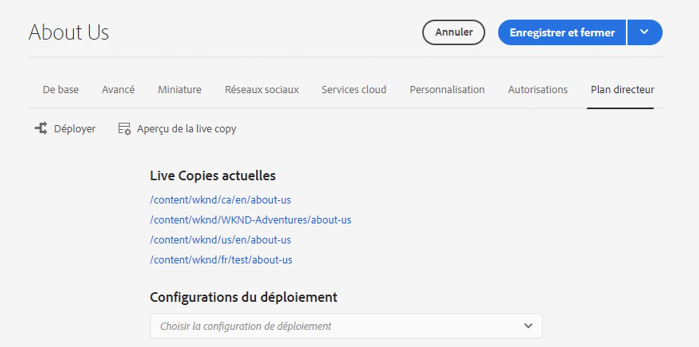

# Console Aperçu de Live Copy {#live-copy-overview-console}

L’**aperçu de Live Copy** vous permet :

* d’afficher ou de gérer l’héritage sur un site ;
   * d’afficher l’arborescence de plan directeur de la structure de Live Copy correspondante, ainsi que le statut d’héritage ;
   * de modifier le statut d’héritage, tel que la suspension et la reprise ;
   * d’afficher les propriétés de plan directeur et de Live Copy ;
* d’exécuter des actions de déploiement.

## Ouverture de l’aperçu de la Live Copy {#opening-the-live-copy-overview}

Vous pouvez ouvrir l’aperçu de la Live Copy via :

* [Panneau latéral de références d’une page de plan directeur (console Sites)](#opening-live-copy-overview-references-for-a-blueprint-page)
* [Propriétés d’une page de plan directeur](#opening-live-copy-overview-properties-of-a-blueprint-page)

### Références à une page de plan directeur {#references-to-a-blueprint-page}

L’**aperçu de la Live Copy** peut être ouvert via le panneau latéral **Références** de la console **Sites** :

1. Dans la console **Sites**, [accédez à la page de plan directeur et sélectionnez-la](/help/sites-cloud/authoring/basic-handling.md#viewing-and-selecting-resources).
1. Ouvrez le rail **[Références](/help/sites-cloud/authoring/basic-handling.md#references)** et sélectionnez **Live Copies**.

   

   >[!TIP]
   >
   >Vous pouvez également ouvrir le panneau des références en premier, puis sélectionner le plan directeur.

1. Sélectionnez **Aperçu de Live Copy** pour afficher et utiliser l’aperçu de toutes les Live Copies associées au plan directeur sélectionné.
1. Utilisez **Fermer** pour fermer l’aperçu et retourner à la console **Sites**.

### Propriétés d’une page de plan directeur {#properties-of-a-blueprint-page}

L’**Aperçu de Live Copy** peut être ouvert lors de l’affichage des propriétés d’une page de plan directeur :

1. Ouvrez les **propriétés** pour la page de plan directeur appropriée.
1. Ouvrez l’onglet **Plan directeur**, l’option **Aperçu de Live Copy** s’affiche dans la barre d’outils supérieure :

   

1. Sélectionnez **Aperçu de Live Copy** pour afficher et utiliser l’aperçu de toutes les Live Copies associées au plan directeur actuel.

1. Utilisez **Fermer** pour fermer l’aperçu et retourner à la console **Sites**.

## Utilisation de l’aperçu de la Live Copy {#using-the-live-copy-overview}

La fenêtre **Aperçu de Live Copy** donne un aperçu du statut des Live Copies liées à la page sélectionnée.

Un processus de déploiement dépend des actions de synchronisation définies dans une configuration de déploiement spécifique. Certaines actions dépendent des modifications apportées au contenu. Cependant, de nombreuses actions ne dépendent pas des modifications apportées au contenu mais plutôt d’événements tels que l’activation des pages. Ces événements ne modifient pas le contenu mais modifient les propriétés internes liées au contenu.

Les champs de statut dépendent également des actions de synchronisation définies dans une configuration de déploiement spécifique et indiquent de telles actions ont eu lieu dans le plan ou dans la Live Copy depuis le dernier déploiement réussi. Un champ de statut ne reflète que les actions d’une configuration de déploiement spécifique. Si aucun déploiement réussi n’a jamais été effectué sur une Live Copy, le statut s’affiche en permanence comme étant à jour.

Par exemple, une configuration de déploiement est définie sur `targetActivate`. Par conséquent, le déploiement ne dépendra que des événements d’activation. Le champ de statut indique uniquement si des événements d’activation se sont produits depuis le dernier déploiement réussi.

L’**aperçu de Live Copy** peut également être utilisé pour effectuer des actions sur la Live Copy :

1. Ouvrez l’**aperçu de la Live Copy**.
1. Sélectionnez la page de plan directeur ou de Live Copy requise. La barre d’outils est mise à jour pour afficher les actions disponibles. Les [actions](overview.md#terms-used) disponibles varient selon que vous sélectionnez une page de [plan directeur](#actions-for-a-blueprint-page) ou de [Live Copy](#actions-for-a-live-copy-page).

### Actions d’une page de plan directeur {#actions-for-a-blueprint-page}

Lorsque vous sélectionnez une page de plan directeur, les actions suivantes sont disponibles :

* **Modifier** – Ouvrez le plan directeur pour le modifier.
* **[Déployer](overview.md#rollout-and-synchronize)** – Effectuez un déploiement pour pousser les modifications de la source vers la Live Copy.

### Actions d’une page de Live Copy {#actions-for-a-live-copy-page}

Lorsque vous sélectionnez une page de Live Copy, les actions suivantes sont disponibles :

* **Modifier** – Ouvrez la page de la Live Copy pour la modifier.
* **[État de la relation](#relationship-status)** – Affichez des informations sur l’état et l’héritage.
* **[Synchroniser](overview.md#rollout-and-synchronize)** – Synchronisez une Live Copy pour extraire des modifications de la source vers la Live Copy.
* **[Réinitialiser](creating-live-copies.md#resetting-a-live-copy-page)** – Réinitialisez une page Live Copy pour supprimer toutes les annulations d’héritage et restaurer la page au même statut que la page source.
* **[Suspendre](overview.md#suspending-and-cancelling-inheritance-and-synchronization)** – Désactive temporairement les relations directes entre une Live Copy et sa page de plan directeur.
* **[Reprendre](creating-live-copies.md#resuming-inheritance-for-a-page)** - Reprendre vous permet de rétablir une relation suspendue.
* **[Désolidariser](overview.md#detaching-a-live-copy)** – Supprime définitivement la relation directe entre une Live Copy et sa page de plan directeur.

## État de la relation {#relationship-status}

La console **État de la relation** comporte deux onglets fournissant de nombreuses fonctionnalités.

* [État de la relation](#relationship-status-tab)
* [Live Copy](#live-copy-tab)

### État de la relation {#relationship-status-tab}

Cet onglet fournit des informations détaillées sur le statut de la relation entre le plan directeur et la Live Copy.

### Live Copy {#live-copy-tab}

Cet onglet vous permet d’afficher et de modifier la configuration de la Live Copy.

