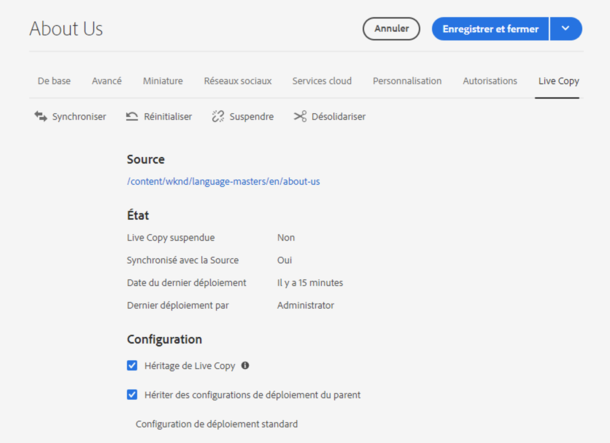

# Configuration de la synchronisation des Live Copies  {#configuring-live-copy-synchronization}

Adobe Experience Manager fournit plusieurs configurations de synchronisation prêtes à l’emploi. Avant d’utiliser les Live Copies, tenez compte des points suivants pour définir comment et quand elles sont synchronisées avec leur contenu source.

1. Déterminez si les configurations de déploiement existantes répondent à vos besoins.
1. Si les configurations de déploiement existantes ne répondent pas à vos besoins, décidez si vous devez créer les vôtres.
1. Spécifiez les configurations de déploiement à utiliser avec les Live Copies.

## Configurations de déploiement installées et personnalisées {#installed-and-custom-rollout-configurations}

Cette section contient des informations sur les configurations de déploiement installées et les actions de synchronisation qu’elles utilisent, ainsi que sur la création de configurations personnalisées, si nécessaire.

>[!CAUTION]
>
>Il n’est **pas** recommandé de mettre à jour ou de modifier une configuration de déploiement prête à l’emploi. Si une action en direct et personnalisée est requise, elle doit être ajoutée dans une configuration de déploiement personnalisée.

### Déclencheurs de déploiement {#rollout-triggers}

Chaque configuration du déploiement utilise un déclencheur qui entraîne la survenue du déploiement. Les configurations de déploiement peuvent utiliser l’un des déclencheurs suivants :

* **En cas de déploiement** : la commande **Déploiement** est utilisée dans la page Plan directeur ou la commande **Synchroniser** est utilisée dans la page Live Copy.
* **En cas de modification** : la page source est modifiée.
* **En cas d’activation** : la page source est activée.
* **En cas de désactivation** : la page source est désactivée.

>[!NOTE]
>
>L’utilisation du déclencheur **En cas de modification** peut nuire aux performances. Pour plus d’informations, voir [Meilleures pratiques MSM](best-practices.md#onmodify).

### Configurations du déploiement {#rollout-configurations}

Le tableau ci-dessous répertorie les configurations de déploiement prêtes à l’emploi installées avec AEM. Le tableau contient les actions de déclenchement et de synchronisation de chaque configuration du déploiement.

Si les actions de configuration de déploiement installées ne répondent pas à vos exigences, vous pouvez [créer une configuration de déploiement](#creating-a-rollout-configuration).

| Nom | Description | Déclencheur | [Actions de synchronisation](#synchronization-actions) |
|---|---|---|---|
| Configuration de déploiement standard | Configuration du déploiement standard qui permet de démarrer le processus de déploiement à partir d’un déclencheur de déploiement et d’actions d’exécutions : créer, mettre à jour, supprimer le contenu et trier les nœuds enfants | En cas de déploiement | `contentUpdate` `contentCopy` `contentDelete` `referencesUpdate` `productUpdate` `orderChildren` |
| Activer au moment de l’activation du plan directeur | Publie la Live Copy lorsque la source est publiée | En cas d’activation | `targetActivate` |
| Désactiver au moment de la désactivation du plan directeur | Désactive la Live Copy lorsque la source est désactivée | En cas de désactivation | `targetDeactivate` |
| Pousser au moment de la modification | Envoie le contenu à la Live Copy lorsque la source est modifiée Utilisez cette configuration de déploiement avec parcimonie, car elle emploie le déclencheur En cas de modification. | En cas de modification | `contentUpdate` `contentCopy` `contentDelete` `referencesUpdate` `orderChildren` |
| Envoyer au moment de la modification (superficielle) | Envoie le contenu à la Live Copy lors de la modification de la page du plan directeur, sans mettre à jour les références (par exemple pour les copies superficielles) Utilisez cette configuration de déploiement avec parcimonie, car elle emploie le déclencheur En cas de modification. | En cas de modification | `contentUpdate` `contentCopy` `contentDelete` `orderChildren` |
| Convertir le lancement | Configuration de déploiement standard pour la promotion des pages de lancement. | En cas de déploiement | `contentUpdate` `contentCopy` `contentDelete` `referencesUpdate` `orderChildren` `markLiveRelationship` |

### Actions de synchronisation {#synchronization-actions}

Le tableau ci-dessous répertorie les actions de synchronisation prêtes à l’emploi d’AEM.

Si les actions installées ne répondent pas à vos exigences, vous pouvez [créer une action de synchronisation](/help/implementing/developing/extending/msm.md#creating-a-new-synchronization-action).

| Nom de l’action | Description | Propriétés |
|---|---|---|
| `contentCopy` | Si les nœuds de la source n’existent pas sur la Live Copy, cette action les y copie. [Configurez le service **CQ MSM Content Copy Action**](#excluding-properties-and-node-types-from-synchronization) pour spécifier les types de nœuds, les éléments de paragraphe et les propriétés de page à exclure. |  |
| `contentDelete` | Cette action supprime les nœuds de la Live Copy qui n’existent pas sur la source. [Configurez le service **CQ MSM Content Delete Action**](#excluding-properties-and-node-types-from-synchronization) pour spécifier les types de nœuds, les éléments de paragraphe et les propriétés de page à exclure. |  |
| `contentUpdate` | Cette action met à jour le contenu de la Live Copy avec les modifications provenant de la source. [Configurez le service **CQ MSM Content Update Action**](#excluding-properties-and-node-types-from-synchronization) pour spécifier les types de nœuds, les éléments de paragraphe et les propriétés de page à exclure. |  |
| `editProperties` | Cette action modifie les propriétés de la Live Copy. La propriété `editMap` détermine les propriétés modifiées et leur valeur. La valeur de la propriété `editMap` doit utiliser le format suivant :  `[property_name_n]#[current_value]#[new_value]` `current_value` et `new_value` sont des expressions régulières et `n` est un entier incrémenté. Par exemple, tenez compte de la valeur suivante pour `editMap` : `sling:resourceType#/(contentpage`‖`homepage)#/mobilecontentpage,cq:template#/contentpage#/mobilecontentpage` Cette valeur modifie les propriétés des nœuds Live Copy comme suit :  Les propriétés `sling:resourceType` qui sont définies sur `contentpage` ou sur `homepage` sont configurées sur `mobilecontentpage`. Les propriétés `cq:template` qui sont définies sur `contentpage` sont configurées sur `mobilecontentpage`. | `editMap: (String)` identifie la propriété, la valeur actuelle et la nouvelle valeur. Pour plus d’informations, voir la description. |
| `notify` | Cette action envoie un événement de page que la page a déployé. Pour recevoir des notifications, vous devez d’abord vous abonner aux événements de déploiement. |  |
| `orderChildren` | Cette action commande les nœuds enfants en fonction du plan directeur. |  |
| `referencesUpdate` | Cette action de synchronisation met à jour les références sur la Live Copy. Elle recherche des chemins d’accès dans les pages Live Copy, qui pointent vers une ressource dans le plan directeur. Ensuite, elle met à jour le chemin d’accès pour qu’il pointe vers la ressource associée dans la Live Copy. Les références qui comportent des cibles en dehors du plan directeur ne sont pas modifiées.  [Configurez le service **CQ MSM References Update Action**](#excluding-properties-and-node-types-from-synchronization) pour spécifier les types de nœuds, les éléments de paragraphe et les propriétés de page à exclure. |  |
| `targetVersion` | Cette action crée une version de la Live Copy. Cette action doit être la seule action de synchronisation incluse dans une configuration du déploiement. |  |
| `targetActivate` | Cette action active la Live Copy. Cette action doit être la seule action de synchronisation incluse dans une configuration du déploiement. |  |
| `targetDeactivate` | Cette action désactive la Live Copy. Cette action doit être la seule action de synchronisation incluse dans une configuration du déploiement. |  |
| `workflow` | Cette action lance le workflow défini par la propriété cible (pour les pages uniquement) et utilise la Live Copy comme charge utile. Le chemin d’accès à la cible est le chemin d’accès du nœud du modèle. | `target: (String)` est le chemin d’accès au modèle de processus. |
| `mandatory` | Cette action définit l’autorisation de différentes listes de contrôle d’accès dans la page Live Copy en lecture seule pour un groupe d’utilisateurs spécifique. Les listes de contrôle d’accès suivantes sont configurées :  `ActionSet.ACTION_NAME_REMOVE` `ActionSet.ACTION_NAME_SET_PROPERTY` `ActionSet.ACTION_NAME_ACL_MODIFY` Utilisez cette action uniquement pour les pages. | `target: (String)` : identifiant du groupe pour lequel vous définissez des autorisations. |
| `mandatoryContent` | Cette action définit l’autorisation de différentes listes de contrôle d’accès dans la page Live Copy en lecture seule pour un groupe d’utilisateurs spécifique. Les listes de contrôle d’accès suivantes sont configurées :  `ActionSet.ACTION_NAME_SET_PROPERTY` `ActionSet.ACTION_NAME_ACL_MODIFY` Utilisez cette action uniquement pour les pages. | `target: (String)` : identifiant du groupe pour lequel vous définissez des autorisations. |
| `mandatoryStructure` | Cette action définit l’autorisation de la liste de contrôle d’accès `ActionSet.ACTION_NAME_REMOVE` dans la page Live Copy en lecture seule pour un groupe d’utilisateurs spécifique. Utilisez cette action uniquement pour des pages. | `target: (String)` : identifiant du groupe pour lequel vous définissez des autorisations. |
| `VersionCopyAction` | Si la page source/de plan directeur a été publiée au moins une fois, cette action crée une page Live Copy à l’aide de la version publiée. Remarque : Cette action est disponible pour créer une page Live Copy sur une page source publiée, et non pour mettre à jour une page Live Copy existante. |  |
| `PageMoveAction` | L’action `PageMoveAction` s’applique lorsqu’une page a été déplacée dans le plan directeur. L’action copie, plutôt que de la déplacer, la page Live Copy (associée) de l’emplacement précédant le déplacement vers l’emplacement qui le suit. L’action `PageMoveAction` ne modifie pas la page Live Copy à l’emplacement précédant le déplacement. Par conséquent, pour les configurations de déploiement consécutives, elle a le statut d’une relation active sans plan directeur. [Configurez le service **CQ MSM Page Move Action**](#excluding-properties-and-node-types-from-synchronization) pour spécifier les types de nœuds, les éléments de paragraphe et les propriétés de page à exclure. Cette action doit être la seule action de synchronisation incluse dans une configuration du déploiement. | Définissez `prop_referenceUpdate: (Boolean)` sur true (par défaut) pour mettre à jour les références. |
| `markLiveRelationship` | Cette action indique qu’il existe une relation en direct pour le contenu créé au lancement. |  |

### Créer une configuration de déploiement {#creating-a-rollout-configuration}

Vous pouvez [créer une configuration de déploiement](/help/implementing/developing/extending/msm.md#creating-a-new-rollout-configuration) lorsque les configurations de déploiement installées ne répondent pas aux exigences de votre application en procédant comme suit.

1. [Création de la configuration de déploiement -](/help/implementing/developing/extending/msm.md#create-the-rollout-configuration)
1. [Ajoutez des actions de synchronisation à la configuration de déploiement](/help/implementing/developing/extending/msm.md#add-synchronization-actions-to-the-rollout-configuration).

La nouvelle configuration de déploiement est alors disponible pour vous lors de la configuration des configurations de déploiement sur une page de plan directeur ou de Live Copy.

### Exclusion des propriétés et des types de nœuds de la synchronisation {#excluding-properties-and-node-types-from-synchronization}

Vous pouvez configurer différents services OSGi qui prennent en charge les actions de synchronisation correspondantes afin qu’ils n’affectent pas des types de nœuds et des propriétés spécifiques. Par exemple, nombre de propriétés et de sous-nœuds associés au fonctionnement interne d’AEM ne doivent pas être inclus dans une Live Copy. Seul le contenu pertinent pour l’utilisateur de la page doit être copié.

Dans AEM, il existe plusieurs méthodes pour gérer les paramètres de configuration pour ces services. Consultez [Configuration d’OSGi](/help/implementing/deploying/configuring-osgi.md) pour plus d’informations et pour connaître les pratiques recommandées.

Le tableau ci-dessous répertorie les actions de synchronisation pour lesquelles vous pouvez spécifier les nœuds à exclure. Le tableau fournit les noms des services à configurer à l’aide de la console web et le PID pour la configuration à l’aide d’un nœud de référentiel.

| Action de synchronisation | Nom de service dans la console web | PID de service |
|---|---|---|
| `contentCopy` | CQ MSM Content Copy Action | `com.day.cq.wcm.msm.impl.actions.ContentCopyActionFactory` |
| `contentDelete` | CQ MSM Content Delete Action | `com.day.cq.wcm.msm.impl.actions.ContentDeleteActionFactory` |
| `contentUpdate` | CQ MSM Content Update Action | `com.day.cq.wcm.msm.impl.actions.ContentUpdateActionFactory` |
| `PageMoveAction` | CQ MSM Page Move Action | `com.day.cq.wcm.msm.impl.actions.PageMoveActionFactory` |
| `referencesUpdate` | CQ MSM References Update Action | `com.day.cq.wcm.msm.impl.actions.ReferencesUpdateActionFactory` |

Le tableau ci-dessous décrit les propriétés que vous pouvez configurer :

| Propriété de la console web | Propriété OSGi | Description |
|---|---|---|
| Types de nœuds exclus | `cq.wcm.msm.action.excludednodetypes` | Expression régulière correspondant aux types de nœuds à exclure de l’action de synchronisation |
| Éléments de paragraphe exclus | `cq.wcm.msm.action.excludedparagraphitems` | Expression régulière correspondant aux éléments de paragraphe à exclure de l’action de synchronisation |
| Propriétés de page exclues | `cq.wcm.msm.action.excludedprops` | Expression régulière correspondant aux propriétés de page à exclure de l’action de synchronisation |
| Types de nœuds mixin ignorés | `cq.wcm.msm.action.ignoredMixin` | Expression régulière correspondant au nom des types de nœuds mixin à exclure de l’action de synchronisation (disponible uniquement pour une action `contentUpdate`) |

#### CQ MSM Content Update Action – Exclusions {#cq-msm-content-update-action-exclusions}

Plusieurs propriétés et types de nœud sont exclus par défaut. Ils sont définis dans la configuration OSGi de **Action de mise à jour du contenu CQ MSM**, sous **Propriétés de page exclues**.

Par défaut, les propriétés correspondant aux expressions régulières suivantes sont exclues (c’est-à-dire, non mises à jour) au moment du déploiement :

Vous pouvez modifier les expressions en définissant la liste d’exclusions, au besoin.

Par exemple, si vous souhaitez que le **titre** de la page soit inclus dans les modifications prises en compte pour le déploiement, supprimez `jcr:title` des exclusions. Par exemple, dans l’expression régulière :

`jcr:(?!(title)$).*`

### Configuration de la synchronisation pour la mise à jour des références {#configuring-synchronization-for-updating-references}

Vous pouvez configurer différents services OSGi qui prennent en charge les actions de synchronisation correspondantes associées à la mise à jour des références.

Dans AEM, il existe plusieurs méthodes pour gérer les paramètres de configuration pour ces services. Consultez [Configuration d’OSGi](/help/implementing/deploying/configuring-osgi.md) pour plus d’informations et pour connaître les pratiques recommandées.

Le tableau ci-dessous répertorie les actions de synchronisation pour lesquelles vous pouvez spécifier la mise à jour des références. Le tableau fournit les noms des services à configurer à l’aide de la console web et le PID pour la configuration à l’aide d’un nœud de référentiel.

| Propriété de la console web | Propriété OSGi | Description |
|---|---|---|
| Mettre à jour de référence sur des Live Copies imbriquées | `cq.wcm.msm.impl.action.referencesupdate.prop_updateNested` | Sélectionnez cette option dans la console web ou définissez cette propriété booléenne sur `true` à l’aide de la configuration du référentiel pour remplacer les références ciblant des ressources qui se trouvent dans la branche de la Live Copy la plus élevée. Uniquement disponible pour l’action `referencesUpdate`. |
| Mettre à jour les pages de référence | `cq.wcm.msm.impl.actions.pagemove.prop_referenceUpdate` | Sélectionnez cette option dans la console web ou définissez cette propriété booléenne sur `true` à l’aide de la configuration du référentiel pour mettre à jour toutes les références afin d’utiliser la page d’origine pour référencer la page Live Copy. Disponible uniquement pour `PageMoveAction`. |

## Spécification des configurations de déploiement à utiliser {#specifying-the-rollout-configurations-to-use}

MSM permet de spécifier des groupes de configurations de déploiement généralement utilisées et, si nécessaire, de les remplacer pour des Live Copies spécifiques. MSM fournit différents emplacements pour la spécification des configurations de déploiement à utiliser. L’emplacement détermine si la configuration s’applique à une Live Copy spécifique.

La liste ci-après des emplacements où vous pouvez spécifier les configurations de déploiement à utiliser décrit comment MSM détermine les configurations de déploiement à utiliser pour une Live Copy :

* **[Propriétés des pages Live Copy](live-copy-sync-config.md#setting-the-rollout-configurations-for-a-live-copy-page) :** lorsqu’une page Live Copy est configurée pour utiliser une ou plusieurs configurations de déploiement, MSM utilise ces configurations de déploiement.
* **[Propriétés des pages de plan directeur](live-copy-sync-config.md#setting-the-rollout-configuration-for-a-blueprint-page) :** lorsqu’une Live Copy est basée sur un plan directeur et que la page Live Copy n’est pas configurée avec une configuration de déploiement, la configuration du déploiement associée à la page source du plan directeur est utilisée.
* **Propriétés des pages parentes Live Copy** : lorsque ni la page Live Copy ni la page source du plan directeur ne sont configurées avec une configuration de déploiement, c’est la configuration du déploiement qui s’applique à la page parente de la page Live Copy qui est utilisée.
* **[Valeurs système par défaut](live-copy-sync-config.md#setting-the-system-default-rollout-configuration) :** lorsque la configuration du déploiement de la page parente de la Live Copy ne peut pas être déterminée, c’est la configuration du déploiement des valeurs système par défaut qui est utilisée.

Par exemple, un plan directeur utilise le site [Tutoriel WKND](/help/implementing/developing/introduction/develop-wknd-tutorial.md) comme contenu source. Un site est créé à partir du plan directeur. Chaque élément de la liste suivante décrit un scénario différent concernant l’utilisation des configurations de déploiement :

* Aucune des pages de plan directeur ou des pages Live Copy n’est configurée pour utiliser une configuration du déploiement. MSM utilise la configuration du déploiement système par défaut pour toutes les pages Live Copy.
* La page principale du site WKND est configurée avec plusieurs configurations de déploiement. MSM utilise ces configurations de déploiement pour toutes les pages Live Copy.
* La page principale du site WKND est configurée avec plusieurs configurations de déploiement et la page principale du site Live Copy est configurée avec un autre ensemble de configurations de déploiement. MSM utilise les configurations de déploiement configurées sur la page principale du site Live Copy.

### Définition des configurations de déploiement pour une page Live Copy {#setting-the-rollout-configurations-for-a-live-copy-page}

Configurez une page Live Copy avec des configurations du déploiement à utiliser lorsque la page source est déployée. Les pages enfants héritent de la configuration par défaut. Lorsque vous configurez la configuration du déploiement à utiliser, vous remplacez la configuration qui a été héritée par la page Live Copy de son parent.

Vous pouvez également configurer les configurations du déploiement d’une page Live Copy lorsque vous [créez la Live Copy](creating-live-copies.md#creating-a-live-copy-of-a-page).

1. Utilisez la console **Sites** pour sélectionner la page Live Copy.
1. Sélectionnez **Propriétés** dans la barre d’outils.
1. Ouvrez l’onglet **Live Copy**.

   La section **Configuration** répertorie les configurations de déploiement dont la page hérite.

   

1. Si nécessaire, ajustez l’indicateur **Héritage de Live Copy**. Si cette option est activée, la configuration de Live Copy est effective sur tous les enfants.

1. Effacez la variable **Hériter de la configuration de déploiement du parent**, puis sélectionnez une ou plusieurs configurations de déploiement dans la liste.

   Les configurations de déploiement sélectionnées s’affichent sous la liste déroulante.

   

1. Sélectionnez **Enregistrer et fermer**.

### Définition de la configuration du déploiement pour une page de plan directeur {#setting-the-rollout-configuration-for-a-blueprint-page}

Configurez une page de plan directeur avec les configurations de déploiement à utiliser lorsque la page de plan directeur est déployée.

Les pages enfants de la page de plan directeur héritent de la configuration. Lorsque vous configurez la configuration du déploiement à utiliser, vous risquez de remplacer la configuration qui a été héritée par la page de son parent.

1. Utilisez la console **Sites** pour sélectionner la page racine du plan directeur.
1. Sélectionnez **Propriétés** dans la barre d’outils.
1. Ouvrez l’onglet **Plan directeur**.
1. Sélectionnez une ou plusieurs **configurations de déploiement** à l’aide du sélecteur de liste déroulante.
1. Conservez vos mises à jour à l’aide de l’option **Enregistrer**.

### Définition de la configuration du déploiement système par défaut {#setting-the-system-default-rollout-configuration}

Pour spécifier une configuration de déploiement à utiliser comme valeur par défaut du système, configurez le service OSGi suivant.

* **Day CQ WCM Live Relationship Manager** avec le PID du service `com.day.cq.wcm.msm.impl.LiveRelationshipManagerImpl`

Configurez le service à l’aide de la [console web](/help/implementing/deploying/configuring-osgi.md#osgi-configuration-with-the-web-console) ou d’un [nœud de référentiel](/help/implementing/deploying/configuring-osgi.md#osgi-configuration-in-the-repository).

* Dans la console web, le nom de la propriété à configurer est **Configuration de déploiement par défaut**.
* Si vous utilisez un nœud de référentiel, le nom de la propriété à configurer est `liverelationshipmgr.relationsconfig.default`.

Définissez la valeur de cette propriété sur le chemin d’accès à la configuration de déploiement à utiliser comme valeur système par défaut. La valeur par défaut est `/libs/msm/wcm/rolloutconfigs/default`, qui est la **configuration de déploiement standard**.
