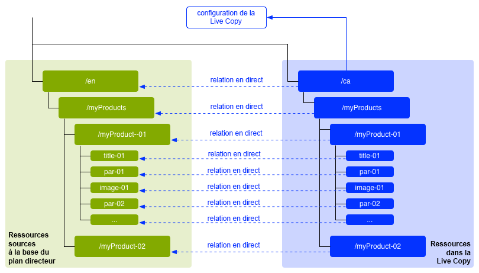
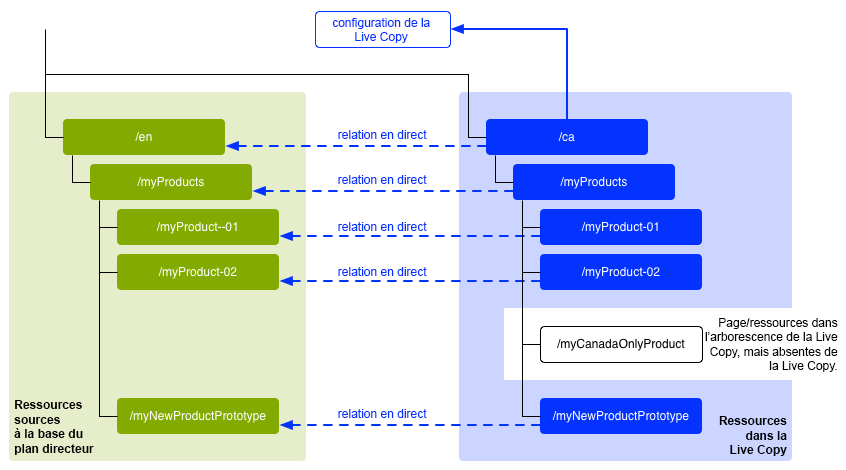
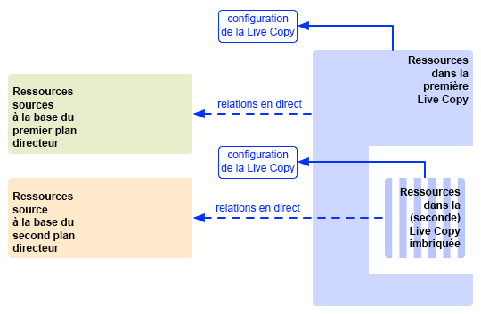

# Réutilisation de contenu : Multi Site Manager et Live Copy {#multi-site-manager-and-live-copy}

Multi Site Manager (MSM) vous permet d’utiliser le même contenu à plusieurs endroits différents. Pour ce faire, MSM utilise sa fonctionnalité Live Copy.

* Avec MSM, vous pouvez :
   * créer une fois un contenu ;
   * le réutiliser dans d’autres zones (grâce aux [Live Copies](#live-copies)) du même site ou d’autres sites.
* MSM conserve alors les relations en direct entre votre contenu source et ses Live Copies afin que :
   * Lorsque vous modifiez le contenu source, la source et les Live Copies sont synchronisées.
   * vous puissiez apporter des ajustements uniquement au contenu des Live Copies en déconnectant les relations en direct pour des sous-pages et composants spécifiques.

Cette page présente un aperçu de la réutilisation du contenu avec MSM. Les pages suivantes traitent en détail des questions connexes.

* [Création et synchronisation de Live Copies](creating-live-copies.md)
* [Console Aperçu de Live Copy](live-copy-overview.md)
* [Configuration de la synchronisation des Live Copies](live-copy-sync-config.md)
* [Conflits de déploiement de MSM](rollout-conflicts.md)
* [Bonnes pratiques MSM](best-practices.md)

>[!NOTE]
>
>MSM peut également être utilisé pour Assets, y compris les fragments de contenu. Voir [ Réutilisation de fragments de contenu à l’aide de MSM pour Assets ](/help/assets/reuse-assets-using-msm.md) (disponible uniquement via la console Assets).

## Scénarios possibles {#possible-scenarios}

Il existe de nombreux cas d’utilisation pour MSM et les Live Copies. Voici quelques scénarios :

* **Multinationales – Entreprise mondiale à locale**

  Un cas d’utilisation type pris en charge par MSM consiste à réutiliser du contenu dans plusieurs sites internationaux utilisant la même langue. Cela permet de réutiliser le contenu de base, tout en autorisant des variantes nationales.

  Par exemple, la section en anglais de l’[exemple de tutoriel WKND](/help/implementing/developing/introduction/develop-wknd-tutorial.md) est créée pour les clients situés aux États-Unis. La majeure partie du contenu de ce site peut également être utilisée pour d’autres sites WKND répondant aux besoins de clients anglophones de différents pays et différentes cultures. Le contenu de base reste identique sur tous les sites, mais des adaptations régionales sont possibles.

  La structure suivante peut être utilisée pour des sites destinés aux États-Unis et au Canada : Notez que le nœud `language-masters` conserve la copie originale non seulement du contenu en anglais mais aussi d’autres langues. Ce contenu peut servir de base à d’autres contenus linguistiques régionaux en plus de l’anglais.

  ```xml
  /content
      |- wknd
          |- language-masters
              |- en
              |- es
              |- fr
          |- us
              |- en
              |- es
          |- ca
              |- en
              |- fr
  ```

  >[!NOTE]
  >
  >MSM ne traduit pas le contenu. Il crée la structure requise et déploie le contenu.
  >
  >
  >Consultez [Traduction de contenu pour les sites multilingues](/help/sites-cloud/administering/translation/overview.md) pour cet exemple.

* **National – Siège social et filiales régionales**

  Une autre possibilité est qu’une entreprise disposant d’un réseau de concessionnaires souhaite créer des sites web distincts pour chaque concession, chacun de ces sites étant une variante du site principal fourni par le siège social. Il peut s’agir d’une seule entreprise avec plusieurs bureaux régionaux, ou d’un système de franchise national constitué d’un franchiseur central et de plusieurs franchisés locaux.

  Le siège peut fournir les informations de base, tandis que les entités régionales peuvent ajouter des informations locales, telles que les coordonnées, les heures d’ouverture et les événements.

  ```xml
  /content
      |- head-office-berlin
      |- branch-hamburg
      |- branch-stuttgart
      |- branch-munich
      |- branch-frankfurt
  ```

* **Versions multiples**

  MSM peut créer des versions d’une sous-branche spécifique. Par exemple, un sous-site d’assistance peut contenir des détails sur les différentes versions d’un produit spécifique, où les informations de base restent constantes et seules les fonctionnalités mises à jour doivent être modifiées :

  ```xml
  /content
      |- game-support
          |- polybius
              |- v5.0
              |- v4.0
              |- v3.0
              |- v2.0
              |- v1.0
  ```

  >[!TIP]
  >
  >Dans un tel scénario, il s’agit de savoir s’il convient de faire une copie simple ou d’utiliser des Live Copies, qui offrent un équilibre entre :
  >
  >* D’un côté, le volume de contenu de base qu’il faudra mettre à jour sur plusieurs versions.
  >
  >De l’autre :
  >
  >* Le nombre de copies individuelles qu’il faudra adapter.

## MSM à partir de l’interface utilisateur {#msm-from-the-ui}

MSM est directement accessible dans l’interface utilisateur à l’aide de différentes options issues de la console appropriée.

* **Créer un site** (**Sites**)

   * MSM vous aide à gérer plusieurs sites web qui partagent du contenu commun. Par exemple, les sites web sont souvent offerts aux audiences internationales de sorte que la majeure partie du contenu soit commun à tous les pays, avec un sous-ensemble du contenu spécifique à chaque pays. MSM vous permet de [créer des Live Copies qui mettent automatiquement à jour un ou plusieurs sites en fonction de votre site source](creating-live-copies.md#creating-a-live-copy-of-a-site-from-a-blueprint-configuration). Cela vous permet également d’appliquer une structure de base commune, d’utiliser le contenu commun dans tous les sites, de conserver la même apparence et de concentrer les efforts sur la gestion du contenu qui diffère réellement d’un site à l’autre. Créer un site de la manière suivante :
      * requiert une configuration de plan directeur prédéfinie pour spécifier la source ;
      * crée une Live Copy de la source (prédéfinie).
      * fournit à l’utilisateur ou l’utilisatrice le bouton **Déploiement**.

* **Créer une Live Copy** (**Sites**)

   * MSM vous permet de [créer une Live Copy ad hoc (unique) d’une page ou d’une sous-branche spécifique d’un site web](creating-live-copies.md#creating-a-live-copy-of-a-page). Par exemple, la duplication d’une sous-branche pour fournir des informations sur la nouvelle version d’un produit. Créer une Live Copy de la manière suivante :
      * crée une Live Copy ad hoc (aucune configuration de plan directeur requise) ;
      * peut être utilisé pour créer (immédiatement) une Live Copy pour une page ou une branche.
      * Nécessite de **Synchroniser** (ne fournit pas le bouton **Déployer**).

* **Afficher les propriétés** (**Sites**)

   * Le cas échéant, cette option vous permet de [surveiller votre Live Copy](creating-live-copies.md#monitoring-your-live-copy) en fournissant des informations sur la **Live Copy** ou le **plan directeur** associé.

* **Références** (**Sites**)

   * Le rail [Références](/help/sites-cloud/authoring/basic-handling.md#references) fournit des informations sur les **Live Copies** ainsi que l’accès aux actions appropriées.

* **Aperçu de la Live Copy** (**Sites**)

   * Cette console vous permet [d’afficher et de gérer votre plan directeur et ses Live Copies](live-copy-overview.md).

* **Plans directeurs** (**Outils** – **Sites**)

   * Cette console vous permet de [créer et de gérer vos configurations de plan directeur](creating-live-copies.md#creating-a-blueprint-configuration).

>[!NOTE]
>
>MSM peut être utilisé avec les deux pages et les [fragments d’expérience](/help/sites-cloud/authoring/fragments/experience-fragments.md), car ces fragments font partie d’une expérience (page).

>[!NOTE]
>
>Certains aspects de la fonctionnalité MSM sont utilisés dans plusieurs autres fonctionnalités AEM telles que les lancements. Dans ce cas, la Live Copy est gérée par cette fonctionnalité.

### Termes utilisés {#terms-used}

Le tableau suivant donne une vue d’ensemble des principaux termes utilisés avec MSM. Ces derniers sont décrits plus en détail dans les sections et pages suivantes.

| Terme | Définition | Informations supplémentaires |
|---|---|---|
| Source | Pages d’origine utilisées comme base pour les Live Copies | Synonyme de plan directeur et/ou pages de plan directeur |
| Live Copy | Copie (de la source), maintenue par des actions de synchronisation telles que définies par les configurations de déploiement |  |
| Configuration de Live Copy | Définition des détails de configuration d’une Live Copy |  |
| Relations en direct | Définition de l’héritage pour une ressource donnée, c’est-à-dire les connexions entre la source et les Live Copies | Assure que les modifications apportées à la source peuvent être synchronisées avec la Live Copy |
| Blueprint | Synonyme de source | Peut être défini par une configuration de plan directeur |
| Configuration du plan directeur | Configuration prédéfinie spécifiant un chemin d’accès source | Lorsqu’une page de plan directeur est référencée dans une configuration de plan directeur, la commande Déployer devient disponible |
| Chapitre | Sections du plan à inclure dans la Live Copy | Il s’agit généralement de sous-pages de la racine |
| Synchronisation | Terme générique pour la synchronisation du contenu entre la source et les Live Copies (par les options **Déployer** et **Synchroniser**). |  |
| Déploiement | Synchronise la source avec la Live Copy | Peut être déclenché par un auteur (sur une page de plan directeur) ou par un événement système (tel que défini par la configuration de déploiement) |
| Configuration du déploiement | Règles qui déterminent quelles propriétés sont synchronisées, de quelle manière et à quel moment |  |
| Synchroniser | Demande manuelle de synchronisation, effectuée à partir des pages Live Copy |  |
| Héritage | Une page ou un composant Live Copy hérite du contenu de sa page ou de son composant source lors de la synchronisation |  |
| Suspendre | Supprime temporairement les relations en direct entre une Live Copy et sa page de plan directeur |  |
| Désolidariser | Supprime de façon permanente la relation en direct entre une Live Copy et sa page de plan directeur |  |
| Réinitialiser | Réinitialise une page Live Copy pour supprimer toutes les annulations d’héritage et restaure la page au même statut que la page source | La réinitialisation affecte toutes les modifications que vous avez apportées aux propriétés de page, au système de paragraphes et aux composants. |
| Superficiel | Live Copy d’une seule page |  |
| Profond | Live Copy d’une page, ainsi que de ses pages enfants |  |

>[!TIP]
>
>Pour connaître les noms d’objet[&#128279;](/help/implementing/developing/extending/msm.md#overview-of-the-java-api) voir  Extension de Multi Site Manager .

## Live Copies {#live-copies}

Une Live Copy MSM est une copie du contenu spécifique d’un site pour laquelle des relations en direct avec la source d’origine sont conservées :

* La Live Copy hérite du contenu de sa source.
* La synchronisation effectue le transfert réel du contenu lorsque des modifications sont apportées à la source.
* Une Live Copy peut être considérée comme :
   * Superficielle : une seule page
   * Profonde : la page, ainsi que ses pages enfants
* Les règles de synchronisation, ou configurations de déploiement, déterminent quelles propriétés sont synchronisées et à quel moment se produit la synchronisation.

Dans l’exemple précédent, `/content/wknd/language-masters/en` est le site gabarit mondial en anglais. Pour réutiliser le contenu de ce site, des Live Copies MSM sont créées :

* Le contenu situé en dessous de `/content/wknd/language-masters/en` est la source.
* Le contenu sous `/content/wknd/language-masters/en` est copié sous les nœuds `/content/wknd/us/en/` et `/content/wknd/ca/en`. Il s’agit des Live Copies.
* Les auteurs modifient les pages sous `/content/wknd/language-masters/en`.
* Une fois la synchronisation déclenchée, MSM synchronise ces modifications vers les Live Copies.

### Live Copies – Composition {#live-copies-composition}

>[!NOTE]
>
>Les graphiques et les descriptions de cette section représentent des instantanés de Live Copies potentielles. Ils ne sont pas exhaustifs, mais offrent un aperçu mettant en évidence les caractéristiques spécifiques.

Lorsque vous créez initialement une Live Copy, les pages sources sélectionnées sont reflétées sur une base 1:1 dans la Live Copy. Par la suite, de nouvelles ressources (pages et/ou paragraphes) peuvent également être créées directement dans la Live Copy. Il est donc utile d’être conscient de ces variations et de savoir comment elles affectent la synchronisation. Les compositions possibles sont les suivantes :

* [Live Copy avec des pages autres que Live Copy](#live-copy-with-non-live-copy-pages)
* [Live Copies imbriquées](#nested-live-copies)

La forme de base de la Live Copy comprend les éléments suivants :

* Les pages Live Copy qui reflètent les pages sources sélectionnées sur une base 1:1.
* Une définition de configuration.
* Une relation en direct définie pour chaque ressource :
   * Liez la ressource de Live Copy à son plan directeur ou sa source.
   * Les pages Live Copy sont utilisées pour les opérations d’héritage et de déploiement.

Les modifications peuvent être [synchronisées](creating-live-copies.md#synchronizing-your-live-copy) en fonction des besoins.



#### Live Copy avec des pages autres que Live Copy {#live-copy-with-non-live-copy-pages}

Lorsque vous créez une Live Copy dans AEM, vous pouvez consultez la branche Live Copy et naviguer dans celle-ci et utiliser les fonctionnalités AEM normales sur la branche Live Copy. Cela signifie que vous pouvez (ou un processus peut) créer de nouvelles ressources (des pages et des paragraphes) dans la Live Copy. Par exemple, un produit pour une région ou un pays spécifique.

* Ces ressources n’ont aucune relation en direct avec les pages source/de plan directeur et ne sont pas synchronisées.
* Certains scénarios peuvent se produire, et MSM les traite comme des cas spéciaux. Par exemple, lorsque vous (ou un processus) créez une page ayant la même position et le même nom dans les branches source ou de plan directeur et Live Copy. Pour ces cas de figure, consultez [Conflits de déploiement dans MSM](rollout-conflicts.md) pour plus d’informations.



#### Live Copies imbriquées {#nested-live-copies}

Lorsque vous créez (ou un processus crée) une [page dans une Live Copy existante](#live-copy-with-non-live-copy-pages), cette nouvelle page peut également être configurée en tant que Live Copy d’un plan directeur différent. Il s’agit d’une Live Copy imbriquée. Dans les Live Copies imbriquées, le comportement de la seconde Live Copy ou de la Live Copy interne est affecté par la première Live Copy ou par la Live Copy externe des manières suivantes :

* Un déploiement profond déclenché pour la Live Copy globale peut être poursuivi dans la Live Copy imbriquée.
* Tous les liens entre les sources sont réécrits dans les Live Copies.

Par exemple, les liens pointant du second au premier plan directeur sont réécrits en tant que liens pointant de la seconde Live Copy ou de la Live Copy imbriquée vers la première Live Copy.



>[!NOTE]
>
>Si vous déplacez ou renommez une page de la branche Live Copy, cette opération est traitée comme une Live Copy imbriquée pour permettre à AEM d’effectuer le suivi des relations.

#### Live Copies empilées {#stacked-live-copies}

Une Live Copy est appelée Live Copy empilée lorsqu’elle est créée en tant qu’enfant d’une Live Copy superficielle. Elle se comporte de la même façon qu’une [Live Copy imbriquée](#nested-live-copies).

### Source, plans directeurs et configurations de plan directeur {#source-blueprints-and-blueprint-configurations}

N’importe quelle page ou branche de pages peut être utilisée comme source d’une Live Copy. Toutefois, MSM vous permet également de définir une configuration de plan directeur qui spécifie un chemin d’accès source. Les avantages liés à l’utilisation d’une configuration de plan directeur sont les suivants :

* Permet à l’auteur d’utiliser l’option **Déployer** sur un plan directeur. C’est-à-dire envoyer explicitement les modifications aux Live Copies qui héritent de ce plan.
* Permet à l’auteur d’utiliser **Créer un site**. L’utilisateur peut ainsi sélectionner facilement les langues et configurer la structure de la Live Copy.
* définit une configuration de déploiement par défaut pour les Live Copies partageant une relation avec le plan directeur.

La source d’une Live Copy peut comprendre des pages normales ou des pages englobées par une configuration de plan directeur. Ces deux scénarios sont valides.

La source forme le plan directeur de la Live Copy. Le plan directeur est défini lorsque vous effectuez l’une des opérations suivantes :

* [Créer une configuration de plan directeur](creating-live-copies.md#creating-a-blueprint-configuration) La configuration définit à l’avance les pages à utiliser pour créer la Live Copy.
* [Créer une Live Copy d’une page](creating-live-copies.md#creating-a-live-copy-of-a-page) Les pages utilisées pour créer la Live Copy (les pages source) sont les pages de plan directeur. La page source peut être référencée ou non par une configuration de plan directeur.

### Déploiement et synchronisation {#rollout-and-synchronize}

Le déploiement est l’action MSM centrale qui synchronise les Live Copies avec leur source. Vous pouvez exécuter des déploiements manuellement ou ils peuvent se produire automatiquement.

* Une [configuration de déploiement](#rollout-configurations) peut être définie de sorte que des [événements](live-copy-sync-config.md#rollout-triggers) spécifiques puissent provoquer l’exécution automatique d’un déploiement.
* Lorsque vous créez une page de plan directeur, vous pouvez utiliser la commande **[Déployer](creating-live-copies.md#rolling-out-a-blueprint)** pour pousser les modifications vers la Live Copy.
   * La commande **Déployer** est disponible sur une page de plan directeur référencée par une configuration de plan directeur.

  

* Lorsque vous créez une page Live Copy, vous pouvez utiliser la commande **[Synchroniser](creating-live-copies.md#synchronizing-a-live-copy)** pour pousser les modifications de la source vers la Live Copy.
   * La commande **Synchroniser** est toujours disponible sur la page Live Copy que la page source/de plan directeur soit englobée ou non par une configuration de plan directeur.

  

### Configurations du déploiement {#rollout-configurations}

Une configuration de déploiement définit quand et comment une Live Copy est synchronisée avec le contenu source. Une configuration de déploiement se compose d’un déclencheur et d’une ou de plusieurs actions de synchronisation :

* **Déclencheur** – Un déclencheur est un événement qui provoque la synchronisation d’une action en direct, comme l’activation d’une page source. MSM définit les déclencheurs que vous pouvez utiliser.
* **Actions de synchronisation** : les actions de synchronisation sont exécutées sur Live Copy pour la synchroniser avec la source. Par exemple, la copie de contenu, l’organisation de nœuds enfants et l’activation de la page Live Copy sont des actions de synchronisation. MSM fournit plusieurs actions de synchronisation.

>[!NOTE]
>
>Vous pouvez créer des actions personnalisées pour votre instance à l’aide de l’API Java.

Les configurations de déploiement peuvent être réutilisées, de sorte que plusieurs Live Copies puissent utiliser la même configuration de déploiement. L’installation standard comprend plusieurs [configurations de déploiement](live-copy-sync-config.md#installed-rollout-configurations).

### Conflits de déploiement {#rollout-conflicts}

Les déploiements peuvent devenir complexes, en particulier lorsque les auteurs modifient du contenu à la fois dans la source et la Live Copy. Il est donc utile de savoir comment AEM gère les [ conflits susceptibles de se produire pendant le déploiement](rollout-conflicts.md).

### Suspension et annulation de l’héritage et de la synchronisation {#suspending-and-cancelling-inheritance-and-synchronization}

Chaque page et chaque composant dans une Live Copy sont associés à leur page source et leur composant source via des relations en direct. Les relations en direct configurent la synchronisation du contenu Live Copy à partir de la source.

Vous pouvez **Suspendre** l’héritage Live Copy d’une page Live Copy de manière à pouvoir modifier les propriétés de la page et ses composants. Lorsque vous suspendez l’héritage, les propriétés et les composants de la page ne sont plus synchronisés avec la source.

Lors de la modification d’une page individuelle, les auteurs peuvent **Annuler l’héritage** d’un composant. Lorsque l’héritage est annulé, les relations en direct sont suspendues et la synchronisation ne se produit pas pour ce composant. L’annulation de l’héritage et de la synchronisation est utile lorsque des sous-sections du contenu doivent être personnalisées.

### Désolidarisation d’une Live Copy {#detaching-a-live-copy}

Vous pouvez également [désolidariser une Live Copy](creating-live-copies.md#detaching-a-live-copy) de son plan directeur pour supprimer toutes les connexions.

>[!CAUTION]
>
>L’action Désolidariser est définitive et irréversible.

L’action Désolidariser supprime définitivement les relations en direct entre une Live Copy et sa page de plan directeur. Toutes les propriétés MSM sont supprimées de la Live Copy et les pages Live Copy deviennent une copie autonome.

>[!TIP]
>
>Consultez [Désolidarisation d’une Live Copy](creating-live-copies.md#detaching-a-live-copy) pour plus d’informations, y compris pour connaître l’impact associé sur les sous-pages et les pages parentes.

## Étapes standard d’utilisation de MSM {#standard-steps-for-using-msm}

Les étapes suivantes décrivent la procédure standard d’utilisation de MSM pour réutiliser le contenu et synchroniser les modifications apportées aux Live Copies.

1. Développez le contenu du site source.
1. Déterminez la configuration de déploiement à utiliser.

   1. MSM [installe plusieurs configurations de déploiement](live-copy-sync-config.md#installed-rollout-configurations) pouvant répondre à plusieurs cas d’utilisation.
   1. Vous pouvez éventuellement [créer une configuration de déploiement](live-copy-sync-config.md#creating-a-rollout-configuration), le cas échéant.

1. Déterminez où vous devez [spécifier les configurations de déploiement à utiliser](live-copy-sync-config.md#specifying-the-rollout-configurations-to-use) et effectuez la configuration selon vos besoins.
1. Si nécessaire, [créez une configuration de plan directeur](creating-live-copies.md#creating-a-blueprint-configuration) qui identifie le contenu source de la Live Copy.
1. [Créer une Live Copy](creating-live-copies.md#creating-a-live-copy).
1. Apportez des modifications au contenu source selon vos besoins. Vous devez utiliser le processus normal de révision et d’approbation de contenu établi par votre entreprise.
1. [Déployez](creating-live-copies.md#rolling-out-a-blueprint) le plan directeur ou [synchronisez la Live Copy](creating-live-copies.md#synchronizing-a-live-copy) avec les modifications.

## Personnalisation de MSM {#customizing-msm}

MSM fournit des outils afin que votre implémentation puisse s’adapter aux complexités exceptionnelles pouvant résulter du partage de contenu.

* **Configurations de déploiement personnalisées** – [Créez une configuration de déploiement](live-copy-sync-config.md#creating-a-rollout-configuration) lorsque les configurations de déploiement installées ne répondent pas à vos besoins. Vous pouvez utiliser n’importe quel déclencheur de déploiement et action de synchronisation disponibles.

<!--
* **Custom Synchronization Actions** - [Create a custom synchronization action](/help/sites-developing/extending-msm.md#creating-a-new-synchronization-action) when the installed actions do not meet your specific application requirements. MSM provides a Java API for creating custom synchronization actions.
-->

## Bonnes pratiques {#best-practices}

La page [Meilleures pratiques MSM](best-practices.md) contient des informations importantes sur votre implémentation.
