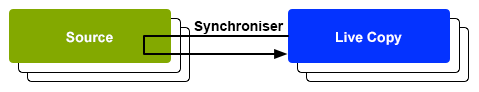

# Réutilisation de contenu : Multi Site Manager et Live Copy {#multi-site-manager-and-live-copy}

Le gestionnaire multisite (MSM) vous permet d’utiliser le même contenu de site en plusieurs emplacements. MSM utilise sa fonctionnalité Live Copy pour y parvenir.

* Avec MSM, vous pouvez :
   * Créer du contenu une fois puis
   * Réutilisez ce contenu dans d’autres zones (via [Live Copies](#live-copies)) du même site ou d’autres sites.
* MSM conserve ensuite les relations en direct entre votre contenu source et ses Live Copies, de sorte que :
   * Lorsque vous apportez des modifications au contenu source, la source et les Live Copies sont synchronisées.
   * Vous pouvez apporter des ajustements uniquement au contenu des Live Copies en déconnectant la relation active pour les sous-pages et/ou composants individuels.

Cette page présente un aperçu de la réutilisation du contenu avec MSM. Les pages suivantes traitent en détail des questions connexes.

* [Création et synchronisation de Live Copies](creating-live-copies.md)
* [Console Aperçu de la Live Copy](live-copy-overview.md)
* [Configuration de la synchronisation des Live Copies](live-copy-sync-config.md)
* [Conflits de déploiement dans MSM](rollout-conflicts.md)
* [Meilleures pratiques MSM](best-practices.md)

## Scénarios possibles {#possible-scenarios}

Il existe de nombreux cas d&#39;utilisation pour les médias multimédias et les Live Copies. Voici quelques scénarios :

* **Multinationales - Entreprise mondiale à locale**

   Un cas d’utilisation type pris en charge par MSM consiste à réutiliser du contenu dans plusieurs sites internationaux utilisant la même langue. Cela permet de réutiliser le contenu de base tout en permettant des variations nationales.

   Par exemple, la section Anglais de l&#39;[exemple de tutoriel WKND](/help/implementing/developing/introduction/develop-wknd-tutorial.md) est créée pour les clients des États-Unis. La plupart du contenu de ce site peut aussi être utilisé pour d&#39;autres sites WKND qui s&#39;adressent à des clients anglophones de différents pays et cultures. Le contenu de base reste identique sur tous les sites, mais des adaptations régionales sont possibles.

   La structure suivante peut être utilisée pour les sites des États-Unis et du Canada. Notez comment le noeud `language-masters` conserve la copie originale non seulement du contenu en anglais mais aussi d’autres langues. Ce contenu peut servir de base à d&#39;autres contenus linguistiques régionaux en plus de l&#39;anglais.

   ```xml
   /content
       |- wknd
           |- language-masters
               |- en
               |- es
               |- fr
           |- us
               |- en
               |- es
           |- ca
               |- en
               |- fr
   ```

   >[!NOTE]
   >
   >MSM ne traduit pas le contenu. Il crée la structure requise et déploie le contenu.
   >
   >
   >Voir [Traduction de contenu pour les sites multilingues](/help/sites-cloud/administering/translation/overview.md) pour un tel exemple.

* **National - Siège social et filiales régionales**

   Une société disposant d&#39;un réseau de concessionnaires peut aussi vouloir des sites Web distincts pour ses concessionnaires individuels, chacun étant une variante du site principal fourni par le siège social. Il peut s’agir d’une entreprise unique ayant plusieurs sites régionaux ou d’un système de franchise nationale constitué d’un franchisé central et de plusieurs franchisés locaux.

   Le siège social peut fournir les informations de base et les entités régionales peuvent y ajouter des informations locales, comme les coordonnées, les heures d’ouverture et les événements.

   ```xml
   /content
       |- head-office-berlin
       |- branch-hamburg
       |- branch-stuttgart
       |- branch-munich
       |- branch-frankfurt
   ```

* **Plusieurs versions**

   MSM peut créer des versions d&#39;une sous-branche spécifique. Par exemple, un sous-site d&#39;assistance peut contenir des détails sur les différentes versions d&#39;un produit spécifique, où les informations de base restent constantes et seules les fonctionnalités mises à jour doivent être modifiées :

   ```xml
   /content
       |- game-support
           |- polybius
               |- v5.0
               |- v4.0
               |- v3.0
               |- v2.0
               |- v1.0
   ```

   >[!TIP]
   >
   >Dans un tel scénario, il s&#39;agit de savoir s&#39;il convient de faire une copie simple ou d&#39;utiliser des Live Copies, ce qui constitue l&#39;équilibre entre :
   >
   >* La quantité de contenu principal qui doit être mise à jour dans plusieurs versions.
   >
   >De l’autre :
   >
   >* La quantité de copies individuelles à ajuster.


## MSM à partir de l’interface utilisateur {#msm-from-the-ui}

MSM est directement accessible dans l’interface utilisateur à l’aide de différentes options de la console appropriée.

* **Créer un site** (**Sites**)

   * MSM vous aide à gérer plusieurs sites Web qui partagent du contenu commun. Par exemple, les sites Web sont souvent fournis pour les audiences internationales de sorte que la plupart du contenu soit commun à tous les pays, avec un sous-ensemble du contenu spécifique à chaque pays. MSM vous permet de [créer des Live Copies qui mettent automatiquement à jour un ou plusieurs sites en fonction de votre site source](creating-live-copies.md#creating-a-live-copy-of-a-site-from-a-blueprint-configuration). Cela vous permet également d’appliquer une structure de base commune, d’utiliser le contenu commun dans tous les sites, de conserver la même apparence et de concentrer les efforts sur la gestion du contenu qui diffère réellement d’un site à l’autre. Créez un site de la manière suivante :
      * Requiert une configuration de plan directeur prédéfinie pour spécifier la source.
      * Crée une Live Copy de la source (prédéfinie).
      * Fournit à l’utilisateur le bouton **Déployer**.

* **Créer une Live Copy** (**Sites**)

   * MSM vous permet de [créer une Live Copy ad hoc (ponctuelle) d&#39;une page ou sous-branche individuelle d&#39;un site Web.](creating-live-copies.md#creating-a-live-copy-of-a-page) Par exemple, dupliquer une sous-branche pour fournir des informations sur une nouvelle version/mise à jour d&#39;un produit. Création d’une Live Copy de la manière suivante :
      * Crée une Live Copy ad hoc (aucune configuration de plan directeur n’est requise).
      * Peut être utilisé pour (immédiatement) créer une Live Copy de n’importe quelle page/branche.
      * Nécessite **Synchroniser** (ne fournit pas le bouton **Déploiement**).

* **Afficher les propriétés** (**Sites**)

   * Le cas échéant, cette option vous aide [à surveiller votre Live Copy](creating-live-copies.md#monitoring-your-live-copy) en fournissant des informations sur la **Live Copy** ou **Blueprint** associée.

* **Références** (**Sites**)

   * Le rail [References](/help/sites-cloud/authoring/getting-started/basic-handling.md#references) fournit des informations sur **Live Copies** ainsi que l&#39;accès aux actions appropriées.

* **Aperçu de la Live Copy** (**Sites**)

   * Cette console vous permet de [vue et de gérer votre plan directeur et ses Live Copies.](live-copy-overview.md)

* **Plans directeurs** (**Outils** - **Sites**)

   * Cette console vous permet de [créer et de gérer vos configurations de plan directeur.](creating-live-copies.md#creating-a-blueprint-configuration)

>[!NOTE]
>
>Certains aspects de la fonctionnalité MSM sont utilisés dans plusieurs autres fonctionnalités AEM telles que les lancements. Dans ce cas, la Live Copy est gérée par cette fonctionnalité.

### Termes utilisés {#terms-used}

En introduction, le tableau suivant présente un aperçu des principaux termes utilisés avec les MSM. Elles seront traitées plus en détail dans les sections et pages suivantes.

| Terme | Définition | Détails supplémentaires |
|---|---|---|
| Source | Pages d&#39;origine utilisées comme base pour les Live Copies | Synonyme de pages de plans et/ou de plans directeurs |
| Live Copy  | La copie (de la source), gérée par des actions de synchronisation définies par les configurations de déploiement |  |
| Configuration de Live Copy | Définition des détails de configuration d’une Live Copy |  |
| Relations en direct | Définition efficace de l&#39;héritage pour une ressource donnée, c&#39;est-à-dire les connexions entre la source et les Live Copies | Garantit que les modifications apportées à la source peuvent être synchronisées avec Live Copy |
| Blueprint | Synonyme avec source | Peut être défini par une configuration de plan |
| Configuration du plan directeur | Configuration prédéfinie spécifiant un chemin d’accès source | Lorsqu’une page de plan directeur est référencée dans une configuration de plan directeur, la commande Déployer devient disponible |
| Chapitre | Les sections du plan à inclure dans la Live Copy | Il s’agit généralement de sous-pages de la racine |
| Synchronisation | Terme générique de synchronisation du contenu entre la source et les Live Copies (par les options **Déploiement** et **Synchroniser**). |  |
| Déploiement | Synchronise la source avec la Live Copy | Peut être déclenché par un auteur (sur une page de plan directeur) ou par un événement système (tel que défini par la configuration de déploiement) |
| Configuration du déploiement | Règles qui déterminent quelles propriétés seront synchronisées, comment et quand |  |
| Synchroniser | Demande manuelle de synchronisation, effectuée à partir des pages Live Copy |  |
| Héritage | Une page/un composant Live Copy hérite du contenu de sa page/composant source lors de la synchronisation |  |
| Suspendre | Supprime temporairement la relation active entre une Live Copy et sa page de plan |  |
| Désolidariser | Supprime définitivement la relation de production entre une Live Copy et sa page de plan |  |
| Réinitialiser | Réinitialisez une page Live Copy pour supprimer toutes les annulations d’héritage et rétablir la page au même état que la page source. | La réinitialisation affecte toutes les modifications que vous avez apportées aux propriétés de page, au système de paragraphes et aux composants. |
| Léger | Une copie dynamique d’une seule page |  |
| Profondeur | Live Copy d’une page, ainsi que de ses pages enfants |  |

<!--
>[!TIP]
>
>See [Overview of the Java API](/help/sites-developing/extending-msm.md#overview-of-the-java-api) for the object names.
-->

## Live Copies {#live-copies}

Une Live Copy MSM est une copie du contenu spécifique du site pour lequel une relation dynamique avec la source d&#39;origine est conservée :

* Live Copy hérite du contenu de sa source.
* La synchronisation effectue le transfert réel du contenu lorsque des modifications sont apportées à la source.
* Une Live Copy peut être considérée comme :
   * Superficielle : une seule page
   * Profonde : la page, ainsi que ses pages enfants
* Les règles de synchronisation, appelées configurations de déploiement, déterminent quelles propriétés sont synchronisées et quand la synchronisation a lieu.

Dans l’exemple précédent, `/content/wknd/language-masters/en` est le site maître global en anglais. Pour réutiliser le contenu de ce site, des Live Copies MSM sont créées :

* Le contenu ci-dessous `/content/wknd/language-masters/en` est la source.
* Le contenu ci-dessous `/content/wknd/language-masters/en` est copié sous les noeuds `/content/wknd/us/en/` et `/content/wknd/ca/en`. Voici les Live Copies.
* Les auteurs apportent des modifications aux pages suivantes `/content/wknd/language-masters/en`.
* Lorsqu&#39;il est déclenché, MSM synchronise ces modifications avec les Live Copies.

### Live Copies - Composition {#live-copies-composition}

>[!NOTE]
>
>Les diagrammes et descriptions de cette section représentent des instantanés de Live Copies potentielles. Ils ne sont pas exhaustifs, mais offrent un aperçu mettant en évidence les caractéristiques spécifiques.

Lors de la création initiale d’une Live Copy, les pages source sélectionnées sont reflétées 1:1 dans la Live Copy. Ensuite, de nouvelles ressources (pages et/ou paragraphes) peuvent également être créées directement dans Live Copy. Il est donc utile de connaître ces variations et leur impact sur la synchronisation. Les compositions possibles sont les suivantes :

* [Live Copy avec des pages non-Live Copy](#live-copy-with-non-live-copy-pages)
* [Live Copies imbriquées](#nested-live-copies)

La forme de base de Live Copy est la suivante :

* Pages Live Copy qui reflètent les pages source sélectionnées sur la base 1:1.
* Une définition de configuration.
* Des relations en direct définies pour chaque ressource :
   * Liez la ressource Live Copy à son plan directeur/source.
   * Sont utilisés lors de la réalisation de l’héritage et du déploiement.

Les modifications peuvent être [synchronisées](creating-live-copies.md#synchronizing-your-live-copy) en fonction des besoins.


#### Live Copy avec des pages non Live-Copy {#live-copy-with-non-live-copy-pages}

Lorsque vous créez une Live Copy dans AEM, vous pouvez afficher et parcourir la branche Live Copy et utiliser la fonctionnalité AEM normale sur la branche Live Copy. Cela signifie que vous (ou un processus) pouvez créer de nouvelles ressources (pages et/ou paragraphes) dans Live Copy. Par exemple, un produit pour une région ou un pays particulier.

* Ces ressources n’ont aucune relation en direct avec les pages source/de plan directeur et ne sont pas synchronisées.
* Certains scénarios peuvent se produire, et MSM les traite comme des cas spéciaux. Par exemple, lorsque vous (ou un processus) créez une page avec la même position et le même nom dans les branches source/plan et Live Copy. Pour de telles situations, voir [Conflits de déploiement MSM](rollout-conflicts.md) pour plus d&#39;informations.


#### Live Copies imbriquées {#nested-live-copies}

Lorsque vous (ou un processus) créez une [nouvelle page dans une Live Copy](#live-copy-with-non-live-copy-pages) existante, cette nouvelle page peut également être configurée en Live Copy d&#39;un autre modèle. Il s’agit d’une Live Copy imbriquée. Dans les Live Copies imbriquées, le comportement de la seconde ou de la seconde Live Copy interne est affecté par la première ou la première Live Copie externe de la manière suivante :

* Un déploiement profond déclenché pour la Live Copy globale peut être poursuivi dans la Live Copy imbriquée.
* Tout lien entre les sources sera réécrit dans les Live Copies.

Par exemple, les liens qui pointent de la seconde vers la première esquisse seront réécrits en tant que liens pointant de la Live Copy imbriquée/seconde vers la première Live Copy.


>[!NOTE]
>
>Si vous déplacez ou renommez une page dans la branche Live Copy, celle-ci sera traitée comme une Live Copy imbriquée afin de permettre AEM le suivi des relations.

#### Live Copies empilées {#stacked-live-copies}

Une Live Copy est appelée Live Copy empilée lorsqu’elle est créée en tant qu’enfant d’une Live Copy peu profonde. Il se comporte de la même manière qu’une [Live Copy imbriquée](#nested-live-copies).

### Source, plans directeurs et configurations de plan directeur {#source-blueprints-and-blueprint-configurations}

N’importe quelle page ou branche de pages peut être utilisée comme source d’une Live Copy. Toutefois, MSM vous permet également de définir une configuration de plan directeur qui spécifie un chemin d’accès source. L&#39;utilisation d&#39;une configuration de schéma directeur présente les avantages suivants :

* Permet à l’auteur d’utiliser l’option **Déploiement** sur un plan. C&#39;est-à-dire pousser explicitement les modifications aux Live Copies qui héritent de ce plan.
* Permet à l’auteur d’utiliser **Créer un site**. Cela permet à l’utilisateur de sélectionner facilement les langues et de configurer la structure de Live Copy.
* Définissez une configuration de déploiement par défaut pour les Live Copies qui ont une relation avec le plan.

La source d&#39;une Live Copy peut être soit des pages ordinaires, soit des pages couvertes par une configuration de plan. Les deux cas d’utilisation sont valables.

La source forme le plan directeur de la Live Copy. Le plan directeur est défini lorsque vous effectuez l’une des opérations suivantes :

* [Créer une configuration](creating-live-copies.md#creating-a-blueprint-configuration)  de plan directeur : la configuration définit à l&#39;avance les pages à utiliser pour créer la Live Copy.
* [Créer une Live Copy d&#39;une page](creating-live-copies.md#creating-a-live-copy-of-a-page)  : les pages utilisées pour créer la Live Copy (les pages source) sont les pages du plan directeur. La page source peut être référencée ou non par une configuration de plan.

### Déploiement et synchronisation {#rollout-and-synchronize}

Un déploiement est l’action MSM centrale qui synchronise les Live Copies avec leurs sources. Vous pouvez effectuer des déploiements manuellement ou automatiquement.

* Une [configuration de déploiement](#rollout-configurations) peut être définie de sorte que des [événements](live-copy-sync-config.md#rollout-triggers) spécifiques puissent provoquer l’exécution automatique d’un déploiement.
* Lors de la création d&#39;une page de plan, vous pouvez utiliser la commande **[Déploiement](creating-live-copies.md#rolling-out-a-blueprint)** pour pousser les modifications dans la Live Copy.
   * La commande **Déploiement** est disponible sur une page de plan qui est référencée par une configuration de plan.

   

* Lors de la création d’une page Live Copy, vous pouvez utiliser la commande **[Synchroniser](creating-live-copies.md#synchronizing-a-live-copy)** pour extraire les modifications de la source vers la Live Copy.
   * La commande **Synchroniser** est toujours disponible sur la page Live Copy, que la page source/plan soit ou non comprise dans une configuration de plan.

   

### Configurations du déploiement {#rollout-configurations}

Une configuration de déploiement définit quand et comment une Live Copy est synchronisée avec le contenu source. Une configuration de déploiement consiste en un déclencheur et d’une ou plusieurs actions de synchronisation :

* **Déclencheur** - Un déclencheur est un événement qui provoque la synchronisation de l&#39;action active, telle que l&#39;activation d&#39;une page source. MSM définit les déclencheurs que vous pouvez utiliser.
* **Actions**  de synchronisation : les actions de synchronisation sont exécutées sur Live Copy pour la synchroniser avec la source. Les exemples d’actions consistent à copier du contenu, à classer les noeuds enfants et à activer la page Live Copy. MSM fournit un certain nombre d&#39;actions de synchronisation.

>[!NOTE]
>
>Vous pouvez créer des actions personnalisées pour votre instance à l’aide de l’API Java.

Les configurations de déploiement peuvent être réutilisées, de sorte que plusieurs Live Copy puissent utiliser la même configuration de déploiement. L’installation standard comprend plusieurs [configurations de déploiement](live-copy-sync-config.md#installed-rollout-configurations).

### Conflits de déploiement  {#rollout-conflicts}

Les déploiements peuvent devenir complexes, en particulier lorsque les auteurs modifient le contenu à la fois dans la source et dans la Live Copy. Il est donc utile de savoir comment AEM gère les [conflits qui peuvent survenir pendant le déploiement.](rollout-conflicts.md)

### Suspension et annulation de l’héritage et de la synchronisation {#suspending-and-cancelling-inheritance-and-synchronization}

Chaque page et composant d’une Live Copy est associé à sa page source et à son composant par le biais d’une relation en direct. La relation active configure la synchronisation du contenu Live Copy à partir de la source.

Vous pouvez **Suspendre** l’héritage de Live Copy pour une page Live Copy afin de pouvoir modifier les propriétés et les composants de la page. Lorsque vous suspendez l’héritage, les propriétés et les composants de la page ne sont plus synchronisés avec la source.

Lors de la modification d’une page individuelle, les auteurs peuvent **Annuler l’héritage** d’un composant. Lorsque l’héritage est annulé, les relations en direct sont suspendues et la synchronisation ne se produit pas pour ce composant. L’annulation de l’héritage et de la synchronisation est utile lorsque des sous-sections du contenu doivent être personnalisées.

### Désolidarisation d’une Live Copy {#detaching-a-live-copy}

Vous pouvez également [détacher une Live Copy](creating-live-copies.md#detaching-a-live-copy) de son plan pour supprimer toutes les connexions.

>[!CAUTION]
>
>L’action Désolidariser est définitive et irréversible.

L’action de détachement supprime définitivement la relation active entre une Live Copy et sa page de plan. Toutes les propriétés pertinentes pour MSM sont supprimées de Live Copy et les pages Live Copy deviennent une copie autonome.

>[!TIP]
>
>Voir [Détachement d’une Live Copy](creating-live-copies.md#detaching-a-live-copy) pour plus d’informations, y compris l’impact associé sur les pages sous-et parentes.

## Étapes standard d’utilisation de MSM {#standard-steps-for-using-msm}

Les étapes suivantes décrivent la procédure standard d’utilisation de MSM pour réutiliser du contenu et synchroniser les modifications apportées aux Live Copies.

1. Développez le contenu du site source.
1. Déterminez la configuration de déploiement à utiliser.

   1. MSM [installe plusieurs configurations de déploiement](live-copy-sync-config.md#installed-rollout-configurations) qui peuvent répondre à un certain nombre de cas d&#39;utilisation.
   1. Vous pouvez également [créer une configuration de déploiement](live-copy-sync-config.md#creating-a-rollout-configuration) si nécessaire.

1. Déterminez à quel endroit vous devez [spécifier les configurations de déploiement à utiliser](live-copy-sync-config.md#specifying-the-rollout-configurations-to-use) et procédez aux configurations en fonction de vos besoins.
1. Si nécessaire, [créez une configuration de plan directeur](creating-live-copies.md#creating-a-blueprint-configuration) qui identifie le contenu source de Live Copy.
1. [Création d’une Live Copy.](creating-live-copies.md#creating-a-live-copy)
1. Apportez des modifications au contenu source selon vos besoins. Vous devez suivre le processus normal d’examen et d’approbation du contenu établi par votre entreprise.
1. [Exécutez ](creating-live-copies.md#rolling-out-a-blueprint) le plan ou  [synchronisez la ](creating-live-copies.md#synchronizing-a-live-copy) copie dynamique avec les modifications.

## Personnalisation de MSM {#customizing-msm}

MSM fournit des outils qui permettent à votre implémentation de s’adapter aux complexités exceptionnelles qui peuvent exister lors du partage de contenu.

* **Configurations**  de déploiement personnalisées -  [Créez une ](live-copy-sync-config.md#creating-a-rollout-configuration) configuration de déploiement lorsque les configurations de déploiement installées ne répondent pas à vos besoins. Vous pouvez utiliser n’importe quel déclencheur de déploiement et action de synchronisation disponibles.

<!--
* **Custom Synchronization Actions** - [Create a custom synchronization action](/help/sites-developing/extending-msm.md#creating-a-new-synchronization-action) when the installed actions do not meet your specific application requirements. MSM provides a Java API for creating custom synchronization actions.
-->

## Bonnes pratiques {#best-practices}

La page [Meilleures pratiques MSM](best-practices.md) contient des informations importantes sur votre implémentation.
