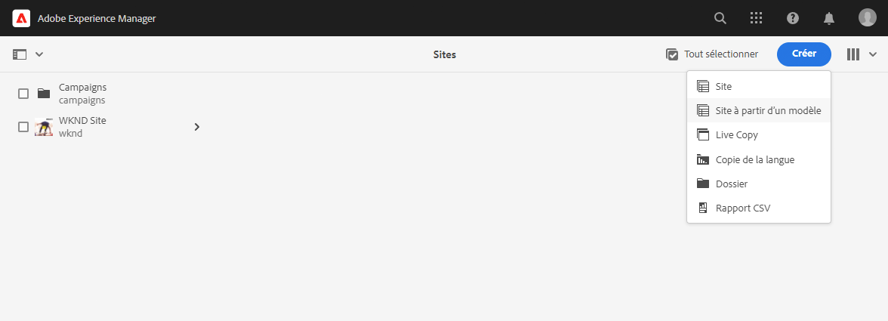
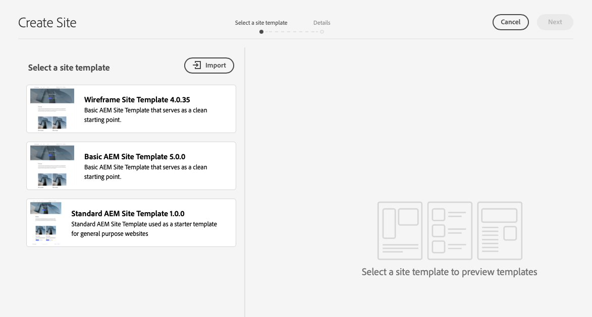
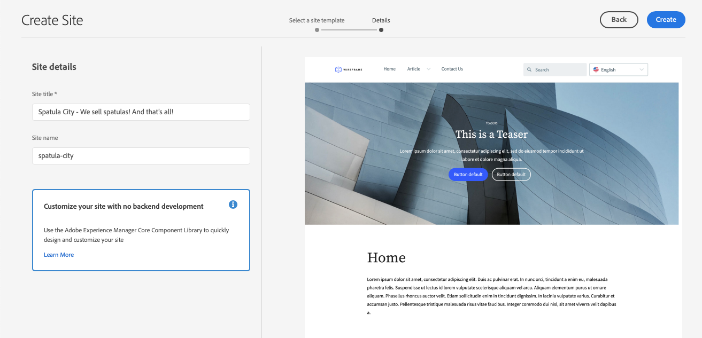
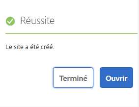
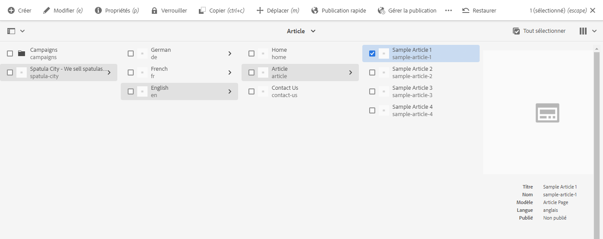

# Création d’un site {#creating-site}

Découvrez comment utiliser AEM pour créer un site à l’aide de modèles de site afin de définir le style et la structure de votre site.

## Vue d’ensemble {#overview}

Pour que les auteurs de contenu puissent créer des pages avec du contenu, le site doit d’abord être créé. Cette opération est généralement effectuée par un administrateur AEM qui définit la structure initiale du site. L’utilisation de modèles de site rend la création de site rapide et flexible pour les non-développeurs.

## Planification de la structure du site {#structure}

Prenez le temps d’examiner à l’avance l’objectif et le contenu planifié de votre site. Cela vous permettra de concevoir la structure du site. Une structure de site bien conçue facilite la navigation et la découverte du contenu pour les visiteurs de votre site et prend en charge diverses fonctionnalités d’AEM telles que [gestion multisite et traduction](/help/sites-cloud/administering/msm-and-translation.md).

## Modèles de site {#site-templates}

La structure du site étant si importante pour le succès d’un site, il est pratique de disposer de structures prédéfinies pour déployer rapidement un nouveau site en fonction d’un ensemble de normes existantes. Les modèles de site permettent de combiner du contenu de site de base dans un package pratique et réutilisable.

Les modèles de site contiennent généralement le contenu et la structure du site de base, ainsi que des informations de style pour démarrer rapidement un nouveau site. Les modèles, réutilisables et personnalisables, sont d’une grande efficacité. De plus, comme vous pouvez avoir plusieurs modèles disponibles dans votre installation AEM, vous avez la possibilité de créer différents sites pour répondre à divers besoins professionnels.

>[!TIP]
>
>Pour plus d’informations sur les modèles de site, consultez le document [Modèles de site.](site-templates.md)

>[!NOTE]
>
>Le modèle de site ne doit pas être confondu avec les modèles de [page).](/help/sites-cloud/authoring/page-editor/templates.md) Les modèles de site définissent la structure globale d’un site. Un modèle de page définit la structure et le contenu initial d’une page individuelle.

### Modèles De Site Fournis Par Adobe {#adobe-templates}

{{adobe-templates}}

## Création d’un site {#create-site}

L’utilisation d’un modèle pour créer un site est simple.

1. Connectez-vous à votre environnement de création AEM et accédez à la console Sites.

   * `https://<your-author-environment>.adobeaemcloud.com/sites.html/content`

1. Appuyez ou cliquez sur **Créer** en haut à droite de l’écran et, dans le menu déroulant, sélectionnez **Site à partir d’un modèle**.

   

1. Dans l’assistant Créer un site, sélectionnez un modèle existant dans le panneau de gauche ou sur **Importer** en haut de la colonne gauche pour importer un nouveau modèle.

   

   1. Si vous choisissez d’importer, dans l’explorateur de fichiers, recherchez le modèle que vous souhaitez utiliser, puis sélectionnez **Charger**.

   1. Une fois chargé, il s’affiche dans la liste des modèles disponibles.

1. Lors de la sélection d’un modèle, il affiche des informations sur le modèle dans la colonne de droite. Une fois le modèle souhaité sélectionné, sélectionnez **Suivant**.

   

1. Indiquez un titre pour votre site. Un nom de site peut être fourni ou généré à partir du titre s’il est omis.

   * Le titre du site s’affiche dans la barre de titre des navigateurs.
   * Le nom du site fait alors partie de l’URL.
   * Le nom du site doit respecter les [conventions de dénomination des pages d’AEM](/help/sites-cloud/authoring/sites-console/organizing-pages.md#page-name-restrictions-and-best-practices).

1. Fournissez des détails supplémentaires sur le site, comme l’exige le modèle de site.

   * Différents modèles peuvent nécessiter des détails supplémentaires.
   * Par exemple, les modèles pour les [projets Edge Delivery Services](https://www.aem.live/developer/ue-tutorial) nécessitent le référentiel GitHub de votre projet.

1. Sélectionnez **Créer** pour que le site soit créé à partir du modèle de site.

   

1. Dans la boîte de dialogue de confirmation qui s’affiche, sélectionnez **Terminé**.

   

1. Dans la console Sites, le nouveau site est visible et vous pouvez y accéder pour explorer sa structure de base telle que définie par le modèle.

   

Les auteurs de contenu peuvent maintenant commencer la création !

## Personnalisation du site {#site-customization}

Les modèles sont utiles pour configurer rapidement la structure et le style de base d’un site. Cependant, la plupart des projets nécessitent un style et une personnalisation supplémentaires. Les modèles de site permettent de découpler la mise en forme du site, de sorte que les développeurs front-end n’ont pas besoin de connaître AEM pour mettre en forme le site et peuvent
travailler séparément et parallèlement aux créateurs et créatrices de contenu ; Selon le type de projet, il peut prendre deux formes.

* Pour les projets avec création de pages AEM à l’aide de l’éditeur universel et diffusion via la diffusion [&#x200B; Edge](/help/edge/overview.md), toute la mise en forme est effectuée dans le projet GitHub.
   * Consultez le document [Prise en main - Tutoriel de développement de l’éditeur universel](https://www.aem.live/developer/ue-tutorial) pour plus d’informations.
* Pour les projets avec la création et la diffusion de pages AEM traditionnelles par le biais de la diffusion [publication](/help/sites-cloud/authoring/author-publish.md) l’administrateur AEM télécharge simplement le thème du site et le fournit au développeur front-end, qui le personnalise à l’aide de ses outils préférés, puis valide les modifications dans le référentiel de code AEM, qui est ensuite déployé.
   * Consultez le document [Parcours de création rapide de site AEM](/help/journey-sites/quick-site/overview.md) pour plus d’informations.
