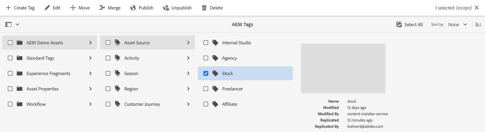
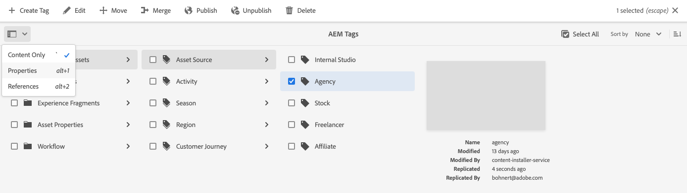

# Administration des balises {#administering-tags}

Les balises sont une méthode intuitive de classification de votre contenu. Ils peuvent être considérés comme des mots-clés ou des libellés (métadonnées) qui permettent de trouver plus rapidement du contenu.

Dans Adobe Experience Manager (AEM), une balise peut être une propriété de l’un des éléments suivants :

* Nœud de contenu pour une page
   * Consultez le document [Utilisation des balises](/help/sites-cloud/authoring/sites-console/tags.md) pour plus d’informations.
* Nœud de métadonnées pour une ressource
   * Consultez le document [Gestion des métadonnées pour Digital Assets](/help/assets/manage-metadata.md) pour plus d’informations.

>[!TIP]
>
>Il est recommandé de réduire au minimum le nombre de balises qui se rapportent aux mêmes idées. Par exemple, si vous gérez le contenu d’une boutique de fournitures pour l’extérieur, vous n’avez probablement pas besoin de balise pour les **chaussures** et **chaussures**.

## Fonctionnalités de balise {#tag-features}

Les balises offrent des fonctionnalités robustes pour organiser et gérer le contenu.

* Les balises peuvent être regroupées dans différents espaces de noms.
   * Les espaces de noms peuvent être considérés comme des hiérarchies qui permettent de créer des taxonomies.
   * Ces taxonomies sont globales dans l’ensemble d’AEM.
* Les balises peuvent être appliquées par les auteurs et utilisées par les visiteurs du site.
* Quel que soit leur créateur ou créatrice, toutes les formes de balises peuvent être sélectionnées, lors de l’affectation d’une page ou lors d’une recherche.
* Les balises sont utilisées par le [composant Liste](https://experienceleague.adobe.com/docs/experience-manager-core-components/using/wcm-components/list.html?lang=fr) pour générer des listes dynamiques en fonction des balises sélectionnées.

## Tag Requirements {#requirements}

Il existe quelques détails techniques à garder à l’esprit lors de la création et de la gestion des balises.

* Les balises doivent être uniques dans un espace de noms spécifique.
* Le nom d’une balise ne peut pas comporter de délimiteur :
   * Deux-points (`:`) : délimite la balise de l’espace de noms.
   * Barre oblique (`/`) : délimite les balises secondaires.
* Si le titre d’une balise comprend des délimiteurs de balise, ils sont supprimés dans l’interface utilisateur.
* Les membres du groupe `tag-administrators` et les membres disposant de droits de modification sur les `/content/cq:tags` peuvent créer des balises et modifier leur taxonomie.
   * Une balise qui contient des balises enfants est appelée balise conteneur.
   * Une balise qui n’est pas une balise conteneur est appelée balise feuille.
   * Un espace de noms de balise peut être une balise feuille ou une balise conteneur.

Pour plus d’informations sur le fonctionnement des balises, consultez le [Framework de balisage AEM](/help/implementing/developing/introduction/tagging-framework.md).

## Console Balisage {#tagging-console}

La console de balisage est utilisée pour créer et gérer des balises et leurs taxonomies. Vous pouvez utiliser la console de balisage pour gérer vos balises en procédant comme suit :

* Les regrouper dans des espaces de noms.
* Vérification de l’utilisation des balises existantes avant d’en créer de nouvelles.
* Réorganisation des balises sans déconnecter la balise du contenu actuellement référencé.

Pour accéder à la console de balisage :

1. Connectez-vous à un environnement de création avec des droits d’administrateur.
1. Dans le menu de navigation global, sélectionnez **`Tools`** > **`General`** >
   **`Tagging`**.

## Création de balises {#creating-new-tags}

Il existe plusieurs étapes pour créer et utiliser des balises afin d’organiser votre contenu.

1. [Créer un espace de noms pour vos balises](#creating-namespaces) (ou en choisir un existant à réutiliser).
1. [Créer une balise](#creating-tags).
1. [Publish la balise](#publishing-tags).

### Création d’espaces de noms {#creating-namespaces}

Un espace de noms est utilisé pour organiser d’autres balises. Elle peut être considérée comme la balise de niveau inférieur et est généralement utilisée pour regrouper d’autres balises.

1. Pour créer un espace de noms, ouvrez la console [balisage](#tagging-console) et cliquez sur le bouton **Créer** de la barre d’outils, puis sur **Créer un espace de noms**.

   

1. Fournissez les informations requises.

   * **Titre** - Titre de l’espace de noms affiché pour l’utilisateur dans l’interface utilisateur (facultatif)
   * **Nom** - Si aucun nom n’est spécifié, un nom de nœud valide est créé à partir du **Titre**. Consultez le document [Framework de balisage AEM](/help/implementing/developing/introduction/tagging-framework.md#tagid) pour plus d’informations.
   * **Description** - Description de l’espace de noms (facultatif)

1. Une fois les informations requises saisies, sélectionnez **Créer**.

L’espace de noms est créé. Dans la console de balisage, les espaces de noms se trouvent au niveau le plus bas (dans la colonne tout à gauche de la console) et sont représentés par des icônes de dossier, reflétant leur nature en tant que « conteneur » ou regroupement d’autres balises.

Vous pouvez désormais [créer des balises](#creating-tags) dans cet espace de noms ou [gérer des balises existantes](#managing-tags).

Un espace de noms ne doit pas nécessairement contenir de sous-balises. Un espace de noms étant lui-même une balise, il peut être utilisé pour organiser votre contenu comme n’importe quelle autre balise. Cependant, pour continuer à créer une taxonomie de balisage structurée, vous pouvez [créer des sous-balises](#creating-tags) dans cet espace de noms en fonction des exigences de votre projet.

### Création de balises {#creating-tags}

Les balises sont généralement ajoutées aux espaces de noms.

1. Pour créer une balise, ouvrez la [console de balisage](#tagging-console).

1. Sélectionnez l’espace de noms dans lequel vous souhaitez créer la balise. Vous pouvez également sélectionner une autre balise pour créer une sous-balise en dessous.

1. Sélectionnez le bouton **Créer** dans la barre d’outils, puis **Créer une balise**.

1. La boîte de dialogue **Créer une balise** s’ouvre. Fournissez les informations requises pour la nouvelle balise.

   * **Titre** - Titre affiché pour la balise (obligatoire)
   * **Name** - Nom de la balise (obligatoire). Si aucun nom n’est spécifié, un nom de nœud valide est créé à partir du **Titre**. Voir [ID de balise](/help/implementing/developing/introduction/tagging-framework.md#tagid).
   * **Description** - Description de la balise
   * **Chemin d’accès à la balise** - La valeur par défaut est l’espace de noms (ou la balise) que vous avez sélectionné dans la console de balisage. Elle peut être mise à jour manuellement en appuyant ou en cliquant sur l’icône du sélecteur de chemin d’accès.

   

1. Sélectionnez **Envoyer**.

La balise est créée et la console est mise à jour pour afficher la nouvelle balise.

Les balises permettent la création flexible de votre propre taxonomie en fonction des besoins de votre organisation.

* Vous pouvez créer des balises enfants de balises existantes en sélectionnant la balise parent dans la console avant de créer votre nouvelle balise.
* Si vous créez une balise sans sélectionner d’espace de noms ou de balise, vous créez un espace de noms.

### Publier des balises {#publishing-tags}

Comme pour la création de tout autre contenu dans AEM, après avoir créé une balise (ou un espace de noms), elle n’existe que dans l’environnement de création. Pour que vos balises soient disponibles pour vos utilisateurs, vous devez les publier.

1. Pour publier une balise, ouvrez la [console de balisage](#tagging-console).

1. Sélectionnez la ou les balises à publier, puis, dans la barre d’outils, sélectionnez **Publish**.

   

1. La boîte de dialogue **Publish Tag** vous invite à confirmer la publication des balises sélectionnées. Sélectionnez **Publier**.

   

1. L’action de publication est confirmée par une boîte de dialogue **Succès**.

   Boîte de dialogue de réussite de la balise Publish 

La ou les balises sélectionnées sont mises en file d’attente pour publication. De même que pour le contenu d’une page, seule la ou les balises sélectionnées sont publiées, qu’elle contienne ou non des balises secondaires.

Pour publier une taxonomie entière (un espace de noms et des balises secondaires), il est recommandé de créer un [ package ](/help/implementing/developing/tools/package-manager.md) de l’espace de noms (voir [Nœud racine de taxonomie](/help/implementing/developing/introduction/tagging-framework.md#taxonomy-root-node)).

<!--
Be sure to [apply permissions](#setting-tag-permissions) to the namespace before creating the package.
-->

## Gestion des balises {#managing-tags}

Vous pouvez exécuter plusieurs actions sur des balises et des espaces de noms existants pour les gérer et les organiser. Il vous suffit de sélectionner une balise ou un espace de noms dans la [console de balisage](#tagging-console) pour afficher dans la barre d’outils les actions disponibles.

* [Afficher les propriétés](#viewing-tag-properties)
* [Modifier](#editing-tags)
* [Dépublier](#unpublishing-tags)
* [Références](#viewing-tag-references)
* [Déplacer](#moving-tags)
* [Fusionner](#merging-tags)
* [Supprimer](#deleting-tags)

Lorsqu’il y a suffisamment d’espace disponible sur la barre d’outils, d’autres options sont disponibles derrière l’icône représentant des points de suspension.

### Affichage des propriétés de balise {#viewing-tag-properties}

Lorsqu’une seule balise, un espace de noms ou une autre balise est sélectionné dans la console Balisage, des informations de base sur la balise sélectionnée, telles que l’heure de la dernière modification et de la dernière publication, sont affichées dans la colonne située à gauche de la colonne Balise.

Vous pouvez afficher plus de détails sur la balise, y compris qui l’a publiée pour la dernière fois et quand en basculant la console sur la vue **Propriétés**.

1. Pour afficher les propriétés d’une balise, ouvrez la [console de balisage](#tagging-console).

1. Sélectionnez la balise dont vous souhaitez afficher les propriétés, puis, dans le rail de gauche, sélectionnez **Propriétés**.

   

1. Les propriétés détaillées de la balise sélectionnée s’affichent dans le rail de gauche.

   

Pour plus d’informations sur la sélection des modes d’affichage et du rail, voir [ Manipulation de base ](/help/sites-cloud/authoring/basic-handling.md#rail-selector).

### Modification des balises {#editing-tags}

Les balises et les espaces de noms peuvent être modifiés après leur création.

1. Pour modifier une balise, ouvrez la [console de balisage](#tagging-console).

1. Sélectionnez la balise à modifier, puis, dans la barre d’outils, sélectionnez **Modifier**.

1. Effectuez les modifications souhaitées. Il est possible de modifier les éléments suivants :

   * **Titre**
   * **Description**
   * [**Localisation **](#managing-tags-in-different-languages)

1. Une fois les modifications apportées, sélectionnez **Envoyer**.

Pour plus d’informations sur l’ajout de traductions, consultez la section [Gestion de balises dans différentes langues](#managing-tags-in-different-languages).

Si les modifications que vous avez apportées portaient sur une balise déjà publiée, vous pouvez la [republier](#publishing-tags).

### Dépublication de balises {#unpublishing-tags}

Pour désactiver la balise sur votre instance de création et la supprimer de votre instance de publication, vous pouvez la dépublier.

1. Pour dépublier une balise, ouvrez la [console de balisage](#tagging-console).

1. Sélectionnez la ou les balises dont vous souhaitez annuler la publication, puis, dans la barre d’outils, sélectionnez **Dépublier**.

   

1. La boîte de dialogue **Dépublier la balise** vous invite à confirmer la publication des balises sélectionnées. Sélectionnez **Publier**.

   

1. L’action de dépublication est confirmée par une boîte de dialogue **Succès**.

   Boîte de dialogue de réussite de la balise Publish 

La ou les balises sélectionnées sont placées en file d’attente pour dépublication. Si la balise sélectionnée est une balise conteneur, toutes les balises enfants sont désactivées dans l’environnement de création et supprimées dans l’environnement de publication.

### Affichage des références de balises {#viewing-tag-references}

Il peut s’avérer utile de déterminer à quel contenu une balise particulière est appliquée. Pour ce faire, utilisez la vue **Références** dans la console de balisage.

1. Pour afficher les références d’une balise, ouvrez la [console de balisage](#tagging-console).

1. Sélectionnez la balise dont vous souhaitez afficher les références, puis, dans le rail de gauche, sélectionnez **Références**.

   

1. Le nombre total de références pour la balise sélectionnée s’affiche dans le rail de gauche.

   

1. Sélectionnez le nombre de références de balise pour afficher la liste détaillée du contenu affecté à la balise.

   

Passez la souris ou sélectionnez un contenu de référence dans la liste pour afficher le chemin d’accès complet du contenu.

Pour plus d’informations sur la sélection des modes d’affichage et du rail, voir [ Manipulation de base ](/help/sites-cloud/authoring/basic-handling.md#rail-selector).

### Déplacement des balises {#moving-tags}

Il peut s’avérer nécessaire de nettoyer ou de réorganiser votre taxonomie de balisage en déplaçant une balise vers un nouvel emplacement ou en la renommant.

>[!TIP]
>
>Il est recommandé de n’autoriser que les administrateurs à déplacer et renommer les balises.

1. Pour déplacer ou renommer une balise, ouvrez la [ console de balisage ](#tagging-console).

1. Sélectionnez la balise à déplacer ou à renommer, puis sélectionnez **Déplacer** dans la barre d’outils.

1. Dans la boîte de dialogue **Déplacer la balise**, indiquez la propriété à modifier.

   * **Renommer en** - Nouveau nom que vous souhaitez donner à la balise
      * Ce champ est prérempli avec le nom actuel de la balise.
      * Ne modifiez pas ce paramètre si vous souhaitez déplacer uniquement la balise sans la renommer.
   * **Déplacer vers** - Où vous souhaitez déplacer la balise
      * Ce champ est prérempli avec l’emplacement actuel de la balise.
      * Ne modifiez pas ce paramètre si vous souhaitez uniquement renommer la balise et ne pas la déplacer.

   

1. Sélectionnez **Envoyer**.

La balise est renommée et/ou déplacée vers son nouvel emplacement. Si la balise sélectionnée est une balise conteneur, le fait de la déplacer déplace également toutes les balises enfants.

### Fusion de balises {#merging-tags}

Si votre taxonomie de balisage comporte des doublons ou des balises similaires, il peut être utile de fusionner ces balises. Lorsque l’`A` de balises est fusionnée dans l’`B` de balises, toutes les pages balisées avec des `A` de balises sont balisées avec des `B` de balises et l’`A` de balises n’est plus disponible pour les auteurs.

1. Pour fusionner deux balises, ouvrez la [ console de balisage ](#tagging-console).

1. Sélectionnez la balise que vous souhaitez fusionner dans une autre balise, puis sélectionnez **Fusionner** dans la barre d’outils.

1. Dans la boîte de dialogue **Fusionner la balise**, sélectionnez l’icône **Parcourir** du champ **Fusionner dans** pour spécifier dans quelle balise vous souhaitez fusionner la balise sélectionnée.

   

1. Sélectionnez **Envoyer**.

La balise sélectionnée dans la console est fusionnée dans la balise spécifiée dans la boîte de dialogue. Lorsqu’une balise référencée est déplacée ou fusionnée, elle n’est pas physiquement supprimée, de sorte qu’il est possible de conserver les références. Consultez [Framework de balisage AEM](/help/implementing/developing/introduction/tagging-framework.md#moving-and-merging-tags) pour plus d’informations.

### Suppression des balises {#deleting-tags}

Si votre taxonomie de balisage change et rend une balise ou un espace de noms inutile, elle peut être supprimée.

1. Pour supprimer une balise, ouvrez la [console de balisage](#tagging-console).

1. Sélectionnez la balise à supprimer, puis sélectionnez **Supprimer** dans la barre d’outils.

1. La boîte de dialogue **Supprimer la balise** vous invite à confirmer la suppression des balises sélectionnées. Sélectionnez **Supprimer**.

   

1. AEM vérifie que la balise n’est pas référencée.

   1. Si aucune référence n’est trouvée, AEM demande une confirmation finale de suppression. Sélectionnez **Supprimer**

      

   1. Si des références sont trouvées, AEM les présente et demande une confirmation finale de suppression.

      

La ou les balises sélectionnées sont supprimées et définitivement supprimées de l’environnement de création. Si la balise a été publiée, elle est également supprimée de l’environnement de publication. Si la balise sélectionnée est une balise conteneur, toutes ses balises enfants sont également supprimées.

<!--

## Setting Tag Permissions {#setting-tag-permissions}

Tag permissions are ['secure (by default)'](/help/sites-administering/production-ready.md); a best practice for the publish environment that requires read permission to be explicitly allowed for tags. Bascially, this is done by creating a package of the Tag Namespace after permissions have been set on author, and installing the package on all publish instances.

* on author instance

    * sign in with administrative privileges
    * access the [Security Console](/help/sites-administering/security.md#accessing-user-administration-with-the-security-console),

        * for example, browse to http://localhost:4502/useradmin

    * in the left pane, select the group (or user) for which [read permission](/help/sites-administering/security.md#permissions) is to be granted
    * in the right pane, locate the **Path **to the Tag Namespace

        * for example, `/content/cq:tags/mycommunity`

    * select the `checkbox`in the **Read** column
    * select **Save**

* ensure all publish instances have same permissions

    * one approach is to [create a package](/help/sites-administering/package-manager.md#package-manager) of the namespace on author

        * on `Advanced` tab, for `AC Handling` select `Overwrite`

    * replicate the package

        * choose `Replicate` from package manager

-->

## Gestion des balises dans différentes langues {#managing-tags-in-different-languages}

La propriété `title` d’une balise peut être traduite en plusieurs langues. Une fois traduit, le titre de balise approprié peut être affiché selon l’utilisateur ou la langue du contenu.

Supposons que nous ayons une balise appelée `Animals` que nous voulons traduire en allemand et en français.

1. Ouvrez la [ console de balisage ](#tagging-console).

1. Sélectionnez la balise à traduire, puis sélectionnez **Modifier** dans la barre d’outils.

1. Dans la boîte de dialogue **Modifier la balise**, dans la colonne **Localisation**, sélectionnez la langue cible, par exemple, l’allemand.

1. Dans le champ **Allemand** qui s’affiche, fournissez le titre traduit.

1. Répétez les deux étapes précédentes pour le français.

   

1. Sélectionnez **Envoyer**.

Pour les pages de contenu, la langue choisie pour la balise est celle de la page, le cas échéant.

Toutefois, dans l’environnement de création, AEM utilise le paramètre de langue de l’utilisateur. Ainsi, dans la console de balisage, pour la balise `Animals`, `Animaux` s’affiche pour un utilisateur qui définit la langue sur Français dans ses propriétés d’utilisateur.

Pour ajouter une nouvelle langue dans la boîte de dialogue, consultez le document [Génération du balisage dans des applications AEM](/help/implementing/developing/introduction/tagging-applications.md#adding-a-new-language-to-the-edit-tag-dialog)

>[!TIP]
>
>Pour en savoir plus sur les fonctions de localisation d’AEM, consultez [Traduction de contenu pour des sites multilingues](/help/sites-cloud/administering/translation/overview.md).
