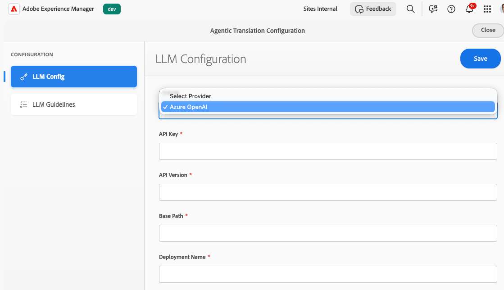
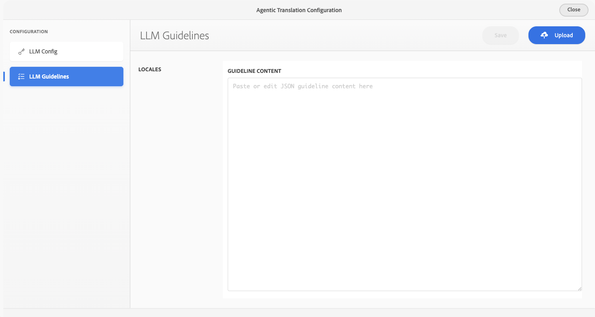

# Configuration de l’intégration de la traduction dans l’IA {#ai-translation-integration}

L’intégration de la traduction dans l’IA vous permet d’utiliser un **modèle de langue volumineux (LLM)** comme service de traduction pour le contenu que vous créez dans Adobe Experience Manager. Vous connectez AEM à votre fournisseur LLM (à commencer par Microsoft Azure OpenAI), réutilisez les mêmes [workflows de traduction](/help/sites-cloud/administering/translation/overview.md) que pour les autres connecteurs et, éventuellement, téléchargez **guides de style de traduction** afin qu’AEM puisse générer des règles qui assurent la cohérence du ton, de la terminologie et de la langue de la marque entre les paramètres régionaux.

Pour obtenir des informations sur les projets de traduction, les configurations cloud et la structure d’intégration de traduction, consultez [Traduction de contenu pour les sites multilingues](overview.md) et [Configuration de la structure d’intégration de traduction](integration-framework.md).

## Adaptation de la traduction de l’IA à AEM {#how-ai-translation-fits-in-aem}

Les grands modèles linguistiques peuvent traduire des passages entiers en prêtant attention au contexte, au ton et aux expressions idiomatiques plutôt qu’à une substitution littérale mot pour mot. Lorsque vous configurez l’intégration de la traduction de l’IA, le LLM agit comme un **service de traduction tiers** de la même manière que les autres fournisseurs que vous connectez via AEM. Vous fournissez votre **propre licence et vos propres informations d’identification** pour le service LLM.

La prise en charge initiale connecte AEM à **Azure OpenAI**. Adobe prévoit d’ajouter la prise en charge de fournisseurs supplémentaires dans une version ultérieure.

Vous configurez la connexion LLM et les guides de style facultatifs dans **Services cloud de traduction**, ainsi que vos autres configurations de traduction. Vous pouvez utiliser différents services de traduction pour différentes [configurations cloud](/help/sites-cloud/administering/translation/integration-framework.md#creating-a-translation-integration-configuration) ; par exemple, une configuration peut utiliser la traduction par l’IA tandis qu’une autre utilise un connecteur de traduction automatique traditionnel.

## Configuration des services cloud de traduction {#configure-translation-cloud-services}

Configurez la traduction IA dans la zone où vous gérez les autres configurations de cloud de traduction.

1. Dans le [menu de navigation global](/help/sites-cloud/authoring/basic-handling.md#global-navigation), sélectionnez **Outils** > **Services cloud** > **Services cloud de traduction**.
1. Ouvrez ou créez la configuration dans laquelle vous souhaitez activer la traduction IA (y compris `/conf/global` si la fonctionnalité doit s’appliquer largement).

## Configuration de la connexion LLM {#configure-the-llm-connection}

L’expérience **Configuration de traduction automatique** comprend une section **Configuration LLM** dans laquelle vous connectez votre fournisseur.

1. Ouvrez la configuration de traduction d’IA pour votre entrée de services cloud de traduction.
1. Sélectionnez **[!UICONTROL Configuration LLM]**.
1. Choisissez votre fournisseur (par exemple, **Azure OpenAI**).
1. Saisissez les informations d’identification et de point d’entrée requises pour votre abonnement (**Clé API**, **Version de l’API**, **Chemin de base**, **Nom de déploiement** et tout autre champ requis par votre fournisseur).
1. Enregistrez la configuration.

## Ajout de guides de style de traduction et de règles générées {#add-translation-style-guides-and-generated-rules}

Vous pouvez charger des documents **guide de style de traduction** (généralement un par langue cible). AEM analyse chaque guide et génère des **règles de traduction** pour aligner la sortie sur votre marque et vos attentes linguistiques.

1. Dans **Configuration de traduction automatique**, sélectionnez **[!UICONTROL Instructions LLM]**.
1. Choisissez un paramètre régional et utilisez **[!UICONTROL Télécharger]** pour ajouter un guide de style pour cette langue.
1. Lorsqu’AEM traite un guide, un indicateur de statut indique la progression (**traitement**, **terminé** ou **abandonné**).
1. Consultez ou modifiez les règles générées dans l’éditeur (par exemple, JSON qui capture la tonalité, la terminologie et les exemples).

## Définition de la méthode de traduction par défaut dans le framework {#set-the-default-translation-method-in-the-framework}

Une fois la configuration cloud enregistrée, enregistrez **traduction automatique** comme comportement par défaut dans votre configuration [Framework d’intégration de traduction](integration-framework.md) lorsque vous créez des projets de traduction. Si nécessaire, vous pouvez modifier la méthode par projet.

## Exécution de projets de traduction {#run-translation-projects}

Une fois que la traduction IA est configurée et associée à vos pages, vous [créez et exécutez des projets de traduction](managing-projects.md) de la même manière qu’avec d’autres fournisseurs de traduction. Le contenu des pages, des fragments de contenu et des ressources suit vos règles de traduction et paramètres de structure.

>[!NOTE]
>
>L’intégration de la traduction de l’IA est **pas** disponible dans l’assistant [AI de Adobe Experience Manager](/help/implementing/cloud-manager/ai-assistant-in-aem.md) l’interface utilisateur de chat ou dans l’interface de l’agent de production Experience. Utilisez les workflows et les consoles de traduction décrits dans cet article.

