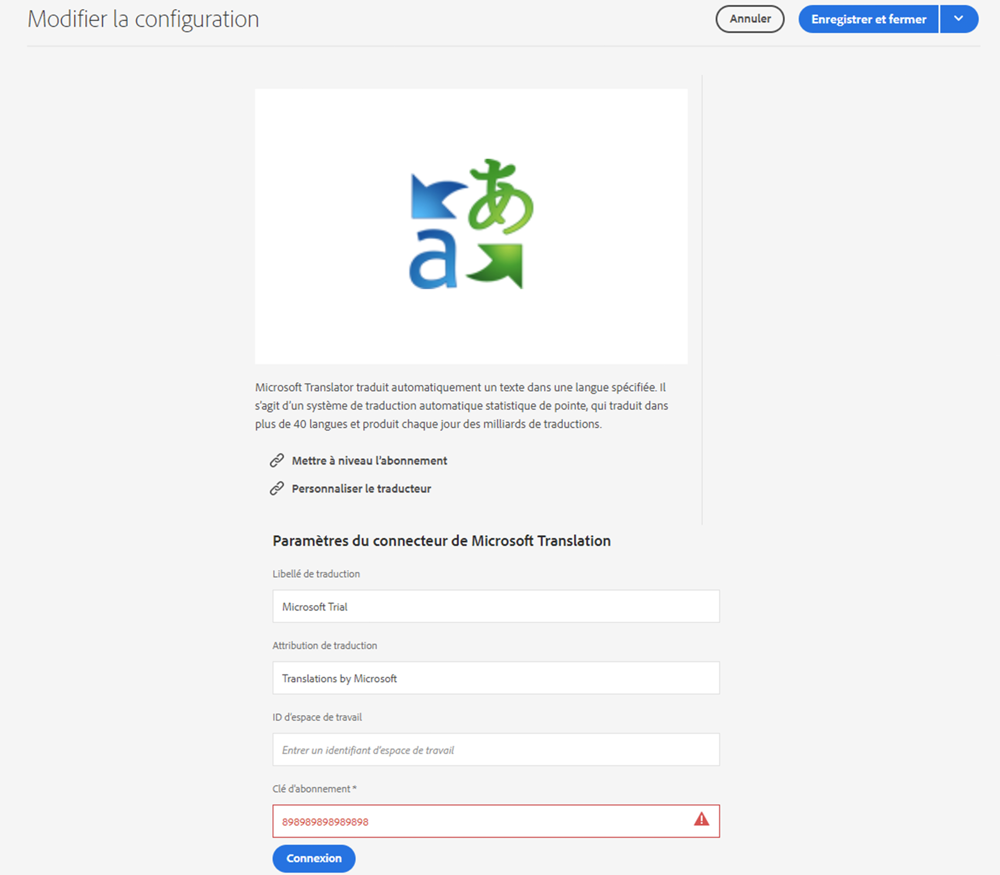

# Connexion à Microsoft Translator {#connecting-to-microsoft-translator}

Créez une configuration afin que le service cloud [Microsoft Translator](https://www.microsoft.com/fr-fr/translator/business/) utilise votre compte Microsoft Translator pour traduire le contenu de pages ou de ressources AEM.

>[!TIP]
>
>Si vous débutez dans la traduction de contenu, référez-vous à notre [Parcours de traduction Sites,](/help/journey-sites/translation/overview.md) qui vous guide sur le chemin de la traduction de votre contenu AEM Sites à l’aide des puissants outils de traduction d’AEM, idéaux pour celles et ceux qui ne disposent pas d’une expérience concernant AEM ou la traduction.

>[!NOTE]
>
>AEM propose un compte d’évaluation de Microsoft Translator qui permet de traduire gratuitement un maximum de 2 000 000 caractères par mois. Pour obtenir un abonnement de compte adapté aux systèmes de production, voir [Mise à niveau de la configuration de licence d’évaluation de Microsoft Translator](#upgrading-the-microsoft-translator-trial-license-configuration).

| Propriété | Description |
|---|---|
| Libellé de traduction | Nom d’affichage du service de traduction |
| Attribution de traduction | (Facultatif) Pour le contenu créé par l’utilisateur ou l’utilisatrice, l’attribution qui apparaît à côté du texte traduit, par exemple `Translations by Microsoft`. |
| ID d’espace de travail | (Facultatif) ID de votre moteur Microsoft Translator personnalisé à utiliser |
| Clé d’abonnement | Votre clé d’abonnement Microsoft pour Microsoft Translator |

Après avoir créé la configuration, vous devez [l’activer](#activating-the-translator-service-configurations).

La procédure suivante crée une configuration Microsoft Translator.

1. Dans le [ panneau de navigation,](/help/sites-cloud/authoring/basic-handling.md#first-steps) sélectionnez **Outils** > **Cloud Service** > **Cloud Service de traduction**.
1. Accédez à l’emplacement où vous souhaitez créer la configuration. Normalement, il s’agit de la racine de votre site, mais il peut s’agir aussi d’une configuration globale par défaut.
1. Cliquez sur le bouton **Créer**.
1. Définissez votre configuration.
   1. Sélectionnez **Microsoft Translator** dans la liste déroulante.
   1. Indiquez un titre pour votre configuration. Le titre identifie la configuration dans la console Services cloud, ainsi que dans les listes déroulantes de propriétés de la page.
   1. Éventuellement, saisissez un nom à utiliser pour le nœud du référentiel qui stocke la configuration.

   

1. Cliquez sur **Créer**.
1. Dans la fenêtre **Modifier la configuration**, indiquez les valeurs du service de traduction décrit dans le tableau précédent.

   

1. Sélectionnez **Connect** pour vérifier la connexion.
1. Sélectionnez **Enregistrer et fermer**.

## Mise à niveau de la configuration de licence d’évaluation de Microsoft Translator {#upgrading-the-microsoft-translator-trial-license-configuration}

Les pages de configuration Microsoft Translator fournissent un lien pratique vers le site web Microsoft pour obtenir un abonnement de compte qui est adapté aux systèmes d’exploitation.

1. Dans le [ panneau de navigation,](/help/sites-cloud/authoring/basic-handling.md#first-steps) sélectionnez **Outils** > **Cloud Service** > **Cloud Service de traduction**.
1. Sélectionnez votre configuration Microsoft Translator existante.
1. Sélectionnez **Modifier**.
1. Dans la fenêtre **Modifier la configuration**, sélectionnez **Abonnement à la mise à niveau**. Une page web Microsoft contenant des détails supplémentaires sur le service s’ouvre.

## Personnalisation de votre moteur Microsoft Translator {#customizing-your-microsoft-translator-engine}

Les pages de configuration de Microsoft Translator fournissent un lien pratique vers le site web Microsoft pour personnaliser votre moteur Microsoft Translator.

1. Dans le [ panneau de navigation,](/help/sites-cloud/authoring/basic-handling.md#first-steps) sélectionnez **Outils** > **Cloud Service** > **Cloud Service de traduction**.
1. Sélectionnez votre configuration Microsoft Translator existante.
1. Sélectionnez **Modifier**.
1. Dans la fenêtre **Modifier la configuration**, sélectionnez **Personnaliser le traducteur**. Utilisez la page web de Microsoft qui s’ouvre pour personnaliser votre service.

## Activation des configurations du service de traducteur {#activating-the-translator-service-configurations}

Vous devez activer les configurations de service cloud pour prendre en charge le contenu traduit qui est répliqué vers l’instance de publication. Utilisez la méthode de [publication d’une arborescence](/help/sites-cloud/authoring/sites-console/publishing-pages.md#publishing-and-unpublishing-a-tree) pour activer les nœuds de référentiel qui contiennent les configurations Microsoft Translator. Les nœuds se trouvent sous les nœuds parents suivants :

* `/libs/settings/cloudconfigs/translation/msft-translation`
