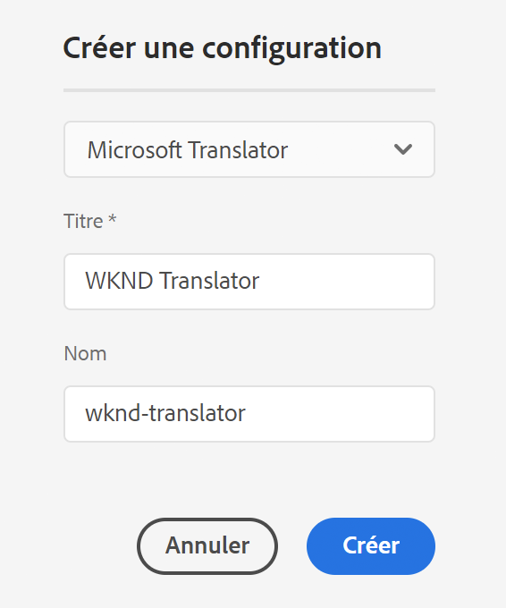

# Connexion à Microsoft Translator {#connecting-to-microsoft-translator}

AEM fournit un connecteur intégré pour [Microsoft Translator](https://www.microsoft.com/fr-fr/translator/business/) afin de traduire le contenu des pages ou des ressources. Après obtention d’une licence Microsoft pour utiliser Microsoft Translator, configurez le connecteur en suivant les instructions de cette page.

>[!TIP]
>
>Si vous êtes un débutant dans la traduction de contenu, reportez-vous à la section [Parcours de traduction de sites](/help/journey-sites/translation/overview.md), qui vous guide sur le chemin de la traduction de votre contenu AEM Sites à l’aide d’AEM de puissants outils de traduction, idéaux pour ceux qui ne disposent pas d’une expérience concernant AEM ou la traduction.

| Propriété | Description |
|---|---|
| Libellé de traduction | Nom d’affichage du service de traduction |
| Attribution de traduction | (Facultatif) Pour le contenu créé par l’utilisateur ou l’utilisatrice, l’attribution qui apparaît à côté du texte traduit, par exemple `Translations by Microsoft`. |
| ID d’espace de travail | (Facultatif) ID de votre moteur Microsoft Translator personnalisé à utiliser |
| Clé d’abonnement | Votre clé d’abonnement Microsoft pour Microsoft Translator |

La procédure suivante crée une configuration Microsoft Translator.

1. Dans le [panneau de navigation](/help/sites-cloud/authoring/basic-handling.md#first-steps), sélectionnez **Outils** > **Cloud Service** > **Cloud Service de traduction**.
1. Accédez à l’emplacement où vous souhaitez créer la configuration. Normalement, il s’agit de la racine de votre site, mais il peut s’agir aussi d’une configuration globale par défaut.
1. Cliquez sur le bouton **Créer**.
1. Définissez votre configuration.
   1. Sélectionnez **Microsoft Translator** dans la liste déroulante.
   1. Indiquez un titre pour votre configuration. Le titre identifie la configuration dans la console Services cloud, ainsi que dans les listes déroulantes de propriétés de la page.
   1. Éventuellement, saisissez un nom à utiliser pour le nœud du référentiel qui stocke la configuration.

   

1. Cliquez sur **Créer**.
1. Dans la fenêtre **Modifier la configuration**, indiquez les valeurs du service de traduction décrit dans le tableau précédent.

   

1. Sélectionnez **Connexion** pour vérifier la connexion.
1. Sélectionnez **Enregistrer et fermer**.

## Publication des configurations du service Translator {#publishing-the-translator-service-configurations}

La dernière étape consiste à publier les configurations de Microsoft Translator pour prendre en charge le contenu traduit publié à l’aide de l’action [publication d’une arborescence](/help/sites-cloud/authoring/sites-console/publishing-pages.md#publishing-and-unpublishing-a-tree).
