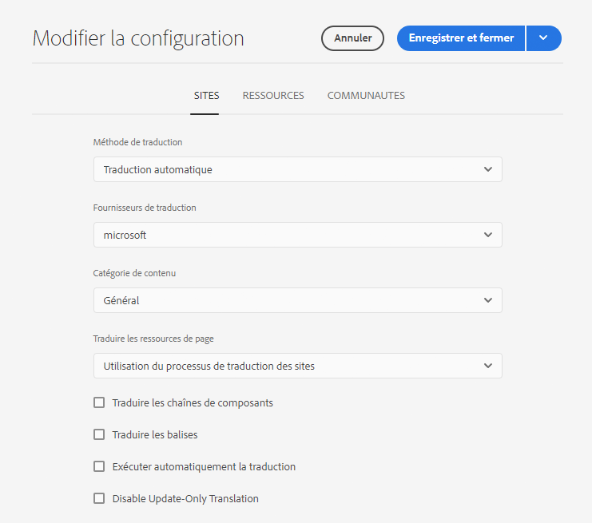

# Configuration de la structure d’intégration de traduction {#configuring-the-translation-integration-framework}

La structure d’intégration de traduction s’intègre à des services de traduction tiers pour orchestrer la traduction du contenu d’AEM. Elle implique trois étapes de base.

1. [Connectez-vous à un fournisseur de services de traduction](#connecting-to-a-translation-service-provider).
1. [Créez une configuration de structure d’intégration de traduction](#creating-a-translation-integration-configuration).
1. [Associez les configurations cloud à vos pages](#configuring-pages-for-translation).

Pour une présentation des fonctions de traduction de contenu d’AEM, voir [Traduction de contenu pour les sites multilingues](overview.md).

>[!TIP]
>
>Si vous êtes un débutant dans la traduction de contenu, reportez-vous à la section [Parcours de traduction de sites](/help/journey-sites/translation/overview.md), qui vous guide sur le chemin de la traduction de votre contenu AEM Sites à l’aide d’AEM de puissants outils de traduction, idéaux pour ceux qui ne disposent pas d’une expérience concernant AEM ou la traduction.

## Connexion à un fournisseur de services de traduction {#connecting-to-a-translation-service-provider}

Créez une configuration cloud qui connecte AEM à votre fournisseur de services de traduction.

AEM permet d’établir par défaut une [connexion à Microsoft® Translator](connect-ms-translator.md). D’autres fournisseurs de technologies de traduction disposant de connecteurs AEM et membres du programme de partenariat d’Adobe Exchange sont disponibles [ici](https://exchange.adobe.com/apps/browse/ec?page=1&amp;partnerLevel=All&amp;product=AEM&amp;q=experience+manager+translation&amp;sort=RELEVANCE).

Une fois que vous avez installé un package de connecteur, vous pouvez créer une configuration de cloud pour le connecteur. En règle générale, vous devez fournir vos informations d’identification pour l’authentification auprès du service de traduction. Pour plus d’informations sur l’ajout d’une configuration cloud pour le connecteur Microsoft® Translator, voir [Intégration à Microsoft® Translator](connect-ms-translator.md).

Vous pouvez créer plusieurs configurations de cloud pour le même connecteur, si nécessaire. Par exemple, créez une configuration pour chacun des comptes ou projets que vous avez avec le même fournisseur.

Après avoir configuré une connexion, vous pouvez créer la configuration du framework d’intégration de traduction qui l’utilise.

## Création d’une configuration de l’intégration de traduction {#creating-a-translation-integration-configuration}

Créez une configuration de structure d’intégration de traduction afin de spécifier comment traduire votre contenu. La configuration contient les informations suivantes :

* Le fournisseur de service de traduction à utiliser
* Si une traduction humaine ou automatique doit être réalisée
* S’il est nécessaire de traduire un autre contenu associé à une page ou à une ressource, comme des balises

Après avoir créé une configuration de structure, vous associez la configuration de cloud aux pages à traduire en fonction de la configuration. Lorsque le processus de traduction est démarré, il se déroule en fonction de la configuration de framework associée.

Si différentes parties de votre site web impliquent différentes exigences en matière de traduction, créez plusieurs configurations de structure en conséquence. Par exemple, un site web multilingue inclut des versions en anglais, en espagnol et en japonais. Le propriétaire du site a recours à deux fournisseurs de services de traduction pour les traductions en espagnol et en japonais. Par conséquent, deux configurations de la structure sont définies. Chaque configuration utilise un fournisseur de services de traduction différent.

Une fois que vous avez configuré une structure d’intégration de traduction, vous pouvez l’[associer aux pages](preparation.md) qui l’utilisent.

>[!TIP]
>
>Pour une présentation des fonctions de traduction de contenu d’AEM, voir [Traduction de contenu pour les sites multilingues](overview.md).

Une configuration unique de la structure contrôle la manière dont le contenu de page et les ressources sont traduits. Pour créer une configuration de traduction :

1. Dans le [menu de navigation global](/help/sites-cloud/authoring/basic-handling.md#global-navigation), sélectionnez **Outils > Cloud Service et Cloud Service de traduction**.
1. Accédez à l’emplacement où vous souhaitez créer la configuration dans votre structure de contenu. Il est souvent basé sur un site particulier, mais peut également être global.
1. Fournissez les informations suivantes dans les champs requis, puis sélectionnez **Créer**. :
   1. Sélectionnez **Type de configuration** dans la liste déroulante.
   1. Indiquez un **Titre** pour votre configuration. Le **Titre** identifie la configuration dans la console **Services cloud**, ainsi que dans les listes déroulantes de propriétés de la page.
   1. Éventuellement, saisissez un **Nom** à utiliser pour le nœud du référentiel qui stocke la configuration.
1. Dans la fenêtre **Modifier la configuration**, configurez les propriétés sur les onglets **Sites** et **Assets**, puis sélectionnez **Enregistrer et fermer**.

### Propriétés de configuration des sites {#sites-configuration-properties}

L’onglet **Sites** contrôle la façon dont le contenu des pages est traduit.

| Propriété | Description |
|---|---|
| Méthode de traduction | Cette propriété définit la méthode de traduction que la structure effectue pour le contenu du site : - Traduction automatique : le fournisseur de traduction effectue la traduction à l’aide de la traduction automatique en temps réel. - Traduction humaine : le contenu est envoyé au fournisseur de services de traduction pour être traduit par des traducteurs. - Ne pas traduire : le contenu n’est pas envoyé pour être traduit. Cela permet d’ignorer certaines parties du contenu qui n’ont pas besoin d’être traduites, mais dont le contenu pourrait devoir être mis à jour. |
| Fournisseur de traduction | Cette propriété définit le fournisseur de traduction qui doit effectuer la traduction. Un fournisseur est répertorié dans la liste lorsque le connecteur correspondant est installé. |
| Catégorie de contenu | (Traduction automatique uniquement) Cette propriété est une catégorie qui décrit le contenu que vous traduisez. Lors de la traduction du contenu, la catégorie peut affecter le choix de la terminologie et des expressions. |
| Traduire les balises | Cette option permet de traduire les balises associées à la page. |
| Traduire les ressources de page | Cette propriété définit comment traduire les ressources qui sont ajoutées aux composants à partir du système de fichiers ou référencés à partir des ressources : - Ne pas traduire : les ressources de la page ne sont pas traduites. - Utilisation du processus de traduction de sites : les ressources sont gérées en fonction des propriétés de configuration sur l’onglet **Sites**. - Utilisation du processus de traduction des ressources : les ressources sont gérées en fonction des propriétés configurées sur l’onglet **Ressources**. |
| Exécuter automatiquement la traduction | Activez cette propriété pour exécuter automatiquement les tâches de traduction après la création des projets de traduction. Si vous sélectionnez cette option, vous n’avez pas la possibilité de vérifier et de définir la portée de la tâche de traduction. |
| Désactiver Traduction uniquement des champs mis à jour | Lorsque cette option est cochée, la mise à jour du projet de traduction envoie tous les champs traduisibles pour traduction, et pas seulement ceux qui ont été modifiés depuis la dernière traduction. |

### Propriétés de configuration des ressources {#assets-configuration-properties}

Les propriétés des ressources contrôlent la façon dont les ressources sont configurées. Pour obtenir plus d’informations sur la traduction des ressources, consultez [Création de copies de langue pour des ressources](/help/assets/translate-assets.md).

| Propriété | Description |
|---|---|
| Méthode de traduction | Cette propriété sélectionne le type de traduction effectué par la structure pour les ressources : - Traduction automatique : le fournisseur de traduction effectue la traduction immédiatement à l’aide de la traduction automatique. - Traduction humaine : le contenu est envoyé automatiquement au fournisseur de services de traduction pour être traduit manuellement. - Ne pas traduire : les ressources ne sont pas envoyées pour être traduites. |
| Fournisseur de traduction | Cette propriété définit le fournisseur de traduction qui doit effectuer la traduction. Un fournisseur est répertorié dans la liste lorsque le connecteur correspondant est installé. |
| Catégorie de contenu | (Traduction automatique uniquement) Cette propriété décrit le contenu que vous êtes en train de traduire. Lors de la traduction du contenu, la catégorie peut affecter le choix de la terminologie et des expressions. |
| Traduire les ressources | Activez cette propriété pour inclure des ressources dans le projet de traduction. |
| Traduire les métadonnées | Activez cette propriété pour pouvoir traduire les métadonnées des ressources. |
| Traduire les balises | Activez cette propriété pour pouvoir traduire les balises associées à la ressource. |
| Exécution automatique de la traduction | Sélectionnez cette propriété pour pouvoir exécuter automatiquement les tâches de traduction après la création des projets de traduction. Si vous sélectionnez cette option, vous n’avez pas la possibilité de vérifier ou de définir la portée de la tâche de traduction. |
| Désactiver Traduction uniquement des champs mis à jour | Lorsque cette option est cochée, la mise à jour du projet de traduction envoie tous les champs traduisibles pour traduction, et pas seulement ceux qui ont été modifiés depuis la dernière traduction. |
| Activer les champs de modèle de contenu pour la traduction | L’activation de cette option utilise le champ **Traduisible** dans [Modèles de fragment de contenu](/help/sites-cloud/administering/content-fragments/content-fragment-models.md#properties) pour déterminer si le champ est traduit et crée automatiquement des [règles de traduction](rules.md) en conséquence. Cette option remplace les règles de traduction que vous avez peut-être créées. |

## Configuration des pages pour la traduction {#configuring-pages-for-translation}

Pour configurer la traduction de vos pages source dans d’autres langues, associez les pages aux configurations cloud suivantes :

* La configuration cloud qui connecte AEM à votre fournisseur de services de traduction.
* Le framework d’intégration de traduction qui configure les détails de la traduction.

Notez que la configuration de cloud du framework d’intégration de traduction identifie la configuration de cloud à utiliser pour la connexion au fournisseur de services. Lorsque vous associez une page source à une configuration cloud de framework, la page doit être associée à la configuration cloud du fournisseur utilisée par la configuration cloud de framework.

Lorsque vous associez une page à une configuration de cloud, les descendants de la page héritent de l’association. Par exemple, si vous avez associé la page `/content/wknd/language-masters/en/magazine` à une structure d’intégration de traduction, la page `magazine` et les pages enfants en dessous sont traduites en fonction de la structure.

Lorsque cela est nécessaire, vous pouvez remplacer l’association dans une page descendante. Par exemple, le contenu d’un site web traite principalement des voyages et de l’art de vivre. Cependant, une branche des pages décrit l’entreprise. Dans ce cas, la page racine du site peut être associée à une structure d’intégration de traduction qui spécifie la traduction automatique à l’aide de la catégorie Art de vivre . La branche qui décrit l’entreprise utilise une structure qui effectue la traduction automatique à l’aide de la catégorie Générale.

### Association d’une page à un fournisseur de traduction {#associating-a-page-with-a-translation-provider}

Associez une page au fournisseur de traduction que vous utilisez pour traduire la page et les pages descendantes.

1. Dans la console Sites, sélectionnez la page à configurer et sélectionnez **Afficher les propriétés**.
1. Sélectionnez l’onglet **Services cloud**.
1. Dans la liste déroulante **Ajouter la configuration**, sélectionnez la configuration.
1. Sélectionnez **Enregistrer et fermer**.

### Association des pages à une structure d’intégration de traduction {#associating-pages-with-a-translation-integration-framework}

Associez une page au framework d’intégration de traduction qui définit la façon dont vous souhaitez effectuer la traduction de la page et des pages descendantes.

1. Dans la console Sites, sélectionnez la page à configurer et sélectionnez **Afficher les propriétés**.
1. Sélectionnez l’onglet **Services cloud**.
1. Dans la liste déroulante **Ajouter la configuration**, sélectionnez la configuration.
1. Sélectionnez **Enregistrer et fermer**.
