# Gestion de projets de traduction {#managing-translation-projects}

Les projets de traduction permettent de gérer la traduction du contenu d’AEM. Un projet de traduction est un type de [projet](/help/sites-cloud/authoring/projects/overview.md) AEM, qui contient des ressources à traduire dans d’autres langues. Ces ressources sont les pages et les actifs des [copies de langue](preparation.md) créées à partir du gabarit de langue.

>[!TIP]
>
>Si vous êtes un débutant dans la traduction de contenu, reportez-vous à la section [Parcours de traduction de sites](/help/journey-sites/translation/overview.md), qui vous guide sur le chemin de la traduction de votre contenu AEM Sites à l’aide d’AEM de puissants outils de traduction, idéaux pour ceux qui ne disposent pas d’une expérience concernant AEM ou la traduction.

Lorsque des ressources sont ajoutées à un projet de traduction, une tâche de traduction est créée pour ces ressources. Les tâches comportent les commandes et les informations sur le statut utilisées pour gérer les workflows de traduction humaine et automatique exécutés sur les ressources.

Les projets de traduction sont des éléments dont l’exécution est longue, définis par langue et par méthode/fournisseur de traduction afin d’être en phase avec la gouvernance organisationnelle en matière d’internationalisation. Ils doivent être lancés une seule fois, que ce soit lors de la traduction initiale ou manuellement, et restent en vigueur pendant toute la durée des activités de mise à jour du contenu et de la traduction.

Les projets et les tâches de traduction sont créés avec des processus de préparation de la traduction. Ces processus possèdent trois options pour la traduction initiale (Créer et traduire) et les mises à jour (Mettre à jour une traduction) :

1. [Créer un projet](#creating-translation-projects-using-the-references-panel)
1. [Ajouter à un projet existant](#adding-pages-to-a-translation-project)
1. [Structure de contenu uniquement](#creating-the-structure-of-a-language-copy)

AEM détecte si un projet de traduction est créé pour la traduction initiale du contenu ou pour mettre à jour des copies de langue déjà traduites. Lorsque vous créez un projet de traduction d’une page et indiquez les copies de langue pour lesquelles vous effectuez la traduction, AEM détecte si la page source existe déjà dans les copies de langue ciblées :

* **La copie de langue n’inclut pas la page :** AEM traite cette situation comme une traduction initiale. La page est copiée immédiatement dans la copie de langue et incorporée au projet. Lorsque la page traduite est importée dans AEM, AEM la copie directement dans la copie de langue.
* **La copie de langue inclut déjà la page :** AEM traite cette situation comme une traduction mise à jour. Un lancement est créé, et une copie de la page est ajoutée au lancement et incorporée au projet. Les lancements vous permettent de passer en revue les traductions mises à jour avant de les valider dans la copie de langue :

   * Lorsque la page traduite est importée dans AEM, elle remplace la page du lancement.
   * La page traduite ne remplace la copie de langue que lorsque le lancement est converti.

Par exemple, la racine de la langue `/content/wknd/fr` est créée pour la traduction française de la langue principale `/content/wknd/en`. Il n’y a pas d’autres pages dans la copie de langue française.

* Un projet de traduction est créé pour la page `/content/wknd/en/products` et toutes les pages enfants, ciblant la copie de langue en français. Comme la copie de langue ne comprend pas la page `/content/wknd/fr/products`, AEM copie immédiatement la page `/content/wknd/en/products` et toutes les pages enfants dans la copie de langue en français. Les copies sont également incluses dans le projet de traduction.
* Un projet de traduction est créé pour la page `/content/wknd/en` et toutes les pages enfants, ciblant la copie de langue en français. Comme la copie de langue comprend la page correspondant à la page `/content/wknd/en` (racine de langue), AEM copie la page `/content/wknd/en` et toutes les pages enfants et les ajoute à un lancement. Les copies sont également incluses dans le projet de traduction.

## Traduction à l’aide de la console Sites {#performing-initial-translations-and-updating-existing-translations}

Les projets de traduction peuvent être créés ou mis à jour directement à partir de la console Sites.

### Création de projets de traduction à l’aide du panneau Références {#creating-translation-projects-using-the-references-panel}

Créez des projets de traduction afin de pouvoir exécuter et gérer le processus pour traduire les ressources de votre gabarit de langue. Lorsque vous créez des projets, vous spécifiez la page dans le gabarit de langue que vous traduisez et les copies de langue pour lesquelles vous effectuez la traduction :

* La configuration cloud du framework d’intégration de traduction associé à la page sélectionnée détermine de nombreuses propriétés des projets de traduction, telles que le workflow de traduction à utiliser.
* Un projet est créé pour chaque copie de langue sélectionnée.
* Une copie de la page sélectionnée et des ressources associées est créée et ajoutée à chaque projet. Ces copies sont ensuite envoyées au fournisseur de traduction pour traduction.

Vous pouvez spécifier que les pages enfants de la page sélectionnée soient elles aussi sélectionnées. Dans ce cas, les copies des pages enfants sont également ajoutées à chaque projet afin d’être traduites. Lorsque des pages enfants sont associées à différentes configurations de la structure d’intégration de traduction, AEM crée des projets supplémentaires.

Vous pouvez également [créer manuellement des projets de traduction](#creating-a-translation-project-using-the-projects-console).

>[!NOTE]
>
>Pour créer un projet, votre compte doit être membre du groupe `project-administrators`.

### Traductions initiales et mise à jour de traductions {#initial-and-updating}

Le panneau Références indique si vous mettez à jour les copies de langue existantes ou si vous créez la première version des copies de langue. Lorsqu’il existe une copie de langue pour la page sélectionnée, l’onglet Mettre à jour les copies de langue s’affiche pour donner accès aux commandes liées au projet.

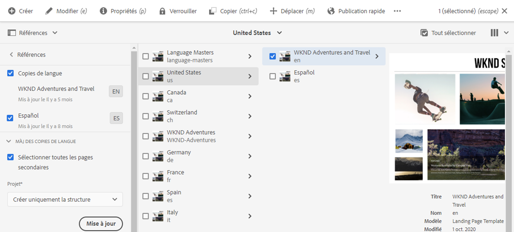

Après la traduction, vous pouvez [réviser la traduction](#reviewing-and-promoting-updated-content) avant de remplacer la copie de langue. Lorsqu’il n’existe aucune copie de langue pour la page sélectionnée, l’onglet Créer et traduire s’affiche pour donner accès aux commandes liées au projet.

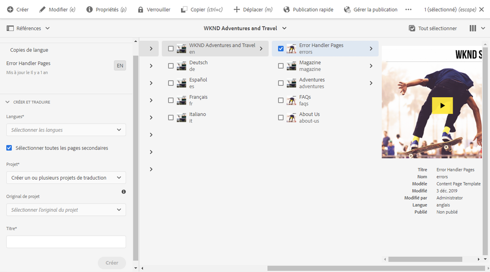

### Création de projets de traduction pour une nouvelle copie de langue {#create-translation-projects-for-a-new-language-copy}

1. Utilisez la console Sites pour sélectionner la page que vous ajoutez aux projets de traduction.

1. À l’aide de la barre d’outils, ouvrez le rail **Références**.

   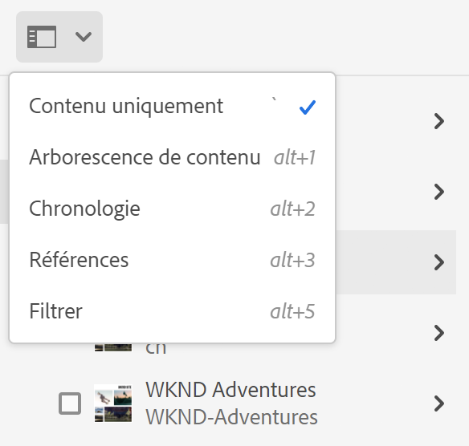

1. Sélectionnez **Copies de langue**, puis sélectionnez les copies de langue pour lesquelles vous traduisez les pages source.
1. Sélectionnez **Créer et traduire** puis configurez la tâche de traduction :

   * Utilisez la liste déroulante **Langues** pour sélectionner une copie de langue à traduire. Sélectionnez d’autres langues, au besoin. Les langues qui apparaissent dans la liste correspondent aux [racines de langue que vous avez créées](preparation.md#creating-a-language-root).
      * La sélection de plusieurs langues crée un projet avec une tâche de traduction pour chacune d’elles.
   * Pour traduire la page sélectionnée et toutes les pages enfant, sélectionnez **Sélectionner toutes les pages secondaires**. Pour ne traduire que la page sélectionnée, désélectionnez cette option.
   * Pour **Projet**, sélectionnez **Créer un ou plusieurs projets de traduction**.
   * Si vous le souhaitez, pour **Original de projet**, sélectionnez un projet à partir duquel hériter les rôles utilisateur et les autorisations.
   * Dans **Titre**, renseignez le nom du projet.

   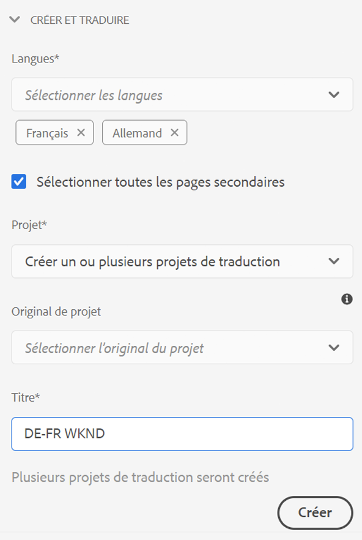

1. Sélectionnez **Créer**.

### Création de projets de traduction pour une copie de langue existante {#create-translation-projects-for-an-existing-language-copy}

1. Utilisez la console Sites pour sélectionner la page que vous ajoutez aux projets de traduction.

1. À l’aide de la barre d’outils, ouvrez le rail **Références**.

   

1. Sélectionnez **Copies de langue**, puis sélectionnez les copies de langue pour lesquelles vous traduisez les pages source.
1. Sélectionnez **Mettre à jour des copies de langue** puis configurez la tâche de traduction :

   * Pour traduire la page sélectionnée et toutes les pages enfant, sélectionnez **Sélectionner toutes les pages secondaires**. Pour ne traduire que la page sélectionnée, désélectionnez cette option.
   * Pour **Projet**, sélectionnez **Créer un ou plusieurs projets de traduction**.
   * Si vous le souhaitez, pour **Original de projet**, sélectionnez un projet à partir duquel hériter les rôles utilisateur et les autorisations.
   * Dans **Titre**, renseignez le nom du projet.

   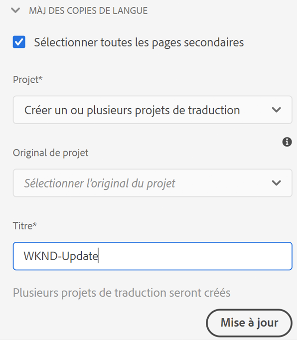

1. Sélectionnez **Créer**.

### Ajout de pages à un projet de traduction {#adding-pages-to-a-translation-project}

Après avoir créé un projet de traduction, vous pouvez utiliser le rail **Ressources** pour ajouter des pages au projet. Il est utile d’ajouter des pages lorsque vous incorporez des pages de différentes branches dans le même projet.

Lorsque vous ajoutez des pages à un projet de traduction, les pages sont incorporées à une nouvelle tâche de traduction. Vous pouvez également [ajouter des pages à une tâche existante](#adding-pages-assets-to-a-translation-job).

Comme lors de la création d’un projet, lorsque vous ajoutez des pages, des copies de pages sont ajoutées à un lancement, si nécessaire, afin d’éviter de remplacer des copies de langue. (Voir [Création de projets de traduction pour des copies de langue existantes](#performing-initial-translations-and-updating-existing-translations).)

1. Utilisez la console Sites pour sélectionner la page que vous ajoutez au projet de traduction.

1. À l’aide de la barre d’outils, ouvrez le rail **Références**.

   

1. Sélectionnez **Copies de langue**, puis sélectionnez les copies de langue pour lesquelles vous traduisez les pages source.

   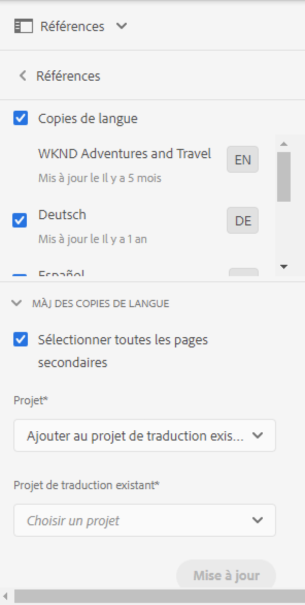

1. Sélectionnez **Mettre à jour les copies de langue** puis configurez les propriétés :

   * Pour traduire la page sélectionnée et toutes les pages enfant, sélectionnez **Sélectionner toutes les pages secondaires**. Pour ne traduire que la page sélectionnée, désélectionnez cette option.
   * Pour le **Projet**, sélectionnez **Ajouter à un projet de traduction existant**.
   * Sélectionnez le projet dans **Projet de traduction existant**.

   >[!NOTE]
   >
   >La langue cible définie dans le projet de traduction doit correspondre au chemin d’accès à la copie de langue, comme indiqué dans le rail Références.

1. Sélectionner **Mettre à jour**.

### Création de la structure d’une copie de langue {#creating-the-structure-of-a-language-copy}

Il est possible de créer uniquement la structure de la copie de langue, ce qui vous permet de copier le contenu et les modifications structurelles dans le gabarit de langue en copies de langue (non traduites). Ceci n’est pas lié à un travail ou un projet de traduction. Vous pouvez l’utiliser pour préserver la synchronisation des gabarits de langue, même sans traduction.

Remplissez la copie de langue afin qu’elle contienne le contenu de la langue principale que vous traduisez. Avant de remplir la copie de langue, vous devez avoir [créé la racine de langue](preparation.md#creating-a-language-root) de la copie de langue.

1. Utilisez la console Sites pour sélectionner la racine de langue de la langue principale utilisée comme source.
1. Ouvrez le rail Références en cliquant ou en appuyant sur **Références** dans la barre d’outils.

   

1. Sélectionnez **Copies de langue**, puis sélectionnez les copies de langue à remplir.

   

1. Sélectionnez **Mettre à jour des copies de langue** pour afficher les outils de traduction et configurez les propriétés :

   * Sélectionnez l’option **Sélectionner toutes les pages secondaires**.
   * Pour un **Projet**, sélectionnez **Créer uniquement la structure**.

   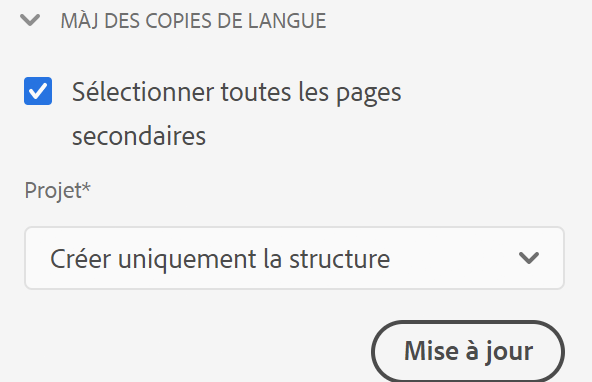

1. Sélectionner **Mettre à jour**.

### Mise à jour de la mémoire de traduction {#updating-translation-memory}

Les modifications manuelles du contenu traduit peuvent être synchronisées avec le système de gestion de traduction (TMS) pour entraîner sa mémoire de traduction.

1. Dans la console Sites, après la mise à jour de contenu textuel sur une page traduite, sélectionnez **Mettre à jour la mémoire de traduction**.
1. Une vue Liste affiche côte à côte une comparaison de la source et de la traduction pour chaque composant de texte qui a été modifié. Sélectionnez les mises à jour de traduction qui doivent être synchronisées avec la mémoire de traduction et sélectionnez **Mettre à jour la mémoire**.

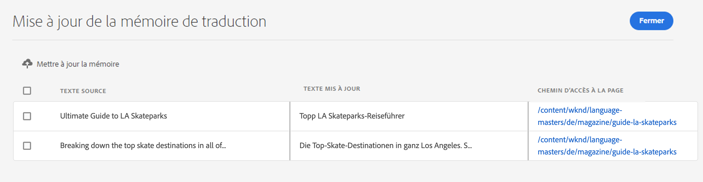

AEM met à jour la traduction des chaînes existantes dans la mémoire de traduction du TMS configuré.

* L’action met à jour la traduction des chaînes existantes dans la mémoire de traduction du TMS configuré.
* Il ne crée pas de nouvelles tâches de traduction.
* Il renvoie les traductions au TMS, via l’API de traduction d’AEM (voir ci-dessous).

Pour utiliser cette fonctionnalité :

* Un TMS doit être configuré pour être utilisé avec AEM.
* Le connecteur doit implémenter la méthode [`storeTranslation`](https://developer.adobe.com/experience-manager/reference-materials/cloud-service/javadoc/com/adobe/granite/translation/api/TranslationService.html).
   * Le code de cette méthode détermine ce qui se passe avec la demande de mise à jour de la mémoire de traduction.
   * Le framework de traduction AEM renvoie les paires de valeurs de chaîne (traduction d’origine et mise à jour) au TMS via cette implémentation de méthode.

Les mises à jour de la mémoire de traduction peuvent être interceptées et envoyées vers une destination personnalisée, dans les cas où une mémoire de traduction propriétaire est utilisée.

### Vérification du statut de traduction d’une page {#check-translation-status}

Une propriété peut être sélectionnée dans la vue Liste de la console Sites. Cette propriété indique si une page a été traduite, si elle est en cours de traduction ou si elle n’a pas encore été traduite.

1. Dans la console Sites, basculez vers la vue [Liste](/help/sites-cloud/authoring/basic-handling.md#viewing-and-selecting-resources).
1. Sélectionnez **Afficher les paramètres** dans la liste déroulante d’affichage.
1. Dans la boîte de dialogue, vérifiez la propriété **Traduit** et sélectionnez **Mettre à jour**.

La console Sites affiche désormais la colonne **Traduit** qui indique l’état de traduction des pages répertoriées.

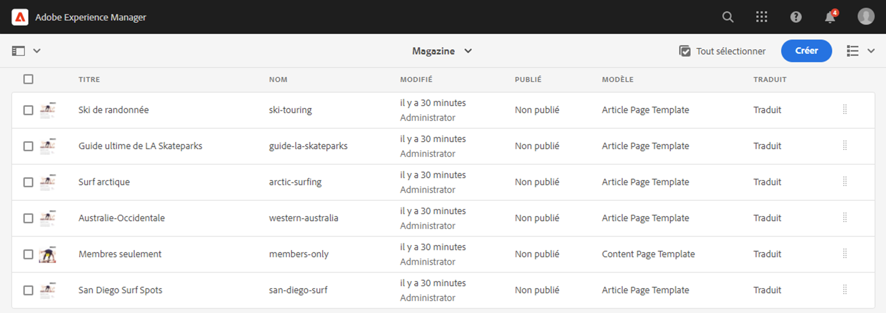

## Gestion des projets de traduction à l’aide de la console Projet

La console Projets permet d’accéder à de nombreuses tâches de traduction et options avancées.

### Présentation de la console Projets

Les projets de traduction réalisés dans AEM utilisent la [console Projets AEM](/help/sites-cloud/authoring/projects/overview.md) standard. Si vous n’avez pas l’habitude des projets AEM, consultez cette documentation.

Comme tout autre projet, un projet de traduction est constitué de mosaïques contenant un aperçu des tâches du projet.

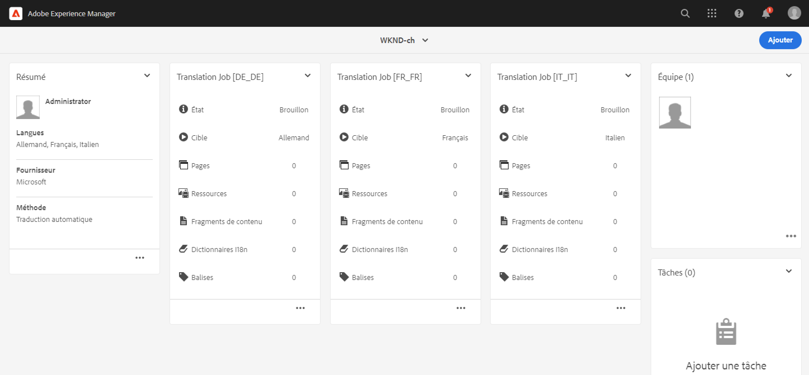

* **Résumé** – Aperçu du projet
* **Tâches** – Une ou plusieurs tâches de traduction
* **Équipe** – Utilisateurs collaborant au projet de traduction
* **Tâches** – Éléments à compléter au cours de l’activité de traduction

Utilisez les commandes et les boutons contenant des points de suspension en haut et en bas des mosaïques (respectivement) pour les contrôles d’accès et les différentes options.

### Création d’un projet de traduction à l’aide de la console Projets {#creating-a-translation-project-using-the-projects-console}

Vous pouvez créer manuellement un projet de traduction si vous préférez utiliser la console Projets au lieu de la console Sites.

>[!NOTE]
>
>Pour créer un projet, votre compte doit être membre du groupe `project-administrators`.

Lorsque vous créez manuellement un projet de traduction, vous devez fournir des valeurs pour les propriétés associées à la traduction ci-dessous en complément des [propriétés de base](/help/sites-cloud/authoring/projects/managing.md#creating-a-project) :

* **Nom** : nom du projet
* **Langue source** : langue du contenu source
* **Langue cible** : langue ou langues vers lesquelles le contenu est traduit
   * Si plusieurs langues sont sélectionnées, une tâche est créée pour chaque langue du projet.
* **Méthode de conversion** : sélectionnez **Traduction humaine** pour indiquer que la traduction doit être effectuée manuellement.

1. Dans la barre d’outils de la console Projets, sélectionnez **Créer**.
1. Sélectionnez le modèle **Projet de traduction** puis sélectionnez **Suivant**.
1. Saisissez les valeurs pour l’onglet des **propriétés de base**.
1. Sélectionnez **Avancé** et saisissez les valeurs pour les propriétés liées à la traduction.
1. Sélectionnez **Créer**. Dans la boîte de dialogue de confirmation, sélectionnez **Terminé** pour revenir à la console Projets, ou sélectionnez **Ouvrir le projet** pour ouvrir le projet et commencer à le gérer.

### Ajout de pages et de ressources à une tâche de traduction {#adding-pages-assets-to-a-translation-job}

Vous pouvez ajouter des pages, des ressources ou des balises à la tâche de traduction de votre projet de traduction. Pour ajouter des pages ou des ressources :

1. Dans la partie inférieure de la mosaïque Tâche de traduction de votre projet de traduction, sélectionnez les points de suspension.

   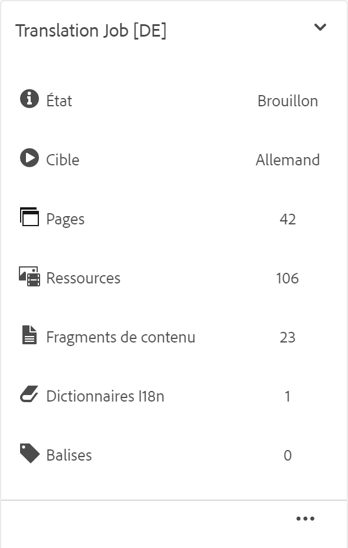

1. Dans la fenêtre suivante, cliquez sur le bouton **Ajouter** dans la barre d’outils, puis sélectionnez **Assets/Pages**.

   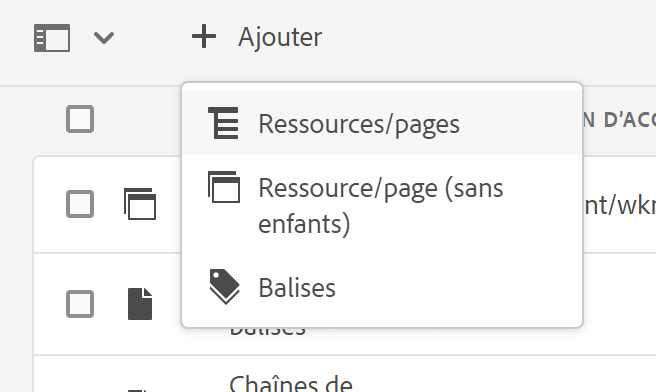

1. Dans la fenêtre modale, sélectionnez l’élément le plus élevé de la branche à ajouter, puis sélectionnez l’icône de coche. La sélection multiple est activée dans cette fenêtre.

   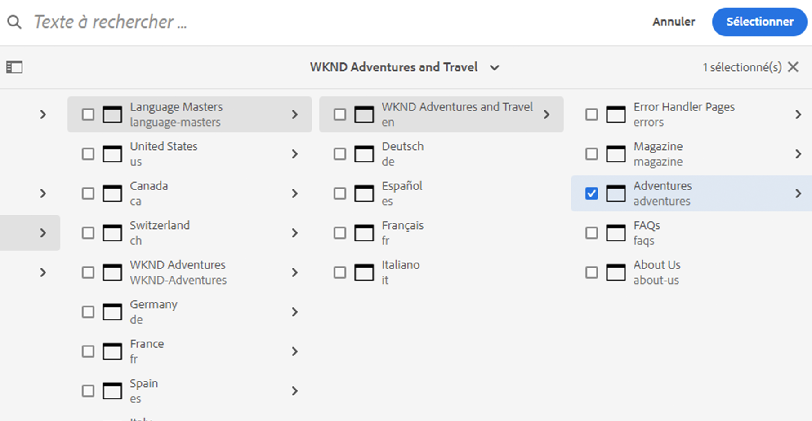

1. Vous pouvez également choisir l’icône de recherche pour rechercher des pages ou des ressources à ajouter à la tâche de traduction.

   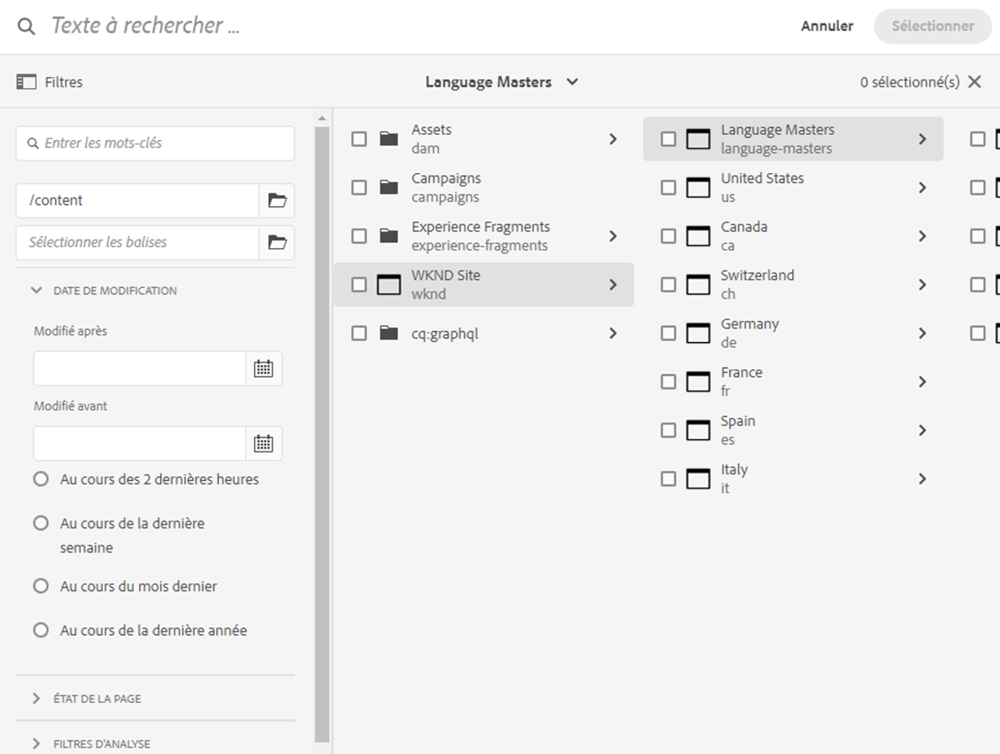

1. Une fois sélectionné, sélectionnez **Sélectionner**. Les pages et/ou les ressources sont ajoutées à la tâche de traduction.

>[!TIP]
>
>Cette méthode ajoute des pages/ressources et leurs enfants au projet. Sélectionnez **Ressource/page (sans enfants)** si vous souhaitez uniquement ajouter les parents.

### Ajout de balises à une tâche de traduction {#adding-tags-to-a-translation-job}

Vous pouvez ajouter des balises à un projet de traduction de manière identique à [l’ajout de ressources et de pages à un projet](#adding-pages-assets-to-a-translation-job). Il suffit de sélectionner **Balises** dans le menu **Ajouter**, puis de suivre les mêmes étapes.

### Affichage des détails d’un projet de traduction {#seeing-translation-project-details}

Les propriétés d’un projet de traduction sont accessibles via le bouton de sélection de la mosaïque de résumé du projet. Outre les [informations génériques du projet](/help/sites-cloud/authoring/projects/overview.md#project-info), les propriétés du projet de traduction contiennent des propriétés spécifiques à la traduction.

Dans votre projet de traduction, sélectionnez les points de suspension en bas de la mosaïque Résumé de traduction . La plupart des propriétés spécifiques au projet se trouvent dans l’onglet **Avancé**.

* **Langue source** : langue des pages en cours de traduction
* **Langue cible** : langue ou langues vers lesquelles les pages sont traduites
* **Configuration du cloud** : configuration de cloud du connecteur du service de traduction utilisé pour le projet
* **Méthode de traduction** : processus de traduction, **Traduction humaine** ou **Traduction automatique**
* **Fournisseur de traduction** : prestataire de services de traduction qui effectue la traduction
* **Catégorie de contenu** : (traduction automatique) – La catégorie de contenu utilisée pour la traduction
* **Informations d’identification du fournisseur de traduction** : informations d’identification de connexion au fournisseur
* **Promouvoir automatiquement les lancements de traduction** : après réception du contenu traduit, les lancements de traduction sont automatiquement promus.
   * **Supprimer le lancement après la promotion** : si les lancements de traduction sont automatiquement promus, supprimez le lancement après la promotion.
* **Approuver automatiquement les traductions** : après réception du contenu traduit, les tâches de traduction sont automatiquement approuvées.
* **Répéter la traduction** : configurez l’exécution récurrente d’un projet de traduction en sélectionnant la fréquence à laquelle le projet créera et exécutera automatiquement des tâches de traduction.

Lors de la création d’un projet à l’aide du rail de références d’une page, ces propriétés sont configurées automatiquement en fonction des propriétés de la page source.

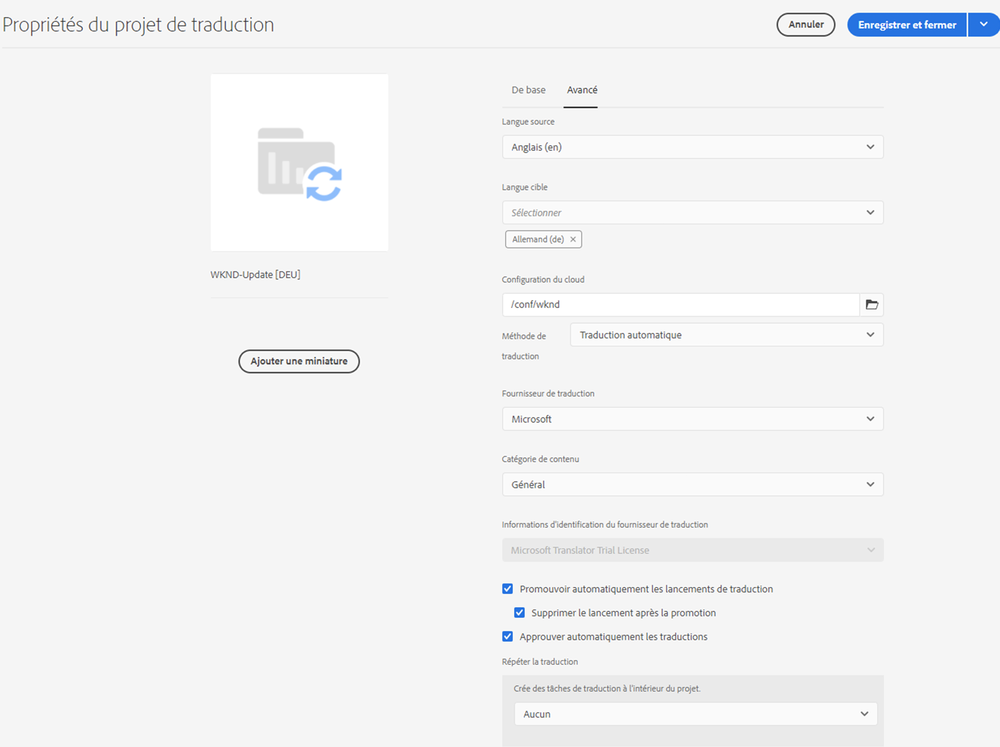

### Suivi du statut d’une tâche de traduction {#monitoring-the-status-of-a-translation-job}

La mosaïque Tâche de traduction d’un projet de traduction fournit le statut d’une tâche de traduction, ainsi que le nombre de pages et les ressources de la tâche.

Le tableau ci-dessous décrit les différents statuts qu’une tâche ou un élément de la tâche peut avoir :

| État | Description |
|---|---|
| **Brouillon** | La tâche de traduction n’a pas été démarrée. Lors de leur création, les tâches de traduction présentent le statut **Brouillon**. |
| **Envoyé** | Les fichiers de la tâche de traduction ont ce statut lorsqu’ils ont été correctement envoyés au service de traduction. Ce statut est défini après l’exécution de la commande **Demander la portée** ou **Commencer**. |
| **Demander la portée** | Pour le processus de traduction humaine, les fichiers de la tâche ont été soumis au fournisseur de traduction pour la définition de la portée. Ce statut est défini après l’exécution de la commande **Demander la portée**. |
| **Portée terminée** | Le fournisseur a défini la portée de la tâche de traduction. |
| **Engagé pour traduction** | Le propriétaire du projet a accepté la portée. Ce statut indique que le fournisseur de traduction doit commencer à traduire les fichiers de la tâche. |
| **Traduction en cours** | Pour une tâche, la traduction d’un ou plusieurs fichiers de la tâche n’est pas encore terminée. Pour un élément de la tâche, l’élément est en cours de traduction. |
| **Traduit** | Pour une tâche, la traduction de tous les fichiers de la tâche est terminée. Pour un élément de la tâche, l’élément est traduit. |
| **Prêt pour la révision** | L’élément de la tâche est traduit et le fichier a été importé dans AEM. |
| **Terminé** | Le propriétaire du projet a indiqué que le contrat de traduction était terminé. |
| **Annuler** | Indique que le fournisseur de traduction doit arrêter de travailler sur une tâche de traduction. |
| **Erreur de mise à jour** | Une erreur s’est produite lors du transfert de fichiers entre AEM et le service de traduction. |
| **État indéterminé** | Une erreur inconnue est survenue. |

Pour afficher le statut de chaque fichier de la tâche, sélectionnez les points de suspension en bas de la mosaïque.

### Définition du délai des tâches de traduction {#setting-the-due-date-of-translation-jobs}

Indiquez la date à laquelle votre fournisseur de traduction doit renvoyer les fichiers traduits. La définition du délai ne fonctionne correctement que lorsque le fournisseur de traduction auquel vous faites appel prend en charge cette fonctionnalité.

1. Sélectionnez les points de suspension en bas de la mosaïque Résumé de traduction .

   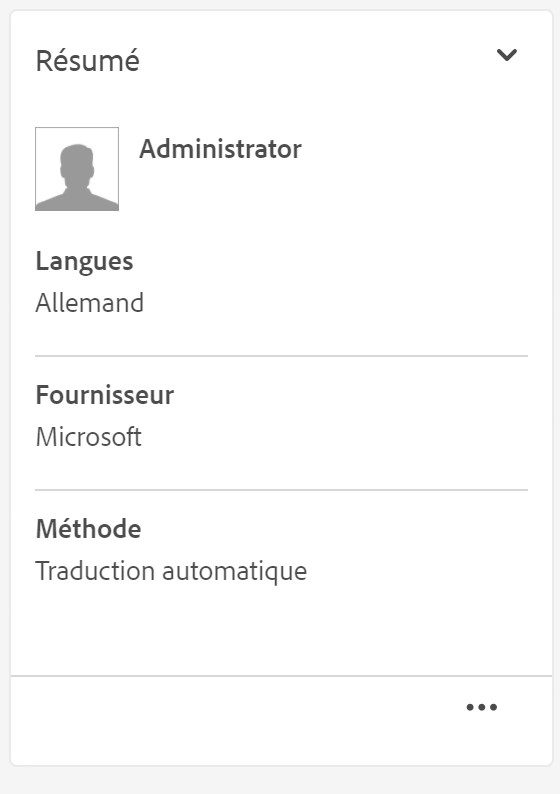

1. Sur l’onglet **De base**, utilisez le sélecteur de date de la propriété **Échéance** pour sélectionner le délai.

   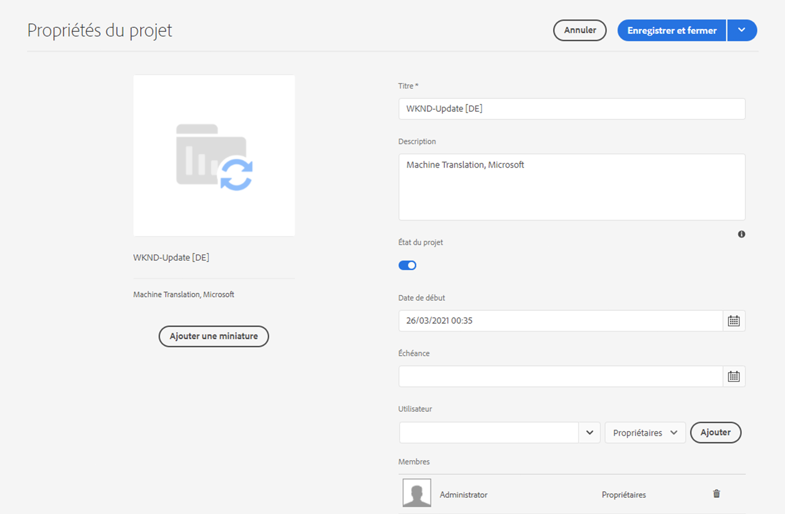

1. Sélectionnez **Enregistrer et fermer**.

### Définition de la portée d’une tâche de traduction {#scoping-a-translation-job}

Définissez la portée de la tâche de traduction afin que le prestataire de services de traduction vous fournisse une estimation du coût de la traduction. Lorsque vous définissez la portée d’une tâche, les fichiers source sont envoyés au fournisseur de traduction, qui compare le texte à son pool de traductions stockées (mémoire de traduction). En règle générale, la portée (ou scope) correspond au nombre de mots à traduire.

Pour obtenir plus d’informations sur les résultats de la portée, contactez votre fournisseur de traduction.

>[!NOTE]
>
>La définition de la portée est facultative et ne concerne que la traduction humaine. Vous pouvez démarrer une tâche de traduction sans définir de portée.

Lorsque vous définissez la portée d’une tâche de traduction, le statut de la tâche est **Portée demandée**. Lorsque le fournisseur de traduction renvoie la définition de la portée, le statut devient **Portée terminée**. Lorsque la définition de la portée est terminée, vous pouvez utiliser la commande **Afficher la portée** pour consulter les résultats de la définition de la portée.

La définition de la portée ne fonctionne correctement que lorsque le fournisseur de traduction auquel vous faites appel prend en charge cette fonctionnalité.

1. Dans la console Projets, ouvrez votre projet de traduction.
1. Dans le titre de la tâche de traduction, sélectionnez le menu Commandes, puis sélectionnez **Demander la portée**.
1. Lorsque le statut de la tâche devient **Portée terminée**, sélectionnez le menu Commandes, puis sélectionnez **Afficher la portée**.

### Démarrage des tâches de traduction {#starting-translation-jobs}

Commencez une tâche de traduction pour traduire les pages source dans la langue cible. La traduction est effectuée selon les valeurs des propriétés de la mosaïque Résumé de traduction.

Vous pouvez débuter une tâche individuelle dans le projet.

1. Dans la console Projets, ouvrez le projet de traduction.
1. Sur la mosaïque Tâche de traduction, sélectionnez le menu Commandes, puis sélectionnez **Démarrer**.
1. Dans la boîte de dialogue Action qui confirme le début de la traduction, sélectionnez **Fermer**.

Une fois que vous avez commencé la tâche de traduction, la mosaïque Tâche de traduction affiche le statut **Traduction en cours**.

Vous pouvez également débuter toutes les tâches de traduction d’un projet.

1. Dans la console Projets, sélectionnez le projet de traduction.
1. Dans la barre d’outils, sélectionnez **Démarrer la ou les tâches de traduction**.
1. Dans la boîte de dialogue, passez en revue la liste des tâches qui sont démarrées, puis confirmez en cliquant sur **Démarrer** ou abandonnez en cliquant sur **Annuler**.

### Annulation d’une tâche de traduction {#canceling-a-translation-job}

Annulez une tâche de traduction pour suspendre le processus de traduction et empêcher le fournisseur de traduction d’effectuer d’autres traductions. Vous pouvez annuler une tâche lorsque cette dernière a le statut **Validé pour la traduction** ou **Traduction en cours**.

1. Dans la console Projets, ouvrez le projet de traduction.
1. Sur la mosaïque Tâche de traduction, sélectionnez le menu Commandes, puis sélectionnez **Annuler**.
1. Dans la boîte de dialogue Action qui confirme l’annulation de la traduction, sélectionnez **OK**.

### Processus d’acceptation et de rejet {#accept-reject-workflow}

Lorsque le contenu revient après traduction et possède le statut **Prêt pour la révision**, vous pouvez passer à la tâche de traduction et accepter/rejeter le contenu.

Si vous sélectionnez **Rejeter la traduction**, vous avez la possibilité d’ajouter un commentaire.

Le rejet du contenu le renvoie au fournisseur de traduction, qui peut consulter le commentaire.

### Fin et archivage des tâches de traduction {#completing-and-archiving-translation-jobs}

Effectuez une tâche de traduction après avoir révisé les fichiers traduits du fournisseur.

1. Dans la console Projets, ouvrez le projet de traduction.
1. Sur la mosaïque Tâche de traduction, sélectionnez le menu Commandes, puis sélectionnez **Terminer**.
1. La tâche a désormais l’état **Terminé**.

Pour les processus de traduction humaine, la réalisation d’une traduction indique au fournisseur que le contrat de traduction est terminé et qu’il doit enregistrer la traduction dans sa mémoire de traduction.

Archivez une tâche de traduction une fois qu’elle est terminée et que vous n’avez plus besoin de consulter les détails du statut de cette tâche.

1. Dans la console Projets, ouvrez le projet de traduction.
1. Sur la mosaïque Tâche de traduction, sélectionnez le menu Commandes, puis sélectionnez **Archiver**.

Lorsque vous archivez la tâche, la mosaïque Tâche de traduction est supprimée du projet.

## Révision et utilisation du contenu traduit {#reviewing-and-promoting-updated-content}

Vous pouvez utiliser la console Sites pour examiner le contenu, comparer des copies de langue et activer le contenu.

### Promotion du contenu mis à jour {#promoting-updated-content}

Lorsque le contenu est traduit pour une copie de langue existante, révisez les traductions, apportez-y des modifications, si nécessaire, puis convertissez les traductions pour les déplacer vers la copie de langue. Vous pouvez réviser les fichiers traduits lorsque la tâche de traduction possède le statut **Prêt pour la révision**.

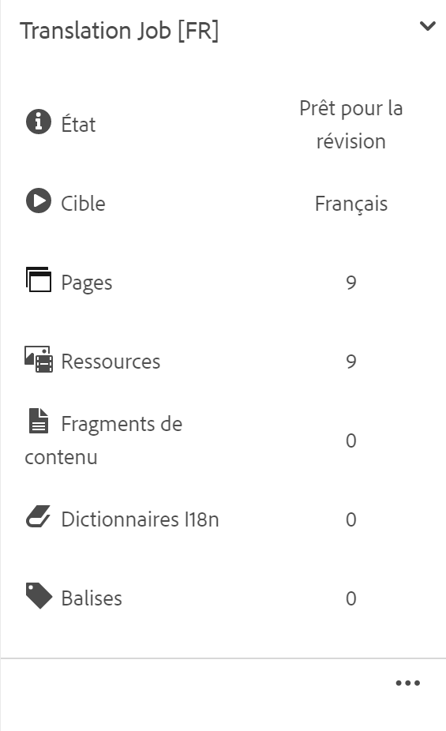

1. Sélectionnez la page dans le gabarit de langue, sélectionnez **Références**, puis **Copies de langue**.
1. Sélectionnez la copie de langue à réviser.

   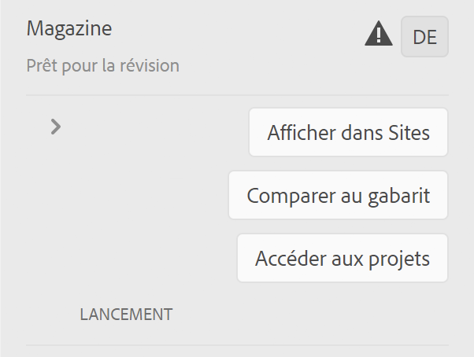

1. Sélectionnez **Lancement** pour afficher les commandes liées au lancement.

   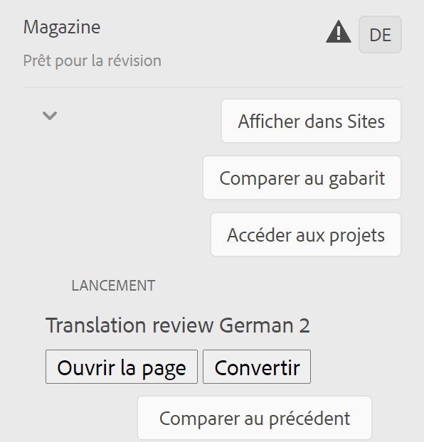

1. Pour ouvrir la copie de lancement de la page pour réviser et modifier le contenu, cliquez sur **Ouvrir la page**.
1. Après avoir révisé le contenu et apporté les modifications nécessaires, pour convertir la copie du lancement, cliquez sur **Convertir**.
1. Dans la page **Convertir le lancement**, spécifiez les pages à convertir, puis sélectionnez **Convertir**.

### Comparaison des copies de langue {#comparing-language-copies}

Pour comparer des copies de langue au gabarit de langue :

1. Dans la console Sites, accédez à la copie de langue à comparer.
1. Ouvrez le [rail Références](/help/sites-cloud/authoring/basic-handling.md#references).
1. Sous le titre **Copies**, sélectionnez **Copies de langue**.
1. Sélectionnez votre copie de langue. Ensuite, vous pouvez cliquer sur **Comparer au gabarit** ou **Comparer au précédent**, le cas échéant.

   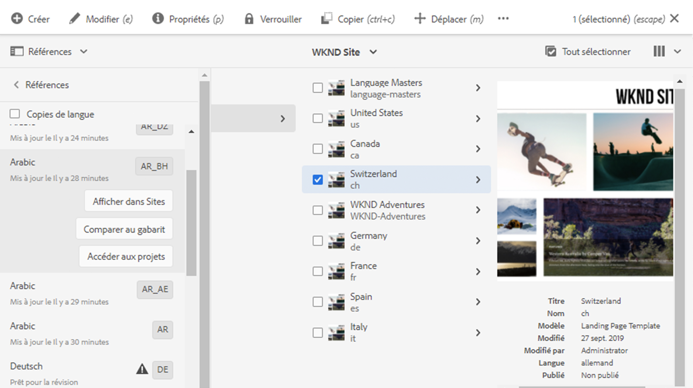

1. Les deux pages (lancement et source) s’ouvrent côte à côte.
   * Pour des informations complètes sur l’utilisation de cette fonction, consultez la section [Comparaison entre les pages](/help/sites-cloud/authoring/sites-console/page-diff.md).

## Déplacement ou modification du nom d’une page source {#move-source}

Si une page source déjà traduite doit être [renommée ou déplacée](/help/sites-cloud/authoring/sites-console/managing-pages.md#moving-or-renaming-a-page), la traduction de la page après le déplacement crée une copie dans la langue en fonction du nouveau nom ou emplacement de la page. L’ancienne copie dans la langue basée sur le nom et l’emplacement précédent est toujours là. Pour éviter cela, vous pouvez utiliser la fonctionnalité de mise à jour de la copie de langue après le déplacement :

1. Déplacez une page qui comporte une copie de langue.
1. Sélectionnez la racine de la copie de langue.
1. Ouvrez le panneau **Références**.
1. Sélectionnez **Copies de langue**.
1. Sélectionnez les langues cibles à mettre à jour.
1. Sélectionnez **Mettre à jour les copies de langue**.

   

1. Cliquez sur **Mettre à jour**. Un [lancement](/help/sites-cloud/authoring/launches/promoting.md) est créé.
1. Accédez à la racine de langue requise et sélectionnez-la.
1. Dans le panneau **Références**, sélectionnez **Lancements**.

   

1. Cliquez sur le lancement que avez créé, puis sur **Promouvoir le lancement**.

Désormais, la page source a été déplacée, ainsi que la copie de langue associée.

## Importation et exportation de tâches de traduction {#import-export}

Bien qu’AEM propose plusieurs solutions et interfaces de traduction, il est également possible d’importer et d’exporter manuellement les informations relatives aux tâches de traduction.

### Exportation d’une tâche de traduction {#exporting-a-translation-job}

Vous pouvez télécharger le contenu d’une tâche de traduction, par exemple, pour l’envoyer à un fournisseur de traduction qui n’est pas intégré à AEM par le biais d’un connecteur ou pour réviser le contenu.

1. Dans le menu déroulant de la mosaïque Tâche de traduction, sélectionnez **Exporter**.
1. Dans la boîte de dialogue, sélectionnez **Télécharger le fichier exporté** et, si nécessaire, utilisez la boîte de dialogue du navigateur web pour enregistrer le fichier.
1. Dans la boîte de dialogue, sélectionnez **Fermer**.

### Importation d’une tâche de traduction {#importing-a-translation-job}

Vous pouvez importer du contenu traduit dans AEM, par exemple, lorsque votre fournisseur de traduction vous l’envoie, car il n’est pas intégré à AEM par le biais d’un connecteur.

1. Dans le menu déroulant de la mosaïque Tâche de traduction, sélectionnez **Importer**.
1. Utilisez la boîte de dialogue du navigateur web pour sélectionner le fichier à importer.
1. Dans la boîte de dialogue, sélectionnez **Fermer**.
