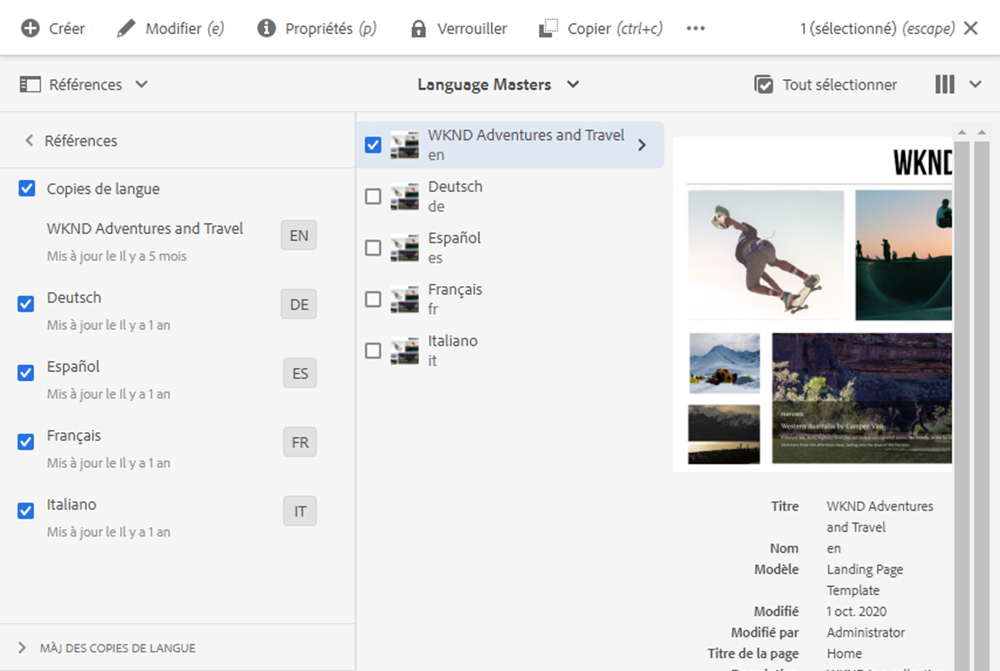

# Gestion des projets de traduction {#managing-translation-projects}

Les projets de traduction permettent de gérer la traduction du contenu d’AEM. Un projet de traduction est un type d&#39;AEM [projet](/help/sites-cloud/authoring/projects/overview.md) qui contient des ressources qui doivent être traduites dans d&#39;autres langues. Ces ressources sont les pages et les actifs des [copies de langue](preparation.md) créées à partir du gabarit de langue.

Lorsque des ressources sont ajoutées à un projet de traduction, une tâche de traduction est créée pour ces ressources. Les tâches comportent les commandes et les informations sur le statut utilisées pour gérer les processus de traduction humaine et automatique exécutés sur les ressources.

Les projets de traduction sont des éléments dont l’exécution est longue, définis par langue et par méthode/fournisseur de traduction afin d’être en phase avec la gouvernance organisationnelle en matière d’internationalisation. Ils doivent être lancés en une seule fois, lors de la traduction initiale ou manuellement, et restent actifs pendant toute la durée des activités de mise à jour du contenu et de la traduction.

Les projets et les tâches de traduction sont créés avec des processus de préparation de la traduction. Ces processus possèdent trois options pour la traduction initiale (Créer et traduire) et les mises à jour (Mettre à jour une traduction) :

1. [Créer un projet](#creating-translation-projects-using-the-references-panel)
1. [Ajouter à un projet existant](#adding-pages-to-a-translation-project)
1. [Structure de contenu uniquement](#creating-the-structure-of-a-language-copy)

AEM détecte si un projet de traduction est créé pour la traduction initiale du contenu ou pour mettre à jour des copies de langue déjà traduites. Lorsque vous créez un projet de traduction pour une page et que vous indiquez les copies de langue pour lesquelles vous effectuez une traduction, AEM détecte si la page source existe déjà dans les copies de langue ciblées :

* **La copie de langue n’inclut pas la page:** AEM traite cette situation comme la traduction initiale. La page est copiée immédiatement dans la copie de langue et incorporée au projet. Lorsque la page traduite est importée dans AEM, AEM la copie directement dans la copie de langue.
* **La copie de langue comprend déjà la page:** AEM traite cette situation comme une traduction mise à jour. Un lancement est créé, et une copie de la page est ajoutée au lancement et incorporée au projet. Les lancements permettent de réviser les traductions mises à jour avant de les valider dans la copie de langue :

   * Lorsque la page traduite est importée dans AEM, elle remplace la page correspondante dans le lancement.
   * La page traduite ne remplace la copie de langue que lorsque le lancement est converti.

Par exemple, la racine de langue `/content/wknd/fr` est créée pour la traduction française de la langue principale `/content/wknd/en`. Il n’y a pas d’autres pages dans la copie de langue française.

* Un projet de traduction est créé pour la page `/content/wknd/en/products` et toutes les pages enfants, en ciblant la copie en français. Comme la copie de langue n&#39;inclut pas la page `/content/wknd/fr/products`, AEM copie immédiatement la page `/content/wknd/en/products` et toutes les pages enfants dans la copie de langue française. Les copies sont également incluses dans le projet de traduction.
* Un projet de traduction est créé pour la page `/content/wknd/en` et toutes les pages enfants, en ciblant la copie en français. Dans la mesure où la copie de langue comprend la page qui correspond à la page `/content/wknd/en` (la racine de langue), AEM copie la page `/content/wknd/en` et toutes les pages enfants et les ajoute à un lancement. Les copies sont également incluses dans le projet de traduction.

## Traduction à partir de la console Sites {#performing-initial-translations-and-updating-existing-translations}

Les projets de traduction peuvent être créés ou mis à jour directement à partir de la console des sites.

### Création de projets de traduction à l’aide du panneau Références {#creating-translation-projects-using-the-references-panel}

Créez des projets de traduction afin de pouvoir exécuter et gérer le processus pour traduire les ressources de votre gabarit de langue. Lorsque vous créez des projets, vous spécifiez la page du gabarit de langue que vous traduisez et les copies de langue pour lesquelles vous effectuez la traduction :

* La configuration du cloud de la structure d’intégration de traduction associée à la page sélectionnée détermine de nombreuses propriétés des projets de traduction, comme le processus de traduction à utiliser.
* Un projet est créé pour chaque copie de langue sélectionnée.
* Une copie de la page sélectionnée et des ressources associées est créée et ajoutée à chaque projet. Ces copies sont ensuite envoyées au fournisseur de traduction pour être traduites.

Vous pouvez spécifier que les pages enfants de la page sélectionnée soient elles aussi sélectionnées. Dans ce cas, les copies des pages enfants sont également ajoutées à chaque projet afin d’être traduites. Lorsque des pages enfants sont associées à des configurations de structure d’intégration de traduction différentes, AEM crée des projets supplémentaires.

Vous pouvez également [créer manuellement des projets de traduction](#creating-a-translation-project-using-the-projects-console).

>[!NOTE]
>
>Pour créer un projet, votre compte doit être membre du groupe `project-administrators`.

### Traductions initiales et mise à jour de traductions {#initial-and-updating}

Le panneau Références indique si vous mettez à jour les copies de langue existantes ou si vous créez la première version des copies de langue. Lorsqu’il existe une copie de langue pour la page sélectionnée, l’onglet Mettre à jour les copies de langue s’affiche pour permettre d’accéder aux commandes liées au projet.

Après la traduction, vous pouvez [réviser la traduction](#reviewing-and-promoting-updated-content) avant de remplacer la copie de langue. Lorsqu’il n’existe pas copie de langue pour la page sélectionnée, l’onglet Créer et traduire s’affiche pour permettre d’accéder aux commandes liées au projet.

 

### Création de projets de traduction pour une nouvelle copie de langue {#create-translation-projects-for-a-new-language-copy}

1. Utilisez la console Sites pour sélectionner la page que vous ajoutez aux projets de traduction.

1. A l’aide de la barre d’outils, ouvrez le rail **Références**.

   

1. Sélectionnez **Copies de langue**, puis sélectionnez les copies de langue pour lesquelles vous traduisez les pages source.
1. Cliquez ou appuyez sur **Créer et traduire**, puis configurez la tâche de traduction :

   * Utilisez la liste déroulante **Langues** pour sélectionner une copie de langue à traduire. Sélectionnez d’autres langues, au besoin. Les langues qui figurent dans la liste correspondent aux [racines de langue que vous avez créées](preparation.md#creating-a-language-root).
      * La sélection de plusieurs langues crée un projet avec une tâche de traduction pour chaque langue.
   * Pour convertir la page sélectionnée et toutes les pages enfants, sélectionnez **Sélectionner toutes les sous-pages**. Pour ne traduire que la page sélectionnée, désélectionnez cette option.
   * Pour **Projet**, sélectionnez **Créer un projet de traduction**.
   * Si vous le souhaitez pour **Principal du projet**, sélectionnez un projet à partir duquel hériter les rôles utilisateur et les autorisations.
   * Dans **Titre**, tapez le nom du projet.

   

1. Cliquez ou appuyez sur **Créer**.

### Création de projets de traduction pour une copie de langue existante {#create-translation-projects-for-an-existing-language-copy}

1. Utilisez la console Sites pour sélectionner la page que vous ajoutez aux projets de traduction.

1. A l’aide de la barre d’outils, ouvrez le rail **Références**.

   

1. Sélectionnez **Copies de langue**, puis sélectionnez les copies de langue pour lesquelles vous traduisez les pages source.
1. Cliquez ou appuyez sur **Mettre à jour les copies de langue**, puis configurez la tâche de traduction :

   * Pour convertir la page sélectionnée et toutes les pages enfants, sélectionnez **Sélectionner toutes les sous-pages**. Pour ne traduire que la page sélectionnée, désélectionnez cette option.
   * Pour **Projet**, sélectionnez **Créer un projet de traduction**.
   * Si vous le souhaitez pour **Principal du projet**, sélectionnez un projet à partir duquel hériter les rôles utilisateur et les autorisations.
   * Dans **Titre**, tapez le nom du projet.

   

1. Cliquez ou appuyez sur **Créer**.

### Ajout de pages à un projet de traduction {#adding-pages-to-a-translation-project}

Après avoir créé un projet de traduction, vous pouvez utiliser le rail **Resources** pour ajouter des pages au projet. Il est utile d’ajouter des pages lorsque vous incorporez des pages de différentes branches dans le même projet.

Lorsque vous ajoutez des pages à un projet de traduction, les pages sont incorporées à une nouvelle tâche de traduction. Vous pouvez également [ajouter des pages à une tâche existante](#adding-pages-assets-to-a-translation-job).

Comme lors de la création d’un projet, lorsque vous ajoutez des pages, des copies des pages sont ajoutées à un lancement, si nécessaire, afin d’éviter de remplacer des copies de langue. (Voir [Création de projets de traduction pour une copie de langue existante](#performing-initial-translations-and-updating-existing-translations).)

1. Utilisez la console Sites pour sélectionner la page que vous ajoutez au projet de traduction.

1. A l’aide de la barre d’outils, ouvrez le rail **Références**.

   

1. Sélectionnez **Copies de langue**, puis sélectionnez les copies de langue pour lesquelles vous traduisez les pages source.

   

1. Cliquez ou appuyez sur **Mettre à jour les copies de langue**, puis configurez les propriétés :

   * Pour convertir la page sélectionnée et toutes les pages enfants, sélectionnez **Sélectionner toutes les sous-pages**. Pour ne traduire que la page sélectionnée, désélectionnez cette option.
   * Pour **Projet**, sélectionnez **Ajouter au projet de traduction existant**.
   * Sélectionnez le projet dans **Projet de traduction existant**.

   >[!NOTE]
   >
   >La langue de cible définie dans le projet de traduction doit correspondre au chemin d’accès de la copie de langue, comme indiqué dans le rail de références.

1. Cliquez ou appuyez sur **Mettre à jour**.

### Création de la structure d’une copie de langue {#creating-the-structure-of-a-language-copy}

Il est possible de créer uniquement la structure de la copie de langue, ce qui vous permet de copier le contenu et les modifications structurelles dans le gabarit de langue en copies de langue (non traduites). Ceci n’est pas lié à un travail ou projet de traduction. Vous pouvez l’utiliser pour préserver la synchronisation des gabarits de langue, même sans traduction.

Remplissez la copie de langue afin qu’elle contienne le contenu de la langue principale que vous traduisez. Avant de renseigner votre copie de langue, [vous devez avoir créé la racine de langue](preparation.md#creating-a-language-root) de la copie de langue.

1. Utilisez la console sites pour sélectionner la langue racine de la langue principale que vous utilisez comme source.
1. Ouvrez le rail de références en cliquant ou en appuyant sur **Références** dans la barre d’outils.

   

1. Sélectionnez **Copies de langue**, puis sélectionnez les copies de langue à renseigner.

   

1. Cliquez ou appuyez sur **Mettre à jour les copies de langue** pour afficher les outils de traduction et configurer les propriétés :

   * Sélectionnez l&#39;option **Sélectionner toutes les sous-pages**.
   * Pour **Projet**, sélectionnez **Créer la structure uniquement**.

   

1. Cliquez ou appuyez sur **Mettre à jour**.

### Mise à jour de la mémoire de traduction {#updating-translation-memory}

Les modifications manuelles du contenu traduit peuvent être synchronisées à nouveau dans le système de gestion de la traduction (TMS) pour former sa mémoire de traduction.

1. Dans la console sites, après avoir mis à jour le contenu textuel dans une page traduite, sélectionnez **Mettre à jour la mémoire de traduction**.
1. Un mode Liste affiche côte à côte une comparaison de la source et de la traduction pour chaque composant de texte qui a été modifié. Sélectionnez les mises à jour de traduction à synchroniser avec la mémoire de traduction, puis sélectionnez **Mettre à jour la mémoire**.

AEM enverra les chaînes sélectionnées vers le système de gestion de traduction.

### Vérification du statut de traduction d&#39;une page {#check-translation-status}

Une propriété peut être sélectionnée dans la vue de liste de la console des sites qui indique si une page a été traduite, est traduite ou n&#39;a pas encore été traduite.

1. Dans la console du site, passez à [vue de liste.](/help/sites-cloud/authoring/getting-started/basic-handling.md#viewing-and-selecting-resources)
1. Appuyez ou cliquez sur **Paramètres de Vue** dans la liste déroulante vue.
1. Dans la boîte de dialogue, vérifiez la propriété **Traduite** et appuyez ou cliquez sur **Mettre à jour**.

La console sites affiche désormais la colonne **Traduite** qui indique l&#39;état de traduction des pages répertoriées.

## Gestion des projets de traduction à partir de la console Projet

De nombreuses tâches de traduction et options avancées sont accessibles dans la console Projets.

### Présentation de la console Projets

Les projets de traduction dans AEM utilisent la console de projets [AEM standard.](/help/sites-cloud/authoring/projects/overview.md) Si vous ne connaissez pas AEM projets, veuillez consulter cette documentation.

Comme tout autre projet Un projet de traduction est constitué de tuiles qui présentent un aperçu des tâches du projet.

* **Résumé**  - Un aperçu du projet
* **Tâches**  - Une ou plusieurs tâches de traduction
* **Equipe**  - Utilisateurs collaborant au projet de traduction
* **Tâches**  - Éléments à compléter dans le cadre de l&#39;effort de traduction

Utilisez les commandes et les boutons d’ellipse en haut et en bas des mosaïques (respectivement) pour les contrôles d&#39;accès et les options des différentes mosaïques.

### Création d’un projet de traduction à l’aide de la console Projets {#creating-a-translation-project-using-the-projects-console}

Vous pouvez créer manuellement un projet de traduction si vous préférez utiliser la console Projets au lieu de la console Sites.

>[!NOTE]
>
>Pour créer un projet, votre compte doit être membre du groupe `project-administrators`.

Lorsque vous créez manuellement un projet de traduction, vous devez fournir des valeurs pour les propriétés associées à la traduction ci-dessous en complément des [propriétés de base](/help/sites-cloud/authoring/projects/managing.md#creating-a-project) :

* **Nom** : nom du projet
* **Langue source** : langue du contenu source
* **Langue de la cible :** la ou les langues dans lesquelles le contenu est traduit
   * Si plusieurs langues sont sélectionnées, une tâche est créée pour chaque langue du projet.
* **Méthode de conversion**** : sélectionnez Traduction humaine pour indiquer que la traduction doit être effectuée manuellement.**

1. Dans la barre d’outils de la console Projets, cliquez ou appuyez sur **Créer**.
1. Sélectionnez le modèle **Projet de traduction**, puis cliquez ou appuyez sur **Suivant**.
1. Saisissez les valeurs de l’onglet des propriétés **Basic**.
1. Cliquez ou appuyez sur **Avancé** et indiquez des valeurs pour les propriétés liées à la traduction.
1. Cliquez ou appuyez sur **Créer**. Dans la zone de confirmation, cliquez ou appuyez sur **Terminé** pour revenir à la console Projets, ou cliquez ou appuyez sur **Ouvrir le projet** pour ouvrir et début la gestion du projet.

### Ajouter des pages et des ressources à une tâche de traduction {#adding-pages-assets-to-a-translation-job}

Vous pouvez ajouter des pages, des ressources ou des balises à la tâche de traduction de votre projet de traduction. Pour ajouter des pages ou des ressources :

1. Au bas de la mosaïque de tâche de traduction de votre projet de traduction, cliquez ou appuyez sur les points de suspension.

   

1. Dans la fenêtre suivante, cliquez ou appuyez sur le bouton **Ajouter** dans la barre d’outils, puis sélectionnez **Ressources/Pages**.

   

1. Dans la fenêtre modale, sélectionnez l&#39;élément le plus haut de la branche à ajouter, puis cliquez ou appuyez sur l&#39;icône représentant une coche. La sélection multiple est activée dans cette fenêtre.

   

1. Vous pouvez également choisir l’icône de recherche pour rechercher des pages ou des ressources à ajouter à la tâche de traduction.

   

1. Une fois sélectionné, appuyez ou cliquez sur **Sélectionner**. Vos pages et/ou ressources sont ajoutées à la tâche de traduction.

>[!TIP]
>
>Cette méthode ajoute des pages/ressources et leurs enfants au projet. Sélectionnez **Actif/Page (sans enfants)** si vous souhaitez uniquement ajouter les parents.

### Ajout de balises à une tâche de traduction {#adding-tags-to-a-translation-job}

Vous pouvez ajouter des balises à un projet de traduction de la même manière que [la manière dont vous ajoutez des ressources et des pages à un projet.](#adding-pages-assets-to-a-translation-job) Il vous suffit de sélectionner  **** Tagssous le  **** menu Ajouter, puis de suivre les mêmes étapes.

### Affichage des détails d’un projet de traduction {#seeing-translation-project-details}

Les propriétés du projet de traduction sont accessibles via le bouton d’ellipse de la mosaïque de résumé du projet. Outre les informations de projet génériques , les propriétés du projet de traduction contiennent des informations spécifiques à la traduction.

Dans votre projet de traduction, cliquez ou appuyez sur les points de suspension en bas de la mosaïque Résumé de traduction. La plupart des propriétés spécifiques au projet se trouvent dans l&#39;onglet **Advanced**.

* **Langue source :** langue des pages traduites
* **Langue de la cible :** la ou les langues dans lesquelles les pages sont traduites
* **Configuration du cloud : configuration** du cloud pour le connecteur du service de traduction utilisé pour le projet
* **Méthode de traduction :** Processus de traduction, soit  **Human** Translationsoit  **Machine Translation**
* **Fournisseur de traduction :** prestataire de traduction qui effectue la traduction
* **Catégorie de contenu:** (Traduction automatique) catégorie de contenu utilisée pour la traduction
* **Informations d’identification du fournisseur de traduction :** informations d’identification de connexion au fournisseur
* **Promouvoir automatiquement les lancements de traduction:** après réception du contenu traduit, les lancements de traduction sont automatiquement promus.
   * **Supprimer le lancement après la promotion :** si les lancements de traduction sont automatiquement promus, supprimez le lancement après la promotion.
* **Approuver automatiquement les traductions :** après réception du contenu traduit, les tâches de traduction sont automatiquement approuvées
* **Traduction répétée :** configurez l’exécution récurrente d’un projet de traduction en sélectionnant la fréquence à laquelle le projet créera et exécutera automatiquement des tâches de traduction.

Lorsqu’un projet est créé à l’aide du rail de références d’une page, ces propriétés sont automatiquement configurées en fonction des propriétés de la page source.

### Suivi du statut d’une tâche de traduction {#monitoring-the-status-of-a-translation-job}

La mosaïque de tâche de traduction d’un projet de traduction indique l’état d’une tâche de traduction, ainsi que le nombre de pages et de ressources qu’elle contient.

Le tableau ci-dessous décrit les différents statuts qu’une tâche ou un élément de la tâche peut avoir :

| État | Description |
|---|---|
| **Draft** | La tâche de traduction n&#39;a pas été démarrée. Les tâches de traduction sont dans l’état **Version préliminaire**** au moment de leur création. |
| **Envoyé** | Les fichiers de la tâche de traduction ont ce statut lorsqu’ils ont été correctement envoyés au service de traduction. Cet état peut survenir après l&#39;émission de la commande **Request Scope** ou de la commande **Début**. |
| **Portée demandée** | Pour le processus de traduction humain, les fichiers de la tâche ont été soumis au fournisseur de traduction pour application de plage. Cet état s&#39;affiche après l&#39;émission de la commande **Request Scope**. |
| **Portée terminée** | Le fournisseur a défini la portée de la tâche de traduction. |
| **Engagé pour la traduction** | Le propriétaire du projet a accepté la portée. Ce statut indique que le fournisseur de traduction doit commencer à traduire les fichiers de la tâche. |
| **Traduction en cours** | Pour une tâche, la traduction d’un ou plusieurs fichiers de la tâche n’est pas encore terminée. Pour un élément de la tâche, l’élément est en cours de traduction. |
| **Traduit** | Pour une tâche, la traduction de tous les fichiers de la tâche est terminée. Pour un élément de la tâche, l’élément est traduit. |
| **Prêt pour la révision** | L’élément de la tâche est traduit et le fichier a été importé dans AEM. |
| **Terminé** | Le propriétaire du projet a indiqué que le contrat de traduction était terminé. |
| **Annuler** | Indique que le fournisseur de traduction doit arrêter de travailler sur une tâche de traduction. |
| **Mise à jour de l’erreur** | Une erreur s&#39;est produite lors du transfert de fichiers entre AEM et le service de traduction. |
| **Etat inconnu** | Une erreur inconnue s&#39;est produite. |

Pour afficher le statut des différents fichiers de la tâche, cliquez ou appuyez sur le bouton de sélection de la mosaïque.

### Définition du délai des tâches de traduction {#setting-the-due-date-of-translation-jobs}

Spécifiez la date à laquelle le fournisseur de traduction doit renvoyer les fichiers traduits. La définition du délai ne fonctionne correctement que lorsque le fournisseur de traduction auquel vous faites appel prend en charge cette fonctionnalité.

1. Cliquez ou appuyez sur les points de suspension au bas de la mosaïque de résumé de traduction.

   

1. Dans l&#39;onglet **Basic**, utilisez le sélecteur de dates de la propriété **Date d&#39;échéance** pour sélectionner la date d&#39;échéance.

   

1. Cliquez ou appuyez sur **Enregistrer et fermer**.

### Définition de la portée d’une tâche de traduction {#scoping-a-translation-job}

Définissez la portée de la tâche de traduction afin que le prestataire de services de traduction vous fournisse une estimation du coût de la traduction. Lorsque vous définissez la portée d’une tâche, les fichiers source sont envoyés au fournisseur de traduction, qui compare le texte à son pool de traductions stockées (mémoire de traduction). En règle générale, la portée est le nombre de mots à traduire.

Pour plus d’informations sur les résultats de la définition de la portée, contactez le fournisseur de traduction.

>[!NOTE]
>
>L&#39;application de plage est facultative et ne s&#39;applique qu&#39;à la traduction humaine. Vous pouvez commencer une tâche de traduction sans définir la portée.

Lorsque vous définissez la portée d’une tâche de traduction, le statut de la tâche est **Portée demandée**. Lorsque le fournisseur de traduction renvoie la définition de la portée, le statut devient **Portée terminée**. Une fois l’étendue terminée, vous pouvez utiliser la commande **Afficher l’étendue** pour examiner les résultats de l’étendue.

La définition de la portée ne fonctionne correctement que lorsque le fournisseur de traduction auquel vous faites appel prend en charge cette fonctionnalité.

1. Dans la console Projets, ouvrez votre projet de traduction.
1. Dans le titre de la tâche de traduction, appuyez ou cliquez sur le menu des commandes, puis appuyez ou cliquez sur **Request Scope**.
1. Lorsque l’état de la tâche devient **Portée terminée**, cliquez ou appuyez sur le menu des commandes, puis cliquez ou appuyez sur **Afficher l’étendue**.

### Démarrage des tâches de traduction {#starting-translation-jobs}

Commencez une tâche de traduction pour traduire les pages source dans la langue cible. La traduction est effectuée en fonction des valeurs de propriété de la mosaïque de résumé de la traduction.

Vous pouvez début une tâche individuelle dans le projet.

1. Dans la console Projets, ouvrez le projet de traduction.
1. Sur la mosaïque de la tâche de traduction, cliquez ou appuyez sur le menu des commandes, puis cliquez ou appuyez sur **Début**.
1. Dans la boîte de dialogue d’action qui confirme le début de la traduction, cliquez ou appuyez sur **Fermer**.

Après avoir début la tâche de traduction, la mosaïque de la tâche de traduction affiche la traduction dans l’état **En cours**.

Vous pouvez également début toutes les tâches de traduction d’un projet.

1. Dans la console du projet, sélectionnez le projet de traduction.
1. Dans la barre d’outils, appuyez ou cliquez sur **Début Translation Job(s)**.
1. Dans la boîte de dialogue, passez en revue la liste des tâches qui seront démarrées, puis confirmez avec **Début** ou abandonnez avec **Annuler**.

### Annulation d’une tâche de traduction {#canceling-a-translation-job}

Annulez une tâche de traduction pour suspendre le processus de traduction et empêcher le fournisseur de traduction d’effectuer d’autres traductions. Vous pouvez annuler une tâche lorsque la tâche possède le statut **Engagé pour traduction** ou **Traduction en cours**.

1. Dans la console Projets, ouvrez le projet de traduction.
1. Sur la mosaïque de la tâche de traduction, cliquez ou appuyez sur le menu des commandes, puis cliquez ou appuyez sur **Annuler**.
1. Dans la boîte de dialogue d’action qui confirme l’annulation de la traduction, cliquez ou appuyez sur **OK**.

### Processus d&#39;acceptation et de rejet {#accept-reject-workflow}

Lorsque le contenu revient après la traduction et est à l’état **Prêt pour révision**, vous pouvez effectuer la tâche de traduction et accepter/rejeter le contenu.

Si vous sélectionnez **Rejeter la traduction**, vous avez la possibilité d’ajouter un commentaire.

Le rejet de contenu le renvoie au fournisseur de traduction où il pourra voir le commentaire.

### Fin et archivage des tâches de traduction {#completing-and-archiving-translation-jobs}

Effectuez une tâche de traduction après avoir révisé les fichiers traduits du fournisseur.

1. Dans la console Projets, ouvrez le projet de traduction.
1. Sur la mosaïque de la tâche de traduction, cliquez ou appuyez sur le menu des commandes, puis cliquez ou appuyez sur **Terminer**.
1. La tâche a désormais l’état **Terminé**.

Pour les workflows de traduction humaine, l&#39;exécution d&#39;une traduction indique au fournisseur que le contrat de traduction a été rempli et qu&#39;il doit enregistrer la traduction dans sa mémoire de traduction.

Archivez une tâche de traduction une fois qu’elle est terminée et que vous n’avez plus besoin de consulter les détails du statut de cette tâche.

1. Dans la console Projets, ouvrez le projet de traduction.
1. Sur la mosaïque de la tâche de traduction, cliquez ou appuyez sur le menu des commandes, puis cliquez ou appuyez sur **Archiver**.

Lorsque vous archivez la tâche, la mosaïque de tâche de traduction est supprimée du projet.

## Révision et utilisation du contenu traduit {#reviewing-and-promoting-updated-content}

Vous pouvez utiliser la console sites pour examiner le contenu, comparer des copies de langue et activer le contenu.

### Promotion du contenu mis à jour {#promoting-updated-content}

Lorsque le contenu est traduit pour une copie de langue existante, révisez les traductions, apportez-y des modifications, si nécessaire, puis convertissez les traductions pour les déplacer vers la copie de langue. Vous pouvez consulter les fichiers traduits lorsque la tâche de traduction affiche l’état **Prêt pour révision**.

1. Sélectionnez la page dans le gabarit de langue, cliquez ou appuyez sur **Références**, puis cliquez ou appuyez sur **Copies de langue**.
1. Cliquez ou appuyez sur la copie de langue à réviser.

   

1. Cliquez ou appuyez sur **Lancer** pour afficher les commandes liées au lancement.

   

1. Pour ouvrir la copie de lancement de la page afin de vérifier et de modifier le contenu, cliquez sur **Ouvrir la page**.
1. Après avoir examiné le contenu et apporté les modifications nécessaires, cliquez sur **Promouvoir** pour promouvoir la copie de lancement.
1. Sur la page **Promouvoir le lancement**, spécifiez les pages à promouvoir, puis cliquez ou appuyez sur **Promouvoir**.

### Comparaison des copies de langue {#comparing-language-copies}

Pour comparer des copies de langue au gabarit de langue :

1. Dans la console sites, accédez à la copie de langue à comparer.
1. Ouvrez le rail [Références.](/help/sites-cloud/authoring/getting-started/basic-handling.md#references)
1. Sous l&#39;en-tête **Copies**, sélectionnez **Copies de langue.**
1. Sélectionnez votre copie de langue spécifique, puis cliquez sur **Comparer au Principal** ou **Comparer au précédent**, le cas échéant.

   

1. Les deux pages (de lancement et source) s’ouvrent côte à côte.
   * Pour des informations complètes sur l’utilisation de cette fonction, consultez [Différence entre les pages](/help/sites-cloud/authoring/features/page-diff.md).

## Importation et exportation de tâches de traduction {#import-export}

Bien que AEM offre un certain nombre de solutions et d&#39;interfaces de traduction, il est également possible d&#39;importer et d&#39;exporter manuellement les informations relatives aux tâches de traduction.

### Exportation d’une tâche de traduction {#exporting-a-translation-job}

Vous pouvez télécharger le contenu d’une tâche de traduction, par exemple, pour l’envoyer à un fournisseur de traduction qui n’est pas intégré à AEM par le biais d’un connecteur ou pour réviser le contenu.

1. Dans le menu déroulant de la mosaïque de tâche de traduction, cliquez ou appuyez sur **Exporter**.
1. Dans la boîte de dialogue, cliquez ou appuyez sur **Télécharger le fichier exporté** et, si nécessaire, utilisez la boîte de dialogue du navigateur Web pour enregistrer le fichier.
1. Dans la boîte de dialogue, cliquez ou appuyez sur **Fermer**.

### Importation d’une tâche de traduction {#importing-a-translation-job}

Vous pouvez importer du contenu traduit dans AEM, par exemple, lorsque votre fournisseur de traduction vous l’envoie, car il n’est pas intégré à AEM par le biais d’un connecteur.

1. Dans le menu déroulant de la mosaïque de tâche de traduction, cliquez ou appuyez sur **Importer**.
1. Utilisez la boîte de dialogue du navigateur web pour sélectionner le fichier à importer.
1. Dans la boîte de dialogue, cliquez ou appuyez sur **Fermer**.
