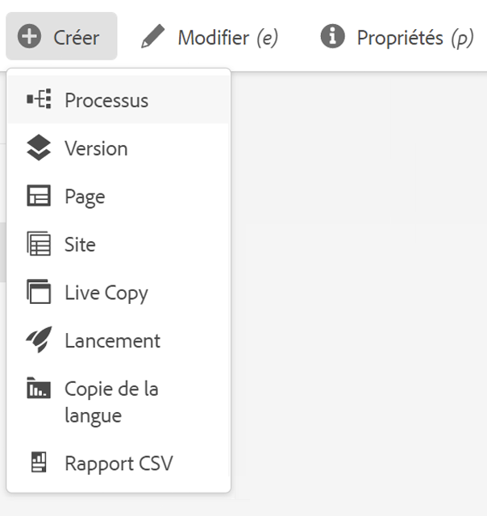
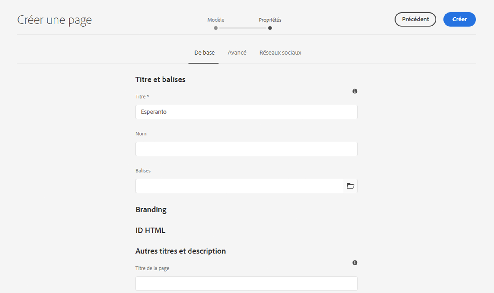
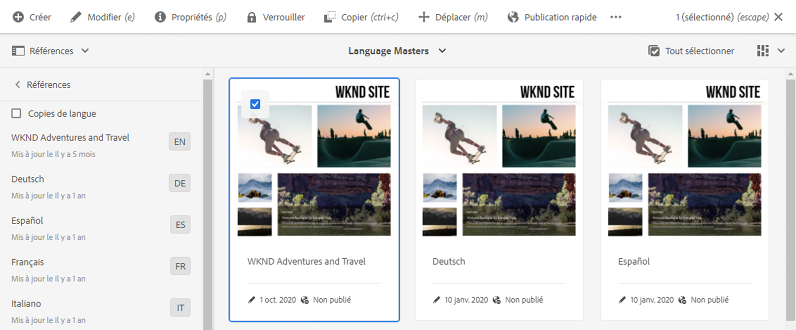
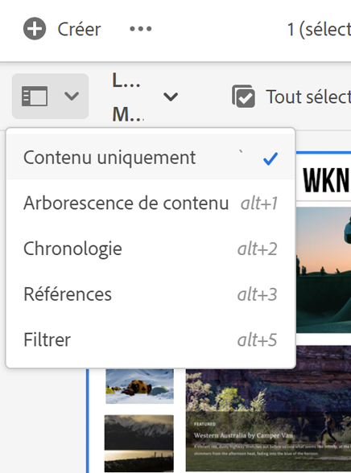

# Préparation du contenu à traduire {#preparing-content-for-translation}

Les sites web multilingues fournissent généralement une certaine quantité de contenu dans plusieurs langues. Le site est créé dans une langue, puis traduit dans d’autres langues. En règle générale, les sites multilingues se composent de branches de pages, où chaque branche contient les pages du site dans une langue différente.

>[!TIP]
>
>Si vous êtes un débutant dans la traduction de contenu, reportez-vous à la section [Parcours de traduction de sites](/help/journey-sites/translation/overview.md), qui vous guide sur le chemin de la traduction de votre contenu AEM Sites à l’aide d’AEM de puissants outils de traduction, idéaux pour ceux qui ne disposent pas d’une expérience concernant AEM ou la traduction.

Le [site de démonstration WKND](/help/implementing/developing/introduction/develop-wknd-tutorial.md) comprend plusieurs branches de langue et utilise la structure suivante :

```text
/content
    |- wknd
        |- language-masters
            |- en
            |- de
            |- es
            |- fr
            |- it
        |- us
            |- en
            |- es
        |- ca
            |- en
            |- fr
        |- ch
            |- de
            |- fr
            |- it
        |- de
            |- de
        |- fr
            |- fr
        |- es
            |- es
        |- it
            |- it
```

La copie de langue pour laquelle vous créez initialement le contenu du site est le gabarit de langue. Le gabarit de langue est la source qui est traduite dans d’autres langues.

Chaque branche de langue d’un site est appelée « copie de langue ». La page racine d’une copie de langue, appelée « racine de langue », identifie la langue du contenu de la copie de langue. Par exemple, `/content/wknd/fr` est la racine de langue de la copie en français. Les copies de langue doivent utiliser une [racine de langue correctement configurée](preparation.md#creating-a-language-root) afin que la bonne langue soit ciblée lorsque des traductions d’un site source sont effectuées.

Procédez comme suit pour préparer la traduction de vos ressources :

1. Créez la racine de langue de votre gabarit de langue. Par exemple, la racine de langue en anglais du site de démonstration WKND est `/content/wknd/language-masters/en`. Vérifiez que la racine de langue est configurée conformément aux informations de la section [Création d’une racine de langue](preparation.md#creating-a-language-root).
1. Créez le contenu de votre gabarit de langue.
1. Créez la racine de langue de chaque copie de langue pour votre site. Par exemple, la copie de langue française de l’exemple de site WKND est `/content/wknd/language-masters/fr`.

Après avoir préparé le contenu à traduire, vous pouvez créer automatiquement les pages manquantes dans les copies de langue et les projets de traduction associés. (Voir [Création d’un projet de traduction](managing-projects.md).) Pour une présentation du processus de traduction de contenu dans AEM, voir [Traduction de contenu pour des sites web multilingues](overview.md).

## Création d’une racine de langue {#creating-a-language-root}

Créez une racine de langue comme page racine d’une copie de langue qui identifie la langue du contenu. Après avoir créé la racine de langue, vous pouvez créer des projets de traduction qui incluent la copie de langue.

Pour créer la racine de langue, créez une page, puis utilisez le code de langue ISO comme valeur de la propriété **Nom**. Le code de la langue doit être dans l’un des formats suivants :

* `<language-code>` - Le code de langue pris en charge est un code à deux lettres défini par la norme ISO-639-1, par exemple `en`.
* `<language-code>_<country-code>` ou `<language-code>-<country-code>` - Le code pays pris en charge est un code à deux lettres, en minuscules ou en majuscules, défini par la norme ISO-3166, par exemple `en_US`, `en_us`, `en_GB`, `en-gb`.

Vous pouvez utiliser l’un de ces formats en fonction de la structure choisie pour votre site international. Par exemple, la racine de la copie de langue française du site WKND est définie sur `fr` en tant que propriété de **Nom**. La propriété **Name** est utilisée comme nom du nœud de page dans le référentiel et détermine donc le chemin d’accès de la page (`http://<host>:<4502>/content/wknd/language-masters/fr.html`).

1. Accédez aux sites.
1. Sélectionnez le site pour lequel vous souhaitez créer une copie de langue.
1. Sélectionnez **Créer**, puis sélectionnez **Page**.

   

1. Sélectionnez le modèle de page, puis sélectionnez **Suivant**.
1. Dans le champ **Nom**, entrez le code de pays au format `<language-code>` ou `<language-code>_<country-code>`, par exemple `en`, `en_US`, `en_us`, `en_GB`, `en_gb`. Saisissez un titre pour la page.

   

1. Sélectionnez **Créer**. Dans la boîte de dialogue de confirmation, sélectionnez **Terminé** pour revenir à la console Sites ou **Ouvrir** pour ouvrir la copie de langue.

## Affichage du statut des racines de langue {#seeing-the-status-of-language-roots}

AEM contient un rail **Références** qui affiche une liste des racines de langue créées.



Utilisez la vue de procédure suivante pour les copies de langue d’une page à l’aide du [sélecteur de rail](/help/sites-cloud/authoring/basic-handling.md#rail-selector).

1. Dans la console Sites, sélectionnez une page du site, puis sélectionnez **Références**.

   

1. Dans le rail des références, sélectionnez **Copies de langue**. Le rail affiche les copies de langue du site web.

## Copies de langue à plusieurs niveaux {#multiple-levels}

Les racines de langues peuvent également être regroupées sous des nœuds, par exemple, par région, tout en étant toujours reconnues comme des racines de copies de langue.

```text
/content
    |- wknd
        |- language-masters
            |- europe
                |- de
                |- fr
                |- it
                |- es
                ]- pt
            |- americas
                |- en
                |- es
                |- fr
                |- pt
            |- asia
                |- ...
            |- africa
                |- ...
            |- oceania
                |- ...
        |- europe
        |- americas
        |- asia
        |- africa
        |- oceania            
```

>[!NOTE]
>
>Un seul niveau est autorisé. Par exemple, les adresses suivantes ne permettent pas à la page `es` de se résoudre en copie de langue :
>
>* `/content/wknd/language-masters/en`
>* `/content/wknd/language-masters/americas/central-america/es`
>
> Cette copie de langue `es` n’est pas détectée car elle se trouve à deux niveaux (`americas/central-america`) du nœud `en`.

>[!TIP]
>
>Dans une telle configuration, les racines de langue peuvent avoir n’importe quel nom de page à la place du code ISO de la langue en question. AEM commence toujours par vérifier le chemin et le nom mais si le nom de la page n’indique pas de langue, AEM vérifie la propriété `cq:language` de la page afin d’identifier la langue.
