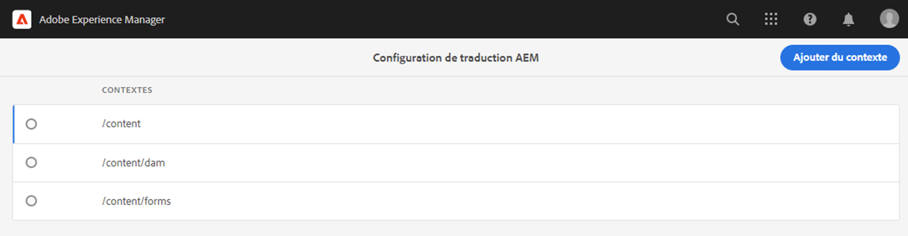
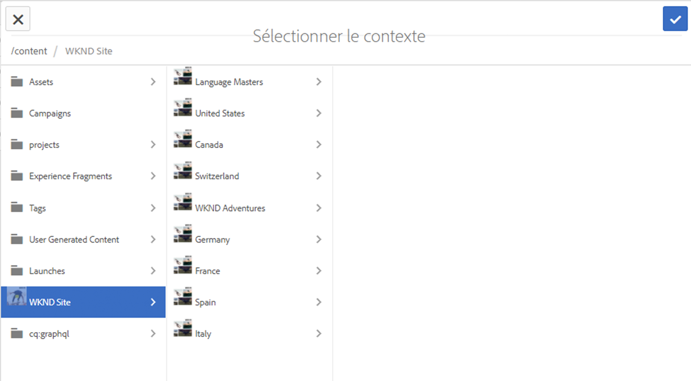
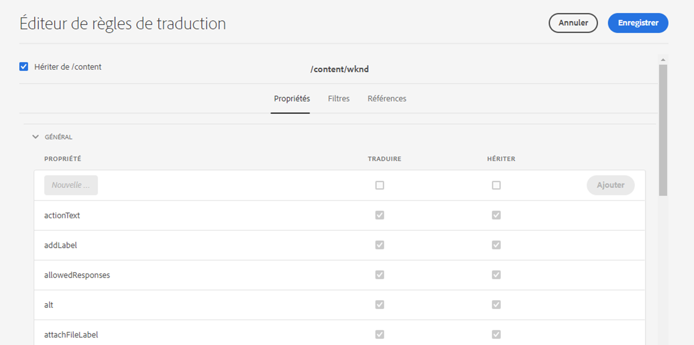
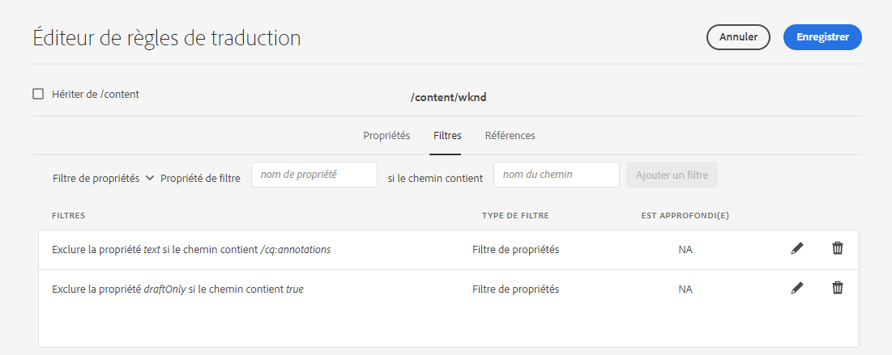
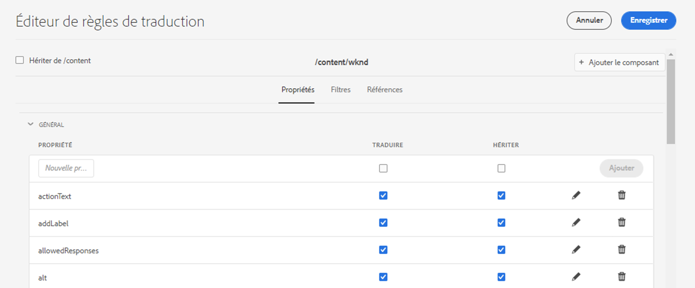

# Identification du contenu à traduire {#identifying-content-to-translate}

Les règles de traduction identifient le contenu à traduire pour les pages, les composants et les ressources incluses ou exclues dans les projets de traduction. Lorsqu’une page ou une ressource est en cours de traduction, AEM extrait ce contenu afin qu’il puisse être envoyé au service de traduction.

>[!TIP]
>
>Si vous êtes un débutant dans la traduction de contenu, reportez-vous à la section [Parcours de traduction de sites](/help/journey-sites/translation/overview.md), qui vous guide sur le chemin de la traduction de votre contenu AEM Sites à l’aide d’AEM de puissants outils de traduction, idéaux pour ceux qui ne disposent pas d’une expérience concernant AEM ou la traduction.

## Fragments de contenu et règles de traduction {#content-fragments}

Les règles de traduction décrites dans ce document s’appliquent aux fragments de contenu uniquement si l’option **Activer les champs de modèle de contenu pour la traduction** n’a pas été activée au niveau de la configuration de la structure d’intégration de traduction [traduction](integration-framework.md#assets-configuration-properties).

Si l’option **Activer les champs de modèle de contenu pour la traduction** est active, AEM utilisera le champ **Traduisible** dans les [Modèles de fragment de contenu](/help/sites-cloud/administering/content-fragments/content-fragment-models.md#properties) pour déterminer si le champ doit être traduit et crée automatiquement des règles de traduction en conséquence. Cette option remplace les règles de traduction que vous avez peut-être créées et ne nécessite aucune intervention ni aucune étape supplémentaire.

Si vous souhaitez utiliser des règles de traduction pour traduire vos fragments de contenu, l’option **Activer les champs de modèle de contenu pour la traduction** dans la configuration de la structure d’intégration de traduction doit être désactivée et vous devez suivre les étapes décrites ci-dessous pour créer vos règles.

## Vue d’ensemble {#overview}

Les pages et les ressources sont représentées sous forme de nœuds dans le référentiel JCR. Le contenu qui est extrait est constitué d’une ou plusieurs valeurs de propriété des nœuds. Les règles de traduction identifient les propriétés qui contiennent le contenu à extraire.

Elles sont exprimées au format XML et stockées dans l’un des emplacements suivants :

* `/libs/settings/translation/rules/translation_rules.xml`
* `/apps/settings/translation/rules/translation_rules.xml`
* `/conf/global/settings/translation/rules/translation_rules.xml`

Le fichier s’applique à tous les projets de traduction.

Les règles comprennent les informations suivantes :

* Le chemin d’accès au nœud auquel la règle s’applique
   * La règle s’applique également aux descendants du nœud.
* Les noms des propriétés de nœud contenant le contenu à traduire
   * Cette propriété peut être spécifique à un type de ressource en particulier ou à tous les types de ressource.

Par exemple, vous pouvez créer une règle traduisant le contenu que les auteurs ajoutent à tous les composants de texte sur vos pages. La règle peut identifier le nœud `/content` et la propriété `text` du composant `core/wcm/components/text/v2/text`.

Une [console](#translation-rules-ui) a été ajoutée pour configurer les règles de traduction. Les définitions de l’interface utilisateur renseignent le fichier pour vous.

Pour une présentation des fonctions de traduction de contenu d’AEM, voir [Traduction de contenu pour les sites multilingues](overview.md).

>[!NOTE]
>
>AEM prend en charge le mappage direct entre les types de ressources et les attributs de référence pour la traduction du contenu référencé sur une page.

## Syntaxe de règle pour les pages, les composants et les ressources {#rule-syntax-for-pages-components-and-assets}

Une règle est un élément `node` ayant un ou plusieurs éléments `property` enfants et zéro ou plusieurs éléments `node` enfants :

```xml
<node path="content path">
          <property name="property name" [translate="false"]/>
          <node resourceType="component path" >
               <property name="property name" [translate="false"]/>
          </node>
</node>
```

Chacun de ces éléments `node` présente les caractéristiques suivantes :

* L’attribut `path` contient le chemin d’accès au nœud racine de la branche à laquelle les règles s’appliquent.
* Les éléments `property` enfants identifient les propriétés de nœud à traduire pour tous les types de ressources :
   * L’attribut `name` contient le nom de la propriété.
   * L’attribut `translate` facultatif est égal à `false` si la propriété n’est pas traduite. Par défaut, la valeur est `true`. Cet attribut est utile pour remplacer les règles précédentes.
* Les éléments `node` enfants identifient les propriétés de nœud à traduire pour certains types de ressources :
   * L’attribut `resourceType` contient le chemin d’accès qui correspond au composant implémentant le type de ressource.
   * Les éléments `property` enfants identifient la propriété node à traduire. Utilisez ce nœud de la même manière que les éléments `property` enfants pour les règles de nœud.

La règle d’exemple suivante entraîne la traduction du contenu de toutes les propriétés `text` pour toutes les pages figurant sous le nœud `/content`. La règle est efficace pour tout composant qui stocke du contenu dans une propriété `text`, comme le composant de texte.

```xml
<node path="/content">
          <property name="text"/>
</node>
```

L’exemple suivant traduit le contenu de toutes les propriétés `text` et traduit également d’autres propriétés du composant d’image. Si d’autres composants présentent des propriétés du même nom, la règle ne s’applique pas à eux.

```xml
<node path="/content">
      <property name="text"/>
      <node resourceType="core/wcm/components/image/v2/image">
         <property name="image/alt"/>
         <property name="image/jcr:description"/>
         <property name="image/jcr:title"/>
      </node>
</node>
```

## Syntaxe de règle pour extraire des ressources à partir de pages  {#rule-syntax-for-extracting-assets-from-pages}

Utilisez la syntaxe de règle suivante pour inclure les ressources qui sont incorporées dans des composants ou référencées à partir de composants :

```xml
<assetNode resourceType="path to component" assetReferenceAttribute="property that stores asset"/>
```

Chaque élément `assetNode` présente les caractéristiques suivantes :

* Un attribut `resourceType` qui est égal au chemin d’accès correspondant au composant
* Un attribut `assetReferenceAttribute` qui est égal au nom de la propriété stockant le fichier binaire de ressource (pour les ressources incorporées) ou le chemin d’accès à la ressource référencée

L’exemple suivant extrait les images à partir du composant d’image :

```xml
<assetNode resourceType="core/wcm/components/image/v2/image" assetReferenceAttribute="fileReference"/>
```

## Règles de remplacement {#overriding-rules}

Le fichier `translation_rules.xml` est constitué d’un élément `nodelist` ayant plusieurs éléments `node` enfants. AEM lit la liste des nœuds de haut en bas. Lorsque plusieurs règles ciblent le même nœud, la règle inférieure dans le fichier est utilisée. Par exemple, les règles suivantes entraînent la traduction de tout le contenu des propriétés `text`, à l’exception de la branche `/content/mysite/en` de pages :

```xml
<nodelist>
     <node path="/content">
           <property name="text" />
     </node>
     <node path="/content/mysite/en">
          <property name="text" translate="false" />
     </node>
<nodelist>
```

## Filtrage de propriétés {#filtering-properties}

Vous pouvez filtrer les nœuds ayant une propriété spécifique à l’aide d’un élément `filter`.

Par exemple, les règles suivantes entraînent la traduction de tout le contenu des propriétés `text`, à l’exception des nœuds dont la propriété `draft` est définie sur `true`.

```xml
<nodelist>
    <node path="/content">
     <filter>
   <node containsProperty="draft" propertyValue="true" />
     </filter>
        <property name="text" />
    </node>
<nodelist>
```

## Interface utilisateur des règles de traduction {#translation-rules-ui}

Une console est également disponible pour configurer les règles de traduction.

Pour y accéder, procédez comme suit :

1. Accédez à **Outils**, puis **Général**.

1. Sélectionnez **Configuration de traduction**.

Dans l’interface utilisateur des règles de traduction, vous pouvez effectuer les opérations suivantes :

1. **Ajouter du contexte**, ce qui permet d’ajouter un chemin d’accès.

   

1. Utilisez l’explorateur de chemins d’accès pour sélectionner le contexte requis et cliquez sur le bouton **Confirmer** pour enregistrer.

   

1. Vous devez ensuite sélectionner votre contexte et cliquer sur **Modifier**. Cette action ouvre l’éditeur de règles de traduction.

   

Vous pouvez modifier quatre attributs via l’interface utilisateur :

* `isDeep`
* `inherit`
* `translate`
* `updateDestinationLanguage`

### isDeep {#isdeep}

**`isDeep`** s’applique sur les filtres de nœud et a la valeur true par défaut. Il vérifie si le nœud (ou ses ancêtres) contient cette propriété avec la valeur de propriété spécifiée dans le filtre. Si la valeur est false, il vérifie uniquement le nœud actif.

Par exemple, les nœuds enfants sont ajoutés à une tâche de traduction même lorsque la propriété `draftOnly` du nœud parent est définie sur true pour marquer le contenu comme étant un brouillon. `isDeep` entre ici en jeu et vérifie si les nœuds parents disposent de la propriété `draftOnly` définie sur true et exclut ces nœuds enfants.

Dans l’éditeur, vous pouvez cocher/désélectionner **ls Deep** dans l’onglet **Filtres**.



Voici un exemple du fichier XML obtenu lorsque l’option **Is Deep** n’est pas cochée dans l’interface utilisateur :

```xml
 <filter>
    <node containsProperty="draftOnly" isDeep="false" propertyValue="true"/>
</filter>
```

### inherit {#inherit}

**`inherit`** est applicable aux propriétés. Par défaut, chaque propriété est héritée, mais si vous souhaitez qu’une propriété ne soit pas héritée par l’enfant, vous pouvez marquer cette propriété comme étant égale à « false » pour qu’elle soit appliquée uniquement à ce nœud spécifique.

Dans l’interface utilisateur, vous pouvez cocher/décocher **Hériter** dans l’onglet **Propriétés**.

### translate {#translate}

**`translate`** sert simplement à indiquer si une propriété doit être traduite ou non.

Dans l’interface utilisateur, vous pouvez cocher/décocher **Traduire** dans l’onglet **Propriétés**.

### updateDestinationLanguage {#updatedestinationlanguage}

**`updateDestinationLanguage`** est utilisé pour les propriétés qui n’ont pas de texte, mais comportent des codes de langue, par exemple `jcr:language`. L’utilisateur ne traduit pas le texte, mais le paramètre régional de langue de la source vers la cible. Ces propriétés ne sont pas envoyées pour traduction.

Dans l’interface utilisateur, vous pouvez cocher/décocher **Traduire** dans l’onglet **Propriétés** pour modifier cette valeur, mais pour les propriétés spécifiques ayant comme valeur des codes de langue.

Pour aider à clarifier la différence entre `updateDestinationLanguage` et `translate`, voici l’exemple simple d’un contexte ne comportant que deux règles :



Le résultat dans le fichier xml ressemble à ce qui suit :

```xml
<property inherit="true" name="text" translate="true" updateDestinationLanguage="false"/>
<property inherit="true" name="jcr:language" translate="false" updateDestinationLanguage="true"/>
```

## Modification manuelle du fichier de règles {#editing-the-rules-file-manually}

Le fichier `translation_rules.xml` qui est installé avec AEM contient un ensemble par défaut de règles de traduction. Vous pouvez modifier le fichier pour prendre en charge les exigences de vos projets de traduction. Par exemple, vous pouvez ajouter des règles afin que le contenu de vos composants personnalisés soit traduit.

Si vous modifiez le fichier `translation_rules.xml`, conservez une copie de sauvegarde dans un package de contenu. La réinstallation de certains packages AEM peut remplacer le fichier `translation_rules.xml` actuel par le fichier d’origine. Pour restaurer vos règles dans ce cas, vous pouvez installer le package contenant votre copie de sauvegarde.

>[!NOTE]
>
>Après avoir créé le package de contenu, recréez-le chaque fois que vous modifiez le fichier.

## Exemple de fichier de règles de traduction {#example-translation-rules-file}

```xml
<?xml version="1.0" encoding="UTF-8"?><nodelist>
  <node path="/content">
    <property name="addLabel"/>
    <property name="allowedResponses"/>
    <property name="alt"/>
    <property name="attachFileLabel"/>
    <property name="benefits"/>
    <property name="buttonLabel"/>
    <property name="chartAlt"/>
    <property name="confirmationMessageToggle"/>
    <property name="confirmationMessageUntoggle"/>
    <property name="constraintMessage"/>
    <property name="contentLabel"/>
    <property name="denyText"/>
    <property name="detailDescription"/>
    <property name="emptyText"/>
    <property name="helpMessage"/>
    <property name="image/alt"/>
    <property name="image/jcr:description"/>
    <property name="image/jcr:title"/>
    <property name="jcr:description"/>
    <property name="jcr:title"/>
    <property name="heading"/>
    <property name="label"/>
    <property name="main"/>
    <property name="listLabel"/>
    <property name="moreText"/>
    <property name="pageTitle"/>
    <property name="placeholder"/>
    <property name="requiredMessage"/>
    <property name="resetTitle"/>
    <property name="subjectLabel"/>
    <property name="subtitle"/>
    <property name="tableData"/>
    <property name="text"/>
    <property name="title"/>
    <property name="navTitle"/>
    <property name="titleDivContent"/>
    <property name="toggleLabel"/>
    <property name="transitionLabel"/>
    <property name="untoggleLabel"/>
    <property name="name"/>
    <property name="occupations"/>
    <property name="greetingLabel"/>
    <property name="signInLabel"/>
    <property name="signOutLabel"/>
    <property name="pretitle"/>
    <property name="cq:panelTitle"/>
    <property name="actionText"/>
    <property name="cq:language" updateDestinationLanguage="true"/>
    <node pathContains="/cq:annotations">
      <property name="text" translate="false"/>
    </node>
    <node path="/content/wknd"/>
  </node>
  <node path="/content/forms">
    <property name="text" translate="false"/>
  </node>
  <node path="/content/dam">
    <property name="dc:description"/>
    <property name="dc:rights"/>
    <property name="dc:subject"/>
    <property name="dc:title"/>
    <property name="defaultContent"/>
    <property name="jcr:description"/>
    <property name="jcr:title"/>
    <property name="pdf:Title"/>
    <property name="xmpRights:UsageTerms"/>
    <property name="main"/>
    <property name="adventureActivity"/>
    <property name="adventureDescription"/>
    <property name="adventureDifficulty"/>
    <property name="adventureGearList"/>
    <property name="adventureGroupSize"/>
    <property name="adventureItinerary"/>
    <property name="adventurePrice"/>
    <property name="adventureTitle"/>
    <property name="adventureTripLength"/>
    <property name="adventureType"/>
    <node pathContains="/jcr:content/metadata/predictedTags">
      <property name="name"/>
    </node>
  </node>
  <assetNode assetReferenceAttribute="fragmentPath" resourceType="cq/experience-fragments/editor/components/experiencefragment"/>
  <assetNode assetReferenceAttribute="fragmentVariationPath" resourceType="core/wcm/components/experiencefragment/v1/experiencefragment"/>
  <assetNode assetReferenceAttribute="fileReference" resourceType="dam/cfm/components/contentfragment"/>
  <assetNode resourceType="docs/components/download"/>
  <assetNode resourceType="docs/components/image"/>
  <assetNode assetReferenceAttribute="fileReference" resourceType="foundation/components/image"/>
  <assetNode assetReferenceAttribute="asset" resourceType="foundation/components/video"/>
  <assetNode assetReferenceAttribute="fileReference" resourceType="foundation/components/download"/>
  <assetNode assetReferenceAttribute="fileReference" resourceType="core/wcm/components/download/v1/download"/>
  <assetNode assetReferenceAttribute="fileReference" resourceType="wcm/foundation/components/image"/>
  <assetNode assetReferenceAttribute="fragmentPath" resourceType="core/wcm/components/contentfragment/v1/contentfragment"/>
  <assetNode assetReferenceAttribute="fileReference" resourceType="core/wcm/components/image/v2/image"/>
</nodelist>
```
