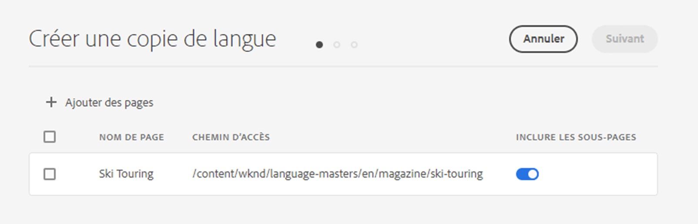
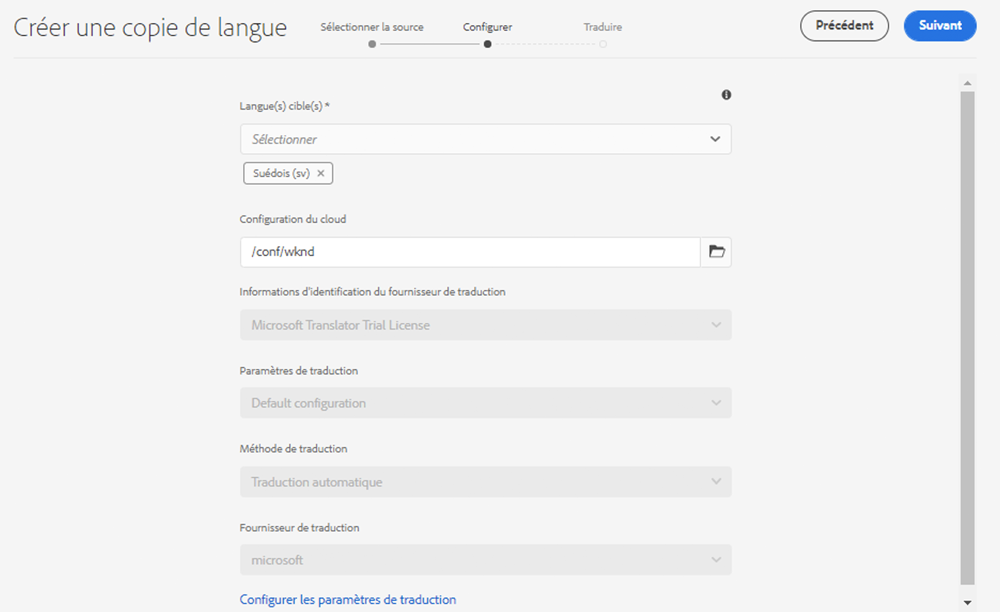
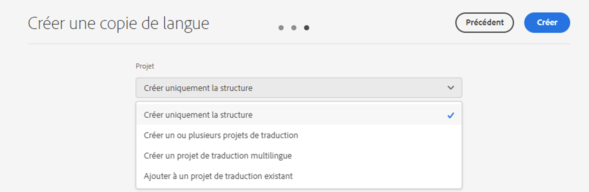
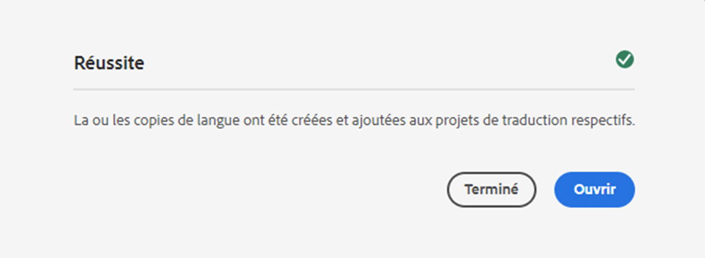

# Assistant Copie de la langue {#language-copy-wizard}

L’assistant Copie de la langue est une expérience guidée pour créer et gérer la structure du contenu multilingue. L’assistant facilite et accélère la création d’une copie de langue.

>[!TIP]
>
>Si vous débutez dans la traduction de contenu, référez-vous à notre [Parcours de traduction Sites,](/help/journey-sites/translation/overview.md) qui vous guide sur le chemin de la traduction de votre contenu AEM Sites à l’aide des puissants outils de traduction d’AEM, idéaux pour celles et ceux qui ne disposent pas d’une expérience concernant AEM ou la traduction.

>[!NOTE]
>
>L’utilisateur doit être membre du `project-administrators` pour créer une copie de langue d’un site.

Pour accéder à cet assistant :

1. Dans la console Sites, sélectionnez une page, puis **Créer** et sélectionnez **Copie de la langue**.

   

1. L’assistant s’ouvre sur la **Sélectionner la source** pour ajouter ou supprimer des pages. Vous avez également la possibilité d’inclure ou d’exclure les sous-pages. Sélectionnez les pages à inclure et sélectionnez **Suivant**.

   

1. La variable **Configurer** de l&#39;assistant, vous pouvez ajouter/supprimer des langues et sélectionner une méthode de traduction. Sélectionnez **Suivant**.

   

   >[!NOTE]
   >
   >Par défaut, il n’y a qu’un seul paramètre de traduction. Pour pouvoir sélectionner d’autres paramètres, vous devez d’abord configurer les configurations cloud. Voir [Configuration de la structure d’intégration de traduction](integration-framework.md).

1. Dans le **Traduire** de l’assistant, vous pouvez choisir entre la création de la structure uniquement, la création d’un projet de traduction ou l’ajout à un projet de traduction existant.

   >[!NOTE]
   >
   >Si vous avez sélectionné plusieurs langues à l’étape précédente, plusieurs projets de traduction sont créés.

   

1. Le bouton **Créer** ferme l’assistant. Sélectionner **Terminé** pour fermer l’assistant ou **Ouvrir** pour afficher le projet de traduction résultant.

   
