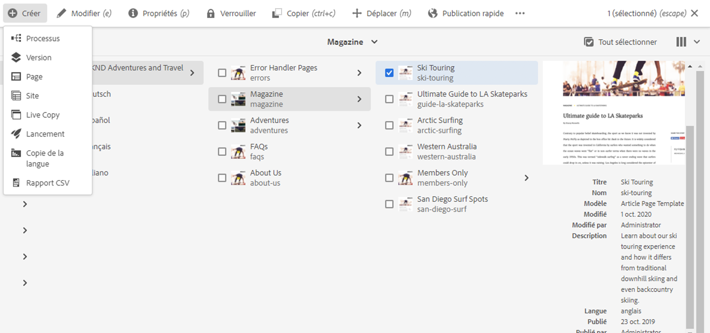
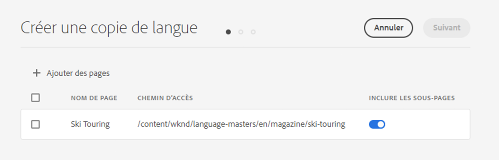
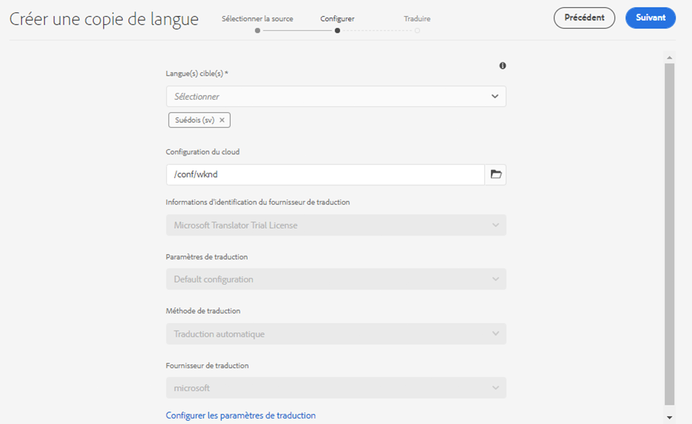
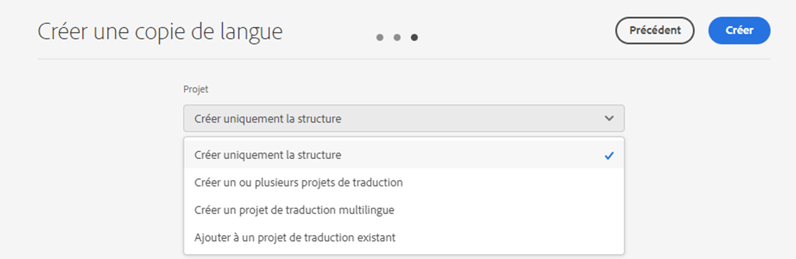
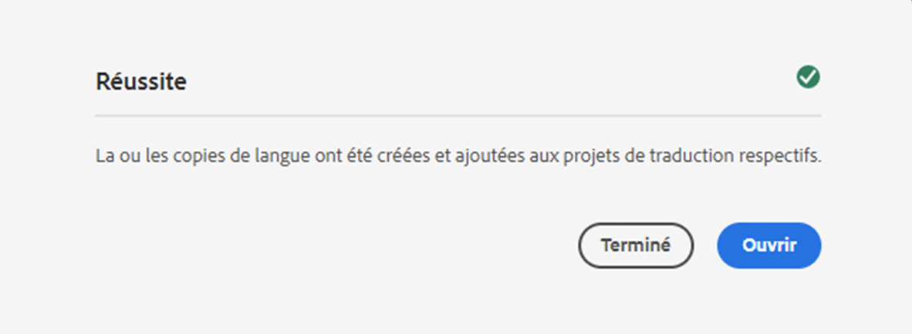

# Assistant Copie linguistique {#language-copy-wizard}

L’assistant Copie linguistique est une expérience guidée pour créer et gérer la structure du contenu multilingue. L’assistant facilite et accélère la création d’une copie linguistique.

>[!TIP]
>
>Si vous êtes un débutant dans la traduction de contenu, consultez [Parcours de traduction de sites](/help/journey-sites/translation/overview.md), qui vous guide sur le chemin de la traduction de votre contenu AEM Sites à l’aide d’outils de traduction puissants d’AEM, idéaux pour ceux qui ne disposent pas d’une expérience concernant AEM ou la traduction.

>[!NOTE]
>
>L’utilisateur doit être membre du groupe `project-administrators` pour créer une copie de langue d’un site.

Pour accéder à cet assistant :

1. Dans la console Sites, sélectionnez une page, puis sélectionnez **Créer** et **Copier la langue**.

   

1. L’assistant s’ouvre à l’étape **Sélectionner le Source** qui vous permet d’ajouter ou de supprimer des pages. Vous avez également la possibilité d’inclure ou d’exclure les sous-pages. Sélectionnez les pages à inclure et sélectionnez **Suivant**.

   

1. L’étape **Configurer** de l’assistant vous permet d’ajouter ou de supprimer des langues et de sélectionner la méthode de traduction. Sélectionnez **Suivant**.

   

   >[!NOTE]
   >
   >Par défaut, il n’y a qu’un seul paramètre de traduction. Pour pouvoir sélectionner d’autres paramètres, vous devez d’abord configurer les configurations cloud. Voir [Configuration de la structure d’intégration de traduction](integration-framework.md).

1. À l’étape **Traduire** de l’assistant, vous pouvez choisir entre créer uniquement la structure, créer un projet de traduction ou ajouter la structure à un projet de traduction existant.

   >[!NOTE]
   >
   >Si vous avez sélectionné plusieurs langues à l’étape précédente, plusieurs projets de traduction sont créés.

   

1. Le bouton **Créer** ferme l’assistant. Sélectionnez **Terminé** pour fermer l’assistant ou **Ouvrir** pour afficher le résultat du projet de traduction.

   
