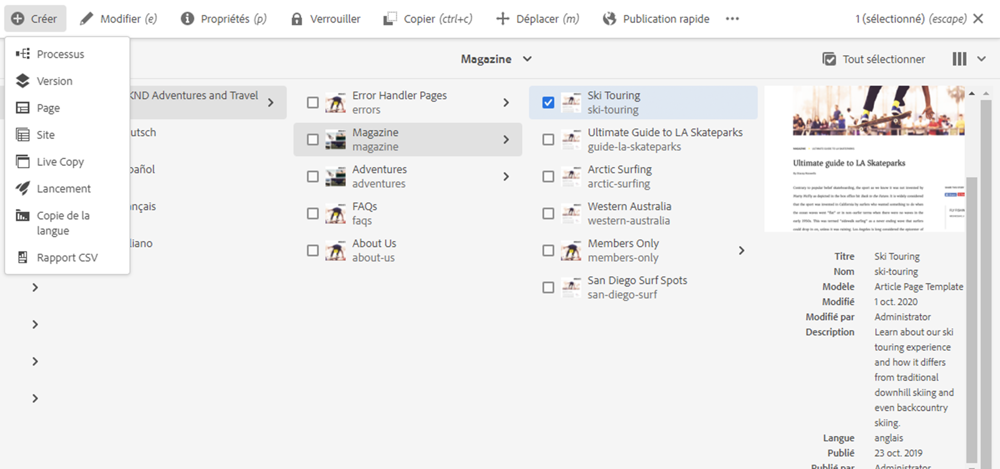

# Assistant Copie de la langue {#language-copy-wizard}

L’Assistant Copie de langue est une expérience guidée permettant de créer et d’instrumenter une structure de contenu multilingue. L’assistant facilite et accélère la création d’une copie de langue.

>[!NOTE]
>
>L&#39;utilisateur doit être membre du groupe `project-administrators` pour créer une copie de langue d&#39;un site.

Pour accéder à l’assistant :

1. Dans la console sites, sélectionnez une page et appuyez ou cliquez sur **Créer** et sélectionnez **Copie de langue**.

   

1. L&#39;Assistant s&#39;ouvre à l&#39;étape **Sélectionner la source** qui vous permet d&#39;ajouter ou de supprimer des pages. Vous avez également la possibilité d’inclure ou d’exclure les sous-pages. Sélectionnez les pages à inclure et appuyez ou cliquez sur **Suivant**.

   

1. L&#39;étape **Configurer** de l&#39;Assistant vous permet d&#39;ajouter/supprimer des langues et de sélectionner la méthode de traduction. Cliquez ou appuyez sur **Suivant**.

   

   >[!NOTE]
   >
   >Par défaut, il n’y a qu’un seul paramètre de traduction. Pour pouvoir sélectionner d’autres paramètres, vous devez d’abord configurer les configurations cloud. Voir [Configuration de la structure d’intégration de traduction](integration-framework.md).

1. À l&#39;étape **Traduire** de l&#39;assistant, vous pouvez choisir entre la création de la structure uniquement, la création d&#39;un nouveau projet de traduction ou l&#39;ajout à un projet de traduction existant.

   >[!NOTE]
   >
   >Si vous avez sélectionné plusieurs langues à l’étape précédente, plusieurs projets de traduction seront créés.

   

1. Le bouton **Créer** ferme l’assistant. Appuyez ou cliquez sur **Terminé** pour fermer l&#39;Assistant ou **Ouvrir** pour vue au projet de traduction résultant.

   
