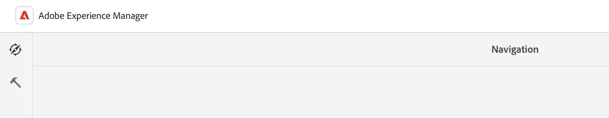

# Manipulation de base {#basic-handling}

Ce document offre un aperçu des opérations de gestion de base lors de l’utilisation de l’environnement de création AEM.

>[!TIP]
>
>Plusieurs raccourcis clavier sont disponibles dans AEM. En particulier lorsque [utilisation de la console sites](/help/sites-cloud/authoring/sites-console/keyboard-shortcuts.md) et [l’éditeur de page](/help/sites-cloud/authoring/page-editor/keyboard-shortcuts.md).

{{edge-delivery-authoring}}

## Interface utilisateur pour écrans tactiles {#a-touch-enabled-ui}

L’interface utilisateur d’AEM est adaptée aux écrans tactiles. Une interface tactile vous permet d’interagir avec le logiciel en appuyant ou en appuyant longuement, par exemple en appuyant sur le logiciel. L’interface utilisateur d’AEM étant tactile, vous pouvez utiliser les mouvements des doigts sur vos appareils tactiles, tels que votre téléphone mobile ou votre tablette. Cependant, les actions de la souris sur un poste de travail traditionnel sont également disponibles, ce qui vous offre davantage de flexibilité pour créer votre contenu.

## Premiers pas {#first-steps}

Une fois connecté, vous accédez au [panneau de navigation](#navigation-panel). Sélectionnez l’une des options pour ouvrir la console correspondante.

La console **Sites** est utilisée dans ce document pour garantir une bonne compréhension de l’utilisation de base d’AEM. Sélectionner sur **Sites** pour commencer.

## Navigation dans le produit {#product-navigation}

Lorsqu’une personne utilisatrice accède à une console pour la première fois, un tutoriel sur la navigation dans le produit en question s’affiche. Prenez quelques instants pour obtenir un bon aperçu de la gestion de base des AEM.

Sélectionner **Suivant** pour accéder à la page suivante de la présentation. Sélectionner **Fermer** ou sélectionnez en dehors de la boîte de dialogue de présentation à fermer.

Si vous ne désactivez pas l’option **Ne plus afficher ce message**, l’aperçu redémarrera la prochaine fois que vous accéderez à la console.

## Navigation globale {#global-navigation}

Pour passer d’une console à une autre, utilisez le panneau de navigation globale. Cela se déclenche sous la forme d’une liste déroulante plein écran lorsque vous sélectionnez la variable **Adobe Experience Manager** lien dans le coin supérieur gauche de l’écran.

Vous pouvez fermer le panneau de navigation globale en cliquant ou en appuyant sur **Fermer** pour revenir à votre position précédente.

La navigation globale se compose de deux panneaux, représentés par des icônes dans la marge gauche de l’écran :

* **[Navigation](#navigation-panel)** - Représenté par une boussole et le panneau par défaut lorsque vous vous connectez à AEM
* **[Outils](#tools-panel)** : représenté par un marteau

Consultez les options disponibles dans ces panneaux ci-dessous.

### Panneau de navigation {#navigation-panel}

La variable **Navigation** panel :

Le titre de l’onglet du navigateur est mis à jour pour refléter votre emplacement lorsque vous naviguez dans les consoles et le contenu.

Les consoles suivantes sont disponibles à partir du panneau de navigation :

| Console | Objectif |
|---|---|
| Projets | La console Projets vous donne un accès direct à vos projets. [Les projets sont des tableaux de bord virtuels](/help/sites-cloud/authoring/projects/overview.md) qui peuvent être utilisés pour créer une équipe. Vous pouvez ensuite donner à cette équipe un accès aux ressources, aux workflows et aux tâches, ce qui permet aux utilisateurs de travailler vers un objectif commun. |
| Sites | [La console Sites](/help/sites-cloud/authoring/sites-console/introduction.md) vous permet de créer, d’afficher et de gérer des sites exécutés sur votre instance AEM. Grâce à ces consoles, vous pouvez créer, modifier, copier, déplacer et supprimer des pages, démarrer des workflows et publier des pages. |
| Fragments d’expérience | Un [fragment d’expérience](/help/sites-cloud/authoring/fragments/content-fragments.md) est une expérience autonome qui peut être réutilisée sur l’ensemble des canaux et qui présente des variations, ce qui vous évite de devoir copier et coller à plusieurs reprises des expériences ou des parties d’expériences. |
| Assets | La console Ressources vous permet d’importer et de gérer des [ressources numériques telles que des images, des vidéos, des documents et des fichiers audio](/help/assets/overview.md). Ces ressources peuvent ensuite être utilisées par n’importe quel site s’exécutant sur la même instance AEM. Vous pouvez également créer et gérer des [fragments de contenu](/help/assets/content-fragments/content-fragments.md) à partir de la console Ressources. |
| Personnalisation  | Cette console propose un ensemble d’outils de [création de contenu ciblé et de présentation d’expériences personnalisées](/help/sites-cloud/authoring/personalization/overview.md). |
| Fragments de contenu | Les [Fragments de contenu](/help/sites-cloud/administering/content-fragments/overview.md) vous permettent de concevoir, créer, organiser et publier du contenu indépendant des pages. Ils vous permettent de préparer du contenu structuré prêt à être utilisé à plusieurs emplacements/sur plusieurs canaux, idéal pour la création de pages et la diffusion headless. |
| Générer des variations | [Générer des variations](/help/generative-ai/generate-variations.md) utilise l’intelligence artificielle (IA) générative pour créer des variations de contenu basées sur des invites ; ces invites sont fournies par Adobe ou créées et gérées par les utilisateurs. |

## Panneau Outils {#tools-panel}

La variable **Outils** Le panneau comporte un panneau latéral contenant un éventail de catégories, qui regroupe des consoles similaires. La variable **Outils** les consoles permettent d’accéder à plusieurs outils et consoles spécialisés pour la gestion des sites web, des ressources numériques et d’autres aspects du référentiel de contenu.

## En-tête {#the-header}

L’en-tête est toujours présent en haut de l’écran. Bien que la plupart des options de l’en-tête restent les mêmes, quel que soit l’endroit où vous vous trouvez dans le système, certaines dépendent du contexte.

* [Navigation globale](#global-navigation) - Sélectionnez la variable **Adobe Experience Manager** pour naviguer entre les consoles.

  

* Commentaires

  

* Votre organisation IMS : sélectionnez cette option si nécessaire.

* [Solutions](https://www.adobe.com/fr/experience-cloud.html) - Sélectionnez cette option pour accéder à vos autres solutions Adobe.

  

* [Rechercher](/help/sites-cloud/authoring/search.md) - Vous pouvez également utiliser la variable [raccourci clavier](/help/sites-cloud/authoring/sites-console/keyboard-shortcuts.md) `/` (barre oblique) pour appeler la recherche depuis n’importe quelle console.

  

* [Aide](#accessing-help)

  

* [Notifications](/help/sites-cloud/authoring/inbox.md) - Cette icône comporte un badge indiquant le nombre de notifications incomplètes actuellement attribuées.

  

* [Propriétés de l’utilisateur](/help/sites-cloud/authoring/account-environment.md) - Sélectionnez cette option pour modifier vos paramètres utilisateur.

  

## Accès à l’Aide {#accessing-help}

Plusieurs ressources d’aide sont disponibles et vous pouvez y accéder de différentes manières.

* **Barre d’outils** - Selon votre emplacement, la variable **Aide** ouvre les ressources appropriées :

  

* **Console** - La première fois que vous naviguez sur le système, [une série de diapositives présentant AEM navigation](#product-navigation).

  

* **Éditeur de page** - La première fois que vous modifiez une page, une série de diapositives présente l’éditeur de page.

  

   * Parcourez cet aperçu comme vous le feriez avec l’[aperçu de navigation du produit](#product-navigation) la première fois que vous accédez à une console.
   * Dans le menu [**Informations sur la page**, sélectionnez l’option **Aide**](#accessing-help) pour afficher de nouveau cette présentation à tout moment.

* **Console Outils** - De la **Outils** vous pouvez également accéder à la console externe. **Ressources**:

   * **Documentation** : affichez la documentation de Web Experience Management.
   * **Ressources pour les développeurs** : ressources et téléchargements pour les développeurs.

>[!TIP]
>
>Vous pouvez accéder à un aperçu des raccourcis clavier disponibles à tout moment à l’aide de la touche `?` (point d’interrogation) lorsque vous vous trouvez dans une console.
>
>Pour une présentation de tous les raccourcis clavier, reportez-vous à la documentation suivante :
>
>* [Raccourcis clavier lors de la modification de pages](/help/sites-cloud/authoring/page-editor/keyboard-shortcuts.md)
>* [Raccourcis clavier pour les consoles](/help/sites-cloud/authoring/sites-console/keyboard-shortcuts.md)
