# Création de newsletters Campaign avec AEM {#creating-newsletters}

Dans ce document, vous apprendrez à utiliser AEM as a Cloud Service pour créer des newsletters qui peuvent être envoyées avec Adobe Campaign Classic.

En tirant parti de l’intégration entre AEM as a Cloud Service et Adobe Campaign Classic, vous pouvez créer vos newsletters à l’aide d’AEM puissants outils de création. Ensuite, lorsque vous êtes prêt à envoyer votre newsletter, vous pouvez utiliser les fonctionnalités de gestion et de distribution des destinataires de Campaign pour l&#39;envoyer.

## Conditions préalables {#prerequisites}

Avant de pouvoir créer une newsletter avec AEM et l’envoyer avec Campaign, vous devez : [intégrer Adobe Campaign Classic et AEM as a Cloud Service.](/help/sites-cloud/integrating/integrating-campaign-classic.md)

## Création de la structure de newsletter {#create-structure}

Le contenu de la newsletter est géré dans AEM comme vous le feriez pour gérer le contenu de votre site. Vous commencez par créer un &quot;site&quot; destiné à contenir votre contenu. Dans ce &quot;site&quot;, vous pouvez collecter vos newsletters par marque.

1. Connectez-vous à votre instance d’auteur AEM.

1. Sur la page de navigation principale, ouvrez le **Sites** console.

1. Dans une installation standard d’AEM, il existe une **Campagne** dossier. Sélectionnez-le et cliquez sur l’icône **Créer** puis **Page**.

   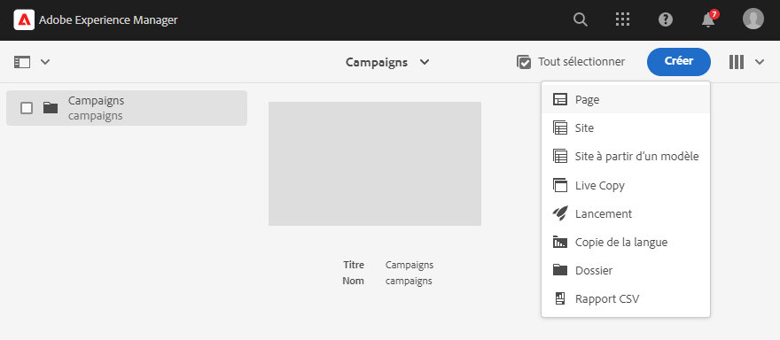

1. Sélectionner **Marque** comme modèle de site, puis cliquez sur **Suivant**.

   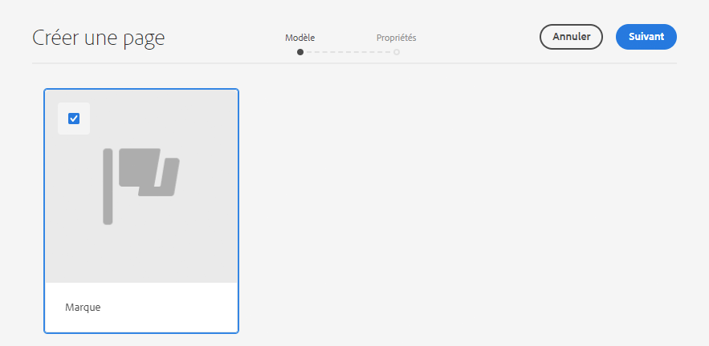

1. Saisissez un **Titre** et cliquez sur **Créer** puis **Terminé**.

   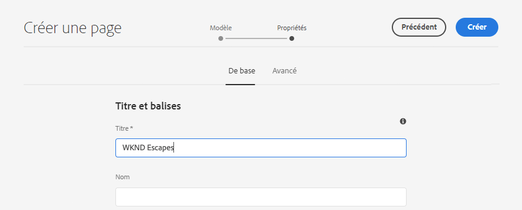

Vous disposez désormais d’une structure de contenu de base pour créer vos campagnes.

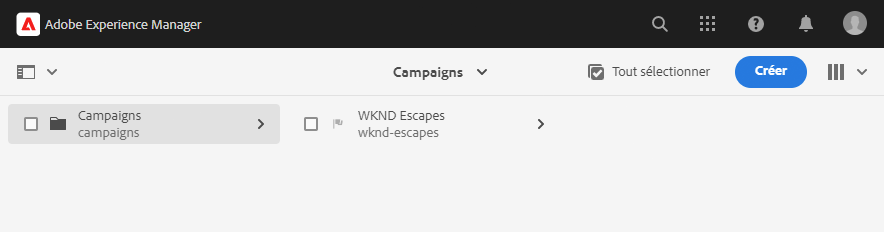

## Création d’une campagne {#create-campaign}

Maintenant que vous disposez d’une structure de contenu de base pour votre campagne, vous pouvez créer la campagne elle-même. La campagne sera utilisée pour organiser plusieurs newsletters, éventuellement.

1. Utilisation [mode colonne](/help/sites-cloud/authoring/getting-started/basic-handling.md#viewing-and-selecting-resources) dans la console sites, sélectionnez la marque que vous avez créée précédemment (dans ce cas, **Échappements WKND**), puis sélectionnez **Zone de Principal**, qui a été automatiquement créé pour vous, puis cliquez sur le bouton **Créer** puis **Page**.

   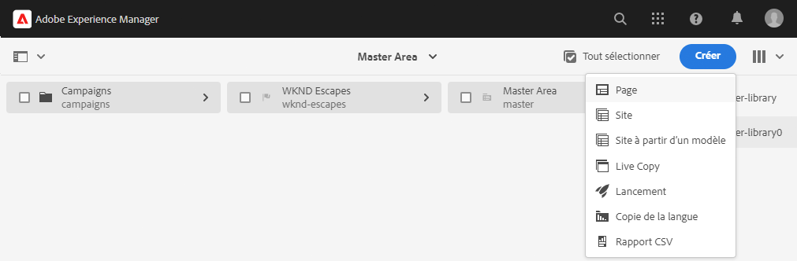

1. Sélectionner **Campagne** comme modèle, puis cliquez sur **Suivant** et **Terminé**.

   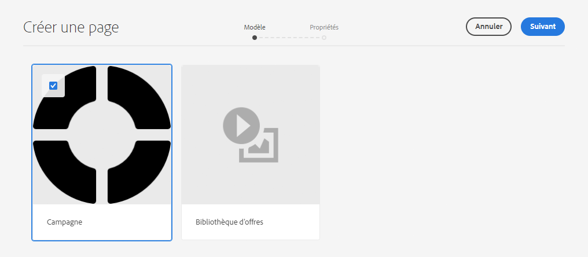

1. Saisissez un **Titre** pour la campagne, puis cliquez sur **Créer** et **Terminé**.

   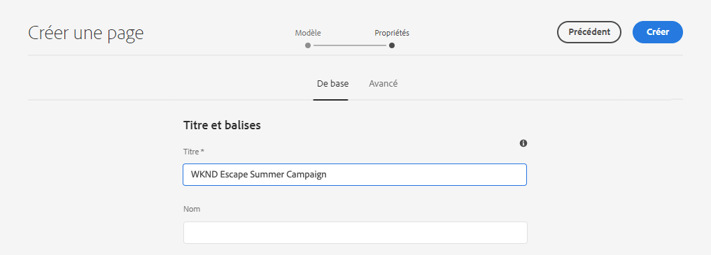

Vous disposez maintenant d’une campagne dans laquelle vous pouvez créer vos newsletters.

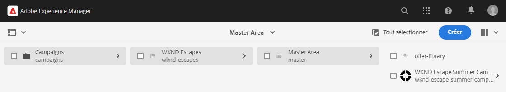

## Sélection de la configuration d&#39;une campagne {#campaign-configuration}

AEM peut prendre en charge plusieurs configurations d’intégration. Pour votre nouvelle campagne, vous devez définir les configurations à utiliser pour envoyer le contenu de votre newsletter.

1. Utilisation [mode colonne](/help/sites-cloud/authoring/getting-started/basic-handling.md#viewing-and-selecting-resources) dans la console sites , recherchez la campagne que vous avez créée précédemment (dans ce cas, **Campagne d’été d’évasion WKND**), puis sélectionnez-la à l’aide de la case à cocher, puis cliquez sur le bouton **Propriétés** sur la barre d’outils.

   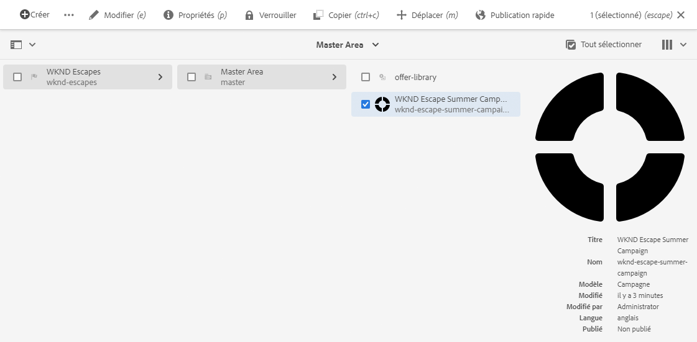

1. Dans le **Propriétés** , sélectionnez la fenêtre **Cloud Service** pour définir l&#39;intégration à utiliser avec cette opération.

   * Sélectionner **Adobe Campaign** de la **Configurations de Cloud Service** liste déroulante.
   * Sélectionnez la configuration de l’intégration Adobe Campaign souhaitée dans la **Adobe Campaign** liste déroulante.
   * Cliquez sur **Enregistrer et fermer**.

   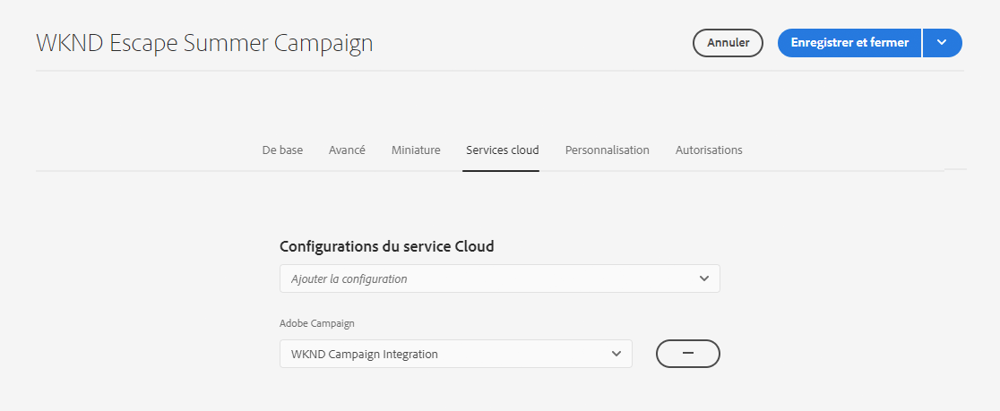

Votre campagne est maintenant liée à votre intégration Adobe Campaign. Vous êtes prêt à créer une newsletter dans AEM et à l’envoyer avec Adobe Campaign.

## Création d’une newsletter {#create-newsletter}

Vous créez et gérez vos newsletters sous la structure de contenu de campagne que vous avez déjà créée et configurée.

1. Utilisation [mode colonne](/help/sites-cloud/authoring/getting-started/basic-handling.md#viewing-and-selecting-resources) dans la console sites , recherchez la campagne que vous avez précédemment configurée (dans ce cas, **Campagne d’été d’évasion WKND**), sélectionnez-le, puis cliquez sur le bouton **Créer** puis **Page**.

   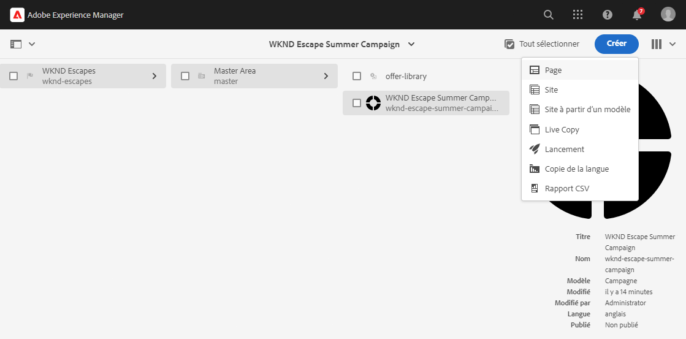

1. Dans l&#39;assistant de création de page, sélectionnez l&#39;option **Adobe Campaign Email (AC 6.1)** modèle et cliquez sur **Suivant**.

   

1. Pour le **Propriétés** de l’assistant, saisissez la **Titre** pour la newsletter, cliquez sur **Créer** et **Ouvrir**.

   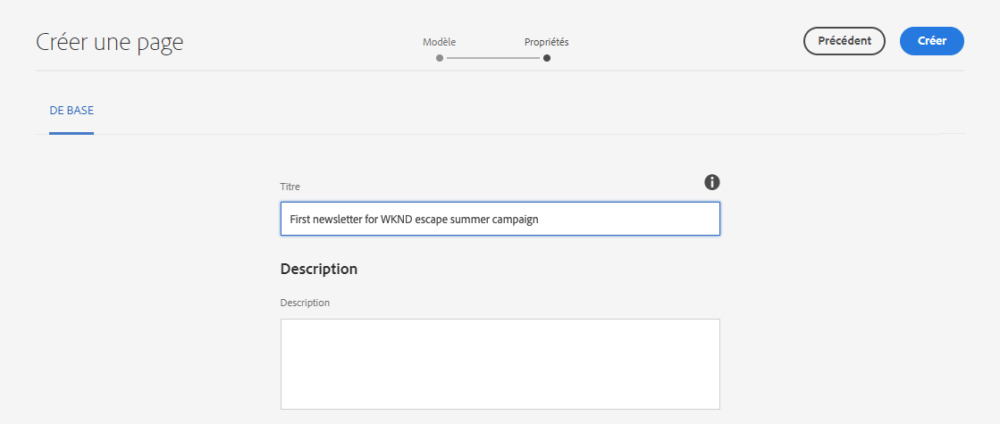

1. Modifiez la page de newsletter comme vous le feriez pour n’importe quelle autre page de contenu AEM afin de répondre à vos besoins.

Vous disposez désormais d’une newsletter prête à être envoyée avec Adobe Campaign.

## Publication de votre newsletter {#publishing-newsletter}

Vous devez publier votre newsletter pour la rendre disponible à Adobe Campaign pour l’envoi.

1. Utilisation [mode colonne](/help/sites-cloud/authoring/getting-started/basic-handling.md#viewing-and-selecting-resources) dans la console sites, recherchez la newsletter que vous avez créée précédemment (dans ce cas, **Première newsletter pour la campagne d’été WKND**), sélectionnez-le, puis cliquez sur le bouton **Informations sur la page** en haut à gauche et cliquez sur **Publier la page**.

1. Sélectionnez la ou les configurations pour lesquelles la page doit être publiée, puis cliquez sur **Publier**.

   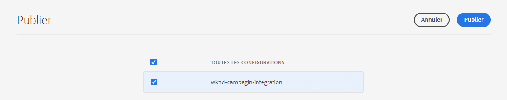

La page de newsletter est maintenant publiée sur l’instance de publication AEM et est visible dans Adobe Campaign Classic. Pour pouvoir la sélectionner dans Adobe Campaign, elle doit être approuvée.

1. Cliquez sur le bouton **Informations sur la page** pour la newsletter, cliquez une fois de plus sur **Démarrer le processus**.

1. Sélectionner **Approuver pour Adobe Campaign** en tant que modèle de processus (fournissant éventuellement une description) et cliquez sur l’icône **Démarrer le processus** bouton .

   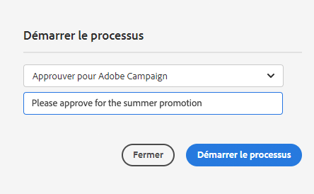

1. Une bannière s’affiche en haut de l’éditeur de page de newsletter pour indiquer les étapes suivantes du processus d’approbation. Cliquez sur **Terminer**.

   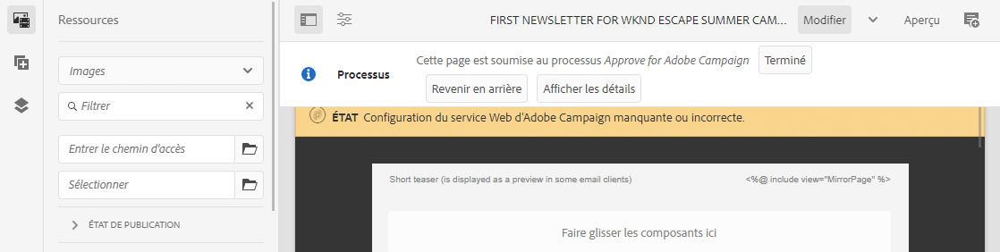

1. Dans le **Terminer l’élément de travail** boîte de dialogue, sélectionnez **Révision de newsletter (administrateur)** dans le **Étape suivante** puis cliquez sur le bouton **OK** bouton .

   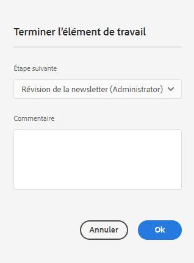

1. Dans la bannière qui s’affiche en haut de l’éditeur de page de newsletter, cliquez de nouveau sur **Terminer**.

1. Dans le **Terminer l’élément de travail** boîte de dialogue, sélectionnez **Approbation de la newsletter** dans le **Étape suivante** puis cliquez sur le bouton **OK** bouton .

   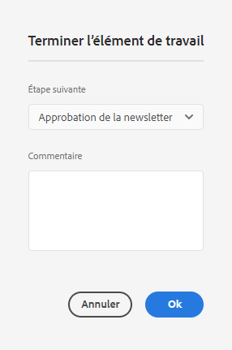

1. Lorsque la boîte de dialogue se ferme, la bannière qui s’affichait en haut de l’éditeur de page de newsletter disparaît car le processus d’approbation est terminé.

La newsletter est maintenant publiée dans AEM et approuvée pour une utilisation dans Adobe Campaign.

>[!TIP]
>
>Les étapes de workflow décrites ici sont simplifiées pour illustrer le processus. Dans un flux de travail normal, la création de la newsletter et son approbation fonctionnent normalement selon différents rôles.
>
>Voir le document [Utilisation des workflows](/help/sites-cloud/authoring/workflows/overview.md) pour plus d’informations sur l’utilisation des workflows.

## Création d’un destinataire {#creating-recipient}

Pour pouvoir envoyer la newsletter que vous avez créée dans AEM, vous devez d&#39;abord définir vos destinataires dans Adobe Campaign Classic.

1. Connectez-vous à Adobe Campaign Classic à l’aide de la console cliente.

1. Sélectionner **Outils** -> **Explorateur** dans la barre de menus.

1. Dans l’explorateur, accédez au **Profils et cibles** -> **Destinataires** noeud .

   

1. Cliquez sur **Nouveau** dans la barre d&#39;outils et indiquez les détails du destinataire.

   * Prénom
   * Nom
   * Adresse électronique

1. Cliquez sur **Enregistrer**.

Vous disposez désormais d’un destinataire auquel vous pouvez envoyer votre newsletter à l’aide de Adobe Campaign Classic.

## Création d’une diffusion email {#create-delivery}

La dernière étape consiste à envoyer la newsletter que vous avez créée dans AEM au destinataire que vous avez ajouté dans Adobe Campaign Classic.

1. Connectez-vous à Adobe Campaign Classic à l’aide de la console cliente.

1. Sélectionner **Outils** -> **Explorateur** dans la barre de menus.

1. Dans l’explorateur, accédez au **Campaign Management** -> **Diffusions** noeud et cliquez sur **Nouveau**.

   

1. Dans le **Diffusion** boîte de dialogue, sélectionnez **Diffusion Email avec AEM contenu** comme la propriété **Modèle de diffusion** dans la liste déroulante, puis cliquez sur **Continuer**.

   

1. Dans le **Paramètres de messagerie** , cliquez sur le bouton **De** et saisissez les informations de l&#39;expéditeur, puis cliquez sur **OK**.

   * Adresse expéditeur
   * À partir du champ

   

1. Dans le **Paramètres de messagerie** , cliquez sur le bouton **À** pour ouvrir le lien **Sélectionner la cible** puis cliquez sur **Ajouter**.

   

1. Dans le **Sélectionner un élément cible** boîte de dialogue, sélectionnez **Un destinataire** et cliquez sur **Suivant**.

   

1. A l&#39;aide des filtres, sélectionnez le destinataire que vous souhaitez. [créé précédemment](#creating-recipient) et cliquez sur **Terminer**.

   

1. De retour dans le **Sélectionner la cible** boîte de dialogue, cliquez sur **OK**.

1. Dans la fenêtre de diffusion, cliquez sur **Synchroniser**.

   

1. Dans le **Synchronisation avec le contenu AEM** , sélectionnez la newsletter que vous avez créée précédemment dans la liste, puis cliquez sur **OK**.

1. Le contenu d’email d’Adobe Campaign est synchronisé avec le contenu de la newsletter que vous avez créé dans AEM.

   * Cliquez sur **Actualiser le contenu** si le contenu n’est pas chargé automatiquement.

1. Cliquez sur **Envoyer** pour envoyer l’email.

1. Dans le **Envoyer à la cible de diffusion principale** boîte de dialogue, sélectionnez **Diffuser dès que possible** puis cliquez sur **Analyser**.

   

1. L&#39;étape d&#39;analyse crée la diffusion, combinant le contenu avec les destinataires. Maintenant que la diffusion a été créée, cliquez sur **Confirmer la diffusion** pour envoyer l’email. Cliquez sur **Oui** pour confirmer.

1. La diffusion a commencé. Cliquez sur **Fermer**.

   

1. Cliquez sur **Enregistrer** pour enregistrer la diffusion.

Votre newsletter a été envoyée !

>[!TIP]
>
>Cet exemple illustre une diffusion simplifiée de l&#39;envoi d&#39;une newsletter à un seul destinataire. Bien sûr, une diffusion normale contiendrait de nombreux destinataires différents, ce qu’Adobe Campaign rend facile à gérer. Reportez-vous à la section [Documentation Adobe Campaign Classic](https://experienceleague.adobe.com/docs/campaign-classic.html) pour plus de détails sur la gestion des diffusions et des destinataires.
