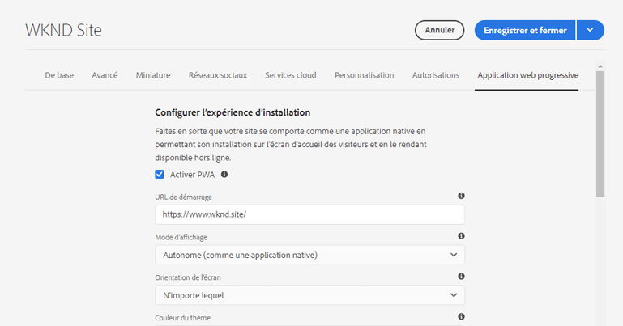
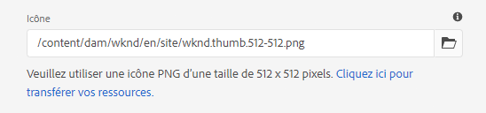
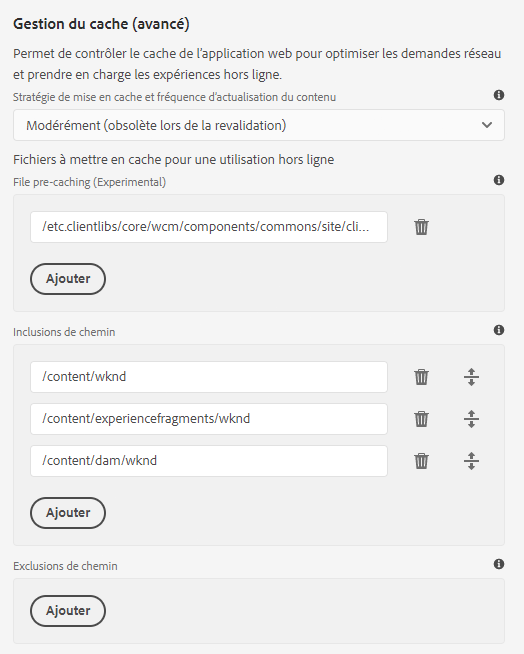

# Activation des fonctionnalités d’application web progressive {#enabling-pwa}

Grâce à une configuration simple, un auteur de contenu peut désormais activer des fonctionnalités d’application web progressive (PWA) pour les expériences créées dans AEM Sites.

>[!CAUTION]
>
>Cette fonction avancée requiert :
>
>* de savoir comment fonctionnent les PWA ;
>* de savoir comment sont organisés votre site et sa structure de contenu ;
>* la compréhension des stratégies de mise en cache ;
>* l’assistance de votre équipe de développement.
>
>Avant d’utiliser cette fonctionnalité, il est recommandé de discuter de cette question avec votre équipe de développement afin de définir le meilleur moyen de l’exploiter au sein de votre projet.

## Présentation {#introduction}

[Les applications web progressives (PWA)](https://developer.mozilla.org/fr/docs/Web/Progressive_web_apps) permettent d’offrir des expériences immersives, similaires à des applications, sur des sites AEM en leur permettant d’être stockées localement sur l’ordinateur d’un utilisateur et d’être accessibles hors ligne. Un utilisateur peut parcourir un site en déplacement, même s’il ne dispose pas d’une connexion Internet. Les PWA permettent des expériences homogènes même en cas de perte ou instabilité du réseau.

Au lieu d’exiger un recodage du site, un auteur de contenu peut configurer les propriétés PWA sous forme d’un onglet supplémentaire dans les [propriétés de page](/help/sites-cloud/authoring/fundamentals/page-properties.md) d’un site.

* Une fois enregistrée ou publiée, cette configuration déclenche un gestionnaire d’événements qui rédige les [fichiers de manifeste](https://developer.mozilla.org/fr/docs/Web/Manifest) et [agent de service](https://developer.mozilla.org/fr/docs/Web/API/Service_Worker_API) qui activent les fonctionnalités PWA sur le site.
* Les mappages Sling sont également conservés afin de garantir que l’agent de service est servi à partir de la racine de l’application afin d’activer le contenu proxy permettant des fonctionnalités hors ligne dans l’application.

En PWA, l’utilisateur dispose d’une copie locale du site, ce qui lui permet de vivre une expérience similaire à une application, même sans connexion Internet.

>[!NOTE]
>
>Les applications web progressives sont une technologie en évolution et la prise en charge de l’installation d’applications locales et d’autres fonctionnalités [dépend du navigateur utilisé.](https://developer.mozilla.org/fr/docs/Web/Progressive_web_apps/Installable_PWAs#summary)

## Prérequis {#prerequisites}

Pour pouvoir utiliser les fonctionnalités PWA sur votre site, l’environnement de votre projet requiert deux éléments :

1. [Utilisez les composants principaux](#adjust-components) pour tirer parti de cette fonctionnalité
1. [Ajustez les règles de votre Dispatcher](#adjust-dispatcher) pour exposer les fichiers requis.

L’auteur devra coordonner ces étapes techniques avec l’équipe de développement. Ces étapes ne sont requises qu’une seule fois par site.

### Utilisez les composants principaux {#adjust-components}

Les composants principaux de la version 2.15.0 et des versions ultérieures prennent entièrement en charge les fonctionnalités PWA d’AEM Sites. Comme AEMaaCS inclut toujours la dernière version des composants principaux, vous pouvez utiliser les fonctionnalités PWA prêtes à l’emploi. Votre projet AEMaaCS répond automatiquement à cette exigence.

>[!NOTE]
>
>Adobe ne recommande pas d’utiliser les fonctionnalités PWA sur les composants personnalisés ou composants non [étendus à partir des composants principaux.](https://experienceleague.adobe.com/docs/experience-manager-core-components/using/developing/customizing.html?lang=fr)
<!--
Your components need to include the [manifest files](https://developer.mozilla.org/en-US/docs/Web/Manifest) and [service worker,](https://developer.mozilla.org/en-US/docs/Web/API/Service_Worker_API) which supports the PWA features.

 To do this, the developer will need to add the following link to the `customheaderlibs.html` file of your page component.

```xml
<link rel="manifest" href="/content/<projectName>/manifest.webmanifest" crossorigin="use-credentials"/>
```

The developer will also need to add the following link to the `customfooterlibs.html` file of your page component.

```xml
<script>
        // Check that service workers are supported
        if ('serviceWorker' in navigator) {
            // Use the window load event to make sure the page load performs well
            window.addEventListener('load', () => {
                let serviceWorker = '/<projectName>sw.js';
                navigator.serviceWorker.register(serviceWorker);
            });
        }
</script>
```
-->

### Ajustement de votre Dispatcher {#adjust-dispatcher}

La fonctionnalité PWA génère et utilise des fichiers `/content/<sitename>/manifest.webmanifest`. Par défaut, [le Dispatcher](/help/implementing/dispatcher/overview.md) n’expose pas ces fichiers. Pour exposer ces fichiers, le développeur doit ajouter la configuration suivante à votre projet de site.

```text
File location: [project directory]/dispatcher/src/conf.dispatcher.d/filters/filters.any >

# Allow webmanifest files
/0102 { /type "allow" /extension "webmanifest" /path "/content/*/manifest" }
```

En fonction du projet, vous pouvez vouloir inclure différents types d’extensions aux règles de réécriture. Il peut s’avérer utile d’inclure l’extension `webmanifest` dans les conditions de réécriture lorsque vous avez introduit une règle qui masque et redirige les requêtes vers `/content/<projectName>`.

```text
RewriteCond %{REQUEST_URI} (.html|.jpe?g|.png|.svg|.webmanifest)$
```

## Activation de fonctionnalités PWA pour votre site {#enabling-pwa-for-your-site}

Une fois [les conditions préalables](#prerequisites) satisfaites, il est très facile pour un auteur de contenu d’activer les fonctionnalités PWA sur un site. Vous trouverez ci-dessous un aperçu basique de la procédure. Les différentes options sont détaillées dans la section [Options détaillées.](#detailed-options)

1. Connectez-vous à AEM.
1. Dans le menu principal, appuyez ou cliquez sur **Navigation** -> **Sites**.
1. Sélectionnez le projet de vos sites et appuyez ou cliquez sur [**Propriétés**](/help/sites-cloud/authoring/fundamentals/page-properties.md) ou utilisez la touche d’accès rapide `p`.
1. Sélectionnez l’onglet **Application web progressive** et configurez les propriétés concernées. Vous pouvez, au minimum :
   1. sélectionner l’option **Activer PWA** ;
   1. définir l’**URL de la page d’accueil** ;

      

   1. charger une icône de 512 x 512 au format png sur le DAM et la référencer en tant qu’icône de l’application ;

      

   1. configurer les chemins d’accès que l’agent de service doit emprunter hors connexion. Les chemins types sont les suivants :
      * `/content/<sitename>`
      * `/content/experiencefragements/<sitename>`
      * `/content/dam/<sitename>`
      * toute référence à une police tierce
      * `/etc/clientlibs/<sitename>`

      


1. appuyer et cliquer sur **Enregistrer et fermer**.

Votre site est maintenant configuré et vous pouvez [l’installer en tant qu’application locale.](#using-pwa-enabled-site)

## Utilisation de votre site compatible PWA {#using-pwa-enabled-site}

Maintenant que vous avez [configuré votre site pour prendre en charge le PWA,](#enabling-pwa-for-your-site) vous pouvez l’expérimenter par vous-même.

1. Accédez au site par le biais d’un [navigateur compatible.](https://developer.mozilla.org/fr/docs/Web/Progressive_web_apps/Installable_PWAs#summary)
1. Une nouvelle icône apparaît dans la barre d’adresse du navigateur, indiquant que le site peut être installé en tant qu’application locale.
   * Selon le navigateur, l’icône peut varier et le navigateur peut également afficher une notification (comme une bannière ou une boîte de dialogue) indiquant qu’il est possible de procéder à l’installation en tant qu’application locale.
1. Installez l’application.
1. L’application sera installée sur l’écran d’accueil de votre appareil.
1. Ouvrez l’application, parcourez le site et vérifiez que les pages sont disponibles hors ligne.

## Options détaillées {#detailed-options}

La section suivante fournit plus de détails sur les options disponibles lorsque [vous configurez votre site pour PWA.](#enabling-pwa-for-your-site)

### Configuration de l’expérience d’installation {#configure-installable-experience}

Ces paramètres permettent que votre site se comporte comme une application native en permettant son installation sur l’écran d’accueil des visiteurs et en le rendant disponible hors ligne.

* **Activer PWA** : cette option permet d’activer les fonctionnalités PWA pour le site.
* **URL de la page d’accueil** : cette option vous permet de définir l’[URL de la page d’accueil](https://developer.mozilla.org/en-US/docs/Web/Manifest/start_url) ouverte par l’application lorsque l’utilisateur charge l’application installée localement.
   * Il peut s’agir de n’importe quel chemin dans votre structure de contenu.
   * Il n’est pas nécessaire qu’il s’agisse de la racine et il s’agit souvent d’une page d’accueil dédiée à l’application.
   * Si cette URL est relative, l’URL du manifeste est utilisée en tant qu’URL de base pour la résoudre.
   * Lorsque l’URL de la page d’accueil n’est pas spécifiée, la fonction utilise l’adresse de la page Web à partir de laquelle l’application Web a été installée.
   * Il est cependant recommandé de définir une valeur pour cette page.
* **Mode d’affichage** : une application activée pour PWA reste un site AEM mis à disposition par le biais d’un navigateur. [Ces options d’affichage](https://developer.mozilla.org/en-US/docs/Web/Manifest/display) définissent la manière dont navigateur doit être masqué ou présenté à l’utilisateur sur l’appareil local.
   * **Autonome** : le navigateur est complètement masqué pour l’utilisateur et apparaît sous la forme d’une application native. Il s’agit de la valeur par défaut.
      * Avec cette option, la navigation de l’application doit être entièrement accessible par le biais de votre contenu à l’aide de liens et de composants sur les pages du site sans utiliser les commandes de navigation du navigateur.
   * **Par navigateur** : le navigateur s’affiche comme il le ferait normalement lors de la visite du site.
   * **Par interface utilisateur minimale** : le navigateur est généralement masqué, comme il le serait en tant qu’application native, mais les commandes de navigation de base sont affichées.
   * **Plein écran** : le navigateur est complètement masqué, comme pour une application native, mais son rendu est réalisé en mode plein écran.
      * Avec cette option, la navigation de l’application doit être entièrement accessible par le biais de votre contenu à l’aide de liens et de composants sur les pages du site sans utiliser les commandes de navigation du navigateur.
* **Orientation de l’écran** : en tant qu’application locale, la PWA doit savoir comment gérer [l’orientation de l’appareil.](https://developer.mozilla.org/en-US/docs/Web/Manifest/orientation)
   * **Auto** : l’application s’adapte à l’orientation de l’appareil de l’utilisateur. Il s’agit de la valeur par défaut.
   * **Portrait** : cette option force l’application à s’ouvrir en mode portrait, quelle que soit l’orientation de l’appareil de l’utilisateur.
   * **Paysage** : cette option force l’application à s’ouvrir en mode paysage, quelle que soit l’orientation de l’appareil de l’utilisateur.
* **Couleur du thème** : définit la [couleur de l’application](https://developer.mozilla.org/fr-FR/docs/Web/Manifest/theme_color) utilisée pour l’affichage de la barre d’outils native et des commandes de navigation de l’interface utilisateur par le système d’exploitation de l’utilisateur local. En fonction du navigateur, cette option peut affecter d’autres éléments de présentation de l’application.
   * Utilisez le pop-up de couleurs pour sélectionner une couleur.
   * La couleur peut également être définie selon une valeur hexadécimale ou RVB.
* **Couleur d’arrière-plan** : définit [la couleur d’arrière-plan de l’application](https://developer.mozilla.org/en-US/docs/Web/Manifest/background_color) qui s’affiche au chargement de l’application.
   * Utilisez le pop-up de couleurs pour sélectionner une couleur.
   * La couleur peut également être définie selon une valeur hexadécimale ou RVB.
   * Certains navigateurs [créent automatiquement un écran de démarrage](https://developer.mozilla.org/fr-FR/docs/Web/Manifest#Splash_screens) en utilisant le nom, la couleur d’arrière-plan et de l’icône de l’application.
* **Icône** : définit [l’icône](https://developer.mozilla.org/en-US/docs/Web/Manifest/icons) qui représente l’application sur l’appareil de l’utilisateur.
   * L’icône doit être constituée d’un fichier PNG de 512 x 512 pixels.
   * Elle doit être [stockée sur le DAM.](/help/assets/overview.md)

### Gestion du cache (avancé) {#offline-configuration}

Ces paramètres rendent des parties de ce site disponibles hors ligne et localement sur l’appareil de votre visiteur. Ils permettent de contrôler le cache de l’application web pour optimiser les demandes réseau et prendre en charge les expériences hors ligne.

* **Stratégie de mise en cache et fréquence d’actualisation du contenu** : ce paramètre définit le modèle de mise en cache de votre PWA.
   * **Modérée** : [ce paramètre](https://web.dev/stale-while-revalidate/) est valable pour la plupart des sites et est défini comme valeur par défaut.
      * Avec ce paramètre, le contenu affiché pour la première fois par l’utilisateur sera chargé à partir du cache et pendant que l’utilisateur consomme ce contenu, le reste du contenu du cache sera revalidé.
   * **Fréquente** : ce paramètre est recommandé pour les sites qui ont besoin de mises à jour très rapides, tels que les sites d’enchères.
      * Avec ce paramètre, l’application recherche d’abord le contenu le plus récent sur le réseau et, si celui-ci n’est pas disponible, elle se réfère au cache local.
   * **Rare** : concerne les sites qui sont pour ainsi dire statiques, tels que les pages de référence.
      * Avec ce paramètre, l’application recherche d’abord le contenu dans le cache et, s’il n’est pas disponible, elle se réfère au réseau pour le récupérer.
* **Prémise en cache des fichiers** : ces fichiers hébergés sur AEM seront enregistrés dans le cache du navigateur local lorsque l’agent de service s’installe et avant son utilisation. Cette option garantit que l’application Web est entièrement fonctionnelle lorsqu’elle est hors ligne.
* **Inclusions des chemins** : les demandes réseau pour les chemins définis sont interceptées et le contenu mis en cache est renvoyé conformément à la **stratégie de mise en cache et à la fréquence d’actualisation** configurées pour le contenu.
* **Exclusions du cache** : ces fichiers ne seront jamais mis en cache, quels que soient les paramètres définis dans **Prémise en cache des fichiers** et dans **Inclusions des chemins**.

>[!TIP]
>
>Votre équipe de développeurs peut probablement vous offrir un avis précieux sur votre configuration hors ligne.

## Restrictions et recommandations {#limitations-recommendations}

Toutes les fonctionnalités PWA ne sont pas disponibles pour AEM Sites. Il existe quelques cas importants de restriction.

* Les pages ne sont pas automatiquement synchronisées ni mises à jour si l’utilisateur n’utilise pas l’application.

Adobe recommande également les éléments suivants pour l’implémentation de votre PWA.

### Réduisez le nombre de ressources à mettre en cache. {#minimize-precache}

Adobe recommande de limiter le nombre de pages à mettre en cache.

* Incorporez des bibliothèques pour réduire le nombre d’entrées à gérer lors de la mise en cache préalable.
* Limitez le nombre de variations d’image à mettre en cache.

### Activez vos fonctionnalités PWA une fois que vous avez stabilisé les scripts et les feuilles de style du projet. {#pwa-stabilized}

Les bibliothèques clientes sont fournies avec un sélecteur de cache qui se conforme au modèle suivant `lc-<checksumHash>-lc`. Chaque fois qu’un des fichiers (et ses dépendances) qui compose une bibliothèque est modifié, ce sélecteur change. Si vous avez répertorié une bibliothèque cliente à mettre en cache par le biais de l’agent de service et que vous souhaitez vous référer à une nouvelle version, vous récupérez et mettez à jour manuellement l’entrée. Par conséquent, nous vous conseillons de configurer votre site pour qu’il active ses fonctionnalités PWA une fois les scripts et feuilles de style du projet stabilisés.

### Réduisez le nombre de variations d’image. {#minimize-variations}

Le composant d’image des composants principaux AEM détermine laquelle des variations doit être utilisée en front-end pour générer le meilleur rendu. Ce mécanisme inclut également un horodatage correspondant à l’heure de la dernière modification de cette ressource. Ce mécanisme complique la configuration PWA mise en cache.

Lors de la configuration de la mise en cache, l’utilisateur doit répertorier toutes les variations de chemin d’accès qui peuvent être récupérées. Ces variations comportent des paramètres tels que la qualité et la largeur. Il est fortement conseillé de réduire le nombre de ces variations à un maximum de trois : petite, moyenne, grande. Vous pouvez le faire par l’intermédiaire de la boîte de dialogue de politique de contenu du [composant d’image.](https://experienceleague.adobe.com/docs/experience-manager-core-components/using/components/image.html?lang=fr)

Si les fonctionnalités PWA ne sont pas configurées correctement, la consommation de mémoire et de réseau peut avoir un impact important sur leurs performances. De même, si vous avez l’intention de prédéfinir, disons, 50 images avec 3 largeurs par image, l’utilisateur qui gère le site devra conserver une liste de jusque 150 entrées dans la section de mise en cache PWA des propriétés de la page.

Adobe vous conseille également de configurer votre site pour qu’il active ses fonctionnalités PWA une fois que l’utilisation des images du projet est stable.
