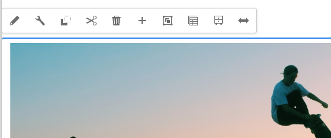

# Modification du contenu de la page à l’aide de l’éditeur de page AEM {#edit-content}

L’éditeur de page d’AEM est un outil puissant pour créer le contenu d’une page. Découvrez comment l’utiliser pour faire glisser et déposer du contenu et modifier le contenu statique.

## Vue d’ensemble {#overview}

Vous pouvez exécuter trois actions de base dans l’éditeur de page pour modifier votre contenu :

1. [Ajout de nouveaux composants](#adding-components) en les faisant glisser sur la page.
1. [Ajout de nouvelles ressources](#adding-asset) en les faisant glisser sur la page.
1. [Modification de composants statiques](#edit-in-place) qui existent déjà sur la page.

L’éditeur de page d’AEM fournit une interface utilisateur intuitive pour effectuer ces tâches, en plus de donner accès à des fonctionnalités plus avancées.

En outre, l’éditeur vous permet d’organiser le contenu existant sur votre page en vous permettant de

* [Déplacer des composants](#moving-components)
* [Modifier la disposition du composant](#editing-component-layout)
* [Modifier l’héritage du composant](#inherited-components)

## Ajout de composants {#adding-components}

Vous pouvez faire glisser de nouveaux composants sur votre page en les sélectionnant dans l’explorateur de composants [du panneau latéral](/help/sites-cloud/authoring/page-editor/editor-side-panel.md#components-browser) et en les déposant dans un espace réservé de composant.

### Espace réservé au composant {#component-placeholder}

L’espace réservé du composant est un indicateur qui indique où un composant sera positionné lorsque vous le déposerez. Il a deux apparences.

* Lors de l’ajout d’un nouveau composant à la page (en le faisant glisser depuis l’explorateur de composants), il s’affiche sous forme de zone grise avec les détails du composant que vous importez.

  

* Lorsque [ déplace un composant existant,](#movging-components) il apparaît comme un carré bleu.

  

Dans les deux cas, la cible sélectionnée apparaît sous la forme d’une bordure bleue sous le composant que vous faites glisser. Cible si l’emplacement du composant est placé lorsque vous le relâchez.

### Ajout d’un composant à partir de l’explorateur de composants {#adding-a-component-from-the-components-browser}

Vous pouvez ajouter un nouveau composant à l’aide de l’[explorateur de composants](/help/sites-cloud/authoring/page-editor/editor-side-panel.md#components-browser). L’ [espace réservé du composant](#component-placeholder) vous indique où vous positionnez le composant.

1. Assurez-vous que l&#39;éditeur de page est en mode [**Édition**.](/help/sites-cloud/authoring/page-editor/introduction.md#mode-selector)
1. Ouvrez le navigateur de composants [component.](/help/sites-cloud/authoring/page-editor/editor-side-panel.md#components-browser)
1. Faites glisser le composant requis vers la [position requise](#component-placeholder) et la version.
1. [Modifiez](#edit-content) le composant nouvellement placé.

>[!NOTE]
>
>Sur un appareil mobile, l’explorateur de composants remplit tout l’écran. Quand vous faites glisser un composant, l’explorateur se ferme pour afficher à nouveau la page afin que vous puissiez placer le composant.

### Ajout d’un composant à partir du système de paragraphes {#adding-a-component-from-the-paragraph-system}

Vous pouvez ajouter un nouveau composant à l’aide de l’espace réservé **Faire glisser les composants ici** du système de paragraphes :

1. Assurez-vous que l&#39;éditeur de page est en mode [**Édition**.](/help/sites-cloud/authoring/page-editor/introduction.md#mode-selector)
1. Il existe deux façons de sélectionner et d’ajouter un nouveau composant à partir du système de paragraphes :

   * Sélectionnez l’option **Insérer le composant** (+) depuis la barre d’outils d’un composant existant ou dans la zone **Faire glisser les composants ici**.

     

   * Si vous utilisez un ordinateur de bureau, vous pouvez double-cliquer sur la zone **Faire glisser les composants ici** .

1. La boîte de dialogue **Insérer un nouveau composant** s’ouvre pour vous permettre de sélectionner le composant requis. Appuyez ou cliquez sur le composant que vous souhaitez ajouter.

   * Utilisez les filtres de recherche pour trouver votre composant.
   * Pour en savoir plus sur le composant, cliquez sur l’icône d’informations située en regard des noms des composants.

   

1. Le composant sélectionné est ajouté à la cible que vous avez sélectionnée. [Modifiez](#edit-content) le composant si nécessaire.

## Ajout d’une ressource {#adding-asset}

Vous pouvez également ajouter un nouveau composant à la page en faisant glisser une ressource à partir de l’explorateur [assets .](/help/sites-cloud/authoring/page-editor/editor-side-panel.md#assets-browser) Cela crée automatiquement un composant du type approprié (et contenant la ressource).

Ce comportement peut être configuré pour votre installation. Pour plus d’informations, consultez le document [Guide de référence des composants](/help/implementing/developing/components/reference.md#component-placeholders) .

Pour créer un composant en faisant glisser l’un des types de ressources ci-dessus, suivez ces étapes :

1. Assurez-vous que votre page est en mode [**Modifier**.](/help/sites-cloud/authoring/page-editor/introduction.md#mode-selector)
1. Ouvrez l’[explorateur de ressources](/help/sites-cloud/authoring/page-editor/editor-side-panel.md#assets-browser).
1. Faites glisser le composant jusqu’à la position requise. L’ [ espace réservé du composant](#component-placeholder) vous indique où le composant est positionné et où une cible s’affichera lorsqu’il sera inséré.
1. Relâchez la ressource sur la cible. Un composant, approprié au type de ressource, est créé à l’emplacement requis contenant la ressource sélectionnée.
1. [Modifiez](#edit-content) le composant si nécessaire.

>[!NOTE]
>
>Sur un appareil mobile, l’explorateur de ressources remplit tout l’écran. Quand vous faites glisser une ressource, l’explorateur se ferme pour afficher à nouveau la page. Vous pouvez alors placer la ressource.

Si, lors de l’exploration des ressources, vous estimez qu’il est nécessaire d’apporter une modification rapide à l’une d’elles, vous pouvez lancer directement l’[éditeur de ressources](/help/assets/manage-digital-assets.md) à partir de l’explorateur en cliquant sur l’icône d’édition située en regard de son nom.

## Modification statique des composants {#edit-in-place}

La sélection d’un composant ouvre la barre d’outils du composant. Cela permet d’accéder à diverses actions pouvant être réalisées sur le composant.

Les actions disponibles dans la barre d’outils du composant sont adaptées au composant sélectionné. Vous pouvez voir plus ou moins cela selon le composant sélectionné et ils peuvent être ou non décrits ici.

* **Modifier** vous permet de modifier le contenu du composant, souvent sur place. Son comportement dépend du composant.

  

* **Configurer** vous permet de modifier certains paramètres du composant qui ne sont pas directement liés à son contenu, normalement dans une boîte de dialogue. Son comportement dépend du composant.

  

* **Copier** copie le composant dans le Presse-papiers pour le coller ailleurs. Le composant d’origine reste inchangé.

  

* **Couper** copie le composant dans le Presse-papiers. Le composant d’origine est supprimé.

  

* **Supprimer** supprime le composant de la page avec votre confirmation.

  

* **Insérer un composant** ouvre la boîte de dialogue [pour ajouter un nouveau composant.](#adding-a-component-from-the-paragraph-system)

  

* **Coller** colle le composant du Presse-papiers sur la page. Si l’original est conservé, cela dépend si vous avez utilisé **Copy** ou **Cut**.

   * Vous pouvez coller les composants sur la même page ou sur une autre.
   * Si vous effectuez un collage sur une autre page qui était déjà ouverte avant l’opération de couper/copier, vous devez actualiser la page pour afficher le contenu collé.
   * L’élément collé est collé au-dessus de l’élément pour lequel vous avez sélectionné l’action de collage.
   * L’action de collage ne s’affiche que si du contenu se trouve dans le presse-papiers.

  

* **Group** permet de sélectionner plusieurs composants à la fois. Vous pouvez obtenir le même résultat sur un ordinateur de bureau à l’aide des commandes **Ctrl-clic** ou **Commande-clic**.

  

* **Parent** sélectionne le composant parent du composant sélectionné.

  

* **Mise en page** permet de modifier la [mise en page](#editing-component-layout) du composant sélectionné.

   * Cela s’applique uniquement au composant sélectionné et n’active pas le [mode de mise en page](/help/sites-cloud/authoring/page-editor/introduction.md#mode-selector) pour la page entière.

  

* **Convertir en variation de fragment d’expérience** vous permet de créer un [fragment d’expérience](/help/sites-cloud/authoring/fragments/content-fragments.md) à partir du composant sélectionné ou de l’ajouter à un fragment d’expérience existant.

  

### Boîte de dialogue de modification du composant {#component-edit-dialog}

Certains composants offrent des options de modification supplémentaires au-delà de ce qui est disponible sur place. Vous pouvez ouvrir la boîte de dialogue de modification d’un composant à l’icône [Modifier (crayon) de la barre d’outils du composant](#component-toolbar) pour accéder à d’autres options de configuration.

Les options de modification exactes dépendent du composant. Pour certains composants [, certaines actions ne seront disponibles qu&#39;en mode plein écran ](#edit-content-full-screen-mode). Par exemple :

* Composant textuel

  

* Composant d’image

  

### Modification des composants en mode Plein écran {#edit-content-full-screen-mode}

De nombreux composants offrent un mode Plein écran pour la modification, accessible avec ce bouton.

La modification en plein écran permet d’afficher davantage d’options de modification que l’éditeur statique, comme pour le composant d’image.

Utilisez le bouton **Minimiser** pour exister en mode plein écran.

## Déplacement de composants {#moving-components}

Pour déplacer un composant :

1. Sélectionnez le composant à déplacer en appuyant et en maintenant la pression enfoncée ou en cliquant et en maintenant la pression enfoncée.
1. Faites glisser le composant vers le nouvel emplacement.

   * L’éditeur de page indique la position du composant avec un [espace réservé](#component-placeholder) et où le paragraphe peut être déposé avec une cible.

   

1. Déposez-le à l’emplacement souhaité.

>[!TIP]
>
>Vous pouvez également utiliser un [couper/coller](#component-toolbar) pour déplacer un composant.

## Modification de la disposition du composant {#editing-component-layout}

Au lieu de basculer à plusieurs reprises entre les modes Modifier et de [Disposition](/help/sites-cloud/authoring/page-editor/responsive-layout.md) pour ajuster un composant, vous pouvez sélectionner l’action **Disposition** pour un composant afin d’en modifier la mise en page. Cela vous évite de devoir quitter le mode Modifier, ce qui se traduit par un gain de temps.

1. En mode **Modifier** de la console Sites, sélectionnez un composant pour afficher la barre d’outils du composant.

1. Sélectionnez l’action **Disposition** pour ajuster la disposition du composant.

   

1. Une fois l’action Mise en page sélectionnée, vous pouvez modifier la mise en page du composant comme vous le feriez en [mode Mise en page.](/help/sites-cloud/authoring/page-editor/responsive-layout.md#defining-layouts-layout-mode)

   * Les poignées de redimensionnement du composant s’affichent.
   * La barre d’outils de l’émulateur s’affiche en haut de l’écran.
   * Les actions de mise en page au lieu des actions de modification standard s’affichent dans la barre d’outils du composant.

   

1. Après avoir apporté les modifications nécessaires à la mise en page, appuyez ou cliquez sur le bouton **Fermer** dans le menu d’actions du composant pour arrêter la modification de la mise en page du composant et la barre d’outils du composant revient à son état d’édition normal.

   

>[!TIP]
>
>L’action de mise en page est limitée au composant sélectionné. Par exemple, si vous modifiez la mise en page d’un composant, puis cliquez sur un autre composant, la barre d’outils d’édition standard (et non la barre d’outils de mise en page) s’affiche pour le nouveau composant sélectionné, les poignées de redimensionnement et la barre d’outils de l’émulateur disparaissent.
>
>Si vous devez modifier la disposition globale de la page et affecter ainsi plusieurs composants, basculez vers le [mode Disposition](/help/sites-cloud/authoring/page-editor/responsive-layout.md).

## Modification de l’héritage des composants {#inherited-components}

L’héritage est le mécanisme par lequel le contenu peut être lié, de sorte que la modification de l’un modifie automatiquement l’autre. Les composants hérités peuvent être le produit de divers scénarios :

* [Gestion de plusieurs sites](/help/sites-cloud/administering/msm/overview.md)
* [Lancements](/help/sites-cloud/authoring/launches/overview.md)

Vous pouvez annuler et réactiver l’héritage. Selon le composant, ces options sont disponibles dans la barre d’outils du composant, si le composant fait partie d’une Live Copy ou d’un lancement.

* **Annuler l’héritage**

  

* **Réactiver l’héritage** si l’héritage est déjà annulé

  

* **Déploiement** est également disponible dans le plan directeur ou la source Live Copy

  
