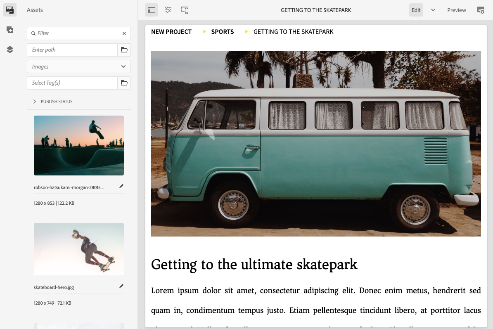
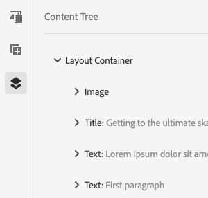

# Panneau latéral Éditeur de page {#side-panel}

Découvrez comment utiliser le panneau latéral dans l’éditeur de sites d’AEM pour ajouter des composants et des ressources à votre page.

## Modes du panneau latéral {#modes}

Le panneau latéral est toujours accessible dans l’éditeur de page en appuyant ou en cliquant sur le **Activer/désactiver le panneau latéral** dans la barre d’outils de l’éditeur de page.

Lorsque vous ouvrez le panneau latéral, il s’ouvre en glissant depuis le côté gauche et vous pouvez ensuite choisir parmi trois onglets importants :

* [Explorateur de composants](#components-browser) pour ajouter du nouveau contenu à votre page
* [Explorateur de ressources](#assets-browser) pour ajouter de nouvelles ressources à votre page
* [Arborescence de contenu](#content-tree) pour parcourir la structure de votre page

## Explorateur de composants {#components-browser}

[Composants](/help/implementing/developing/components/overview.md) sont les blocs de création utilisés pour créer du contenu avec l’éditeur de page d’AEM. Vous placez plusieurs composants sur une page et configurez leurs options pour créer votre page de contenu.

L’explorateur de composants présente tous les composants que vous pouvez utiliser sur la page active. Vous pouvez les faire glisser à l’emplacement approprié, puis les modifier pour ajouter votre contenu.

Appuyez ou cliquez sur le bouton **Composants** dans le panneau latéral pour accéder à la variable **Composants** navigateur.

L’aspect et la gestion de l’appareil dépendent du type d’appareil utilisé.

### Appareil mobile {#mobile-device-components-browser}

Lors de l’ouverture de l’explorateur de composants sur un appareil mobile, il couvre entièrement la page en cours de modification.

Pour ajouter un composant à votre page, sélectionnez-le et faites-le glisser et déplacez-le vers la droite. L’explorateur de composants se ferme pour afficher à nouveau la page, où vous pouvez positionner le composant.

>[!NOTE]
>
>Un appareil mobile est détecté lorsque la largeur est inférieure à 1 024 px.

### Poste de travail {#desktop-device-components-browser}

Lors de l’ouverture de l’explorateur de composants sur un ordinateur de bureau, il s’affiche sur le côté gauche de la fenêtre.

Pour ajouter un composant à votre page, cliquez sur le composant requis et faites-le glisser vers l’emplacement requis.

### Utilisation de l’explorateur de composants {#using-component-browser}

Composants du **Composants** Les navigateurs sont représentés par :

* Nom du composant
* Groupe de composants (en gris)
* Icône ou abréviation
   * Les icônes des composants standard sont monochromes.
   * Les abréviations correspondent toujours aux deux premiers caractères du nom du composant.

Dans la barre d’outils supérieure de l’explorateur de **composants**, vous pouvez effectuer les opérations suivantes :

* Filtrer les composants par nom
* Restreindre l’affichage à un groupe spécifique à l’aide de la liste déroulante.

Pour obtenir une description plus détaillée du composant, vous pouvez sélectionner l’icône d’informations en regard du composant dans la variable **Composants** navigateur (le cas échéant). Par exemple, pour le **fragment de contenu** :

Pour plus d’informations sur les composants disponibles, voir [Console de composants.](/help/sites-cloud/authoring/components-console.md)

## Explorateur de ressources {#assets-browser}

La variable **Ressources** Le navigateur affiche toutes les [ressources](/help/assets/overview.md) qui peuvent être utilisées sur la page active.

Appuyez ou cliquez sur le bouton **Ressources** dans le panneau latéral pour parcourir les ressources.

Le défilement illimité permet de développer la liste des ressources selon les besoins au fur et à mesure que vous faites défiler l’écran.

L’aspect et la gestion de l’explorateur dépendent du type d’appareil utilisé :

### Appareil mobile {#mobile-device-assets-browser}

Lors de l’ouverture de l’explorateur de ressources sur un périphérique mobile, il couvre entièrement la page en cours de modification.

Pour ajouter une ressource à votre page, sélectionnez-la et faites-la glisser, puis déplacez-la vers la droite. L’explorateur de ressources se ferme pour afficher à nouveau la page, où vous pouvez ajouter la ressource au composant requis.

>[!NOTE]
>
>Un appareil mobile est détecté lorsque la largeur est inférieure à 1 024 px.

### Poste de travail {#desktop-device-assets-browser}

Lorsque vous ouvrez l’explorateur de ressources sur un ordinateur de bureau, il s’ouvre sur le côté gauche de la fenêtre.

Pour ajouter une ressource à votre page, sélectionnez-la et faites-la glisser vers le composant ou l’emplacement requis.

### Utilisation de l’explorateur de ressources {#using-assets-browser}

Pour ajouter une ressource à votre page, sélectionnez-la et faites-la glisser jusqu’à l’emplacement souhaité. Il peut s’agir des éléments suivants :

* d’un composant existant du type approprié.
   * Par exemple, vous pouvez faire glisser une ressource de type image sur un composant Image ;
* d’un [espace réservé](/help/sites-cloud/authoring/page-editor/edit-content.md#component-placeholder) dans le système de paragraphes où créer un composant du type approprié :
   * Par exemple, vous pouvez faire glisser une ressource de type image sur le système de paragraphes afin de créer un composant Image.

>[!NOTE]
>
>Le glissement et le dépôt de ressources sont disponibles pour des ressources et des types de composants spécifiques. Voir [Insertion d’un composant à l’aide de l’explorateur de ressources](/help/sites-cloud/authoring/page-editor/edit-content.md#adding-a-component-from) pour plus d’informations.

Dans la barre d’outils supérieure de l’explorateur de ressources, vous pouvez filtrer les ressources en procédant comme suit :

* Nom
* Chemin
* Type de ressource tel que les images, les vidéos, les documents, les paragraphes, les fragments de contenu et les fragments d’expérience
* Caractéristiques des ressources, telles que l’orientation et le style
   * Disponible uniquement pour certains types de ressources

Si vous devez modifier rapidement une ressource, vous pouvez lancer [l’éditeur de ressources](/help/assets/manage-digital-assets.md) directement depuis l’explorateur de ressources en cliquant sur l’icône Modifier affichée en regard du nom de la ressource.

## Arborescence de contenu {#content-tree}

La variable **Arborescence de contenu** donne un aperçu de tous les composants de la page dans une hiérarchie afin que vous puissiez voir en un coup d’oeil comment la page est composée.

>[!NOTE]
>
>L’arborescence de contenu n’est pas disponible si vous modifiez une page sur un appareil mobile (si la largeur de l’explorateur est inférieure à 1 024 px).

Appuyez ou cliquez sur le bouton **Arborescence de contenu** pour accéder à l’arborescence de contenu.

Une fois ouvert, vous pouvez voir une représentation en arborescence de votre page ou modèle. Il est ainsi plus simple de comprendre comment son contenu est structuré de manière hiérarchique. En outre, sur une page complexe, il est plus facile de passer d’un composant à l’autre de la page.

Une page peut facilement être composée de plusieurs composants du même type. Par conséquent, l’arborescence de contenu affiche un texte descriptif (en gris) après le nom du type de composant (en noir). Le texte descriptif provient des propriétés courantes du composant, telles que le titre ou le texte.

Les types de composants sont affichés dans la langue de l’utilisateur ou de l’utilisatrice, tandis que le texte descriptif du composant dépend de la langue de la page.

Cliquez sur le chevron en regard d’un composant pour réduire ou développer ce niveau.

Cliquez sur le composant pour le mettre en surbrillance dans l’éditeur de page. Les actions disponibles dépendent de l’état de la page. Par exemple :

## Une page de base {#basic-page}

Les composants d’une page de base auront les options habituelles.

Si le composant sur lequel vous cliquez est éditable, une icône de clé à molette s’affiche à droite du nom. Cliquez sur cette icône pour ouvrir la boîte de dialogue de modification du composant.

### Une Live Copy {#live-copy}

Une page qui fait partie d’une [livecopy](/help/sites-cloud/administering/msm/overview.md), où les composants sont hérités d’une autre page, propose différentes options.

## Explorateur de contenu associé {#associated-content-browser}

Si votre page contient des fragments de contenu, vous avez également accès au [pour le contenu associé.](/help/sites-cloud/authoring/fragments/content-fragments.md#using-associated-content)
