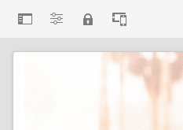

# Éditeur de page d’AEM {#editing-page-content}

Une fois votre page créée dans la console [**Sites**](/help/sites-cloud/authoring/sites-console/introduction.md), vous pouvez en modifier le contenu à l’aide de l’éditeur de page d’AEM, un puissant outil de création de contenu.

>[!NOTE]
>
>Lors de la modification d’une page dans la console [**Sites**](/help/sites-cloud/authoring/sites-console/introduction.md), la console ouvre l’éditeur approprié au [modèle](/help/sites-cloud/authoring/page-editor/templates.md) de la page, soit l’éditeur de page décrit dans ce document, soit l’[éditeur universel](/help/sites-cloud/authoring/universal-editor/authoring.md).

>[!NOTE]
>
>Votre compte a besoin des droits d’accès et des autorisations appropriés pour modifier des pages. Contactez votre administrateur système si vous ne disposez pas des autorisations nécessaires.

{{traditional-aem}}

## Orientation {#orientation}

L’éditeur de page d’AEM se compose principalement de trois sections :

1. [La barre d’outils](#toolbar) - La barre d’outils vous permet d’accéder rapidement au changement de mode de page et aux paramètres de page supplémentaires.
1. [Panneau latéral](#side-panel) - Le panneau latéral vous donne accès aux composants et aux ressources de la page, ainsi qu’à d’autres outils de création.
1. [L’éditeur](#editor) - L’éditeur vous permet de modifier votre contenu et de le prévisualiser.

Le contenu est ajouté à l’aide des [composants](/help/sites-cloud/authoring/components-console.md) (appropriés au type de contenu) qui peuvent être glissés sur la page. Ils peuvent ensuite être modifiés sur place, déplacés ou supprimés.

### Barre d’outils {#page-toolbar}

La barre d’outils de la page permet d’accéder à des fonctionnalités adaptées au contexte, en fonction de la configuration de la page.

#### Panneau latéral {#side-panel-button}

Cette action ouvre/ferme le panneau [latéral](/help/sites-cloud/authoring/page-editor/editor-side-panel.md), qui contient l’explorateur de ressources, l’explorateur de composants et l’arborescence de contenu.

#### Informations sur la page {#page-information}

Vous pouvez ainsi accéder aux informations détaillées sur la page, notamment les détails de la page et les actions qui peuvent être entreprises sur la page, notamment l’affichage et la modification des informations de la page, l’affichage des propriétés de la page et la publication/annulation de la publication de la page.

**Informations sur la page** ouvre un menu déroulant qui fournit des détails sur la dernière modification et la dernière publication de la page sélectionnée. D’autres actions sont disponibles en fonction des caractéristiques de la page, de son site et de votre instance.

* [Ouvrir les propriétés](/help/sites-cloud/authoring/sites-console/page-properties.md)
* [Déployer la page](/help/sites-cloud/administering/msm/overview.md#msm-from-the-ui)
* [Démarrer le processus](/help/sites-cloud/authoring/workflows/applying.md#starting-a-workflow-from-the-page-editor)
* [Verrouillage de la page](/help/sites-cloud/authoring/page-editor/introduction.md#locking-unlocking)
* [Publier la page](/help/sites-cloud/authoring/sites-console/publishing-pages.md#publishing-pages-1)
* [Dépublication de la page](/help/sites-cloud/authoring/sites-console/publishing-pages.md#unpublishing-pages)
* [Modifier le modèle](/help/sites-cloud/authoring/page-editor/templates.md)
* [Afficher comme publié(e)](/help/sites-cloud/authoring/page-editor/introduction.md#view-as-published)
* [Afficher en administrateur](/help/sites-cloud/authoring/basic-handling.md#viewing-and-selecting-resources)
* [Aide](/help/sites-cloud/authoring/basic-handling.md#accessing-help)
* [Convertir le lancement](/help/sites-cloud/authoring/launches/promoting.md) (uniquement si la page correspond à un lancement)

Le menu **Informations sur la page** peut en outre donner accès à des analyses et recommandations, le cas échéant.

#### Emulateur {#emulator}

Cette option permet d’activer ou de désactiver la [&#x200B; barre d’outils de l’émulateur &#x200B;](/help/sites-cloud/authoring/page-editor/responsive-layout.md#selecting-a-device-to-emulate), utilisée pour émuler l’aspect de la page sur un autre appareil. Cette option est automatiquement activée en mode Mise en page.

#### ContextHub {#context-hub}

Le [ContextHub](/help/sites-cloud/authoring/personalization/contexthub.md) s’ouvre alors. Il n’est disponible qu’en mode **Aperçu**.

#### Titre de la page {#page-title}

Il s’agit du titre de la page, affiché en majuscules comme information.

#### Sélecteur de mode {#mode-selector}

Le sélecteur de mode affiche le [mode](/help/sites-cloud/authoring/page-editor/introduction.md#mode-selector) actuel et vous permet de sélectionner un autre mode, tel que l’édition, la mise en page, la distorsion du temps ou le ciblage.

Plusieurs modes sont possibles lors de la modification d’une page, ce qui permet d’effectuer différentes actions :

* [&#x200B; Modifier &#x200B;](/help/sites-cloud/authoring/page-editor/edit-content.md) - Mode à utiliser lors de la modification du contenu de la page
* [Disposition](/help/sites-cloud/authoring/page-editor/responsive-layout.md) - Permet de créer et de modifier une disposition réactive selon l’appareil (si la page est basée sur un conteneur de dispositions)
* [Ciblage](/help/sites-cloud/authoring/personalization/targeted-content.md) - Améliore la pertinence du contenu grâce au ciblage et à la mesure sur tous les canaux
* [Timewarp](/help/sites-cloud/authoring/sites-console/page-versions.md#timewarp) - Affichage de l’état d’une page à un moment donné
* [Statut de la Live Copy](/help/sites-cloud/authoring/page-editor/introduction.md#live-copy-status) : donne un aperçu rapide du statut de la Live Copy et des composants qui sont ou non hérités
* [Mode de développement](/help/implementing/developing/tools/developer-mode.md)
* [Aperçu](/help/sites-cloud/authoring/page-editor/introduction.md#previewing-pages) - Affichez la page telle qu’elle s’affiche dans l’environnement de publication ou pour naviguer à l’aide de liens dans le contenu
* [Annoter](/help/sites-cloud/authoring/page-editor/annotations.md) - Ajouter ou afficher des annotations sur la page

>[!NOTE]
>
>* Selon les caractéristiques de la page, certains modes peuvent ne pas être disponibles.
>* L’accès à certains modes nécessite les autorisations/privilèges appropriés.
>* Le mode de développement n’est pas disponible sur les appareils mobiles en raison de restrictions d’espace.
>* Utilisez le [raccourci clavier](/help/sites-cloud/authoring/sites-console/keyboard-shortcuts.md) ( `Ctrl-Shift-M`) pour basculer entre le mode **Aperçu** et le mode actuellement sélectionné (par exemple, **Modifier**, **Disposition**, etc.).

#### Prévisualisation {#preview}

Le bouton **Aperçu** active le [mode d’aperçu](#preview-mode), affichant la page telle qu’elle apparaîtra une fois publiée.

#### Annoter {#annotate}

Le mode **Annoter** permet d’ajouter des [annotations](/help/sites-cloud/authoring/page-editor/annotations.md) à la page lors de la révision d’une page. Après la première annotation, l’icône prend la forme d’un nombre indiquant le nombre d’annotations sur la page.

### Panneau latéral {#side-panel}

Le panneau latéral vous permet d’accéder à trois onglets différents.

* L’explorateur de composants pour ajouter du nouveau contenu à votre page
* L’explorateur de ressources pour ajouter de nouvelles ressources à votre page
* Arborescence de contenu permettant de parcourir la structure de votre page

Consultez le document [Panneau latéral de l’éditeur de page](/help/sites-cloud/authoring/page-editor/editor-side-panel.md) pour plus d’informations.

### Éditeur {#editor}

L’éditeur vous permet d’apporter des modifications directement au contenu de votre page. La page est rendue telle que vous la voyez et vous pouvez faire glisser et déposer du nouveau contenu à l’aide des navigateurs de ressources ou de composants du panneau latéral, ainsi que modifier le contenu sur place.

## Modification du contenu {#editing-content}

Maintenant que vous comprenez l’éditeur de page, vous êtes prêt à modifier votre contenu.

Pour plus d’informations, consultez le document [Modification de contenu avec l’éditeur de page d’AEM](/help/sites-cloud/authoring/page-editor/edit-content.md).

## Notification de statut {#status-notification}

Si la page fait partie d’un ou de plusieurs [workflow](/help/sites-cloud/authoring/workflows/overview.md), ces informations s’affichent dans une barre de notification située sous la barre d’outils lors de la modification de la page.

>[!NOTE]
>
>La barre de statut n’est visible que pour les comptes d’utilisateur ou d’utilisatrice disposant des privilèges appropriés.

La notification répertorie le workflow qui s’exécute sur la page. Si la personne utilisatrice est impliquée dans l’étape de workflow en cours, les options pour [affecter le statut du workflow](/help/sites-cloud/authoring/workflows/participating.md) et obtenir plus d’informations sur le workflow sont également disponibles, par exemple :

* **Terminé** : ouvre la boîte de dialogue **Terminer l’élément de travail**
* **Déléguer** : ouvre la boîte de dialogue **Terminer l’élément de travail**
* **Afficher les détails** : ouvre la fenêtre **Détails** du workflow

L’utilisation de la barre de notification pour terminer et déléguer des étapes de workflow fonctionne de la même manière que la [participation à des workflows](/help/sites-cloud/authoring/workflows/participating.md) depuis la boîte de réception de notifications.

Si la page est soumise à plusieurs workflows, leur nombre est indiqué à droite de la notification, avec des chevrons, pour vous permettre de les parcourir.

## Statut de la Live Copy {#live-copy-status}

Le mode de page **Statut de la Live Copy** vous donne un aperçu rapide du statut de la Live Copy et des composants qui sont ou non hérités :

* Bordure verte : hérité
* Bordure rose : héritage annulé

Par exemple :

## Prévisualiser des pages {#previewing-pages}

Deux options sont disponibles pour prévisualiser une page :

* [Mode Aperçu](#preview-mode) - Un aperçu rapide et statique.
* [Afficher comme publié](#view-as-published) - Aperçu complet qui ouvre la page dans un nouvel onglet

>[!TIP]
>
>* Les liens dans le contenu sont visibles, mais ne sont pas accessibles en mode **Modifier**.
>* Si vous souhaitez naviguer à l’aide des liens, utilisez l’une des options d’aperçu.
>* Utilisez le [raccourci clavier](/help/sites-cloud/authoring/sites-console/keyboard-shortcuts.md) `Ctrl-Shift-M` pour basculer entre le mode Aperçu et le dernier mode sélectionné.

>[!NOTE]
>
>Le cookie de mode WCM est défini pour les deux options d’aperçu.

### Mode Aperçu {#preview-mode}

Lorsque vous modifiez du contenu, vous pouvez prévisualiser la page à l’aide du mode Aperçu. Ce mode :

* Masque les différents mécanismes de modification pour vous donner un aperçu rapide de l’apparence de la page publiée.
* Permet d’utiliser des liens pour naviguer.
* **N’actualise pas** le contenu de la page.

Lors de la création, le mode Aperçu est disponible à l’aide de l’icône située en haut à droite de l’éditeur de page :

### Afficher comme publié(e) {#view-as-published}

L’option **Afficher comme publié(e)** est disponible à partir du menu [Informations sur la page](#page-information). La page s’ouvre alors dans un nouvel onglet, actualise le contenu et affiche la page telle qu’elle apparaîtra dans l’environnement de publication.

## Verrouillage et déverrouillage d’une page {#locking-unlocking}

AEM vous permet de verrouiller une page afin que personne d’autre ne puisse en modifier le contenu. Le verrouillage est utile lorsque vous apportez de nombreuses modifications à une page spécifique ou lorsque vous devez figer une page pendant quelque temps.

1. Sélectionnez l’icône **Informations sur la page** pour ouvrir le menu.
1. Sélectionnez l’option **Verrouiller la page**.

Une fois verrouillé, un symbole de verrouillage s’affiche dans la barre d’outils de l’éditeur de page.

Le déverrouillage d’une page est très similaire au [verrouillage de la page](#locking-a-page). Une fois la page verrouillée, les options de verrouillage sont remplacées par des actions de déverrouillage.

>[!CAUTION]
>
>* Le verrouillage d’une page peut être réalisé lorsque vous empruntez l’identité d’un utilisateur. Cependant, une page verrouillée de cette manière peut ensuite uniquement être déverrouillée (par les clients) avec l’utilisateur ou l’utilisatrice dont l’identité a été empruntée.
>* Les pages ne peuvent pas être déverrouillées en empruntant l’identité de l’utilisateur ou de l’utilisatrice qui les a verrouillées.
>* Si l’utilisateur ou l’utilisatrice qui a verrouillé la page n’est pas disponible pour la déverrouiller, contactez le service clientèle afin d’évaluer les options de suppression du verrouillage.

## Annulation et rétablissement des modifications de page {#undoing-and-redoing-page-edits}

Les icônes suivantes permettent d’annuler ou de rétablir une opération. Celles-ci s’affichent dans la barre d’outils le cas échéant :

>[!TIP]
>
>* Le [raccourci clavier](/help/sites-cloud/authoring/sites-console/keyboard-shortcuts.md) `Ctrl-Z` est également disponible pour annuler les actions d’édition de la page.
>* Le raccourci clavier `Ctrl-Y` est également disponible pour annuler les actions d’édition de la page.

>[!NOTE]
>
>Consultez le document [Limites d’annulation et de restauration](/help/sites-cloud/authoring/page-editor/undo-redo.md) pour obtenir plus d’informations sur ce qui est possible lorsque vous annulez et rétablissez des modifications de page.
