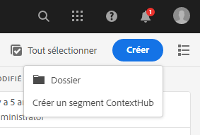
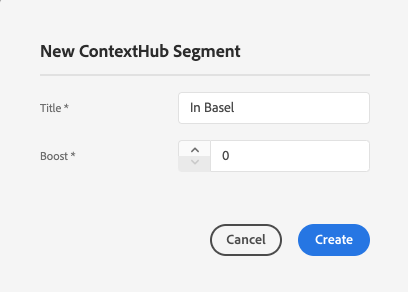
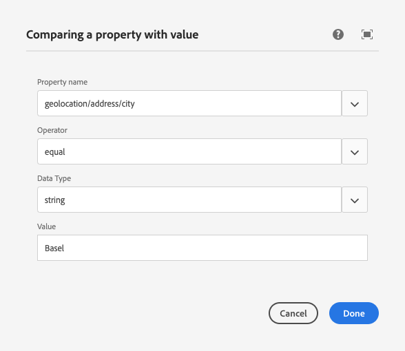
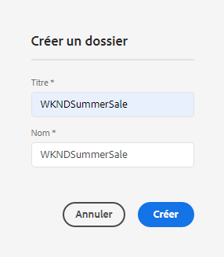
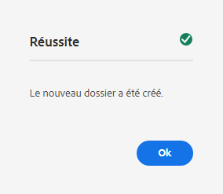
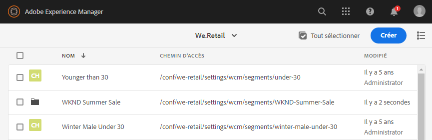
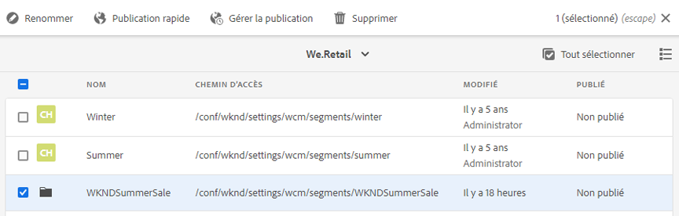
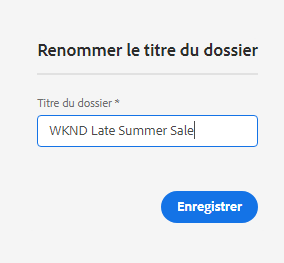
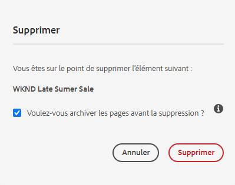
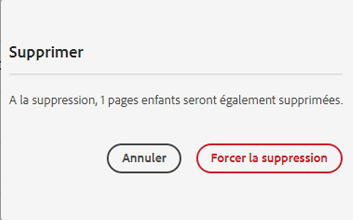

# Configuration de la segmentation avec ContextHub{#configuring-segmentation-with-contexthub}

La segmentation est un élément clé de la création d’une campagne. Voir [Compréhension de la segmentation](segmentation.md) pour plus d’informations sur le fonctionnement de la segmentation et en connaître les termes clés.

Selon les informations que vous avez déjà collectées sur les visiteurs de votre site et les objectifs que vous souhaitez atteindre, définissez les segments et les stratégies nécessaires au contenu ciblé.

Ces segments sont ensuite utilisés pour fournir aux visiteurs du contenu spécifiquement ciblé. Les [activités](activities.md) définies ici peuvent être ajoutées à n’importe quelle page et définissent à quel segment de visiteurs le contenu spécialisé s’applique.

AEM vous permet de personnaliser facilement l’expérience de vos utilisateurs. Il vous permet également de vérifier les résultats de vos définitions de segment.

## Accès aux segments {#accessing-segments}

La console [Audiences](audiences.md) permet de gérer les segments pour ContextHub, ainsi que les audiences de votre compte Adobe Target. Cette documentation couvre la gestion des segments pour ContextHub.

Pour accéder à vos segments, dans la navigation globale, sélectionnez **Navigation > Personnalisation > Audiences**. Sélectionnez votre configuration (par exemple, le site WKND) pour visualiser vos segments :


## Éditeur de segment {#segment-editor}

<!--The **Segment Editor** lets you easily modify a segment. To edit a segment, select a segment in the [list of segments](/help/sites-administering/segmentation.md#accessing-segments) and click the **Edit** button.-->
L&#39;**Éditeur de segment** vous permet de modifier facilement un segment : Pour modifier un segment, sélectionnez un segment dans la liste de segments et cliquez sur le bouton **Modifier**.


Avec l’explorateur de composants, vous pouvez ajouter des conteneurs **ET** et **OU** pour définir la logique de segment, puis ajouter des composants supplémentaires pour comparer les propriétés et les valeurs ou référencer des scripts et d’autres segments afin de définir les critères de sélection (voir la rubrique [Création d’un nouveau segment](#creating-a-new-segment)) pour définir le scénario exact de sélection du segment.

Lorsque l’intégralité de l’instruction est vraie, alors le segment a été résolu. Si plusieurs segments sont applicables, le facteur **Amplifier** est également utilisé. Voir [Création d’un segment](#creating-a-new-segment) pour plus d’informations sur le facteur Amplifier.

>[!CAUTION]
>
>L’éditeur de segment ne vérifie aucune référence circulaire. Par exemple, le segment A fait référence à un autre segment B, qui à son tour référence le segment A. Vous devez vous assurer que vos segments ne contiennent aucune référence circulaire.

### Conteneurs {#containers}

Les conteneurs suivants sont disponibles clé en main et vous permettent de regrouper des comparaisons et des références en vue de l’évaluation booléenne. Ils peuvent être déplacés de l’explorateur de composants vers l’éditeur. Voir la section suivante, [Utilisation de conteneurs ET et OU](#using-and-and-or-containers) pour plus d’informations.

|  |  |
|---|---|
| Conteneur ET | Opérateur ET booléen |
| Conteneur OU | Opérateur OU booléen |

### Comparaisons {#comparisons}

Les comparaisons de segments suivantes sont disponibles par défaut pour évaluer les propriétés des segments. Ils peuvent être déplacés de l’explorateur de composants vers l’éditeur.

|  |  |
|---|---|
| Propriété-Valeur | Compare une propriété d’une boutique à une valeur définie. |
| Propriété-Propriété | Compare une propriété d’une boutique à une autre propriété. |
| Propriété-Référence de segment | Compare une propriété d’une boutique à un autre segment référencé. |
| Propriété-Référence de script | Compare une propriété d’une boutique aux résultats d’un script. |
| Référence de segment-Référence de script | Compare un segment référencé aux résultats d’un script. |

>[!NOTE]
>
>Lors de la comparaison des valeurs, si le type de données de la comparaison n’est pas défini (c’est-à-dire défini sur la détection automatique), le moteur de segmentation de ContextHub compare simplement les valeurs comme le ferait JavaScript. Il ne projette pas de valeurs sur leurs types inattendus, ce qui peut donner des résultats trompeurs. Par exemple :
>
>`null < 30 // will return true`
>
>Par conséquent, lors de la [création d’un segment](#creating-a-new-segment), vous devez sélectionner un **type de données** chaque fois que les types de valeurs comparées sont connus. Par exemple :
>
>Lorsque vous comparez la propriété `profile/age`, vous savez déjà que le type comparé sera un **nombre**. Donc, même si la propriété `profile/age` n’est pas définie, une comparaison `profile/age` inférieure à 30 retourne **faux**, comme prévu.

### Références {#references}

Les références suivantes sont disponibles clé en main pour établir un lien direct à un script ou un segment différent. Ils peuvent être déplacés de l’explorateur de composants vers l’éditeur.

|  |  |
|---|---|
| Référence de segment | Évalue le segment référencé. |
| Référence de script | Évalue le script référencé. Pour plus d’informations, voir la section suivante [Utilisation de références de script](#using-script-references). |

## Création d’un segment {#creating-a-new-segment}

Pour définir votre nouveau segment, procédez comme suit :

1. Après avoir [accédé aux segments](#accessing-segments), [naviguez jusqu’au dossier](#organizing-segments) dans lequel vous souhaitez créer le segment.

1. Sélectionnez le bouton **Créer** et sélectionnez **Créer un segment ContextHub**.

   

1. Dans le **Nouveau segment ContextHub**, saisissez un titre pour le segment et une valeur d’amplification si nécessaire, puis sélectionnez **Créer**.

   

   Chaque segment comporte un paramètre d’amplification utilisé comme facteur de pondération. Une valeur plus élevée indique que le segment est sélectionné de préférence à un segment ayant une valeur plus basse dans les cas où plusieurs segments sont valides.

   * Valeur minimale : `0`
   * Valeur maximale : `1000000`

1. Dans la console des segments, modifiez le segment créé pour l’ouvrir dans l’éditeur de segments.
1. Faites glisser une comparaison ou une référence vers l’Éditeur de segments qui apparaîtra dans le conteneur ET par défaut.
1. Double-sélectionnez l’option de configuration de la nouvelle référence ou du nouveau segment pour éditer les paramètres spécifiques. Dans cet exemple, des personnes situées à Bâle font l’objet d’un test.

   

   Si possible, veillez à toujours définir un **type de données** pour vous assurer que vos comparaisons sont évaluées correctement. Voir [Comparaisons](#comparisons) pour plus d’informations.

1. Cliquez sur **Terminé** pour enregistrer votre définition :
1. Ajoutez d’autres composants, en fonction de vos besoins. Vous pouvez formuler des expressions booléennes à l’aide des composants de conteneur pour des comparaisons ET et OU (voir la rubrique [Utilisation des conteneurs ET et OU](#using-and-and-or-containers) ci-dessous). Avec l’Éditeur de segment, vous pouvez supprimer les composants qui ne sont plus nécessaires ou les faire glisser vers de nouveaux emplacements dans l’instruction.

### Utilisation des conteneurs ET et OU {#using-and-and-or-containers}

Avec les composants de conteneur ET et OU, vous pouvez créer des segments complexes dans AEM. Pour ce faire, il est utile de tenir compte de quelques points de base :

* Le niveau supérieur de la définition est toujours le conteneur ET qui est initialement créé ; cela ne peut pas être changé, mais n’a pas d’effet sur le reste de votre définition de segment.
* Assurez-vous que l’imbrication de votre conteneur a un sens. Les conteneurs peuvent être considérés comme des crochets de votre expression booléenne.

L’exemple suivant permet de sélectionner les visiteurs qui sont considérés comme appartenant à notre groupe cible Suisse :

```text
 People in Basel

 OR

 People in Zürich
```

Commencez par placer un composant de conteneur OU dans le conteneur ET par défaut. Dans le conteneur OU, vous pouvez ajouter la propriété ou les composants de référence.


Vous pouvez imbriquer plusieurs opérateurs ET et OU selon les besoins.

### Utilisation de références de script {#using-script-references}

À l’aide du composant Référence de script, l’évaluation d’une propriété de segment peut être déléguée à un script externe. Une fois le script correctement configuré, il peut être utilisé comme tout autre composant d’une condition de segment.

#### Définition d’une référence de script {#defining-a-script-to-reference}

1. Ajoutez le fichier `contexthub.segment-engine.scripts` à la propriété clientlib.
1. Implémentez une fonction qui renvoie une valeur. Par exemple :

   ```javascript
   ContextHub.console.log(ContextHub.Shared.timestamp(), '[loading] contexthub.segment-engine.scripts - script.profile-info.js');
   
   (function() {
       'use strict';
   
       /**
        * Sample script returning profile information. Returns user info if data is available, false otherwise.
        *
        * @returns {Boolean}
        */
       var getProfileInfo = function() {
           /* let the SegmentEngine know when script should be re-run */
           this.dependOn(ContextHub.SegmentEngine.Property('profile/age'));
           this.dependOn(ContextHub.SegmentEngine.Property('profile/givenName'));
   
           /* variables */
           var name = ContextHub.get('profile/givenName');
           var age = ContextHub.get('profile/age');
   
           return name === 'Joe' && age === 123;
       };
   
       /* register function */
       ContextHub.SegmentEngine.ScriptManager.register('getProfileInfo', getProfileInfo);
   
   })();
   ```

1. Enregistrez le script avec `ContextHub.SegmentEngine.ScriptManager.register`.

Si le script dépend de propriétés supplémentaires, il doit appeler `this.dependOn()`. Par exemple, si le script dépend de `profile/age` :

```javascript
this.dependOn(ContextHub.SegmentEngine.Property('profile/age'));
```

#### Référencement d’un script {#referencing-a-script}

1. Créer un segment ContextHub.
1. Ajouter le composant **Référence de script** à l’emplacement souhaité du segment.
1. Ouvrez la boîte de dialogue de modification du composant **Référence de script**. S’il est [correctement configuré](#defining-a-script-to-reference), le script doit être disponible dans le menu déroulant **Nom du script**.

## Organisation des segments {#organizing-segments}

Si vous disposez de plusieurs segments, ils peuvent devenir difficiles à gérer sous la forme d’une liste brute. Dans ce cas, il peut s’avérer utile de créer des dossiers pour gérer ces segments.

### Créer un dossier {#create-folder}

1. Après [ avoir accédé aux segments](#accessing-segments), cliquez sur le bouton **Créer** et sélectionnez **Dossier**.

   

1. Indiquez un **titre** et un **nom** pour votre dossier.
   * Le **titre** doit être descriptif.
   * Le **nom** deviendra celui du nœud dans le référentiel.
      * Il sera généré automatiquement en fonction du titre et ajusté selon les [conventions de dénomination AEM](/help/implementing/developing/introduction/naming-conventions.md).
      * Il peut être adapté si nécessaire.

   

1. Sélectionnez **Créer**.

   

1. Le dossier s’affiche dans la liste des segments.
   * La manière dont vous triez vos colonnes aura une incidence sur l’emplacement d’affichage du nouveau dossier dans la liste.
   * Vous pouvez sélectionner les en-têtes de colonne pour ajuster votre tri.

     

### Modifier les dossiers existants {#modify-folders}

1. Après avoir [ accédé aux segments](#accessing-segments), sélectionnez le dossier à modifier pour le sélectionner.

   

1. Sélectionnez **Renommer** dans la barre d’outils pour renommer le dossier.

1. Fournissez un nouveau **Titre du dossier** et sélectionnez **Enregistrer**.

   

>[!NOTE]
>
>Lorsque vous renommez des dossiers, seul le titre peut être modifié. Le nom ne peut pas être modifié.

### Supprimer un dossier

1. Après avoir [ accédé aux segments](#accessing-segments), sélectionnez le dossier à modifier pour le sélectionner.

   

1. Sélectionnez **Supprimer** dans la barre d’outils pour supprimer le dossier.

1. Une boîte de dialogue présente une liste de dossiers sélectionnés pour suppression.

   

   * Sélectionnez **Supprimer** pour confirmer.
   * Sélectionnez **Annuler** pour abandonner.

1. Si l’un des dossiers sélectionnés contient des sous-dossiers ou des segments, leur suppression doit être confirmée.

   

   * Sélectionnez **Forcer la suppression** pour confirmer.
   * Sélectionnez **Annuler** pour abandonner.

>[!NOTE]
>
> Il est impossible de déplacer un segment d’un dossier à un autre.

## Test de l’application d’un segment {#testing-the-application-of-a-segment}

Une fois le segment défini, les résultats potentiels peuvent être testés avec **[ContextHub](contexthub.md).**

1. Affichez l’aperçu d’une page.
1. Cliquez sur l’icône ContextHub pour afficher la barre d’outils ContextHub.
1. Sélectionnez une personne qui correspond au segment que vous avez créé.
1. ContextHub résout les segments applicables pour la personne sélectionnée

Par exemple, notre définition de segment simple identifiant les utilisateurs à Bâle repose sur l’emplacement de l’utilisateur. Le chargement d’une personne spécifique correspondant à ces critères indique si ce segment a été résolu avec succès :


Ou s’il n’est pas résolu :


>[!NOTE]
>
>Toutes les caractéristiques sont résolues immédiatement, bien que la plupart ne soient modifiées qu’au rechargement de la page.

Des tests comme celui-ci peuvent également être effectués sur les pages de contenu et en combinaison avec du contenu ciblé et des **Activités** et **Expériences** connexes.

Si vous avez configuré une activité et une expérience, vous pouvez tester facilement votre segment avec l’activité. Pour plus d’informations sur la configuration d’une activité, consultez la [documentation sur la création de contenu ciblé](targeted-content.md).

1. En mode de modification d’une page sur laquelle vous avez configuré du contenu ciblé, vous pouvez constater que le contenu est ciblé par le biais d’une icône de flèche sur le contenu.
1. Basculez vers le mode Aperçu et, avec ContextHub, passez à une personne qui ne correspond pas à la segmentation configurée pour l’expérience.
1. Passez à une personne qui correspond à la segmentation configurée pour l’expérience et constatez que l’expérience change en conséquence.

## Utilisation de votre segment {#using-your-segment}

Les segments sont utilisés afin de contrôler le contenu affiché pour des audiences cible spécifiques. Voir [Gestion des audiences](audiences.md) pour plus d’informations sur les audiences et les segments et [Création de contenu ciblé](targeted-content.md) pour plus d’informations sur l’utilisation des audiences et des segments afin de cibler du contenu.
