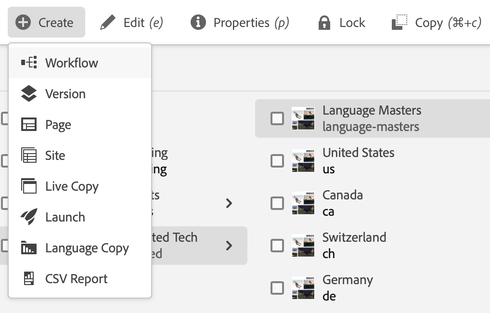

# Guide de démarrage rapide pour la création {#quick-guide-to-authoring}

Démarrez ici pour obtenir un guide rapide et de haut niveau pour commencer à créer du contenu à l’aide de la console **Sites**.

>[!TIP]
>
>Ce guide de démarrage rapide se concentre sur la création de sites, mais la plupart des concepts s’appliquent largement à d’autres consoles.

## Tout commence dans la console Sites. {#sites-console}

Que vous souhaitiez créer du contenu ou afficher et gérer votre contenu existant, l’aperçu central pour vous est la console **Sites**.

Lorsque vous vous connectez pour la première fois à AEM, vous accédez à l’écran de navigation globale. Appuyez ou cliquez simplement sur **Sites** pour ouvrir la console **Sites**.

Pour accéder à la navigation globale à partir de n’importe quel autre emplacement d’AEM, appuyez ou cliquez sur le lien **Adobe Experience Manager** en haut à gauche de tout écran AEM, ce qui ouvre une liste déroulante de la navigation globale.

Une fois dans la console **Sites**, votre contenu est simple à parcourir et est présenté par défaut dans un mode Colonnes.

## Vues {#views}

Par défaut, la console **Sites** s’ouvre dans la vue **Colonne**. Chaque niveau de hiérarchie est affiché sous la forme d’une colonne, qui se prête bien au contenu organisé hiérarchiquement sur le web.

Appuyez ou cliquez sur une entrée dans une colonne pour la sélectionner ou ouvrir le niveau suivant vers le bas de la hiérarchie. Un élément sélectionné est indiqué par une coche.

Deux vues supplémentaires sont disponibles :

* **Mode Carte** - Ce mode présente chaque entrée comme une carte facilement manipulable, rendant ainsi des options supplémentaires facilement accessibles.
* **Mode Liste** : présente un niveau unique d’une hiérarchie sous la forme d’une liste unique, fournissant plus de détails sur les éléments individuels.

Utilisez le sélecteur de vue situé en haut à gauche de l’écran pour passer d’une vue à l’autre. Ce document utilise la vue Colonnes par défaut.

## Navigation dans le contenu {#navigating}

**Mode Colonnes** présente le contenu sous la forme d’une série de colonnes en cascade. La sélection d’un élément dans la colonne active affiche ses détails dans la colonne suivante à droite s’il s’agit d’un document ou affiche le contenu du niveau de hiérarchie suivant s’il s’agit d’un dossier.

Ainsi, vous pouvez parcourir la structure de contenu vers le haut et vers le bas.

Pour passer rapidement d’un niveau à l’autre, vous pouvez utiliser le chemin de navigation situé en haut de la page.

Vous pouvez également, à tout moment, utiliser l’icône de recherche dans le coin supérieur droit de l’écran pour localiser un contenu particulier.

La recherche s’affiche sous la forme d’une liste déroulante sur l’ensemble de la console. Saisissez les termes de recherche pour trouver votre contenu.

## Création de contenu {#creating}

Pour créer une page, accédez simplement à l’emplacement où vous souhaitez qu’elle se trouve dans la hiérarchie de contenu, puis appuyez ou cliquez sur le bouton **Créer** de la barre d’outils.

Les options disponibles dépendent du contexte. Si vous êtes à la racine de votre structure de contenu, vous avez la possibilité de créer un site entièrement nouveau. Sinon, vous pouvez créer des pages ou d’autres contenus liés aux pages.

En fonction de ce que vous avez choisi de créer, l’assistant approprié vous guidera tout au long du processus de création.

## Modifier le contenu {#editing}

Pour modifier une page, appuyez ou cliquez dessus pour la sélectionner dans la console **Sites**. Ensuite, dans la barre d’outils qui s’affiche, appuyez ou cliquez sur l’icône **Modifier** .

La page s’ouvre alors dans l’éditeur approprié au contenu.

Si vous souhaitez simplement mettre à jour les propriétés d’une page comme les balises ou son nom, vous pouvez appuyer ou cliquer sur l’icône **Propriétés** de la barre d’outils.

## Organisation du contenu {#organizing}

Pour déplacer ou copier une page, sélectionnez la page dans la console, puis, dans la barre d’outils, appuyez ou cliquez sur **Déplacer** ou **Copier**. Un assistant vous guide tout au long des étapes de déplacement ou de copie, en définissant le nom et l’emplacement de la page résultant du déplacement.

## Publication de contenu {#publishing}

Lorsque vous avez terminé d’apporter les modifications souhaitées à votre contenu à l’aide de la console **Sites**, vous pouvez publier le contenu. Sélectionnez le contenu à publier et appuyez ou cliquez sur l’icône **Quick Publish** dans la barre d’outils.

Confirmez la publication en appuyant ou en cliquant de nouveau sur **Publish** dans la boîte de dialogue.

## Ressources supplémentaires {#additional-resources}

Il s’agit simplement d’une brève introduction à la puissance de la création de contenu Sites et, en tant que tel, ne couvre pas tous les sujets ou toutes les options.

Voici d’autres ressources qui approfondissent toutes les fonctionnalités de la console et discutent des sujets relatifs à la création de contenu en général.

* [Manipulation de base](/help/sites-cloud/authoring/basic-handling.md)
* [Concepts de création](/help/sites-cloud/authoring/author-publish.md)
* [La console Sites](/help/sites-cloud/authoring/sites-console/introduction.md)
* [Éditeur de page](/help/sites-cloud/authoring/page-editor/introduction.md)
* [Publier des pages](/help/sites-cloud/authoring/sites-console/publishing-pages.md)
