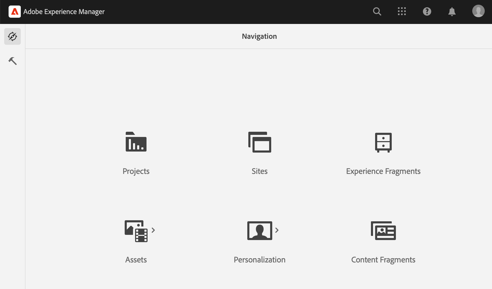
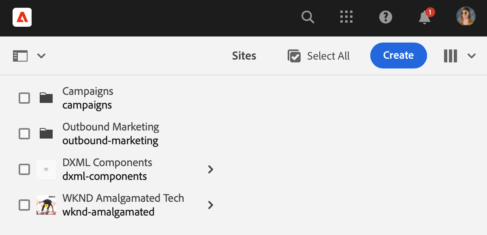
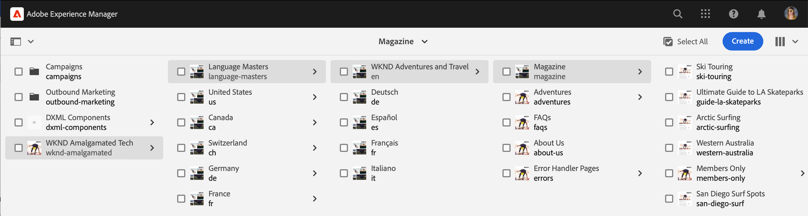
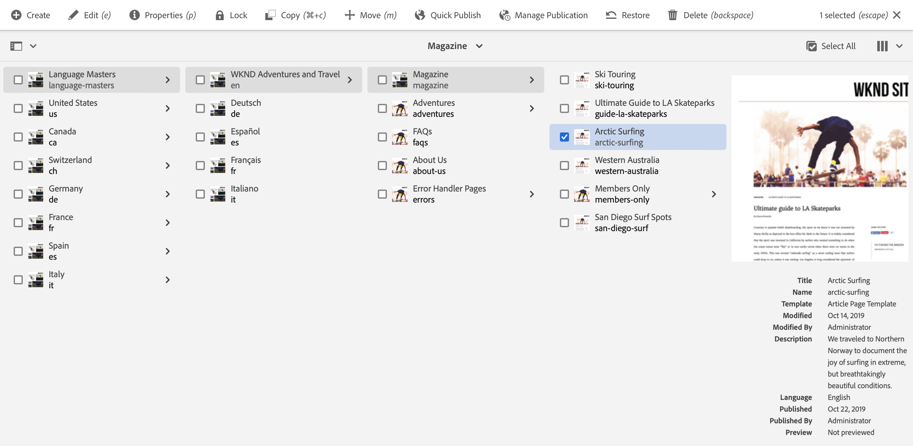
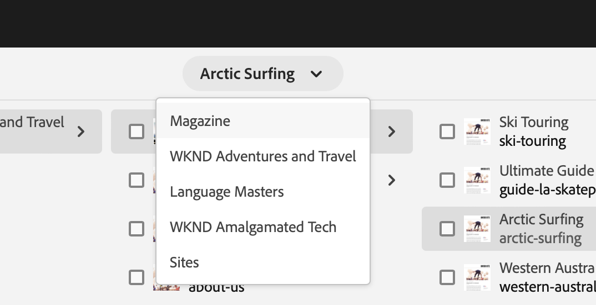
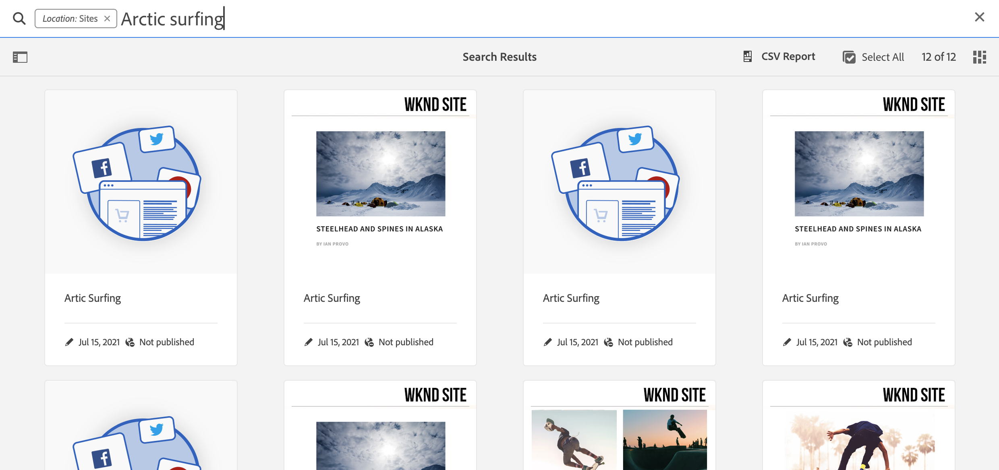
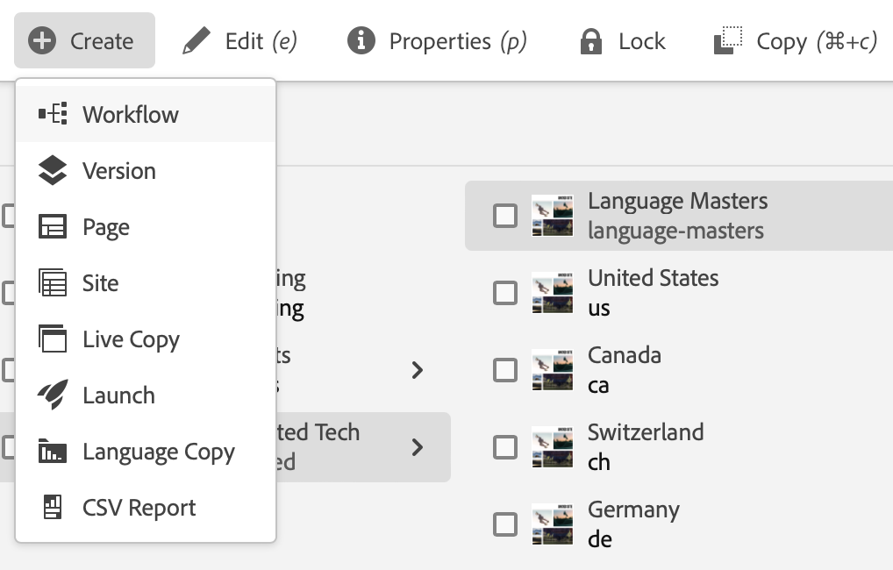
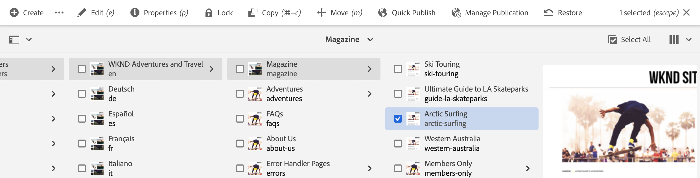
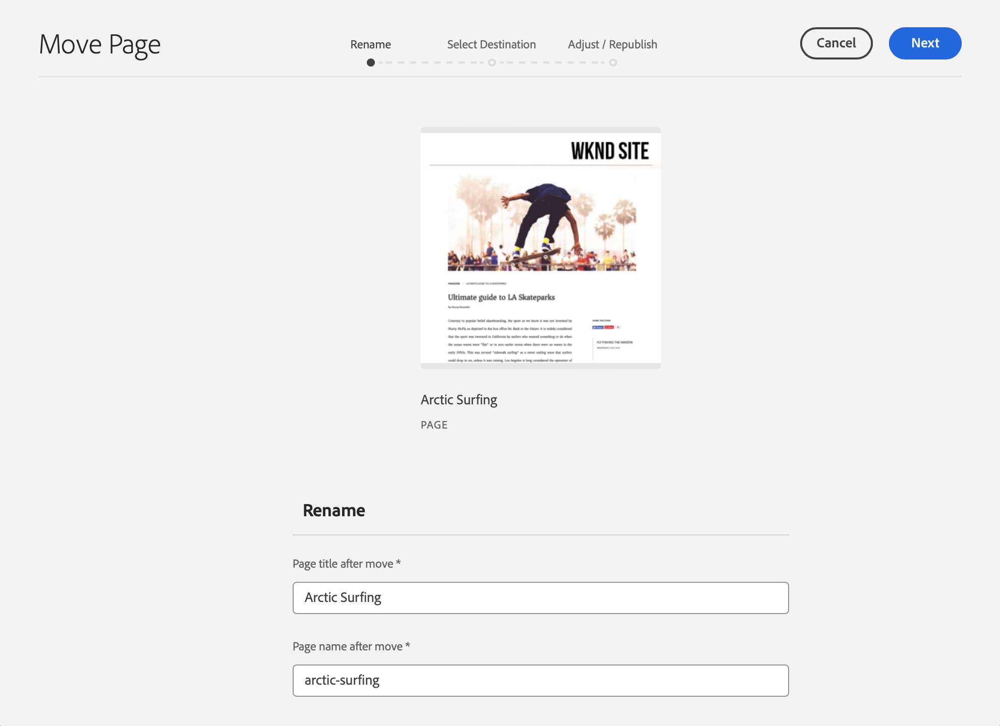
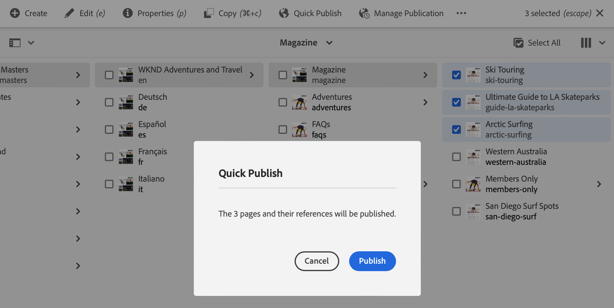

# Guide de démarrage rapide pour la création {#quick-guide-to-authoring}

Commencez ici pour obtenir un guide rapide et détaillé sur la création de contenu à l’aide de la console **Sites**.

>[!TIP]
>
>Ce guide de démarrage rapide se concentre sur la création de sites. Cependant, la plupart des concepts sont largement applicables à d’autres consoles.

## Tout commence dans la console Sites . {#sites-console}

Que vous souhaitiez créer du contenu ou afficher et gérer votre contenu existant, l’aperçu central pour vous est la console **Sites**.

Lorsque vous vous connectez pour la première fois à AEM, l’écran de navigation globale s’affiche. Il vous suffit d’appuyer ou de cliquer sur **Sites** pour ouvrir la console **Sites**.

Pour accéder à la navigation globale à partir de n’importe quel autre emplacement d’AEM, appuyez ou cliquez sur le lien **Adobe Experience Manager** en haut à gauche de n’importe quel écran AEM, qui affiche une superposition déroulante de la navigation globale.

Une fois dans la console **Sites**, votre contenu est simple à parcourir et s’affiche par défaut sous forme de colonnes.

## Vues {#views}

Par défaut, la console **Sites** s’ouvre en mode **Colonne**. Chaque niveau de hiérarchie s’affiche sous la forme d’une colonne, ce qui se prête bien au contenu web organisé de manière hiérarchique.

Appuyez ou cliquez sur une entrée dans une colonne pour la sélectionner ou ouvrir le niveau suivant dans la hiérarchie. Un élément sélectionné est signalé par une coche.

Deux vues supplémentaires sont disponibles :

* **Vue Carte** - Cette vue présente chaque entrée sous la forme d’une carte facile à manipuler, ce qui rend les options supplémentaires facilement accessibles.
* **Vue Liste** - Présente un seul niveau d’une hiérarchie sous la forme d’une liste unique, fournissant plus de détails sur les éléments individuels.

Utilisez le sélecteur de vue en haut à gauche de l’écran pour basculer entre les vues. Ce document utilise la vue Colonnes par défaut.

## Navigation dans le contenu {#navigating}

Le **mode Colonnes** présente le contenu sous la forme d’une série de colonnes en cascade. Si vous sélectionnez un élément dans la colonne active, les détails l&#39;apparaissent dans la colonne suivante à droite s&#39;il s&#39;agit d&#39;un document ou le contenu du niveau hiérarchique suivant s&#39;il s&#39;agit d&#39;un dossier s&#39;affiche.

Vous pouvez ainsi parcourir la structure de votre contenu de haut en bas.

Pour passer rapidement d’un niveau à l’autre, vous pouvez utiliser les chemins de navigation en haut de la page.

Vous pouvez également utiliser à tout moment l’icône de recherche en haut à droite de l’écran pour localiser un contenu particulier.

La recherche s’affiche sous forme de liste déroulante superposée sur l’ensemble de la console. Saisissez les termes de recherche pour trouver votre contenu.

## Création de contenu {#creating}

Pour créer une page, il vous suffit d’accéder à l’emplacement souhaité dans la hiérarchie du contenu, puis d’appuyer ou de cliquer sur le bouton **Créer** de la barre d’outils.

Les options disponibles dépendent du contexte. Si vous êtes à la racine de votre structure de contenu, vous avez la possibilité de créer un site entièrement nouveau. Sinon, vous pouvez créer des pages ou d’autres contenus liés aux pages.

Selon ce que vous choisissez de créer, l’assistant approprié commence à vous guider tout au long du processus de création.

## Modifier le contenu {#editing}

Pour modifier une page, appuyez ou cliquez pour sélectionner la page dans la console **Sites**. Ensuite, dans la barre d’outils qui s’affiche, appuyez ou cliquez sur l’icône **Modifier**.

La page s’ouvre alors dans l’éditeur approprié au contenu.

Si vous souhaitez simplement mettre à jour les propriétés d’une page telles que les balises ou son nom, vous pouvez appuyer ou cliquer sur l’icône **Propriétés** dans la barre d’outils.

## Organisation du contenu {#organizing}

Pour déplacer ou copier une page, sélectionnez-la dans la console, puis dans la barre d’outils, appuyez ou cliquez sur **Déplacer** ou **Copier**. Un assistant s’affiche pour vous guider tout au long des étapes de déplacement ou de copie, afin de définir le nom et l’emplacement de la page obtenue.

## Publication de contenu {#publishing}

Lorsque vous avez terminé d’apporter les modifications souhaitées à votre contenu à l’aide de la console **Sites**, vous pouvez publier le contenu. Sélectionnez le contenu à publier, puis appuyez ou cliquez sur l’icône **Publication rapide** de la barre d’outils.

Confirmez la publication en appuyant ou en cliquant sur **Publier** dans la boîte de dialogue.

## Ressources supplémentaires {#additional-resources}

Il s’agit simplement d’une brève introduction sur la puissance de la création de contenu Sites et, en tant que telle, ne couvre pas tous les sujets ou toutes les options.

Voici d’autres ressources qui approfondissent toutes les fonctionnalités de la console et abordent des sujets relatifs à la création de contenu en général.

* [Manipulation de base](/help/sites-cloud/authoring/basic-handling.md)
* [Concepts de création](/help/sites-cloud/authoring/author-publish.md)
* [Console Sites](/help/sites-cloud/authoring/sites-console/introduction.md)
* [Éditeur de page](/help/sites-cloud/authoring/page-editor/introduction.md)
* [Publier des pages](/help/sites-cloud/authoring/sites-console/publishing-pages.md)
