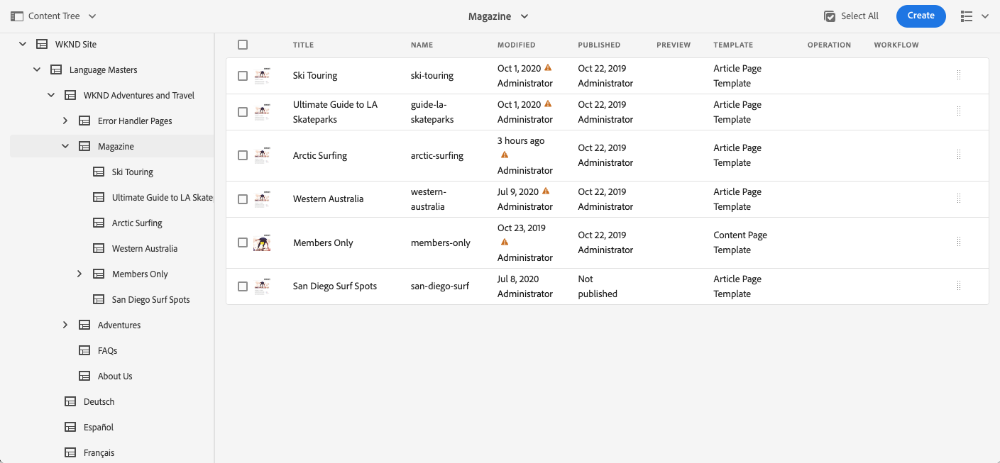

# Panneau latéral de la console Sites {#side-panel}

Découvrez comment utiliser le panneau latéral dans la console AEM **Sites** pour mieux comprendre votre contenu et naviguer dans celui-ci.

## Orientation {#orientation}

Le panneau latéral est fermé par défaut lorsque vous accédez à la console **Sites**. Ainsi, l’écran est entièrement dédié à votre contenu.

Appuyez ou cliquez sur l’icône **Panneau latéral** dans la barre d’outils de la console **Sites** pour activer le panneau latéral et choisir votre affichage du contenu.

* [Contenu uniquement](#content-only)
* [Arborescence de contenu](#content-tree)
* [Chronologie](#timeline)
* [Références](#references)
* [Site](#site)
* [Filtrer](#filter)
* [Configurer Analytics](#setup-analytics)

La vue sélectionnée est indiquée par une coche bleue dans la liste déroulante et l’icône du panneau latéral de la barre d’outils est mise à jour avec le nom de la vue sélectionnée.

## Contenu uniquement {#content-only}

Cette vue du panneau latéral la désactive, c’est-à-dire qu’elle affiche uniquement le contenu de votre site.

>[!TIP]
>
>Utilisez le raccourci clavier `´` accent grave/touche arrière pour passer à la vue de contenu uniquement du panneau latéral.

## Arborescence de contenu {#content-tree}

Cette vue du panneau latéral affiche le contenu dans une arborescence. L’arborescence de contenu peut être utilisée pour parcourir rapidement la hiérarchie du site dans le panneau latéral et afficher de nombreuses informations sur les pages du dossier actif.

Un chevron pointant vers la droite en regard d’un élément de l’arborescence indique un nœud qui peut être développé pour afficher ses enfants. Appuyez ou cliquez sur le chevron pour afficher les enfants.

La console affiche le contenu de l’élément sélectionné dans l’arborescence de contenu.

Grâce au panneau latéral de l’arborescence de contenu associé à un mode Liste ou Carte, vous pouvez facilement voir la structure hiérarchique du projet, naviguer dans la structure de contenu à l’aide du panneau latéral de l’arborescence de contenu et afficher les informations détaillées de la page en mode Liste.

>[!TIP]
>
>* Utilisez le raccourci clavier `Alt+1` pour passer à l’arborescence de contenu du panneau latéral.
>* Après avoir sélectionné une entrée dans la hiérarchie, vous pouvez naviguer rapidement dans la hiérarchie à l’aide des touches directionnelles.
>* Reportez-vous à la section [Raccourcis clavier](/help/sites-cloud/authoring/sites-console/keyboard-shortcuts.md) pour plus d’informations.

## La chronologie {#timeline}

La chronologie peut être utilisée pour afficher les événements qui ont affecté la ressource sélectionnée. Vous pouvez également l’utiliser pour démarrer certains événements, tels que des workflows ou des versions.

Le panneau latéral **Chronologie** vous permet d’afficher différents événements liés à un élément sélectionné, sélectionnable en tant que types dans une liste déroulante :

* Commentaires
* [Annotations](/help/sites-cloud/authoring/page-editor/annotations.md)
* [Activités](/help/sites-cloud/authoring/personalization/activities.md)
* [Lancements](/help/sites-cloud/authoring/launches/overview.md)
* [Versions](/help/sites-cloud/authoring/sites-console/page-versions.md)
* [Workflows](/help/sites-cloud/authoring/workflows/overview.md)
   * Notez qu’aucune information ne s’affiche pour les workflows transitoires, car aucune information historique n’est enregistrée pour ceux-ci.<!--With the exception of [transient workflows](/help/sites-developing/workflows.md#transient-workflows) as no history information is saved for these-->
* Tout afficher

En outre, vous pouvez ajouter/afficher des commentaires sur l’élément sélectionné à l’aide de la zone **Commentaire** affichée au bas de la liste des événements. La saisie d’un commentaire suivi de `Return` enregistre le commentaire. Vous pouvez l’afficher en sélectionnant **Commentaires** ou **Tout afficher**.

Dans la console **Sites**, vous pouvez également accéder à des fonctionnalités supplémentaires à l’aide du bouton représentant des points de suspension en regard du champ **Commentaire**.

* [enregistrer une version ;](/help/sites-cloud/authoring/sites-console/page-versions.md)
* [démarrer un workflow.](/help/sites-cloud/authoring/workflows/applying.md)

>[!TIP]
>
>* Utilisez le raccourci clavier `Alt+2` pour passer à la vue chronologique du panneau latéral.
>* Reportez-vous à la section [Raccourcis clavier](/help/sites-cloud/authoring/sites-console/keyboard-shortcuts.md) pour plus d’informations.

## Références {#references}

La vue **Références** affiche une liste des types de références vers ou depuis la ressource sélectionnée dans la console.

Sélectionnez le type de référence approprié pour en savoir plus. Dans certains cas, d’autres actions sont disponibles lorsque vous sélectionnez une référence particulière, notamment :

* La section **Liens entrants** fournit une liste de pages qui font directement référence à la page sélectionnée, ainsi qu’un accès direct à l’une de ces pages **Modifier** lorsque vous sélectionnez un lien spécifique.
   * Cette option affiche uniquement les liens statiques, et non les liens générés dynamiquement, comme ceux du composant Liste .
* [Lancements](/help/sites-cloud/authoring/launches/overview.md) donne accès aux lancements associés.
* [Live Copies](/help/sites-cloud/administering/msm/overview.md) affiche les chemins d’accès à toutes les Live Copies basées sur la ressource sélectionnée.
* Le [plan directeur](/help/sites-cloud/administering/msm/best-practices.md) fournit des détails et la possibilité de diverses actions.
* [Copies de langue](/help/sites-cloud/administering/translation/managing-projects.md#creating-translation-projects-using-the-references-panel), fournit des détails et diverses actions

## Site {#site}

L’affichage **Site** du panneau latéral affiche les détails des sites [créés à l’aide d’un modèle de site](/help/sites-cloud/administering/site-creation/create-site.md).

Consultez le document [Utilisation du panneau Site pour gérer le thème de votre site](/help/sites-cloud/administering/site-creation/site-rail.md) pour plus d’informations sur l’utilisation du panneau pour gérer le [thème de votre site](/help/sites-cloud/administering/site-creation/site-themes.md).

Si vous n’avez pas encore configuré le pipeline front-end pour activer la création de sites basés sur des thèmes, le panneau latéral vous proposera cette option.

>[!TIP]
>
>Vous trouverez une description de bout en bout du processus de création d’un site à partir d’un modèle et de personnalisation de son thème dans le [Parcours de création rapide de site](/help/journey-sites/quick-site/overview.md).

## Filtrer {#filter}

Le panneau **Filtre** est similaire à la fonction [recherche](/help/sites-cloud/authoring/search.md) avec les filtres d’emplacement appropriés déjà définis, ce qui vous permet de filtrer davantage le contenu que vous souhaitez afficher.

Contrairement aux autres vues du panneau latéral, pour passer à une autre vue, appuyez ou cliquez sur la `X` dans le champ de recherche.

## Configurer Analytics {#setup-analytics}

Cette vue vous permet de configurer rapidement Adobe Analytics pour un site sélectionné.

