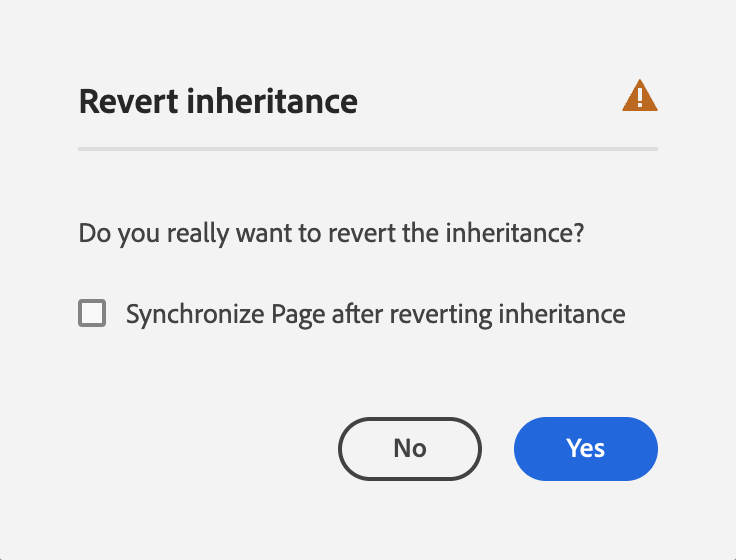

# Modification des propriétés de page {#page-properties}

Découvrez comment modifier [les propriétés d’une page](/help/sites-cloud/authoring/sites-console/page-properties.md) et modifier le comportement de la page ainsi que sa gestion.

>[!TIP]
>
>Pour plus d’informations sur les propriétés de page disponibles, consultez le document [Propriétés de la page.](/help/sites-cloud/authoring/sites-console/page-properties.md)

## Où modifier les propriétés de page {#where}

Vous pouvez modifier les propriétés de page à plusieurs endroits dans AEM.

* [À partir du &#x200B;](#from-the-sites-console)
* [Dans l’éditeur de page](#from-the-page-editor)
* [À partir de l’éditeur universel](#from-the-universal-editor)

La console Sites vous permet également de [modifier les propriétés de plusieurs pages à la fois](#editing-multiple-pages).

### À partir de la console Sites {#from-the-sites-console}

Lorsque vous parcourez votre contenu dans la console **Sites**, vous pouvez utiliser le bouton **Propriétés** de la barre d’outils pour modifier les propriétés de la page :

1. À l’aide de la console [**Sites**](/help/sites-cloud/authoring/sites-console/introduction.md) accédez à l’emplacement de la page pour laquelle vous souhaitez afficher et modifier les propriétés.
1. Sélectionnez l’option **Propriétés** pour la page requise, en utilisant :
   * [Actions rapides](/help/sites-cloud/authoring/basic-handling.md#quick-actions)
   * [Mode de sélection](/help/sites-cloud/authoring/basic-handling.md#selecting-resources)
   * Les propriétés de la page sont affichées dans les onglets appropriés.
1. Affichez ou modifiez les propriétés selon les besoins.
1. Puis cliquez sur **Enregistrer** pour enregistrer vos modifications et sur **Fermer** pour revenir à la console.

### Dans l’éditeur de page {#from-the-page-editor}

Lors de la modification d’une page à l’aide de l’éditeur de page, vous pouvez utiliser **Informations sur la page** pour définir les propriétés de la page :

1. Dans l’[Éditeur de page](/help/sites-cloud/authoring/page-editor/introduction.md), ouvrez la page dont vous souhaitez modifier les propriétés.
1. Sélectionnez l’icône **Informations sur la page** pour ouvrir le menu de sélection :
1. Sélectionnez **Ouvrir les propriétés** et une boîte de dialogue s’ouvre pour vous permettre de modifier les propriétés, triées selon l’onglet approprié. Les boutons suivants sont disponibles à droite de la barre d’outils :
   * **Annuler**
   * **Enregistrez et fermez**
1. Utilisez le bouton **Enregistrer et fermer** pour enregistrer les modifications.

## À partir de l’éditeur universel {#from-the-universal-editor}

Lors de la modification d’une page à l’aide de l’éditeur universel, vous pouvez utiliser l’icône **Propriétés de la page** pour modifier les propriétés :

1. Dans l’[éditeur universel](/help/sites-cloud/authoring/universal-editor/authoring.md#page-properties), ouvrez la page dont vous souhaitez modifier les propriétés.
1. Sélectionnez l’icône **Propriétés de la page** dans la barre d’outils.
1. La fenêtre des propriétés de page d’AEM s’ouvre dans un nouvel onglet du navigateur comme si vous étiez en train de modifier les propriétés de page à partir de l’[Éditeur de page.](#from-the-page-editor) Les boutons suivants sont disponibles à droite de la barre d’outils :
   * **Annuler**
   * **Enregistrez et fermez**
1. Utilisez le bouton **Enregistrer et fermer** pour enregistrer les modifications.
1. Revenez à l’onglet du navigateur de l’éditeur universel.

## Modification des propriétés de plusieurs pages {#editing-multiple-pages}

Dans la console [**Sites**](/help/sites-cloud/authoring/sites-console/introduction.md) vous pouvez sélectionner plusieurs pages, puis utiliser **Afficher les propriétés** pour afficher et/ou modifier les propriétés de la page. On parle alors de modification en bloc des propriétés de la page.

Vous pouvez sélectionner plusieurs pages à des fins de modification en bloc de différentes manières, notamment :

* lorsque vous parcourez la console **Sites** ;
* après avoir utilisé **Rechercher** pour localiser un ensemble de pages.

Sélectionnez les pages et cliquez ou appuyez ensuite sur l’option **Propriétés** pour afficher les propriétés en bloc :

Vous ne pouvez modifier en masse que des pages qui :

* Partagent le même type de ressource.
* ne font pas partie d’une Live Copy ;
   * Si l’une des pages sélectionnées fait partie d’une Live Copy, un message s’affiche lorsque les propriétés sont ouvertes.

La fenêtre de modification en bloc est divisée en deux verticalement :

* La partie gauche répertorie les pages que vous avez sélectionnées en vue de la modification en bloc.
   * Vous pouvez sélectionner/désélectionner les pages selon vos besoins.
   * Par défaut, tous sont sélectionnés.
* La droite est une liste des propriétés [pouvant être modifiées en bloc](/help/implementing/developing/extending/bulk-editor.md).
   * Comme pour l’affichage des propriétés d’une seule page, les propriétés sont classées sous les onglets.
   * Les propriétés qui sont disponibles sur toutes les pages sélectionnées, et qui ont été définies explicitement comme étant disponibles pour la modification en masse, sont visibles.
   * Si vous réduisez la sélection à une seule page, toutes les propriétés sont alors visibles.
   * Seules les propriétés ayant une valeur commune s’affichent.
   * Lorsque le champ comporte plusieurs valeurs (des balises, par exemple), les valeurs ne s’affichent que lorsque *toutes* sont communes. Si seulement certains sont communs, ils ne seront affichés que lors de la modification.
* Les champs qui sont communs, mais pour lesquels des valeurs différentes sont renseignées dans les différentes pages, sont signalés par une valeur spéciale, par exemple par le texte `<Mixed Entries>`.

Vous pouvez mettre à jour les valeurs dans les champs disponibles dans les pages que vous sélectionnez. Les nouvelles valeurs sont appliquées à toutes les pages sélectionnées lorsque vous sélectionnez **Terminé**. Lorsque le champ comporte plusieurs valeurs (Balises, par exemple), vous pouvez ajouter une nouvelle valeur ou supprimer une valeur commune.

## Héritage de propriété {#inheritance}

Si la page est basée sur un plan directeur ou hérite du contenu d’une autre page, l’héritage se reflète dans la fenêtre **Propriétés de la page** pour le champ individuel.

Impossible de modifier les propriétés héritées. Appuyez ou cliquez sur l’icône **Annuler l’héritage** en regard d’un champ particulier pour rompre son héritage.

Confirmez l’annulation dans la fenêtre modale **Annuler l’héritage**.

Une fois que l’héritage est annulé pour un champ, il devient modifiable.

Pour rétablir l’héritage, appuyez ou cliquez sur l’icône **Rétablir l’héritage** en regard du champ.

Confirmez la réversion dans la fenêtre modale **Rétablir l’héritage**.

Sélectionnez **Synchroniser la page après le rétablissement de l’héritage** pour mettre à jour le champ avec les dernières valeurs du plan directeur. Si vous ne le faites pas, les valeurs seront mises à jour la prochaine fois que la Live Copy sera synchronisée.

>[!TIP]
>
>Pour plus d’informations sur l’héritage, consultez le document [&#x200B; Multi Site Manager et traduction &#x200B;](/help/sites-cloud/administering/msm-and-translation.md)
