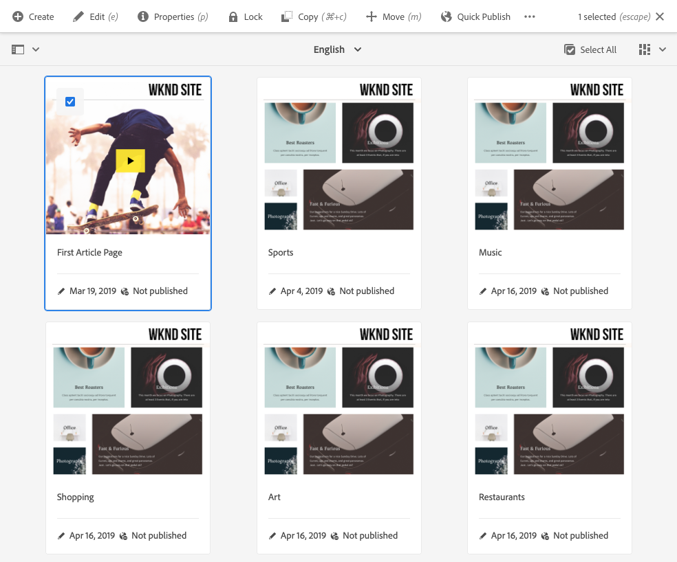

# Console Sites {#sites-console}

Découvrez comment utiliser le **Sites** pour gérer et organiser vos pages d’AEM.

## Orientation {#orientation}

La variable **Sites** console vous permet d’afficher la hiérarchie des pages.

Il offre différentes vues et barres d’outils pour vous aider à gérer et organiser vos pages.

* [Barre d’outils de la console](#toolbar) est toujours présente pour vous aider à naviguer.
* [Trois vues différentes](#views) vous permettent de localiser et de sélectionner facilement votre page.
* [Barre d’outils Action](#action-toolbar) s’affiche lorsque vous avez sélectionné un élément pour y effectuer une action.
* [Panneau latéral](#side-panel) comporte plusieurs options pour afficher des informations détaillées sur une page sélectionnée.

## Barre d’outils Console {#console-toolbar}

La barre d’outils de la console est toujours présente dans la console et vous aide à vous orienter dans votre contenu et à naviguer dans le contenu.

### Sélecteur de panneau latéral {#side-panel-selector}

Le sélecteur de panneau latéral vous permet d’afficher des informations supplémentaires sur l’élément sélectionné dans la console.

Les options présentées dépendent de la console active. Par exemple, dans la console **Sites**, vous ne pouvez sélectionner que le contenu (valeur par défaut), la chronologie, les références ou le panneau latéral de filtrage.

Pour plus d’informations sur le panneau latéral, consultez le document . [Panneau côté console Sites.](/help/sites-cloud/authoring/sites-console/console-side-panel.md)

### Chemins de navigation {#breadcrumbs}

Situé au milieu du rail et affichant toujours la description de l’élément sélectionné, le chemin de navigation vous permet de parcourir les niveaux de votre site web.

Appuyez ou cliquez sur le texte du chemin de navigation pour afficher une liste déroulante répertoriant les niveaux de la hiérarchie de l’élément actuellement sélectionné. Appuyez ou cliquez sur une entrée pour accéder à cet emplacement.

### Tout sélectionner {#select-all}

Appuyez ou cliquez sur le bouton **Tout sélectionner** sélectionne tous les éléments de la vue actuelle de la console.

Lorsque vous avez sélectionné tous les éléments, le nombre d’éléments sélectionnés s’affiche en haut à droite de la barre d’outils, où la variable **Tout sélectionner** apparaissait.

Vous pouvez annuler la sélection de tous les éléments et quitter le mode de sélection en procédant comme suit :

* Cliquez ou appuyez sur le bouton **X** à côté du décompte.
* En utilisant la variable **escape** clé.

### Bouton Créer {#create-button}

La variable **Créer** vous permet d’ajouter de nouvelles pages à votre site et de créer des objets Sites supplémentaires, tels que Live Copies ou Lancements.

Une fois que vous avez cliqué, les options affichées sont adaptées à la console/au contexte. Les plus courantes sont les suivantes :

* [Page](/help/sites-cloud/authoring/sites-console/creating-pages.md)
* [Site](/help/sites-cloud/administering/site-creation/create-site.md)
* [Live Copy](/help/sites-cloud/administering/msm/overview.md)
* [Launch](/help/sites-cloud/authoring/launches/overview.md)
* [Copie de la langue](/help/sites-cloud/administering/translation/overview.md)
* [Rapport CSV](/help/sites-cloud/authoring/sites-console/csv-export.md)

Pour plus d’informations sur leur fonctionnement, reportez-vous aux liens vers ces fonctions.

## Vues et sélection de pages {#views}

La variable **Sites** La console propose trois vues différentes de votre hiérarchie de contenu. Vous pouvez afficher, parcourir et sélectionner (pour effectuer d’autres actions) vos ressources dans n’importe quelle vue disponible.

* [Mode Colonnes](#column-view)
* [Mode Carte](#card-view)
* [Vue Liste](#list-view)

La variable **Affichage** L’icône située à l’extrémité droite de la barre d’outils AEM indique la vue active sélectionnée.

Appuyez ou cliquez dessus pour sélectionner une autre vue.

Vous pouvez basculer entre la vue Colonnes, Carte et Liste. Dans la vue Liste, les paramètres de vue sont également affichés.

>[!NOTE]
>
>L’option **Paramètres** est disponible uniquement dans la vue **Liste**.

L’affichage, la navigation et la sélection sont identiques sur le plan conceptuel dans tous les modes, mais leur manipulation comporte de légères variations en fonction du mode utilisé.

>[!NOTE]
>
>Par défaut, AEM Assets n’affiche pas les rendus originaux des ressources dans l’interface utilisateur sous forme de miniatures, quel que soit le mode. Si vous êtes administrateur ou administratrice, vous pouvez utiliser des superpositions pour configurer AEM Assets afin d’afficher les rendus originaux sous forme de miniatures.

### Sélection de ressources {#selecting-resources}

La sélection d’une ressource en particulier dépend de la combinaison du mode et de l’appareil :

| Mode | Sélectionner Tactile | Sélectionner Bureau | Désélectionner Tactile | Désélectionner Bureau |
|---|---|---|---|---|
| Colonnes | Sélectionner la miniature | Cliquer sur la miniature | Sélectionner la miniature | Cliquer sur la miniature |
| Carte | Sélectionner la carte et la maintenir enfoncée | Placer le pointeur de la souris dessus, puis utiliser l’action rapide sous forme de coche | Sélectionner la carte | Cliquer sur la carte |
| Liste | Sélectionner la miniature | Cliquer sur la miniature | Sélectionner la miniature | Cliquer sur la miniature |

#### Exemple de sélection {#selecting-example}

1. Par exemple, dans la vue Carte :

   

1. Une fois que vous avez sélectionné une ressource, l’en-tête de premier niveau est couvert par la [barre d’outils Actions](#actions-toolbar), qui permet d’accéder aux actions actuellement applicables à la ressource sélectionnée.

1. Pour quitter le mode de sélection, sélectionnez le signe **X** affiché en haut à droite de l’écran ou utilisez la touche **Échap**.

### Mode Colonnes {#column-view}

Le mode Colonnes permet la navigation visuelle d’une arborescence de contenu à travers une série de colonnes en cascade. Cette vue vous permet de visualiser et de parcourir l’arborescence de votre site web.

Si vous sélectionnez une ressource dans la colonne la plus à gauche, les ressources enfants s’affichent dans une colonne à droite. Si vous sélectionnez une ressource dans la colonne de droite, les ressources enfants s’affichent dans une autre colonne à droite, etc.

* Vous pouvez naviguer de haut en bas dans l’arborescence en appuyant ou en cliquant sur le nom de la ressource ou sur le chevron situé à droite du nom de la ressource.

   * Le nom de la ressource et le chevron sont mis en surbrillance lorsque vous appuyez ou cliquez dessus.
   * Les enfants de la ressource sur laquelle vous avez cliqué/appuyé s’affichent dans la colonne située à droite de celle-ci.
   * Si vous sélectionnez un nom de ressource sans enfant, ses détails s’affichent dans la dernière colonne.

* Appuyez ou cliquez sur la miniature pour sélectionner la ressource.

   * Lorsqu’elle est sélectionnée, une coche est apposée sur la miniature et le nom de la ressource est également mis en surbrillance.
   * Les détails de la ressource sélectionnée sont affichés dans la dernière colonne.
   * La barre d’outils d’action devient disponible.

* Lorsque vous sélectionnez une page en mode Colonnes, la page sélectionnée s’affiche dans la dernière colonne avec les détails suivants :

   * Titre de la page
   * Nom de la page (partie de l’URL de la page)
   * Modèle sur lequel est basée la page
   * Détails des modifications
   * Langue de la page
   * Publication et prévisualisation des détails

### Mode Carte {#card-view}

En mode Carte, chaque élément au niveau actuel de la hiérarchie s’affiche sous la forme d’une carte volumineuse.

* Les cartes fournissent des informations telles que :

   * Représentation visuelle du contenu de la page.
   * Le titre de la page ;
   * Des dates importantes (telles que la date de la dernière modification ou publication) ;
   * Si la page est verrouillée, masquée ou fait partie d’une Live Copy.
   * Indicateurs si vous devez agir sur l’élément dans le cadre d’un workflow.

Offres en mode Carte [actions rapides](#quick-actions) pour les éléments tels que la sélection et les actions courantes telles que la modification.

Vous pouvez parcourir l’arborescence vers le bas en appuyant/cliquant sur des cartes (en veillant à ne pas appuyer sur les actions rapides) ou vers le haut en utilisant la variable [chemins de navigation dans l’en-tête](#the-header).

### Vue Liste {#list-view}

Le mode Liste fournit des informations pour chaque ressource au niveau actuel dans une liste.

* Vous pouvez parcourir l’arborescence vers le bas en appuyant/cliquant sur le nom de la ressource, ou vers le haut en utilisant le [chemin de navigation dans l’en-tête](#the-header).
* Pour sélectionner facilement tous les éléments de la liste, utilisez le [**Tout sélectionner** dans la barre d’outils.](#select-all)

* Sélectionnez les colonnes à afficher à l’aide de l’option **Afficher les paramètres** située sous le bouton Vues. Vous pouvez afficher les colonnes suivantes :

   * **Nom** : nom de la page, qui peut s’avérer utile dans un environnement de création multilingue, car il fait partie de l’URL de la page et ne change pas, quelle que soit la langue
   * **Modifié** : date de la dernière modification et dernière modification par l’utilisateur ou l’utilisatrice
   * **Publié** : statut de la publication.
   * **Prévisualisation** : prévisualisation du statut
   * **Modèle** : modèle sur lequel la page est basée.
   * **Opération**
   * **Workflow** : workflow actuellement appliqué à la page. Plus d’informations sont disponibles lorsque vous placez le pointeur de la souris ou ouvrez la chronologie.
   * **Traduit**
   * **Pages vues**
   * **Visiteurs uniques**
   * **Durée sur la page**

Par défaut, la colonne **Nom** est affichée ; ce nom fait partie de l’URL de la page. Dans certains cas, il se peut que l’auteur doive accéder à des pages rédigées dans une autre langue. Aussi, le fait de voir le nom de la page (qui reste généralement identique) peut s’avérer très utile si l’auteur ne connaît pas la langue de la page.

* Modifiez l’ordre des éléments à l’aide de la barre verticale en pointillés tout à droite de chaque élément de la liste.

Sélectionnez la barre de sélection verticale et faites glisser l’élément vers un nouvel emplacement dans la liste.

>[!NOTE]
>
>La modification de l’ordre fonctionne uniquement dans un dossier ordonné dont la valeur `jcr:primaryType` est `sling:OrderedFolder`.

## Barre d’outils Actions {#actions-toolbar}

Chaque fois qu’une ressource est sélectionnée, vous pouvez effectuer diverses actions sur l’élément sélectionné. Ces actions sont affichées dans la barre d’outils des actions.

La barre d’outils Actions n’apparaît que lorsqu’une ressource est sélectionnée dans la console. L’action disponible dans la barre d’outils Actions change pour refléter les actions que vous pouvez effectuer sur les éléments spécifiques sélectionnés. Les actions les plus courantes sont :

* [Créer](#create-action) - Créer du contenu ou des actions liées au contenu
* [Modifier](/help/sites-cloud/authoring/page-editor/introduction.md) - Modifier la page
* [Propriétés](/help/sites-cloud/authoring/sites-console/page-properties.md) - Ouvre la fenêtre des propriétés de page
* [Verrouiller](/help/sites-cloud/authoring/sites-console/managing-pages.md#locking-a-page) - Verrouiller une page pour empêcher d’autres utilisateurs de la modifier
* [Copier](/help/sites-cloud/authoring/sites-console/managing-pages.md#copying-and-pasting-a-page) - Copier une page
* [Déplacer](/help/sites-cloud/authoring/sites-console/managing-pages.md#moving-or-renaming-a-page) - Déplacer ou renommer une page
* [Publication rapide](/help/sites-cloud/authoring/sites-console/publishing-pages.md#quick-publish) - Publier une ou plusieurs pages immédiatement
* [Gérer la publication](/help/sites-cloud/authoring/sites-console/publishing-pages.md#manage-publication) - Planification de la publication d’une ou de plusieurs pages
* [Restaurer](/help/sites-cloud/authoring/sites-console/page-versions.md#restore-version) - Restaurer une version d’une page ou d’une arborescence de pages
* [Supprimer](/help/sites-cloud/authoring/sites-console/managing-pages.md#deleting-a-page) - Supprimer une ou plusieurs pages

En raison des restrictions d’espace dans certaines fenêtres, la barre d’outils peut rapidement dépasser l’espace disponible. Lorsque cela se produit, d’autres options s’affichent. Cliquez ou appuyez sur les points de suspension (les trois points ou **..**) ouvre un sélecteur de liste déroulante contenant toutes les actions restantes.

### Créer une action {#create-action}

L’action de création offre des options similaires au bouton de création de barre d’outils pour créer des pages et des éléments similaires.

En outre, il offre la possibilité de créer des actions liées aux pages.

* [Workflow](/help/sites-cloud/authoring/workflows/overview.md) - Appliquer un workflow à une page
* [Version](/help/sites-cloud/authoring/sites-console/page-versions.md) - Créer une version d’une page

## Modèles

Vous pouvez déterminer facilement le modèle sur lequel la page est basée en sélectionnant cette dernière dans la vue [Colonnes](/help/sites-cloud/authoring/basic-handling.md#column-view) ou [Liste](/help/sites-cloud/authoring/basic-handling.md#list-view).
