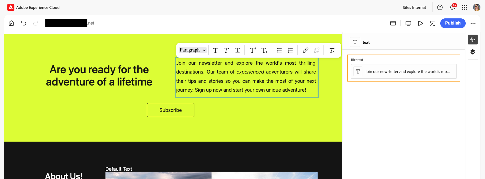
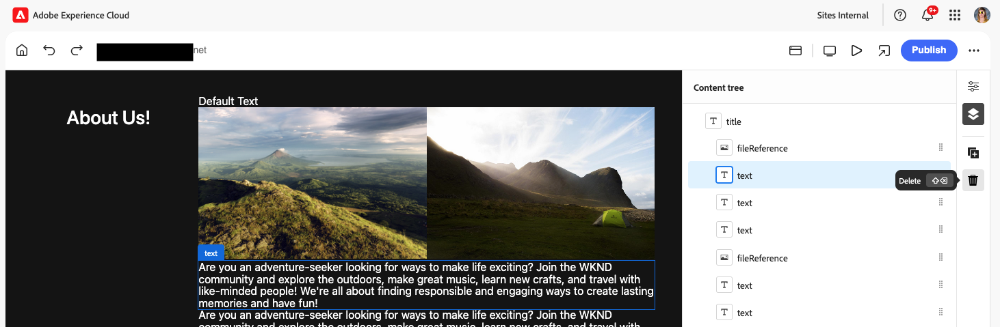

# Création de contenu avec l’éditeur universel {#authoring}

Découvrez à quel point il est facile et intuitif pour les personnes en charge de la création de créer du contenu à l’aide de l’éditeur universel.

## Présentation {#introduction}

L’éditeur universel permet de modifier n’importe quel aspect de contenu dans n’importe quelle mise en œuvre pour que vous puissiez fournir des expériences exceptionnelles, d’augmenter la vitesse du contenu et d’offrir une expérience de développement à la pointe de la technologie.

Pour ce faire, l’éditeur universel offre aux auteurs de contenu une interface utilisateur intuitive qui nécessite une formation minimale pour simplement pouvoir intervenir et commencer à modifier le contenu. Ce document décrit l’expérience de création d’Universal Editor.

>[!NOTE]
>
>Ce document suppose que vous connaissez déjà comment accéder à l’éditeur universel et le parcourir. Si ce n&#39;est pas le cas, consultez le document [Accès à l&#39;éditeur universel et navigation dans l&#39;éditeur.](/help/sites-cloud/authoring/universal-editor/navigation.md)

>[!TIP]
>
>Pour une présentation plus détaillée de l’éditeur universel, consultez le document [Présentation de l’éditeur universel.](/help/implementing/universal-editor/introduction.md)

## Modification du contenu {#editing-content}

La modification du contenu est simple et intuitive. Lorsque vous placez le pointeur de la souris sur le contenu de l’éditeur, le contenu modifiable est mis en surbrillance avec un contour bleu mince.

>[!TIP]
>
>Par défaut, appuyer ou cliquer sur le contenu le sélectionne pour le modifier. Si vous souhaitez parcourir votre contenu en suivant les liens, passez en [mode d&#39;aperçu.](/help/sites-cloud/authoring/universal-editor/navigation.md#preview-mode)

Selon le contenu que vous sélectionnez, vous pouvez avoir différentes options de modification statique et des informations et options supplémentaires pour le contenu dans le [rail de propriétés.](/help/sites-cloud/authoring/universal-editor/navigation.md#properties-rail)

### Modification de texte brut {#edit-plain-text}

Vous pouvez modifier le texte en place en double-cliquant ou en appuyant deux fois sur le composant.

Le mince contour bleu se transforme en bleu épais pour indiquer la sélection et un curseur s’affiche. Effectuez vos modifications, puis appuyez sur Entrée/Retour ou sélectionnez en dehors de la zone de texte pour enregistrer vos modifications.

Lorsque vous choisissez de sélectionner le composant de texte, ses détails sont affichés dans le rail [propriétés.](/help/sites-cloud/authoring/universal-editor/navigation.md#properties-rail) Vous pouvez également modifier le texte dans le rail.

En outre, des détails sur votre texte sont disponibles dans le rail de propriétés. Les modifications sont automatiquement enregistrées lorsque le focus quitte le champ modifié dans le rail des propriétés.

### Modification de texte enrichi {#edit-rich-text}

Vous pouvez modifier le texte en place en double-cliquant ou en appuyant deux fois sur le composant.

Pour votre commodité, les options de mise en forme et les détails de votre texte sont disponibles à deux endroits.

#### Menu contextuel {#context-menu}

Le menu contextuel s’ouvre au-dessus du bloc de texte enrichi et propose des options de mise en forme de base en contexte. En raison des restrictions d’espace, certaines options peuvent être masquées derrière le bouton représentant des points de suspension.

Les modifications sont automatiquement enregistrées lorsque le focus quitte le champ modifié.

#### Rail Propriétés {#properties-rail}

Le [rail de propriétés](/help/sites-cloud/authoring/universal-editor/navigation.md#properties-rail) affiche un élément pour le texte sélectionné. Appuyez sur l’entrée pour ouvrir une boîte de dialogue présentant un canevas plus grand pour modifier le texte.

Appuyez ou cliquez sur **Annuler** ou **Terminé** pour ignorer ou enregistrer les modifications, respectivement.

### Modification du média {#edit-media}

Vous pouvez afficher ses détails dans le [rail de propriétés.](/help/sites-cloud/authoring/universal-editor/navigation.md#properties-rail)

1. Appuyez ou cliquez sur l’aperçu de l’image sélectionnée dans le rail des propriétés.
1. La fenêtre [sélecteur de ressources](/help/assets/overview-asset-selector.md#using-asset-selector) s’ouvre pour vous permettre de sélectionner une ressource.
1. Sélectionnez cette option pour sélectionner une nouvelle ressource.
1. Sélectionnez **Sélectionner** pour revenir au rail des propriétés où la ressource a été remplacée.

Les modifications sont automatiquement enregistrées dans votre contenu.

### Modification de fragments de contenu {#edit-content-fragment}

Si vous sélectionnez un [fragment de contenu,](/help/sites-cloud/administering/content-fragments/overview.md), vous pouvez en modifier les détails dans le [ rail de propriétés.](/help/sites-cloud/authoring/universal-editor/navigation.md#properties-rail)

Les champs définis dans le modèle de contenu du fragment de contenu sélectionné sont affichés et modifiables dans le rail des propriétés.

Si vous sélectionnez un champ lié à un fragment de contenu, celui-ci se charge dans le rail des composants et le champ est automatiquement défilé vers .

Les modifications sont automatiquement enregistrées lorsque le focus quitte le champ modifié dans le rail des propriétés.

Si vous souhaitez modifier votre fragment de contenu dans l’ [éditeur de fragment de contenu](/help/sites-cloud/administering/content-fragments/authoring.md) à la place, appuyez ou cliquez sur le bouton [**Ouvrir dans l’éditeur de fragment de contenu**](/help/sites-cloud/authoring/universal-editor/navigation.md#edit) dans le rail des propriétés.

>[!TIP]
>
>Utilisez la touche d’accès rapide `e` pour modifier le fragment de contenu sélectionné dans l’éditeur de fragment de contenu.

Selon les besoins de votre workflow, vous pouvez modifier le fragment de contenu dans l’éditeur universel ou directement dans l’éditeur de fragment de contenu.

>[!NOTE]
>
>L’éditeur universel [ valide les champs de fragment de contenu en fonction de leurs modèles ](/help/assets/content-fragments/content-fragments-models.md#validation), ce qui vous permet d’appliquer des règles d’intégrité des données telles que des modèles d’expression régulière et des contraintes d’unicité.
>
>Cela garantit que votre contenu répond aux besoins spécifiques de l’entreprise avant d’être publié.

### Ajout de composants aux conteneurs {#adding-components}

1. Sélectionnez un composant de conteneur dans l’ [arborescence de contenu](/help/sites-cloud/authoring/universal-editor/navigation.md#content-tree-mode) ou dans l’éditeur.
1. Sélectionnez ensuite l’icône d’ajout dans le rail des propriétés.

   

Le composant est inséré dans le conteneur et peut être modifié dans l’éditeur.

>[!TIP]
>
>Utilisez la touche d’accès rapide `a` pour ajouter un composant au conteneur sélectionné.

### Suppression de composants des conteneurs {#deleting-components}

1. Sélectionnez un composant de conteneur dans l’ [arborescence de contenu](/help/sites-cloud/authoring/universal-editor/navigation.md#content-tree-mode) ou dans l’éditeur.
1. Sélectionnez l’icône chevron du conteneur pour développer son contenu dans l’arborescence de contenu.
1. Sélectionnez ensuite, dans l’arborescence de contenu, un composant dans le conteneur.
1. Sélectionnez l’icône de suppression dans le rail des propriétés.

   

Le composant sélectionné a été supprimé.

>[!TIP]
>
>Utilisez la touche d’accès rapide `Shift+Backspace` pour supprimer le composant sélectionné de son conteneur.

### Réorganisation des composants dans les conteneurs {#reordering-components}

1. Si ce n&#39;est pas déjà le cas en mode [arborescence de contenu,](/help/sites-cloud/authoring/universal-editor/navigation.md#content-tree-mode) basculez vers ce mode.
1. Sélectionnez un composant de conteneur dans l’arborescence de contenu ou dans l’éditeur.
1. Sélectionnez l’icône chevron du conteneur pour développer son contenu dans l’arborescence de contenu.
1. Faites glisser les icônes de poignée en regard des composants dans le conteneur pour afficher que vous puissiez les réorganiser. Faites glisser les composants pour les réorganiser dans le conteneur.

   

1. Le composant déplacé devient gris dans l’arborescence de contenu, tandis que votre point d’insertion est représenté par une ligne bleue. Libérez le composant pour le placer à son nouvel emplacement.

Les composants sont réorganisés dans l’arborescence de contenu et dans l’éditeur.

>[!NOTE]
>
>Les composants ne peuvent pas être déplacés entre les conteneurs si un [filtre de composant](/help/implementing/universal-editor/customizing.md#filtering-components) différent est défini entre les conteneurs source et cible.

## Prévisualisation du contenu {#previewing-content}

Une fois le contenu modifié, vous aimez généralement le parcourir pour voir à quoi il ressemble dans le contenu d’autres pages. En [mode Aperçu](/help/sites-cloud/authoring/universal-editor/navigation.md#preview-mode), vous pouvez cliquer sur les liens pour parcourir votre contenu comme le ferait un lecteur ou une lectrice. Le contenu est rendu dans l’éditeur tel qu’il serait publié.

En mode d’aperçu, appuyer ou cliquer sur le contenu réagit comme il le ferait à un lecteur du contenu. Si vous souhaitez sélectionner le contenu à modifier, désactivez le mode [aperçu.](/help/sites-cloud/authoring/universal-editor/navigation.md#preview-mode)

## Ressources supplémentaires {#additional-resources}

Pour savoir comment publier du contenu avec l’éditeur universel, consultez ce document.

* [Publication de contenu avec l’éditeur universel](publishing.md) - Découvrez comment l’éditeur universel publie du contenu et comment vos applications peuvent gérer le contenu publié.

Pour en savoir plus sur les détails techniques d’Universal Editor, consultez ces documents de développement.

* [Présentation de l’éditeur universel](/help/implementing/universal-editor/introduction.md) - Découvrez comment l’éditeur universel permet de modifier n’importe quel aspect d’un contenu dans n’importe quelle implémentation afin de fournir des expériences exceptionnelles, d’augmenter la vitesse du contenu et d’offrir une expérience de développement à la pointe de la technologie.
* [Prise en main de l’éditeur universel dans AEM](/help/implementing/universal-editor/getting-started.md) - Découvrez comment accéder à l’éditeur universel et comment commencer à instrumenter votre première application AEM pour l’utiliser.
* [Architecture de l’éditeur universel](/help/implementing/universal-editor/architecture.md) - Découvrez l’architecture de l’éditeur universel et le flux de données entre ses services et calques.
* [Attributs et types](/help/implementing/universal-editor/attributes-types.md) - Découvrez les attributs et les types de données requis par l’éditeur universel.
* [Authentification de l’éditeur universel](/help/implementing/universal-editor/authentication.md) - Découvrez comment l’éditeur universel s’authentifie.

## Modification de l’héritage des composants {#inheritance}

L’héritage est le mécanisme par lequel le contenu peut être lié, de sorte que la modification de l’un modifie automatiquement l’autre.

À l’aide d’Universal Editor, vous pouvez annuler l’héritage du contenu en le mettant simplement à jour. L’éditeur désactive automatiquement l’héritage pour toutes les modifications apportées par les auteurs sur cette page, en s’assurant que le contenu modifié est conservé lorsque les mises à jour sont synchronisées à partir du plan directeur.

Pour plus d’informations sur le fonctionnement de l’héritage à l’aide d’Universal Editor, consultez le document [Héritage de contenu dans Universal Editor.](/help/sites-cloud/authoring/universal-editor/inheritance.md)
