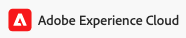
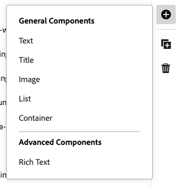

# Accès à l’éditeur universel et navigation dans cet éditeur {#navigating}

Découvrez les principes de base de l’accès et de la navigation dans l’éditeur universel.

## Présentation {#introduction}

L’éditeur universel permet de modifier n’importe quel aspect de contenu dans n’importe quelle mise en œuvre pour que vous puissiez fournir des expériences exceptionnelles, d’augmenter la vitesse du contenu et d’offrir une expérience de développement à la pointe de la technologie.

Pour ce faire, l’éditeur universel fournit aux personnes en charge de la création de contenu une interface utilisateur intuitive qui nécessite une formation minimale pour se lancer et commencer à modifier le contenu. Ce document décrit comment naviguer dans l’éditeur universel.

>[!TIP]
>
>* Pour plus d’informations sur la création à l’aide de l’éditeur universel, consultez le document [Création de contenu avec l’éditeur universel](/help/sites-cloud/authoring/universal-editor/authoring.md).
>* Pour une présentation plus détaillée de l’éditeur universel, voir [Présentation de l’éditeur universel](/help/implementing/universal-editor/introduction.md).

## Préparer l’application {#prepare-app}

Pour créer du contenu pour une application à l’aide de l’éditeur universel, l’application doit être instrumentée par un développeur ou une développeuse afin de prendre en charge l’éditeur.

>[!TIP]
>
>Consultez [Prise en main de l’éditeur universel dans AEM](/help/implementing/universal-editor/getting-started.md) pour obtenir un exemple de configuration d’une application AEM pour qu’elle fonctionne avec l’éditeur universel.

## Accès à l’éditeur universel {#accessing}

Une fois que l’application est instrumentée pour fonctionner avec l’éditeur universel, l’éditeur universel peut être accessible à la fois dans AEM as a Cloud Service et directement sans accéder à AEM.

### Accès à dans AEM as a Cloud Service {#accessing-aem}

1. Connectez-vous à votre instance de création AEM as a Cloud Service.
1. Utilisez la console [**Sites** ](/help/sites-cloud/authoring/sites-console/introduction.md) pour accéder à la page créée pour être utilisée avec l’éditeur universel que vous souhaitez modifier.
1. Modifiez la page.
1. L’éditeur universel s’ouvre pour modifier la page sélectionnée.

>[!NOTE]
>
>Lors de la modification d’une page dans la console [**Sites**](/help/sites-cloud/authoring/sites-console/introduction.md), la console ouvre l’éditeur approprié au [modèle](/help/sites-cloud/authoring/page-editor/templates.md) de la page, soit l’éditeur universel décrit dans ce document, soit l’[éditeur de page](/help/sites-cloud/authoring/page-editor/introduction.md).

### Accès direct {#accessing-directly}

1. Connectez-vous à l’éditeur universel. Vous avez besoin d’une Adobe ID pour vous connecter et d’avoir accès [ l’éditeur universel](/help/implementing/universal-editor/getting-started.md#request-access).

1. Une fois connecté, saisissez l’URL de la page à modifier dans la [barre d’emplacement](#location-bar) afin de commencer à modifier du contenu tel que du contenu texte ou multimédia.

## Présentation de l’interface utilisateur {#ui}

L’interface utilisateur est divisée en ces zones principales.

* [En-tête Experience Cloud](#experience-cloud-header)
* [Barre d’outils de l’éditeur universel](#universal-editor-toolbar)
* [L’éditeur](#editor)
* [Panneau Propriétés](#properties-rail)

>[!TIP]
>
>L’éditeur universel offre un certain nombre [d’options de personnalisation](/help/implementing/universal-editor/customizing.md) et [de points d’extension](/help/implementing/universal-editor/extending.md) qui peuvent modifier et ajouter des fonctionnalités à l’éditeur. Pour cette raison, vous pouvez voir différentes options par rapport aux options standard documentées ici.

### En-tête Experience Cloud {#experience-cloud-header}

L’en-tête Experience Cloud est toujours présent en haut de l’écran. Il s’agit d’une ancre de lien qui vous indique où vous vous trouvez dans Experience Cloud et vous aide à accéder à d’autres applications Experience Cloud.

#### Experience Manager {#experience-manager}

Sélectionnez le lien Adobe Experience Cloud à gauche de l’en-tête pour accéder à la racine de votre solution Experience Manager et aux outils tels que [Cloud Manager](/help/onboarding/cloud-manager-introduction.md), [Cloud Acceleration Manager](/help/journey-migration/cloud-acceleration-manager/introduction/overview-cam.md) et [Distribution logicielle](https://experienceleague.adobe.com/docs/experience-cloud/software-distribution/home.html?lang=fr).

#### Organisation {#organization}

L’organisation dans laquelle vous êtes actuellement connecté s’affiche. Sélectionnez cette option pour passer à une autre organisation si votre Adobe ID est associé à plusieurs d’entre elles.

#### Centre dʼaide {#help}

L’icône du centre d’aide permet d’accéder rapidement aux ressources d’apprentissage et de support.

#### Notifications {#notifications}

Cette icône contient un badge indiquant le nombre de [notifications](/help/implementing/cloud-manager/notifications.md) incomplètes actuellement attribuées.

#### Applications {#solutions}

Appuyez ou cliquez sur le sélecteur d’applications pour accéder rapidement à d’autres solutions Experience Cloud.

#### Compte {#user-properties}

Sélectionnez l’icône représentant votre utilisateur pour accéder aux paramètres de votre compte. Si vous n’avez configuré aucune image d’utilisateur ou d’utilisatrice, une icône est attribuée de manière aléatoire.

Appuyez ou cliquez sur l’icône de compte pour ouvrir un menu contenant vos paramètres utilisateur. Ces paramètres s’appliquent à Cloud Manager en général et ses fonctionnalités sont détaillées [dans cette documentation](/help/implementing/cloud-manager/navigation.md).

Pour l’éditeur universel, sous l’en-tête **Paramètres du produit**, il existe une option pour basculer entre la version de production actuelle de l’éditeur universel et la version d’aperçu à venir.

### Barre d’outils de l’éditeur universel {#universal-editor-toolbar}

La barre d’outils de l’éditeur universel est toujours présente en haut de l’écran, juste en dessous [en-tête Experience Cloud](#experience-cloud-header). Il vous permet d’accéder rapidement à une autre page à modifier et de publier la page active.

Selon la configuration de votre programme, il peut également présenter des [fonctionnalités supplémentaires qui ont été activées en tant qu’extensions par votre administrateur.](#additional-toolbar-buttons)

#### Le Bouton Accueil {#home-button}

Le bouton Accueil vous renvoie à la page de démarrage de l’éditeur universel

Sur la page de démarrage, vous pouvez saisir l’URL du site à modifier à l’aide de l’éditeur universel.

>[!NOTE]
>
>Toute page que vous souhaitez modifier à l’aide de l’éditeur universel doit être [instrumentée pour prendre en charge l’éditeur universel](/help/implementing/universal-editor/getting-started.md).

Une section **Liens rapides** fournit des ressources d’aide et une section **Récents** fournit des liens vers les pages que vous avez récemment ouvertes avec l’éditeur universel.

#### Barre d’emplacement {#location-bar}

La barre d’emplacement affiche l’adresse de la page que vous modifiez. Sélectionnez cette option pour saisir l’adresse d’une autre page à modifier.

>[!TIP]
>
>Utilisez le raccourci clavier `l` (lettre l) pour ouvrir la barre d’adresse.

>[!NOTE]
>
>Toute page que vous souhaitez modifier à l’aide de l’éditeur universel doit être [instrumentée pour prendre en charge l’éditeur universel](/help/implementing/universal-editor/getting-started.md).

#### Annuler et rétablir {#undo-redo}

Sélectionnez les boutons Annuler ou Rétablir pour annuler ou rétablir la dernière modification dans l’éditeur. Consultez le document [Création de contenu avec l’éditeur universel](/help/sites-cloud/authoring/universal-editor/authoring.md#undo-redo) pour plus d’informations.

>[!TIP]
>
>Utilisez la touche de raccourci `Command-Z` ou `Shift-Command-Z` pour annuler ou rétablir, respectivement.

#### En-têtes d’authentification {#authentication-settings}

Sélectionnez l’icône en-têtes d’authentification si vous devez [définir un en-tête d’authentification personnalisé à des fins de développement local](/help/implementing/universal-editor/developer-overview.md#auth-header).

#### Mode réactif {#emulator}

Sélectionnez l’icône de mode réactif pour définir la manière dont l’éditeur universel effectue le rendu de la page.

Appuyez ou cliquez sur l’icône de mode réactif pour afficher les options.

Par défaut, l’éditeur s’ouvre dans une disposition de bureau où la hauteur et la largeur sont automatiquement définies par le navigateur.

Vous pouvez également choisir d’émuler un appareil mobile et dans l’éditeur universel :

* Définir son orientation
* Définir la largeur et la hauteur
* Modifier l’orientation

#### Prévisualisation {#preview-mode}

En mode Aperçu, la page rendue dans l’éditeur est telle qu’elle apparaîtrait sur votre service publié. Cela permet à l’auteur de contenu de parcourir le contenu en cliquant sur des liens, etc.

>[!TIP]
>
>Utilisez le raccourci clavier `p` pour activer/désactiver le mode Aperçu.

#### Ouvrir la page {#open-page}

Sélectionnez l’icône Ouvrir la page pour ouvrir la page que vous êtes en train de modifier dans son propre onglet de navigateur, sans passer par l’éditeur pour prévisualiser votre contenu.

>[!TIP]
>
>Utilisez le raccourci clavier `o` (lettre o) pour ouvrir l’aperçu de l’application.

>[!TIP]
>
>L’URL d’aperçu de votre application [peut être personnalisée](/help/implementing/universal-editor/customizing.md#custom-preview-urls).

>[!NOTE]
>
>Le bouton Ouvrir la page [peut être désactivé](/help/implementing/universal-editor/customizing.md#open-page) et peut donc ne pas s’afficher dans votre éditeur.

#### Publier {#publish}

Sélectionnez le bouton Publier afin de publier les modifications apportées au contenu dynamique pour que vos lecteurs et lectrices puissent les utiliser ou pour les prévisualiser dans un environnement en vue de les réviser.

>[!TIP]
>
>Consultez le document [Publication de contenu avec l’éditeur universel](publishing.md) pour plus d’informations sur la publication avec l’éditeur universel.

>[!NOTE]
>
>Le bouton de publication [peut être désactivé](/help/implementing/universal-editor/customizing.md#disable-publish) et peut donc ne pas s’afficher dans votre éditeur.

#### Points de suspension {#ellipsis}

D’autres options standard sont accessibles à l’aide du bouton représentant des points de suspension.

Par exemple, la possibilité de dépublier une page (c’est-à-dire d’inverser l’action du bouton [**Publier**](#publish)) est accessible à partir du bouton représentant des points de suspension.

#### Boutons supplémentaires {#additional-toolbar-buttons}

L’éditeur universel offre une expérience de création personnalisable et extensible. Si vous voyez des boutons supplémentaires dans la barre d’outils, cela signifie que votre éditeur universel a été étendu.

* Pour plus d’informations sur le fonctionnement d’une extension individuelle, [consultez la documentation sur la création dans l’éditeur universel.](/help/sites-cloud/authoring/universal-editor/authoring.md#toolbar-options)
* Pour plus d’informations sur les possibilités d’extension, consultez la [Extension de l’éditeur universel.](/help/implementing/universal-editor/extending.md)
* Pour plus d’informations sur l’installation d’une extension individuelle, consultez la [documentation d’Extension Manager.](https://developer.adobe.com/uix/docs/extension-manager/extension-developed-by-adobe/)

### L’éditeur {#editor}

L’éditeur occupe la majeure partie de la fenêtre et c’est l’endroit où la page spécifiée dans [la barre d’emplacement](#location-bar) est rendue.

Si l’éditeur se trouve en [mode Aperçu](#preview-mode), le contenu peut être parcouru et vous pouvez suivre les liens, mais vous ne pouvez pas modifier le contenu.

### Panneau Propriétés {#properties-rail}

Le panneau Propriétés est toujours présent le long du côté droit de l’éditeur. Selon son mode, il peut afficher les détails d’un composant sélectionné dans le contenu ou la hiérarchie du contenu de la page.

Selon la configuration de votre programme, il peut également présenter des [fonctionnalités supplémentaires qui ont été activées en tant qu’extensions par votre administrateur.](#additional-properties-panel-buttons)

#### Mode Propriétés {#properties-mode}

En mode Propriétés , le panneau affiche les propriétés du composant actuellement sélectionné dans l’éditeur. Il s’agit du mode par défaut du panneau Propriétés lorsqu’une page est chargée.

Selon le type de composant que vous sélectionnez, les détails peuvent être affichés et modifiés dans le panneau des propriétés.

Tous les composants ne comportent pas de détails pouvant être affichés et/ou modifiés.

>[!TIP]
>
>Utilisez le raccourci clavier `d` pour passer en mode Propriétés.

#### Mode Arborescence de contenu {#content-tree-mode}

En mode d’arborescence de contenu, le panneau affiche la hiérarchie du contenu de la page.

* Lorsque vous sélectionnez un élément dans l’arborescence de contenu, l’éditeur fait défiler l’écran jusqu’à ce contenu et le sélectionne.
* Lorsque vous double-cliquez sur un élément dans l’arborescence de contenu, l’éditeur fait défiler l’écran jusqu’à ce contenu et le sélectionne, puis ouvre les propriétés associées en mode [propriétés](#properties-mode).

>[!TIP]
>
>Utilisez le raccourci clavier `f` pour passer en mode Arborescence de contenu.

##### Ouvrir dans l’éditeur CF {#edit}

Lors de la modification, les options du composant sélectionné s’affichent dans le panneau des propriétés, où vous pouvez modifier le composant sélectionné. Si le composant sélectionné est un fragment de contenu, vous pouvez également sélectionner le bouton **Ouvrir dans CF Editor**.

Appuyez ou cliquez sur le bouton **Ouvrir dans l’éditeur CF** pour ouvrir l’[éditeur de fragment de contenu](/help/assets/content-fragments/content-fragments-managing.md#opening-the-fragment-editor) dans un nouvel onglet. Vous pouvez ainsi accéder à toute la puissance de l’éditeur de fragment de contenu pour modifier le fragment de contenu associé.

Selon les besoins de votre workflow, vous pouvez modifier le fragment de contenu dans l’éditeur universel ou directement dans l’éditeur de fragment de contenu.

>[!TIP]
>
>Utilisez le raccourci `e` pour ouvrir un fragment de contenu sélectionné dans l’éditeur de fragment de contenu.

##### Ajouter {#add}

Si vous sélectionnez un composant de conteneur dans l’arborescence de contenu ou dans l’éditeur, l’option d’ajout apparaît dans le panneau Propriétés.

Appuyez ou cliquez sur le bouton Ajouter pour ouvrir un menu déroulant de composants que vous pouvez [ajouter au conteneur sélectionné](/help/sites-cloud/authoring/universal-editor/authoring.md#adding-components).

>[!TIP]
>
>Utilisez le raccourci `a` pour ajouter un composant à un composant de conteneur sélectionné.

##### Doublon {#duplicate}

Si vous sélectionnez un composant dans un composant de conteneur dans l’arborescence de contenu ou dans l’éditeur, l’option Dupliquer s’affiche dans le panneau des propriétés.

Appuyez ou cliquez sur le bouton Dupliquer [duplique le composant sélectionné](/help/sites-cloud/authoring/universal-editor/authoring.md#duplicating-components).

##### Supprimer {#delete}

Si vous sélectionnez un composant dans un composant de conteneur dans l’arborescence de contenu ou dans l’éditeur, l’option de suppression s’affiche dans le panneau Propriétés.

Appuyez ou cliquez sur le bouton Supprimer [supprime le composant](/help/sites-cloud/authoring/universal-editor/authoring.md#deleting-components).

>[!TIP]
>
>Utilisez le raccourci `Shift+Backspace` pour supprimer un composant sélectionné d’un conteneur.

##### Copier/coller {#copy-paste}

Vous pouvez copier et coller des composants qui se trouvent dans des [conteneurs.](/help/implementing/universal-editor/field-types.md#container)

>[!TIP]
>
>Utilisez la touche de raccourci `Command-C` ou `Command-V` pour copier ou coller, respectivement.

Consultez le document [Création de contenu avec l’éditeur universel](/help/sites-cloud/authoring/universal-editor/authoring.md#copy-paste) pour plus d’informations.

#### Boutons supplémentaires {#additional-properties-panel-buttons}

L’éditeur universel offre une expérience de création personnalisable et extensible. Si vous voyez des boutons supplémentaires dans le panneau des propriétés, cela signifie que votre éditeur universel a été étendu.

* Pour plus d’informations sur le fonctionnement d’une extension individuelle, [consultez la documentation sur la création dans l’éditeur universel.](/help/sites-cloud/authoring/universal-editor/authoring.md#properties-panel-options)
* Pour plus d’informations sur les possibilités d’extension, consultez la [Extension de l’éditeur universel.](/help/implementing/universal-editor/extending.md)
* Pour plus d’informations sur l’installation d’une extension individuelle, consultez la [documentation d’Extension Manager.](https://developer.adobe.com/uix/docs/extension-manager/extension-developed-by-adobe/)

## Étapes suivantes {#next-steps}

Maintenant que vous savez comment accéder à l’éditeur universel et naviguer dans celui-ci, vous êtes prêt à [créer du contenu à l’aide de celui-ci](/help/sites-cloud/authoring/universal-editor/authoring.md).
