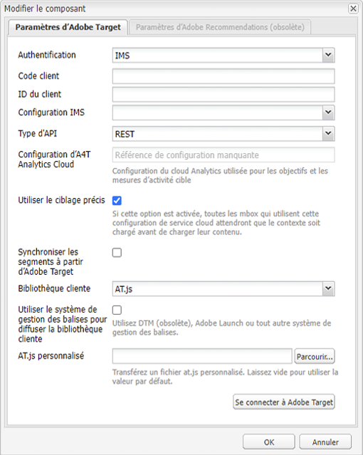
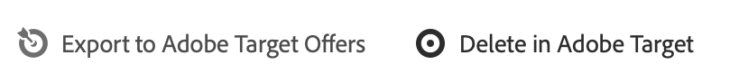

# Exportation de fragments de contenu vers Adobe Target {#exporting-content-fragments-to-adobe-target}

>[!CAUTION]
>
>* Les fragments de contenu AEM sont exportés dans l’espace de travail par défaut d’Adobe Target.
>* AEM doit être intégré à Adobe Target conformément aux instructions de la section [Intégration à Adobe Target](/help/sites-cloud/integrating/integrating-adobe-target.md).

Vous pouvez exporter [Fragments de contenu](/help/sites-cloud/authoring/fundamentals/content-fragments.md), créé dans Adobe Experience Manager as a Cloud Service (AEM), dans Adobe Target (Target). Ceux-ci peuvent ensuite être utilisés comme offres dans les activités Target, pour tester et personnaliser les expériences en fonction des besoins.

Il existe une option pour exporter un fragment de contenu vers Adobe Target :

* JSON : prise en charge de la diffusion de contenu découplé

<!-- * GraphQL query ??? -->

Pour préparer votre instance à l’exportation AEM fragments de contenu vers Adobe Target, vous devez :

* [Intégrez-la à Adobe Target](/help/sites-cloud/integrating/integrating-adobe-target.md)
* [Ajoutez la configuration du cloud](#add-the-cloud-configuration)
* [Ajoutez la configuration héritée](#add-the-legacy-configuration)

Ensuite, vous pouvez :

* [Exportation d’un fragment de contenu vers Adobe Target](#exporting-a-content-fragment-to-adobe-target)
* [Utilisation des fragments de contenu dans Adobe Target](#using-your-content-fragments-in-adobe-target)
* Et aussi [Suppression d’un fragment de contenu déjà exporté vers Adobe Target](#deleting-a-content-fragment-already-exported-to-adobe-target)

Les fragments de contenu peuvent être exportés vers l’espace de travail par défaut dans Adobe Target ou vers des espaces de travail définis par l’utilisateur pour Adobe Target.

>[!NOTE]
>
>Les espaces de travail Adobe Target n’existent pas dans Adobe Target lui-même. Ils sont définis et gérés dans Adobe IMS (Identity Management System), puis sélectionnés pour une utilisation dans toutes les solutions à l’aide de la console Adobe Developer.

>[!NOTE]
>
>Les espaces de travail Adobe Target peuvent être utilisés pour permettre aux membres d’une organisation (groupe) de créer et de gérer des offres et des activités pour cette organisation uniquement ; sans donner accès à d’autres utilisateurs. Par exemple, les organisations spécifiques à un pays avec une préoccupation mondiale.

## Prérequis {#prerequisites}

L’action suivante est requise :

1. Vous devez [intégrer AEM à Adobe Target](/help/sites-cloud/integrating/integrating-adobe-target.md).

<!-- link rewriter - targets in content-fragments-customizing don't exist yet

1. Content Fragments are exported from the AEM author instance, so you need to [Configure the AEM Link Externalizer](/help/implementing/developing/extending/content-fragments-customizing.md#configuring-the-aem-link-externalizer) on the author instance to ensure that any references within the Content Fragment are externalized for web delivery.

   >[!NOTE]
   >
   >For link rewriting not covered by the default, the [Content Fragment Link Rewriter Provider](/help/implementing/developing/extending/content-fragments-customizing.md#the-content-fragment-link-rewriter-provider-html) is available. With this, customized rules can be developed for your instance.
-->

## Ajoutez la configuration du cloud {#add-the-cloud-configuration}

Avant d’exporter un fragment, vous devez ajouter la **configuration cloud** pour **Adobe Target** au fragment ou au dossier. Vous pouvez ainsi :

* spécifier la ou les options de format à utiliser pour l’export ;
* sélectionner un espace de travail Target comme destination ;
* sélectionner un domaine externaliseur pour réécrire des références dans le fragment de contenu (facultatif) ;

Vous pouvez sélectionner les options obligatoires dans les **propriétés de page** du dossier ou du fragment concerné. La spécification sera héritée, le cas échéant.

1. Accédez au **Ressources** console.

1. Ouvrez les **propriétés de page** pour le dossier ou le fragment approprié.

   >[!NOTE]
   >
   >Si vous ajoutez la configuration de cloud au dossier parent Fragment de contenu , elle est héritée par tous les enfants.
   >
   >Si vous ajoutez la configuration cloud au fragment de contenu lui-même, celle-ci est héritée par toutes les variations.

1. Sélectionnez l’onglet **Services cloud**.

1. Sous **Configuration du service cloud**, sélectionnez **Adobe Target** dans la liste déroulante.

   <!-- is this note appropriate? -->

   >[!NOTE]
   >
   >Le format JSON d’une offre de fragment de contenu peut être personnalisé. Pour ce faire, définissez un composant de fragment de contenu client, puis annotez comment exporter ses propriétés dans le modèle Sling du composant.
   >
   >Voir le composant principal : [Composants principaux - Fragments de contenu](https://experienceleague.adobe.com/docs/experience-manager-core-components/using/wcm-components/content-fragment-component.html)

1. Sous **Adobe Target** sélectionnez :

   * la configuration appropriée ;
   * l’option de format requise ;
   * un espace de travail Adobe Target ;
   * si nécessaire : le domaine de l’externaliseur.

   >[!CAUTION]
   >
   >Le domaine de l’externaliseur est facultatif.
   >
   > Un externaliseur d’AEM est configuré lorsque vous souhaitez que le contenu exporté pointe vers un domaine de *publication* spécifique. Pour plus d’informations, consultez [Configuration de l’externaliseur de liens d’AEM](/help/implementing/developing/extending/content-fragments-customizing.md#configuring-the-aem-link-externalizer).
   >
   > Notez également que les domaines Externalizer ne sont pertinents que pour le contenu du fragment de contenu envoyé à Target, et non pour les métadonnées telles que Afficher le contenu de l’offre.

   Par exemple, pour un dossier :

   <!-- need a new screenshot -->

   

1. **Enregistrez et fermez**.

## Ajoutez la configuration héritée {#add-the-legacy-configuration}

<!-- This is effectively the Manually Integrating with Adobe Target {#manually-integrating-with-adobe-target} section from 6.5 -->

>[!IMPORTANT]
>
>L’ajout d’une nouvelle configuration héritée est un cas particulier qui n’est pris en charge que pour l’exportation de fragments de contenu.

Après avoir [ajouté la configuration cloud](#add-the-cloud-configuration) pour utiliser Experience Platform Launch, pour intégrer initialement AEM à Adobe Target, vous devez également effectuer l’intégration manuelle à Adobe Target à l’aide d’une configuration héritée.

### Création d’une configuration de cloud Target {#creating-a-target-cloud-configuration}

Pour permettre à AEM d’interagir avec Adobe Target, créez une configuration de cloud Target. Pour créer la configuration, vous fournissez le code client Adobe Target et les informations d’identification de l’utilisateur.

Vous créez la configuration de cloud Target une seule fois, car vous pouvez l’associer à plusieurs campagnes AEM. Si vous disposez de plusieurs codes client Adobe Target, créez une configuration pour chaque code client.

Vous pouvez configurer la configuration de cloud pour synchroniser les segments depuis Adobe Target. Si vous activez la synchronisation, les segments sont importés de Target en arrière-plan dès que la configuration du cloud est enregistrée.

Procédez comme suit pour créer une configuration cloud Target dans AEM :

1. Accédez aux **Services cloud hérités** via le **logo AEM** > **Outils** > **Cloud Services** > **Services cloud hérités**.
Par exemple : ([http://localhost:4502/libs/cq/core/content/tools/cloudservices.html](http://localhost:4502/libs/cq/core/content/tools/cloudservices.html))

   La page d’aperçu d’**Adobe Experience Cloud** s’ouvre.

1. Dans la section **Adobe Target**, cliquez sur **Configurer maintenant**.
1. Dans la boîte de dialogue **Créer une configuration** :

   1. Donnez un **titre** à la configuration.
   1. Sélectionnez le modèle **Configuration d’Adobe Target**.
   1. Cliquez sur **Créer**.

Vous pouvez maintenant sélectionner la nouvelle configuration à modifier.

1. La boîte de dialogue de modification s’ouvre.

   

   <!-- Can this still occur?

   >[!NOTE]
   >
   >When configuring A4T with AEM, you may see a Configuration reference missing entry. To be able to select the analytics framework, do the following:
   >
   >1. Navigate to **Tools** &gt; **General** &gt; **CRXDE Lite**.
   >1. Navigate to **/libs/cq/analytics/components/testandtargetpage/dialog/items/tabs/items/tab1_general/items/a4tAnalyticsConfig**
   >1. Set the property **disable** to **false**.
   >1. Tap or click **Save All**.

   -->

1. Dans la boîte de dialogue **Paramètres Adobe Target**, indiquez les valeurs de ces propriétés.

   * **Authentification** : par défaut, il s’agit d’IMS (les informations d’identification de l’utilisateur sont obsolètes).

   * **Code client** : code client du compte Target.

   * **Identifiant du client** : l’identifiant du client

   * **Configuration IMS** : sélectionnez la configuration requise dans la liste déroulante.

   * **Type d’API** : par défaut : REST (XML est obsolète)

   * **Configuration d’A4T Analytics Cloud** : sélectionnez la configuration d’Analytics Cloud utilisée pour les objectifs et les mesures des activités de Target. Vous avez besoin de cette option si vous utilisez Adobe Analytics en tant que source de création de rapports lors du ciblage de contenu.

      <!-- Is this needed?
     If you do not see your cloud configuration, see note in [Configuring A4T Analytics Cloud Configuration](#configuring-a-t-analytics-cloud-configuration).
     -->

   * **Utiliser le ciblage précis** : par défaut, cette case est cochée. Si cette option est sélectionnée, la configuration du service cloud attend le chargement du contexte avant de charger le contenu. Voir la remarque suivante.

   * **Synchroniser les segments à partir d’Adobe Target** : sélectionnez cette option pour télécharger les segments définis dans Target pour les utiliser dans AEM. Vous devez sélectionner cette option lorsque la propriété Type d’API est REST, car les segments incorporés ne sont pas pris en charge, et vous devez toujours utiliser les segments de Target. (Notez que le terme AEM de &quot;segment&quot; équivaut à l’&quot;audience&quot; de Target.)

   * **Bibliothèque cliente** : par défaut, cette valeur est définie sur AT.js (mbox.js est obsolète).

      >[!NOTE]
      >
      >Le fichier de bibliothèque cible, [AT.JS](https://experienceleague.adobe.com/docs/target/using/implement-target/client-side/implement-target-for-client-side-web.html?lang=fr), est une nouvelle bibliothèque d’implémentation pour Adobe Target qui a été conçue pour les implémentations web classiques et les applications d’une seule page.
      >
      >mbox.js est obsolète et sera supprimé ultérieurement.
      >
      >Adobe vous recommande d’utiliser AT.js au lieu de mbox.js comme bibliothèque cliente.
      >
      >AT.js offre plusieurs améliorations par rapport à la bibliothèque mbox.js :
      >
      >* Amélioration des temps de chargement des pages pour les implémentations web
      >* Amélioration de la sécurité
      >* Meilleures options de mise en oeuvre pour les applications d’une seule page
      >* AT.js contient les composants qui étaient inclus dans target.js. Il n’y a donc plus d’appel à target.js.

      >
      >Vous pouvez sélectionner AT.js ou mbox.js dans le menu déroulant **Bibliothèque cliente**.

   * **Utilisation du système de gestion des balises pour diffuser la bibliothèque cliente** : sélectionnez cette option pour utiliser la bibliothèque cliente depuis Adobe Launch ou un autre système de gestion des balises (ou DTM, qui est obsolète).

   * **Fichier AT.js personnalisé** : parcourez l’arborescence pour charger votre fichier AT.js personnalisé. Laissez vide pour utiliser la bibliothèque par défaut.

      >[!NOTE]
      >
      >Par défaut, lorsque vous souscrivez à l’assistant de configuration Adobe Target, le ciblage précis est activé.
      >
      >Le ciblage précis implique que cette configuration du service cloud attend le chargement du contexte avant de charger le contenu. Par conséquent, en termes de performances, un ciblage précis peut créer un délai de quelques millisecondes avant le chargement du contenu.
      >
      >Le ciblage précis est toujours activé sur l’instance de création. Toutefois, sur l’instance de publication, vous pouvez choisir de le désactiver en désactivant la coche en regard de Ciblage précis dans la configuration du service cloud (**http://localhost:4502/etc/cloudservices.html**). Vous pouvez également activer et désactiver le ciblage précis pour chaque composant, quel que soit votre paramètre dans la configuration du service cloud.
      >
      >Si vous avez ***déjà*** créé les composants ciblés et si vous modifiez ce paramètre, vos modifications n’affectent pas ces composants. Vous devez apporter directement des modifications à ces composants.

1. Cliquez sur **Se connecter à Adobe Target** pour lancer la connexion à Target. Si la connexion est réussie, le message **Connexion réussie** s’affiche. Cliquez sur **OK** dans le message et **OK** dans la boîte de dialogue.

### Ajout d’une structure Target {#adding-a-target-framework}

<!-- Is this section needed? -->

Une fois que vous avez configuré la configuration de cloud Target, ajoutez une structure Target. La structure identifie les paramètres par défaut qui sont envoyés à Adobe Target à partir des composants [ContextHub](/help/implementing/developing/personalization/configuring-contexthub.md) disponibles. Target utilise les paramètres pour déterminer les segments qui s’appliquent au contexte actuel.

Vous pouvez créer des structures multiples pour une même configuration Target. Les structures multiples s’avèrent utiles lorsque vous devez envoyer un jeu de paramètres différent à Target pour différentes sections de votre site web. Créez une structure pour chaque jeu de paramètres que vous avez besoin d’envoyer. Associez chaque section de votre site web à la structure appropriée. Notez qu’une page web peut utiliser uniquement une structure à la fois.

1. Sur la page de configuration Target, cliquez sur le signe **+** en regard des configurations disponibles.

1. Dans la boîte de dialogue Créer une structure, spécifiez un **titre**, sélectionnez la **structure Adobe Target** et cliquez sur **Créer**.

   <!--  -->

   La page de structure s’ouvre. Le sidekick fournit des composants qui représentent les informations de [ContextHub](/help/implementing/developing/personalization/configuring-contexthub.md) que vous pouvez mettre en correspondance.

   <!--  -->

1. Faites glisser le composant ClientContext représentant les données que vous souhaitez utiliser pour mettre en correspondance avec la cible de dépôt. Vous pouvez également faire glisser le composant **Boutique ContextHub** vers la structure.

   >[!NOTE]
   >
   >Lors de la mise en correspondance, les paramètres sont transmis à un mbox via des chaînes simples. Vous ne pouvez pas mapper des tableaux à partir de ContextHub.

   Par exemple, pour utiliser les **données du profil** des visiteurs de votre site afin de contrôler votre campagne Target, faites glisser le composant **Données du profil** vers la page. Les variables de données de profil qui sont disponibles pour la mise en correspondance des paramètres Target s’affichent.

   <!--  -->

1. Sélectionnez les variables que vous souhaitez rendre visibles pour le système Adobe Target en cochant la case **Partager** dans les colonnes appropriées.

   <!--  -->

   >[!NOTE]
   >
   >La synchronisation des paramètres n’est qu’une seule voie : d’AEM à Adobe Target.

La structure est créée. Pour répliquer la structure sur l’instance de publication, utilisez la méthode **Activation de la structure** dans le sidekick.

<!--
### Associating Activities With the Target Cloud Configuration  {#associating-activities-with-the-target-cloud-configuration}

Associate your [AEM activities](/help/sites-cloud/authoring/personalization/activities.md) with your Target cloud configuration so that you can mirror the activities in [Adobe Target](https://experienceleague.adobe.com/docs/target/using/experiences/offers/manage-content.html).

>[!NOTE]
>
>What types of activities are available is determined by the following:
>
>* If the **xt_only** option is enabled on the Adobe Target tenant (clientcode) used on the AEM side to connect to Adobe Target, then you can create **only** XT activities in AEM.
>
>* If the **xt_only** options is **not** enabled on the Adobe Target tenant (clientcode), then you can create **both** XT and A/B activities in AEM.
>
>**Additional note:** **xt_only** options is a setting applied on a certain Target tenant (clientcode) and can only be modified directly in Adobe Target. You cannot enable or disable this option in AEM.
-->

<!--
### Associating the Target Framework With Your Site {#associating-the-target-framework-with-your-site}

After you create a Target framework in AEM, associate your web pages with the framework. The targeted components on the pages send the framework-defined data to Adobe Target for tracking. (See [Content Targeting](/help/sites-cloud/authoring/personalization/targeted-content.md).)

When you associate a page with the framework, the child pages inherit the association.

1. In the **Sites** console, navigate to the site that you want to configure.
1. Using either [quick actions](/help/sites-cloud/authoring/getting-started/basic-handling.md#quick-actions) or [selection mode](/help/sites-cloud/authoring/getting-started/basic-handling.md#selecting-resources), select **View Properties.**
1. Select the **Cloud Services** tab.
1. Tap/click **Edit**.
1. Tap/click **Add Configuration** under **Cloud Service Configurations** and select **Adobe Target**.

  

1. Select the framework you want under **Configuration Reference**.

   >[!NOTE]
   >
   >Make sure that you select the specific **framework** that you created and not the Target cloud configuration under which it was created.

1. Tap/click **Done**.
1. Activate the root page of the website to replicate it to the publish server. (See [How To Publish Pages](/help/sites-cloud/authoring/fundamentals/publishing-pages.md).)

   >[!NOTE]
   >
   >If the framework you attached to the page was not activated yet, a wizard opens which allows you to publish it as well.
-->

## Exportation d’un fragment de contenu vers Adobe Target {#exporting-a-content-fragment-to-adobe-target}

>[!CAUTION]
>
>Pour les contenus multimédias, comme les images, une seule référence est exportée vers Target. La ressource elle-même reste stockée dans AEM Assets et est diffusée à partir de l’instance de publication AEM.
>
>C’est pourquoi le fragment de contenu, avec toutes les ressources associées, doit être publié avant l’exportation vers Target.

Pour exporter un fragment de contenu d’AEM vers Target (après avoir spécifié la configuration cloud) :

1. Accédez à votre fragment de contenu dans le **Ressources** console.
1. Sélectionnez le fragment de contenu que vous souhaitez exporter vers la cible.

1. Appuyez/cliquez sur **Exporter vers des offres Adobe Target**.

   

   <!-- this note doesn't seem to be accurate for CFs -->

   <!--
   
   >[!NOTE]
   >
   >If the Content Fragment has already been exported, select **Update in Adobe Target**.
   
   -->

1. Appuyez/cliquez sur **Exportation sans publication** ou **Publier** selon les besoins.

   >[!NOTE]
   >
   >Les actions affichées dépendent de l’état de votre fragment et des ressources associées.
   >
   >Si tout a déjà été publié et que rien n’a été modifié depuis, cette étape sera franchie.

   >[!NOTE]
   >
   >Sélection **Publier** publiera le fragment de contenu immédiatement et l’enverra à Target.

1. Appuyez/cliquez sur **OK** dans la boîte de dialogue de confirmation.

   Votre fragment de contenu doit maintenant se trouver dans Target.

   >[!NOTE]
   >
   >[Divers détails](/help/sites-cloud/authoring/fundamentals/content-fragments.md#details-of-your-content-fragment) sur l’exportation sont visibles dans la vue **Liste** de la console et dans les **Propriétés**.

   >[!NOTE]
   >
   >Lors de l’affichage d’un fragment de contenu dans Adobe Target, la variable *last modified* La date affichée est la date de la dernière modification du fragment dans AEM, et non la date de la dernière exportation du fragment vers Adobe Target.

>[!NOTE]
>
>Vous pouvez également effectuer l’exportation à partir de l’éditeur de page, à l’aide de commandes comparables dans la variable [Informations sur la page](/help/sites-cloud/authoring/fundamentals/environment-tools.md#page-information) .

## Utilisation des fragments de contenu dans Adobe Target {#using-your-content-fragments-in-adobe-target}

Après avoir effectué les tâches précédentes, le fragment de contenu s’affiche sur la page Offres de Target. Veuillez jeter un coup d’oeil au [documentation spécifique de Target](https://experienceleague.adobe.com/docs/target/using/integrate/aem/fragments/content-fragments-aem.html) pour en savoir plus sur ce que vous pouvez y réaliser.

>[!NOTE]
>
>Lors de l’affichage d’un fragment de contenu dans Adobe Target, la variable *last modified* La date affichée est la date de la dernière modification du fragment dans AEM, et non la date de la dernière exportation du fragment vers Adobe Target.

## Suppression d’un fragment de contenu déjà exporté vers Adobe Target {#deleting-a-content-fragment-already-exported-to-adobe-target}

Comme pour l’exportation, la suppression d’un fragment de contenu d’Adobe Target peut également être sélectionnée dans la barre d’outils supérieure de la fonction **Ressources** une fois le fragment sélectionné :

La suppression d’un fragment de contenu qui a déjà été exporté vers Target peut entraîner des problèmes si le fragment est déjà utilisé dans une offre dans Target. La suppression du fragment rendrait l’offre inutilisable, car le contenu du fragment est diffusé par AEM.

<!-- if the information about deleting-if-used correct, or is it not allowed at all? -->

Pour éviter de telles situations :

* Si le fragment de contenu n’est pas actuellement utilisé dans une activité, AEM permet à l’utilisateur de le supprimer sans message d’avertissement.
* Si le fragment de contenu est actuellement utilisé par une activité dans Target, un message d’erreur avertit l’utilisateur AEM des conséquences possibles de la suppression du fragment sur l’activité.

   Le message d’erreur dans AEM n’interdit pas à l’utilisateur de supprimer (force-) le fragment de contenu. Si le fragment de contenu est supprimé :

   * L’offre Target avec AEM fragment de contenu peut présenter un comportement indésirable

      * L’offre sera probablement toujours rendue, car le fragment de contenu a été envoyé à Target.
      * Les références contenues dans le fragment de contenu peuvent ne pas fonctionner correctement si des ressources référencées ont également été supprimées dans AEM.
   * Bien sûr, toute modification supplémentaire du fragment de contenu est impossible, car le fragment de contenu n’existe plus dans AEM.

## Autres ressources {#further-resources}

Pour plus d’informations, consultez également :

<!--
* [Creating a Target Cloud Configuration](/help/sites-cloud/integrating/integrating-adobe-target.md#create-configuration)
-->

* [Composants principaux - Fragments de contenu](https://experienceleague.adobe.com/docs/experience-manager-core-components/using/wcm-components/content-fragment-component.html)

* [Développement d’Adobe Target](https://developers.adobetarget.com/)

* [Adobe Target - Utilisation de fragments de contenu AEM dans les activités Target pour faciliter l’optimisation ou la personnalisation](https://experienceleague.adobe.com/docs/target/using/integrate/aem/fragments/content-fragments-aem.html)

* [Adobe Target - Aperçu des fragments d’expérience AEM et des fragments de contenu](https://experienceleague.adobe.com/docs/target/using/integrate/aem/fragments/aem-experience-and-content-fragments.html)
