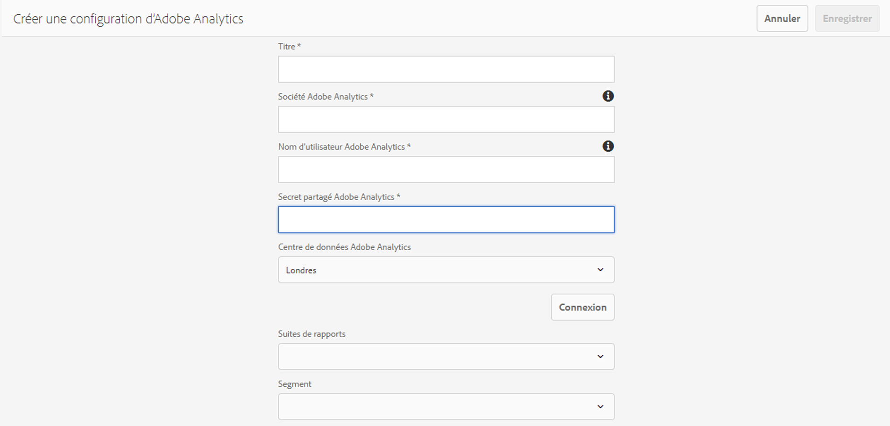

# Intégration à Adobe Analytics{#integrating-with-adobe-analytics}

L’intégration d’Adobe Analytics et d’AEM en tant que Cloud Service vous permet de suivre l’activité de votre page Web. L&#39;intégration requiert :

* à l’aide de l’interface utilisateur tactile pour créer une configuration Analytics dans AEM en tant que Cloud Service.
* ajout et configuration d’Adobe Analytics en tant qu’extension dans [Adobe Launch](#analytics-launch). Pour plus d&#39;informations sur le lancement d&#39;Adobe, consultez [cette page](https://docs.adobe.com/content/help/en/launch/using/intro/get-started/quick-start.html).

Par rapport aux versions précédentes d’AEM, la prise en charge de la structure n’est pas fournie dans la configuration Analytics en tant que Cloud Service dans AEM. Au lieu de cela, elle est désormais réalisée par le lancement d’Adobe, qui est l’outil par défaut permettant d’instrumenter un site AEM avec des fonctionnalités Analytics (bibliothèques JS). Dans Adobe Launch, une propriété est créée où l’extension Adobe Analytics peut être configurée et des règles sont créées pour envoyer des données à Adobe Analytics. Le lancement d’Adobe a remplacé la tâche d’analyse fournie par sitecatalyst.

>[!NOTE]
>
>Les clients Adobe Experience Manager as a Cloud Service qui ne disposent pas d’un compte Analytics existant peuvent demander l’accès au package Analytics Foundation pour Experience Cloud. Ce package Foundation offre une utilisation limitée en volume d’Analytics.

## Création de la configuration Adobe Analytics {#analytics-configuration}

1. Navigate to **Tools** → **Cloud Services**.
2. Select **Adobe Analytics**.
   
3. Select the **Create** button.
4. Renseignez les détails (voir ci-dessous), puis cliquez sur **Se connecter**.

### Configuration Parameters {#configuration-parameters}

Les champs de configuration présents dans la fenêtre Configuration Adobe Analytics sont les suivants :

| Propriétés | Description |
|---|---|
| Société | société de connexion Adobe Analytics |
| Nom d’utilisateur | Utilisateur de l’API Adobe Analytics |
| Mot de passe | mot de passe Adobe Analytics utilisé pour l’authentification |
| Centre de données | Centre de données Adobe Analytics auquel votre compte est associé (serveur par exemple San Jose, Londres) |
| Segment | Option permettant d’utiliser un segment Analytics défini dans la suite de rapports actuelle. Les rapports Analytics seront filtrés en fonction du segment. Consultez [cette page](https://docs.adobe.com/content/help/en/analytics/components/segmentation/seg-overview.html) pour plus de détails. |
| Suites de rapports | Référentiel dans lequel vous envoyez des données et extrayez des rapports. Une suite de rapports définit le rapports complet et indépendant sur un site Web choisi, un ensemble de sites Web ou un sous-ensemble de pages Web. Vous pouvez vue les rapports récupérés à partir d’une seule suite de rapports et modifier ce champ dans une configuration à tout moment en fonction de vos besoins. |

### ajouter une configuration à un site {#add-configuration}

Pour appliquer une configuration d’interface utilisateur tactile à un site, accédez à : **Sites** → **Sélectionner n&#39;importe quelle page** du site → **Propriétés** → **Avancé** → Configuration → sélectionner le client de configuration.****

## Intégration d’Adobe Analytics sur AEM sites à l’aide du lancement d’Adobe {#analytics-launch}

adobe analytics peut être ajouté en tant qu’extension dans la propriété Launch. Les règles peuvent être définies pour effectuer le mappage et effectuer un appel post-Adobe Analytics :

* Regardez [cette vidéo](https://docs.adobe.com/content/help/en/analytics-learn/tutorials/implementation/via-adobe-launch/basic-configuration-of-the-analytics-launch-extension.html) pour savoir comment configurer l’extension Analytics dans Lancer pour un site de base.

* Consultez [cette page](https://docs.adobe.com/content/help/en/core-services-learn/implementing-in-websites-with-launch/implement-solutions/analytics.html) pour en savoir plus sur la création de règles et l’envoi de données à Adobe Analytics.

>[!NOTE]
>
>Les structures existantes (héritées) fonctionnent toujours, mais ne peuvent pas être configurées dans l’interface utilisateur tactile. Il est conseillé de recréer les configurations de mappage de variables dans Lancement.

>[!NOTE]
>
>La configuration IMS (comptes techniques) pour le lancement est préconfigurée en AEM en tant que Cloud Service. Les utilisateurs n’ont pas à créer cette configuration.
