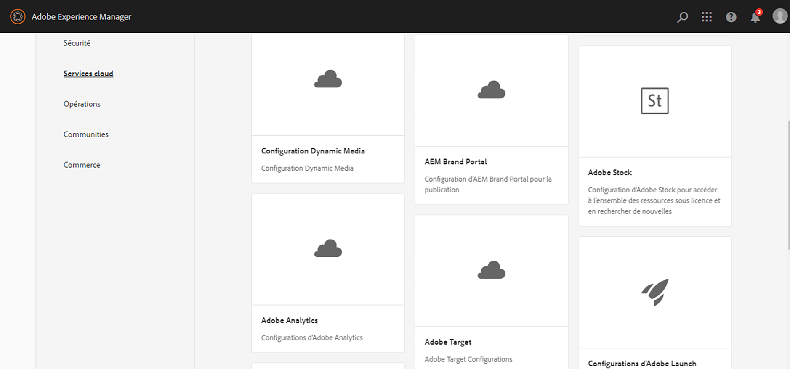
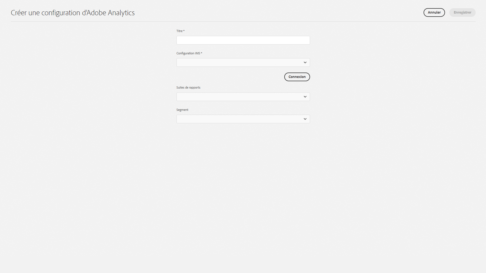

# Intégration à Adobe Analytics{#integrating-with-adobe-analytics}

L’intégration d’Adobe Analytics et d’AEM as a Cloud Service vous permet de suivre l’activité de votre page web. L’intégration nécessite :

* d’utiliser l’interface utilisateur tactile pour créer une configuration Analytics dans AEM as a Cloud Service. L’authentification IMS est requise pour intégrer Adobe Analytics à AEM as a Cloud Service.
* d’ajouter et de configurer Adobe Analytics en tant qu’extension dans [Adobe Launch](#analytics-launch). Pour plus d’informations sur Adobe Launch, vous pouvez commencer avec le [guide de démarrage rapide](https://experienceleague.adobe.com/docs/experience-platform/tags/get-started/quick-start.html?lang=fr).

Par rapport aux versions précédentes d’AEM, la prise en charge du framework n’est pas fournie dans la configuration d’Analytics dans AEM as a Cloud Service. À la place, elle est désormais assurée via Adobe Launch, qui est l’outil par défaut permettant d’instrumenter un site AEM avec des fonctionnalités Analytics (bibliothèques JS). Dans Adobe Launch, une propriété est créée où l’extension Adobe Analytics peut être configurée et des règles sont créées pour envoyer des données à Adobe Analytics. Adobe Launch a remplacé la tâche d’analyse fournie par SiteCatalyst.

>[!NOTE]
>
>Les clients Adobe Experience Manager as a Cloud Service qui ne disposent pas d’un compte Analytics existant peuvent demander l’accès à l’Analytics Foundation Pack pour Experience Cloud. Ce Foundation Pack offre une utilisation limitée en volume d’Analytics.

## Création de la configuration d’Adobe Analytics {#analytics-configuration}

1. Accédez à **Outils** → **Services cloud**.
2. Sélectionnez **Adobe Analytics**.
   
3. Cliquez sur le bouton **Créer**.
4. Renseignez les détails (voir ci-dessous), puis cliquez sur **Se connecter**.

### Paramètres de configuration {#configuration-parameters}

Les champs présents dans la fenêtre de paramétrage sont les suivants :

| Propriété | Description |
|---|---|
| Titre | Nom de la configuration |
| Configuration IMS | Sélectionnez la configuration IMS (voir le chapitre ci-dessous) |
| Segment | Option permettant d’utiliser un segment Analytics défini dans la suite de rapports actuelle. Les rapports Analytics sont filtrés en fonction du segment. Voir [À propos des segments](https://experienceleague.adobe.com/docs/analytics/components/segmentation/seg-overview.html?lang=fr) pour plus de détails. |
| Suites de rapports | Référentiel dans lequel vous envoyez des données et extrayez des rapports. Une suite de rapports définit le reporting complet et indépendant sur un site web choisi, un ensemble de sites web ou un sous-ensemble de pages web. Vous pouvez afficher les rapports récupérés à partir d’une seule suite de rapports et modifier ce champ dans une configuration à tout moment, en fonction de vos besoins. |

### Adobe Analytics avec authentification IMS {#configuration-parameters-ims}

L’intégration d’Adobe Experience Manager as a Cloud Service (AEMaaCS) avec Adobe Analytics via l’API Analytics Standard nécessite la configuration d’Adobe IMS (système Identity Management).

Voir [Configuration des intégrations IMS pour AEM as a Cloud Service](/help/security/setting-up-ims-integrations-for-aem-as-a-cloud-service.md) pour savoir comment créer la configuration IMS.

>[!NOTE]
>
>[Les intégrations IMS sont désormais configurées avec OAuth S2S](/help/security/setting-up-ims-integrations-for-aem-as-a-cloud-service.md).
>
>Auparavant, les configurations étaient effectuées avec les [informations d’identification JWT désormais sujettes à l’obsolescence dans Adobe Developer Console](/help/security/jwt-credentials-deprecation-in-adobe-developer-console.md).

### Ajout d’une configuration à un site {#add-configuration}

Pour appliquer une configuration d’interface utilisateur tactile à un site, accédez à : **Sites** → **Sélectionnez une page de site** → **Propriétés** → **Avancées** → **Configuration** → Sélectionnez le client de configuration.

## Intégration d’Adobe Analytics sur AEM Sites à l’aide d’Adobe Launch {#analytics-launch}

Adobe Analytics peut être ajouté en tant qu’extension dans la propriété Launch. Des règles peuvent être définies pour procéder au mappage et effectuer un appel POST auprès d’Adobe Analytics :

* Regardez [cette vidéo](https://experienceleague.adobe.com/docs/analytics-learn/tutorials/implementation/via-adobe-launch/basic-configuration-of-the-analytics-launch-extension.html?lang=fr) afin de savoir comment configurer l’extension Analytics dans Launch pour un site de base.

* Voir [Ajout d’Adobe Analytics](https://experienceleague.adobe.com/docs/core-services-learn/implementing-in-websites-with-launch/implement-solutions/analytics.html?lang=fr) pour plus d’informations sur la création de règles et l’envoi de données à Adobe Analytics.

>[!NOTE]
>
>La configuration IMS (comptes techniques) pour Launch est préconfigurée dans AEM as a Cloud Service. Les utilisateurs n’ont pas à créer cette configuration.

>[!NOTE]
>
>Les frameworks existants (hérités) fonctionnent toujours, mais ne peuvent pas être configurés dans l’interface utilisateur tactile. Il est conseillé de recréer les configurations de mappage de variables dans Launch.
