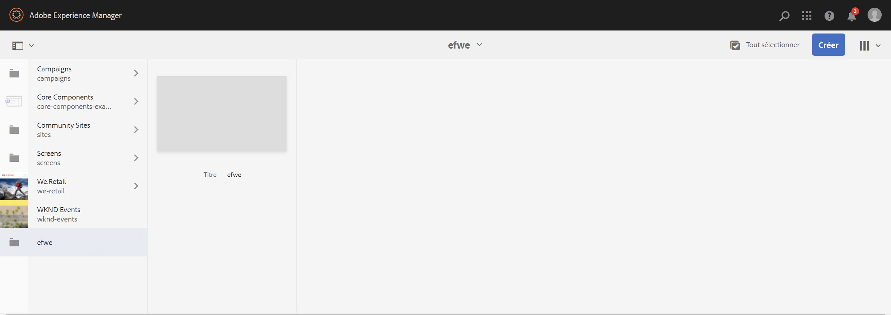
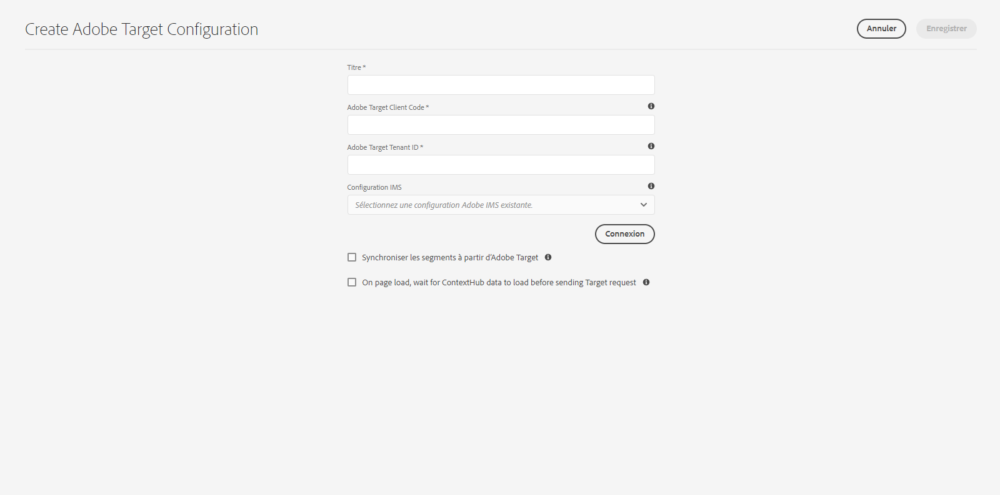

# Intégrer à Adobe Target{#integrating-with-adobe-target}

Dans le cadre d’Adobe Experience Cloud, [Adobe Target](https://experienceleague.adobe.com/fr/docs/target) vous permet d’améliorer la pertinence du contenu en effectuant un ciblage et des mesures sur tous les canaux. L’intégration d’Adobe Target et d’AEM as a Cloud Service nécessite :

* d’utiliser l’interface utilisateur tactile pour créer une configuration Target dans AEM as a Cloud Service (configuration IMS requise) ;
* d’ajouter et de configurer Adobe Target en tant qu’extension dans [Adobe Launch](https://experienceleague.adobe.com/docs/experience-platform/tags/get-started/quick-start.html?lang=fr).

Adobe Launch est nécessaire afin de gérer les propriétés côté client pour Analytics et Target dans les pages AEM (bibliothèques/balises JS). Cela dit, l’intégration à Launch est nécessaire au « ciblage d’expérience ».

Pour l’exportation de fragments d’expérience et/ou de fragments de contenu vers Target, vous avez besoin de la [configuration d’Adobe Target](#create-configuration), y compris l’intégration [IMS](#ims-configuration).

>[!NOTE]
>
>Les clientes et clients qui ne disposent pas d’un compte Target existant peuvent demander l’accès au Foundation Pack de Target pour Experience Cloud. Le Foundation Pack offre une utilisation limitée en volume de Target.

>[!NOTE]
>
>Consultez également la documentation d’Adobe Target : [ Intégration de Target à Adobe Experience Manager (AEM)](https://experienceleague.adobe.com/fr/docs/target/using/integrate/aem/aem-target-integration).

## Création de la configuration Adobe Target {#create-configuration}

1. Accédez à **Outils** → **Services cloud**.
   
2. Sélectionnez **Adobe Target**.
3. Cliquez sur le bouton **Créer**.
   
4. Renseignez les détails (voir ci-dessous), puis sélectionnez **Connexion**.
   

### Configuration IMS {#ims-configuration}

L’intégration d’AEM à Adobe Target à l’aide de l’API Target Standard nécessite la configuration d’Adobe IMS (système d’Identity Management). La configuration IMS de Target doit être créée (une fois Target configuré). Voir [Configuration des intégrations IMS pour AEM as a Cloud Service](/help/security/setting-up-ims-integrations-for-aem-as-a-cloud-service.md) et la vidéo [Intégration d’Experience Platform Launch et d’AEM](https://experienceleague.adobe.com/docs/experience-manager-learn/sites/integrations/experience-platform-data-collection-tags/overview.html?lang=fr) pour savoir comment créer la configuration IMS cible.

>[!NOTE]
>
>[Les intégrations IMS sont désormais configurées avec OAuth S2S](/help/security/setting-up-ims-integrations-for-aem-as-a-cloud-service.md).
>
>Auparavant, les configurations étaient effectuées avec les [informations d’identification JWT désormais sujettes à l’obsolescence dans Adobe Developer Console](/help/security/jwt-credentials-deprecation-in-adobe-developer-console.md).

>[!NOTE]
>
>Lors de la configuration du projet, les profils de produit affichés dépendent si vous disposez des éléments suivants :
>
>* Adobe Target Standard - Seul l’**espace de travail par défaut** est disponible.
>* Adobe Target Premium - Tous les espaces de travail disponibles sont répertoriés, comme illustré ci-dessous.

### ID de client Adobe Target et code client Adobe Target {#tenant-client}

Lors de la configuration des champs d’ID client Adobe Target et de code client Adobe Target, tenez compte des points suivants :

1. Pour la plupart des clientes et clients, l’ID de client et le code client sont identiques. Cela signifie que les deux champs contiennent les mêmes informations et sont identiques. Veillez à saisir l’identifiant du client dans les deux champs.
2. Pour des raisons d’héritage, vous pouvez également entrer différentes valeurs dans les champs d’ID client et de Code client.

Dans les deux cas :

* par défaut, le Code client (s’il est ajouté en premier) est également automatiquement copié dans le champ d’ID client ;
* Si nécessaire, vous pouvez modifier le jeu d’ID client par défaut.
* Les appels back-end vers Target sont basés sur l’ID client et les appels vers Target côté client sont basés sur le Code client.

Comme nous l’avons indiqué plus haut, le premier cas est le plus courant pour AEM as a Cloud Service. Dans les deux cas, veillez à ce que les **deux** champs contiennent les informations appropriées en fonction de vos besoins.

>[!NOTE]
>
> Si vous souhaitez modifier une configuration Target existante :
>
> 1. Saisissez de nouveau l’ID client.
> 2. Reconnectez-vous à Target.
> 3. Enregistrez la configuration.

### Modification de la configuration de Target {#edit-target-configuration}

Pour modifier la configuration de Target, procédez comme suit :

1. Sélectionnez une configuration existante et cliquez sur **Propriétés**.
2. Modifiez les propriétés.
3. Sélectionnez **Reconnecter à Adobe Target**.
4. Sélectionnez **Enregistrer et fermer**.

### Ajout d’une configuration à un site {#add-configuration}

Pour appliquer une configuration d’interface utilisateur tactile à un site, accédez à : **Sites** >**Sélectionnez une page de site** > **Propriétés** > **Avancé** > **Configuration** > Sélectionnez le client de configuration.

## Intégration d’Adobe Target dans AEM Sites à l’aide d’Adobe Launch {#integrate-target-launch}

AEM offre une intégration à Experience Platform Launch prête à l’emploi. En ajoutant l’extension Adobe Target à Experience Platform Launch, vous pouvez utiliser les fonctionnalités d’Adobe Target sur les pages web AEM. Les bibliothèques Target ne peuvent être rendues qu’à l’aide de Launch.

>[!NOTE]
>
>Les frameworks existants (hérités) fonctionnent toujours, mais ne peuvent pas être configurés dans l’interface utilisateur tactile. Adobe vous recommande de recréer les configurations de mappage de variables dans Launch.

En général, les étapes d’intégration sont les suivantes :

1. Créer une propriété Launch
2. Ajouter les extensions requises
3. Créer un élément de données (pour capturer les paramètres du hub contextuel)
4. Créer une règle de page
5. Concevoir et publier

### Création d’une propriété Launch {#create-property}

Une propriété est un conteneur qui est rempli d’extensions, de règles et d’éléments de données.

1. Sélectionnez le bouton **New Property** (Nouvelle propriété).
2. Attribuez un nom à votre propriété.
3. Saisissez comme domaine l’adresse IP/l’hôte sur lequel vous souhaitez charger la bibliothèque Launch.
4. Sélectionnez le bouton **Save** (Enregistrer).
   

### Ajout des extensions requises {#add-extension}

Les **extensions** sont le conteneur qui gère les paramètres de bibliothèque principaux. L’extension Adobe Target prend en charge les implémentations côté client en utilisant le SDK Target JavaScript pour le web moderne, at.js. Ajoutez les extensions **Adobe Target** et **Adobe ContextHub**.

1. Sélectionnez l’option Catalogue des extensions, puis recherchez Target dans le filtre.
2. Sélectionnez **Adobe Target** at.js et cliquez sur l’option Installer .
   
3. Sélectionnez le bouton **Configure** (Configurer). Notez la fenêtre de configuration avec les informations d’identification du compte Target importées et la version at.js de cette extension.
4. Sélectionnez **Save** (Enregistrer) pour ajouter l’extension Target à votre propriété Launch. Vous devriez être en mesure de voir l’extension Target répertoriée dans la liste **Installed Extensions** (Extensions installées).
   
5. Répétez les étapes ci-dessus pour rechercher l’extension **Adobe ContextHub** et l’installer (cette extension est nécessaire pour l’intégration avec les paramètres ContextHub, en fonction du ciblage effectué).

### Création d’un élément de données {#data-element}

Les **éléments de données** sont des espaces réservés vers lesquels vous pouvez mapper les paramètres du hub contextuel.

1. Sélectionnez **Data Elements** (Éléments de données).
2. Sélectionnez **Add Data Element** (Ajouter l’élément de données).
3. Fournissez le nom de l’élément de données et mappez-le à un paramètre de hub contextuel.
4. Sélectionnez **Enregistrer**.
   

### Création d’une règle de page {#page-rule}

Dans **Règle**, définissez et ordonnez une séquence d’actions qui sera exécutée sur le site pour procéder au ciblage.

1. Ajoutez un ensemble d’actions comme illustré dans la capture d’écran.
   
2. Dans Ajouter les paramètres à toutes les mBox, ajoutez l’élément de données configuré précédemment (voir élément de données ci-dessus) au paramètre envoyé dans l’appel de mBox.
   

### Concevoir et publier {#build-publish}

Pour savoir comment créer et publier, voir [page](https://experienceleague.adobe.com/docs/experience-manager-learn/aem-target-tutorial/aem-target-implementation/using-launch-adobe-io.html?lang=fr).

## Modifications de la structure de contenu entre les configurations de l’interface utilisateur classique et tactile {#changes-content-structure}

<table style="table-layout:auto">
  <tr>
    <th>Modification</th>
    <th>Configuration de l’interface utilisateur classique</th>
    <th>Configuration de l’interface utilisateur tactile</th>
    <th>Conséquences</th>
  </tr>
  <tr>
    <td>Emplacement de la configuration de Target.</td>
    <td>/etc/cloudservices/testandtarget/</td>
    <td>/conf/tenant/settings/cloudservices/target/</td>
    <td> Auparavant, plusieurs configurations étaient présentes sous /etc/cloudservices/testandtarget, mais désormais une seule configuration figure sous un client.</td>
  </tr>
</table>

>[!NOTE]
>
>Les configurations héritées sont toujours prises en charge pour les clientes et clients existants (sans possibilité de modifier des configurations ou d’en créer de nouvelles). Les configurations héritées font partie des packages de contenu chargés par les clientes et les clients à l’aide de VSTS.
