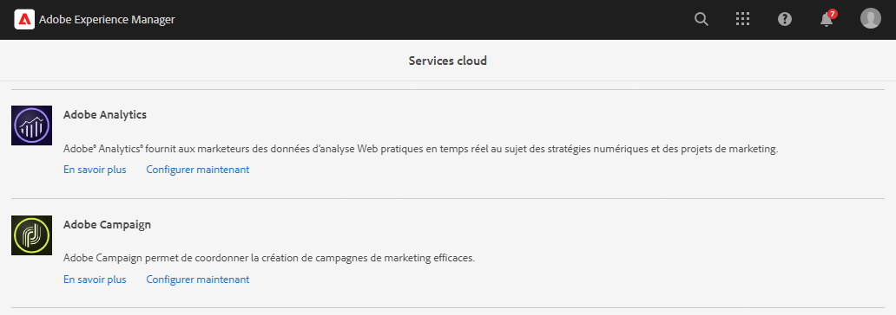
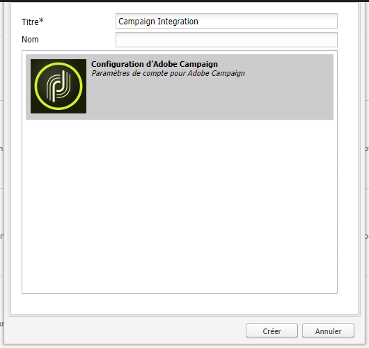
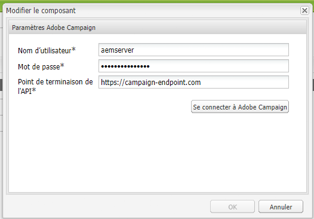

# Intégration à Adobe Campaign Classic {#integrating-campaign-classic}

En intégrant AEM as a Cloud Service à Adobe Campaign, vous pouvez gérer la diffusion email, le contenu et les formulaires directement dans AEM as a Cloud Service. Les étapes de configuration dans Adobe Campaign Classic et dans AEM as a Cloud Service sont nécessaires pour permettre la communication bidirectionnelle entre les solutions.

Cette intégration permet à AEM as a Cloud Service et à Adobe Campaign Classic d’être utilisés indépendamment. Les marketeurs peuvent créer des campagnes et utiliser le ciblage dans Adobe Campaign, tandis que les créateurs de contenu en parallèle peuvent travailler sur la conception de contenu dans AEM as a Cloud Service. L&#39;intégration permet de cibler et de diffuser le contenu et la conception de la campagne dans AEM.

## Étapes d’intégration {#integration-steps}

L&#39;intégration entre AEM et Campaign requiert un certain nombre d&#39;étapes dans les deux solutions.

1. [Installez le package d’intégration AEM dans Campaign.](#install-package)
1. [Créer un opérateur pour AEM dans Campaign](#create-operator)
1. [Configuration de l’intégration de Campaign dans AEM](#campaign-integration)
1. [Configuration de l’externaliseur d’AEM](#externalizer)
1. [Configuration de l’utilisateur distant de campagnes dans AEM](#configure-user)
1. [Configuration du compte externe AEM dans Campaign](#acc-setup)

Ce document vous guide tout au long de chacune de ces étapes.

## Conditions préalables {#prerequisites}

* Accès des administrateurs à Adobe Campaign Classic
   * Pour effectuer l’intégration, vous avez besoin d’une instance Adobe Campaign Classic opérationnelle, y compris d’une base de données configurée.
   * Si vous avez besoin de détails supplémentaires sur la configuration de Adobe Campaign Classic, reportez-vous à la section [Documentation Adobe Campaign Classic,](https://experienceleague.adobe.com/docs/campaign-classic/using/campaign-classic-home.html) notamment le guide Installation et configuration .

* Accès des administrateurs à AEM as a Cloud Service

## Installation du package d’intégration AEM dans Campaign {#install-package}

Le **Intégration AEM** dans Adobe Campaign comprend plusieurs configurations standard nécessaires pour se connecter à AEM.

1. En tant qu’administrateur, connectez-vous à l’instance Adobe Campaign à l’aide de la console cliente.

1. Sélectionner **Outils** > **Avancé** > **Importer un package...**.

   

1. Cliquez sur **Installer un package standard** puis cliquez sur **Suivant**.

1. Vérifiez les **Intégration AEM** module.

   

1. Cliquez sur **Suivant**, puis **Début** pour commencer l’installation.

   

1. Cliquez sur **Fermer** une fois l’installation terminée.

Le package d’intégration est maintenant installé.

## Création de l&#39;opérateur pour AEM dans Campaign {#create-operator}

Le package d’intégration crée automatiquement la variable `aemserver` qui AEM utilisé pour se connecter à Adobe Campaign. Vous devez définir une zone de sécurité pour cet opérateur et définir son mot de passe.

1. Connectez-vous à Adobe Campaign en tant qu’administrateur à l’aide de la console cliente.

1. Sélectionner **Outils** -> **Explorateur** dans la barre de menus.

1. Dans l’explorateur, accédez au **Administration** > **Gestion des accès** > **Opérateurs** noeud .

1. Sélectionnez la `aemserver` de l’opérateur.

1. Sur le **Modifier** de l&#39;opérateur, sélectionnez l&#39;onglet **Droits d’accès** sous-onglet , puis cliquez sur le **Editer les paramètres d&#39;accès...** lien.

   

1. Sélectionnez la zone de sécurité appropriée et définissez le masque IP de confiance selon vos besoins.

1. Cliquez sur **Enregistrer**.

1. Déconnectez-vous du client Adobe Campaign.

1. Sur le système de fichiers du serveur Adobe Campaign, accédez à l’emplacement d’installation de Campaign et modifiez la variable `serverConf.xml` en tant qu’administrateur. Ce fichier se trouve généralement sous :
   * `C:\Program Files\Adobe\Adobe Campaign Classic v7\conf` sous Windows.
   * `/usr/local/neolane/nl6/conf/eng` sous Linux.

1. Rechercher `securityZone` et assurez-vous que les paramètres suivants sont définis pour la zone de sécurité de l&#39;opérateur AEM.

   * `allowHTTP="true"`
   * `sessionTokenOnly="true"`
   * `allowUserPassword="true"`.

1. Enregistrez le fichier.

1. Assurez-vous que la zone de sécurité n’est pas écrasée par le paramètre correspondant dans la variable `config-<server name>.xml` fichier .

   * Si le fichier de configuration contient un paramètre de zone de sécurité distinct, modifiez la variable `allowUserPassword` Attribuer à `true`.

1. Si vous souhaitez modifier le port du serveur Adobe Campaign Classic, remplacez `8080` avec le port souhaité.

>[!CAUTION]
>
>Par défaut, aucune zone de sécurité n&#39;est configurée pour l&#39;opérateur. Pour que AEM se connecte à Adobe Campaign, vous devez sélectionner une zone comme décrit dans les étapes précédentes.
>
>Adobe recommande vivement de créer une zone de sécurité dédiée à AEM afin d&#39;éviter tout problème de sécurité. Pour plus d’informations sur ce sujet, reportez-vous à la section [Documentation Adobe Campaign Classic.](https://experienceleague.adobe.com/docs/campaign-classic/using/installing-campaign-classic/additional-configurations/security-zones.html)

1. Dans le client Campaign, revenez au `aemserver` et sélectionnez l’opérateur **Général** .

1. Cliquez sur le bouton **Réinitialiser le mot de passe...** lien.

1. Indiquez un mot de passe et stockez-le dans un emplacement sécurisé en vue d’une utilisation ultérieure.

1. Cliquez sur **OK** pour enregistrer le mot de passe du `aemserver` de l’opérateur.

## Configuration de l’intégration de Campaign dans AEM {#campaign-integration}

AEM utilise [l&#39;opérateur que vous avez déjà configuré dans Campaign.](#create-operator) afin de communiquer avec Campaign

1. Connectez-vous à votre instance de création AEM en tant qu’administrateur.

1. Dans le rail latéral de navigation globale, sélectionnez **Outils** > **Cloud Services** > **Cloud Services hérités** > **Adobe Campaign**, puis cliquez sur **Configurer maintenant**.

   

1. Dans la boîte de dialogue, créez une configuration de service Campaign en saisissant une **Titre** et cliquez sur **Créer**.

   

1. Une nouvelle fenêtre et une nouvelle boîte de dialogue s’ouvre pour modifier la configuration. Fournissez les informations nécessaires.

   * **Nom d’utilisateur** - Ceci est [l’opérateur de package Intégration Adobe Campaign AEM créé à l’étape précédente.](#create-operator) Par défaut, il est `aemserver`.
   * **Mot de passe** - Il s’agit du mot de passe pour [l’opérateur de package Intégration Adobe Campaign AEM créé à l’étape précédente.](#create-operator)
   * **Point de terminaison API** - Il s’agit de l’URL de l’instance Adobe Campaign.

   

1. Sélectionner **Connexion à Adobe Campaign** pour vérifier la connexion, puis cliquez sur **OK**.

AEM peut désormais communiquer avec Adobe Campaign.

>[!NOTE]
>
>Assurez-vous que votre serveur Adobe Campaign est accessible via Internet. AEM as a Cloud Service ne peut pas accéder aux réseaux privés.

## Configuration de l’externaliseur d’AEM {#externalizer}

L’externaliseur est un service OSGi d’AEM qui transforme un chemin d’accès aux ressources en URL externe et absolue, ce qui est nécessaire pour AEM diffuser du contenu que Campaign peut utiliser.

1. Connectez-vous à l’instance de création AEM en tant qu’administrateur.
1. Confirmez l’instance de publication dans la configuration de l’externaliseur en vérifiant l’image mémoire des services OSGi dans la [console de développement.](https://experienceleague.adobe.com/docs/experience-manager-learn/cloud-service/debugging/debugging-aem-as-a-cloud-service/developer-console.html#osgi-services)
1. S’il n’est pas correct, apportez les modifications nécessaires dans le référentiel git de l’instance correspondante, puis [déployez la configuration à l’aide de cloud manager.](/help/implementing/cloud-manager/deploy-code.md)

```text
Service 3310 - [com.day.cq.commons.externalizer] (pid: com.day.cq.commons.impl.externalizerImpl)",
"  from Bundle 420 - Day Communique 5 Commons Library (com.day.cq.cq-commons), version 5.12.16",
"    component.id: 2149",
"    component.name: com.day.cq.commons.impl.externalizerImpl",
"    externalizer.contextpath: ",
"    externalizer.domains: [local https://author-p17558-e33255-cmstg.adobeaemcloud.com, author https://author-p17558-e33255-cmstg.adobeaemcloud.com,
     publish https://publish-p17558-e33255-cmstg.adobeaemcloud.com]",
"    externalizer.encodedpath: false",
"    externalizer.host: ",
"    feature-origins: [com.day.cq:cq-quickstart:slingosgifeature:cq-platform-model_quickstart_author:6.6.0-V23085]",
"    service.bundleid: 420",
"    service.description: Creates absolute URLs",
"    service.scope: bundle",
"    service.vendor: Adobe Systems Incorporated",
```

>[!NOTE]
>
>L’instance de publication doit être accessible à partir du serveur Adobe Campaign.

## Configuration de l’utilisateur distant de campagne dans AEM {#configure-user}

Pour que Campaign puisse communiquer avec AEM, vous devez définir un mot de passe pour la variable `campaign-remote` utilisateur dans AEM.

1. Connectez-vous à AEM en tant qu’administrateur.
1. Dans la console de navigation principale, cliquez sur **Outils** dans le rail de gauche.
1. Cliquez ensuite sur **Sécurité** -> **Utilisateurs** pour ouvrir la console d’administration des utilisateurs.
1. Recherchez la variable `campaign-remote` utilisateur.
1. Sélectionnez la `campaign-remote` utilisateur et cliquez sur **Propriétés** pour modifier l’utilisateur.
1. Dans le **Modifier les paramètres utilisateur** fenêtre, cliquez sur **Modifier le mot de passe**.
1. Saisissez un nouveau mot de passe pour l’utilisateur et notez-le dans un emplacement sécurisé en vue d’une utilisation ultérieure.
1. Cliquez sur **Enregistrer** pour enregistrer le changement de mot de passe.
1. Cliquez sur **Enregistrer et fermer** pour enregistrer les modifications apportées au `campaign-remote` utilisateur.

## Configuration du compte externe AEM dans Campaign {#acc-setup}

When [l’installation de **Intégration AEM** package dans Campaign,](#install-package) un compte externe est créé pour AEM. En configurant ce compte externe, Adobe Campaign peut se connecter à AEM as a Cloud Service, ce qui permet une communication bidirectionnelle entre les solutions.

1. Connectez-vous à Adobe Campaign en tant qu’administrateur à l’aide de la console cliente.

1. Sélectionner **Outils** -> **Explorateur** dans la barre de menus.

1. Dans l’explorateur, accédez au **Administration** > **Plateforme** > **Comptes externes** noeud .

   

1. Recherchez le compte d’AEM externe. Par défaut, il contient les valeurs suivantes :

   * **Type** - AEM
   * **Libellé** - Instance AEM
   * **Nom interne** - aemInstance

1. Sur le **Général** de ce compte, saisissez les informations utilisateur que vous avez définies dans la variable [Définition du mot de passe utilisateur distant Campaign](#set-campaign-remote-password) étape .

   * **Serveur** - Adresse du serveur d’auteur AEM
      * Le serveur d’auteur AEM doit être accessible à partir de l’instance de serveur Adobe Campaign Classic.
      * Assurez-vous que l’adresse du serveur **not** se terminer par une barre oblique.
   * **Compte** - Par défaut, il s’agit de la variable `campaign-remote` que vous définissez dans AEM dans la variable [Définition du mot de passe utilisateur distant Campaign](#set-campaign-remote-password) étape .
   * **Mot de passe** - Ce mot de passe est le même que la variable `campaign-remote` que vous définissez dans AEM dans la variable [Définition du mot de passe utilisateur distant Campaign](#set-campaign-remote-password) étape .

1. Sélectionnez la **Activé** .

1. Cliquez sur **Enregistrer**.

Adobe Campaign peut désormais communiquer avec AEM.

## Étapes suivantes {#next-steps}

Avec Adobe Campaign Classic et AEM as a Cloud Service configurés, l’intégration est maintenant terminée.

Vous pouvez maintenant apprendre à créer une newsletter dans Adobe Experience Manager en poursuivant avec [ce document.](/help/sites-cloud/authoring/campaign/creating-newsletters.md)
