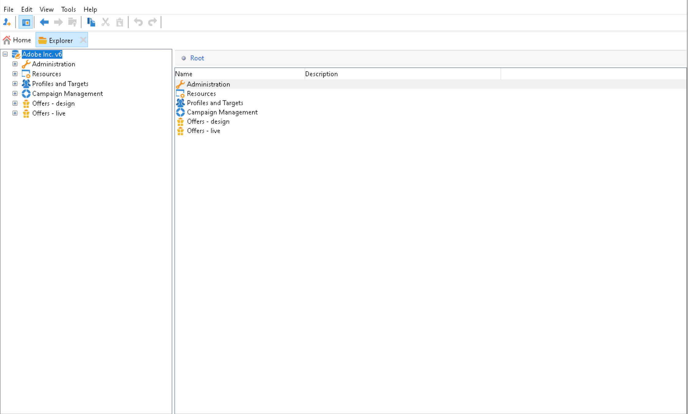

# Intégration à Adobe Campaign Classic {#integrating-campaign-classic}

En vous intégrant à Adobe Campaign, vous pouvez gérer la diffusion email, le contenu et les formulaires directement dans AEM as a Cloud Service. Les étapes de configuration dans Adobe Campaign Classic et dans AEM as a Cloud Service sont nécessaires pour permettre la communication bidirectionnelle entre les solutions.

Veuillez noter qu’AEM as a Cloud Service et Adobe Campaign Classic peuvent également être utilisés indépendamment. Par exemple, les marketeurs peuvent créer des campagnes et utiliser le ciblage dans Adobe Campaign, tandis que les créateurs de contenu peuvent travailler sur la conception dans AEM as a Cloud Service.

## Workflow d’intégration {#integration-workflow}

Les chapitres suivants décrivent comment intégrer les solutions. Cela nécessite des étapes de configuration dans Adobe Campaign Classic et dans AEM as a Cloud Service. Ainsi, vous apprendrez à :

* [Création de l’utilisateur de l’opérateur](#create-operator)
* [Configuration d’AEM as a Cloud Service pour l’intégration](#aem-configuration)
* [Configuration de l’utilisateur distant Campaign](#configure-user)
* [Configuration du compte externe Adobe Campaign Classic](#acc-setup)

### Prérequis {#prerequisites}

**Adobe Campaign Classic**

Pour effectuer l’intégration, vous devez disposer d’une instance Adobe Campaign Classic opérationnelle, y compris d’une base de données. Si vous avez besoin de détails supplémentaires sur la configuration et la configuration de Adobe Campaign Classic, veuillez lire le document officiel [Documentation Adobe Campaign Classic](https://experienceleague.adobe.com/docs/campaign-classic/using/campaign-classic-home.html) notamment le guide Installation et configuration . Pour effectuer les opérations présentées ci-dessous, vous devez également disposer du rôle d’administrateur.

**AEM as a Cloud Service**

Vous avez besoin de la variable [AEM as a Cloud Service](https://experienceleague.adobe.com/docs/experience-manager-cloud-service/content/overview/introduction.html) solution.

### Création de l’utilisateur Opérateur dans Adobe Campaign Classic {#create-operator}

Ouvrez la console cliente Adobe Campaign Classic à partir du menu de démarrage et connectez-vous. La page d’accueil doit s’afficher.

1. Cliquez sur **Explorateur** pour ouvrir la vue Explorateur.
   
1. Dans l’arborescence de gauche, accédez à **Administration -> Gestion des accès -> Opérateurs**.
1. Double-cliquez sur le `aemserver` entrée dans la liste Opérateurs à droite.
1. Basculez vers le **Modifier** . Définissez le mot de passe du serveur aemserver.
   
1. Cliquez sur le bouton **Droits d’accès** et cliquez sur l’onglet **Modification des paramètres d’accès** sous les paramètres de sécurité.
1. Sous Chiffrement, sélectionnez Réseau public comme zone de connexion autorisée. Cliquez sur **OK**.
   
1. Cliquez sur **Enregistrer**.
1. Déconnexion.
1. Accédez à l’emplacement d’installation de Adobe Campaign Classic v7, par exemple `C:\Program Files\Adobe\Adobe Campaign Classic v7\conf` et ouvrez le `serverConf.xml` en tant qu’administrateur.
   * Rechercher **zone de sécurité**.
   * Définissez les paramètres suivants `allowHTTP="true"` `sessionTokenOnly="true"` `allowUserPassword="true"`.
   * Enregistrez le fichier.
1. Assurez-vous que la zone de sécurité n’est pas écrasée par le paramètre correspondant dans `config-<server name>.xml` (C:\Program Files\Adobe\Adobe Campaign Classic v7\conf\config_acc-test.xml).
   * Si le fichier de configuration contient un paramètre de zone de sécurité distinct, modifiez la variable `allowUserPassword` sur true.
1. Si vous souhaitez modifier le port du serveur Adobe Campaign Classic, remplacez 8080 par le port souhaité (par exemple : 80).

>[!NOTE]
>
>Par défaut, aucune zone de sécurité n&#39;est configurée pour l&#39;opérateur. Pour vous connecter à Adobe Campaign avec AEM as a Cloud Service, vous devez en sélectionner un (voir les étapes ci-dessus). Nous vous recommandons vivement de créer une zone de sécurité dédiée à AEM afin d&#39;éviter tout problème de sécurité.

### Configuration d’AEM as a Cloud Service {#aem-configuration}

1. Connectez-vous à Cloud Manager et lancez l’instance d’auteur as a Cloud Service AEM.
1. Accédez à **Outils→Cloud Service→Cloud Service hérité**.
   
1. Faites défiler l’écran jusqu’à Adobe Campaign et cliquez sur le bouton **Configurer maintenant** lien.
   * Saisissez un titre.
   * Saisissez un nom.
   * Cliquez sur **Créer**.
1. Sur l’écran Modifier le composant
   * Saisissez le nom d’utilisateur, voir [Création de l’utilisateur de l’opérateur](#create-operator).
   * Saisissez le mot de passe.
   * Saisissez le point de terminaison de l’API du serveur Adobe Campaign Classic (par exemple : `http://3.22625.51:80`).
   * Cliquez sur **Se connecter à Adobe Campaign**.
   * Cliquez sur **OK**.

   >[!NOTE]
   >
   >Assurez-vous que votre serveur Adobe Campaign est accessible sur Internet car AEM as a Cloud Service ne peut pas atteindre les réseaux privés.
1. Vérifiez l’instance de publication dans la configuration de l’externaliseur de liens.
Vous pouvez afficher cette configuration en vérifiant la sauvegarde de l’état des services OSGi dans la variable [console de développement](https://experienceleague.adobe.com/docs/experience-manager-learn/cloud-service/debugging/debugging-aem-as-a-cloud-service/developer-console.html#osgi-services).
S’il n’est pas correct, apportez les modifications dans le référentiel git de l’instance correspondante, puis déployez la configuration à l’aide de [gestionnaire de cloud](https://experienceleague.adobe.com/docs/experience-manager-cloud-service/content/implementing/using-cloud-manager/deploy-code.html).

```
Service 3310 - [com.day.cq.commons.Externalizer] (pid: com.day.cq.commons.impl.ExternalizerImpl)",
"  from Bundle 420 - Day Communique 5 Commons Library (com.day.cq.cq-commons), version 5.12.16",
"    component.id: 2149",
"    component.name: com.day.cq.commons.impl.ExternalizerImpl",
"    externalizer.contextpath: ",
"    externalizer.domains: [local https://author-p17558-e33255-cmstg.adobeaemcloud.com, author https://author-p17558-e33255-cmstg.adobeaemcloud.com,
     publish https://publish-p17558-e33255-cmstg.adobeaemcloud.com]",
"    externalizer.encodedpath: false",
"    externalizer.host: ",
"    feature-origins: [com.day.cq:cq-quickstart:slingosgifeature:cq-platform-model_quickstart_author:6.6.0-V23085]",
"    service.bundleid: 420",
"    service.description: Creates absolute URLs",
"    service.scope: bundle",
"    service.vendor: Adobe Systems Incorporated",
```

>[!NOTE]
>
>L’instance de publication doit également être accessible à partir du serveur Adobe Campaign.

### Configuration de l’utilisateur distant Adobe Campaign {#configure-user}

Vous devez définir un mot de passe pour l’utilisateur distant de Campaign. Il est nécessaire pour connecter Adobe Campaign Classic à AEM as a Cloud Service.

1. Accédez à **AEM→Tools→Security→Users**.
   
1. Recherchez le `campaign-remote` et cliquez dessus.
1. Clic sur Changer de mot de passe
   * Saisissez le nouveau mot de passe deux fois.
   * Saisissez votre mot de passe AEM.
   * Cliquez sur **Enregistrer**.

### Configuration du compte externe Adobe Campaign Classic {#acc-setup}

Vous devez également configurer un compte externe pour connecter Adobe Campaign Classic à l’instance as a Cloud Service AEM.

1. Connectez-vous au serveur Adobe Campaign Classic à l’aide de la console cliente.
1. Accédez à la vue Explorateur.
1. Dans l’arborescence de gauche, accédez à **Administration→Platform→Comptes externes**.
1. En mode Liste en haut à droite, cliquez sur AEM’instance.
1. Dans la configuration de l’instance AEM
   * Saisissez AEM adresse IP/FQN de l’auteur as a Cloud Service, par exemple `https://author-p17558-e33255-cmstg.adobeaemcloud.com`.
   * Saisissez l’utilisateur et le compte.
   * Saisissez le mot de passe de l’utilisateur distant de la campagne que vous avez défini dans l’instance as a Cloud Service AEM (voir la procédure ci-dessus).
   * Sélectionnez la **Activé** .
   * Cliquez sur **Enregistrer**.

   >[!NOTE]
   >
   >L’adresse IP/le FQN du serveur d’auteur AEM doit être accessible à partir de l’instance du serveur Adobe Campaign Classic. De plus, n’ajoutez pas la barre oblique inverse dans l’IP/le FQN du serveur d’auteur AEM.

Après avoir configuré Adobe Campaign Classic et AEM as a Cloud Service, l’intégration est maintenant terminée. En outre, vous pouvez également apprendre à créer une newsletter Adobe Experience Manager en lisant [cette page](/help/sites-cloud/integrating/creating-newsletter.md).
