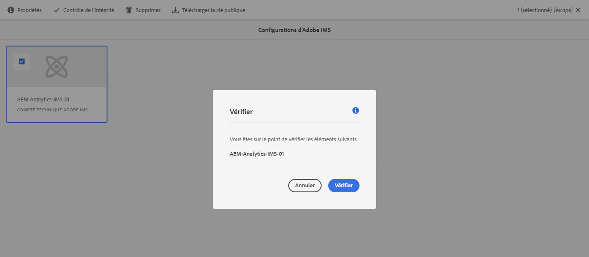

# Configuration IMS à utiliser lors de l’intégration à Adobe Analytics {#ims-configuration-for-integration-with-adobe-analytics}

L’intégration d’Adobe Experience Manager as a Cloud Service (AEMaaCS) avec Adobe Analytics via l’API Analytics Standard nécessite la configuration d’Adobe IMS (système Identity Management). La configuration est réalisée avec Adobe Developer Console.

>[!NOTE]
> 
>Cette fonctionnalité est disponible dans le canal de version préliminaire.
>
>Voir [Documentation sur les canaux de version préliminaire](https://experienceleague.adobe.com/docs/experience-manager-cloud-service/content/release-notes/prerelease.html#enable-prerelease) pour plus d’informations sur l’activation de la fonctionnalité dans votre environnement.

>[!NOTE]
>
>La prise en charge de l’API Adobe Analytics Standard 2.0 est nouvelle dans AEMaaCS 2022.2.0. Cette version de l’API prend en charge l’authentification IMS.
>
>La sélection de l’API repose sur la méthode d’authentification utilisée pour l’intégration AEM/Analytics.
>
>Des informations supplémentaires sont également disponibles sous [Migration vers les API 2.0](https://developer.adobe.com/analytics-apis/docs/2.0/guides/migration/).

## Conditions préalables {#prerequisites}

Avant de commencer cette procédure :

* [Prise en charge des Adobes](https://helpx.adobe.com/fr/contact/enterprise-support.ec.html) doit configurer votre compte pour :

   * Adobe Console
   * Console de développeur Adobe
   * Adobe Analytics et
   * Adobe IMS (système Identity Management)

* L’administrateur système de votre entreprise doit utiliser le Admin Console pour ajouter les développeurs requis de votre entreprise aux profils de produit appropriés.

   * Les développeurs spécifiques disposent ainsi des autorisations nécessaires pour activer les intégrations à l’aide d’Adobe Developer Console.
   * Pour plus d’informations, voir [Gestion des développeurs](https://helpx.adobe.com/enterprise/admin-guide.html/enterprise/using/manage-developers.ug.html).

## Configuration d’une configuration IMS - Génération d’une clé publique {#configuring-ims-generating-a-public-key}

La première étape de la configuration consiste à créer une configuration IMS dans AEM et à générer la clé publique.

1. Dans AEM, ouvrez le **Outils** .
1. Dans le **Sécurité** section select **Configurations d’Adobe IMS**.
1. Sélectionner **Créer** pour ouvrir le **Configuration du compte technique Adobe IMS**.
1. Utilisation de la liste déroulante sous **Configuration du cloud**, sélectionnez **Adobe Analytics**.
1. Activer **Création d’un certificat** et saisissez un nouvel alias.
1. Confirmer avec **Création d’un certificat**.

   

1. Sélectionner **Télécharger** (ou **Télécharger la clé publique**) pour télécharger le fichier sur votre lecteur local, afin qu’il soit prêt à être utilisé lors de la [configuration d’IMS pour l’intégration d’Adobe Analytics avec AEM](#configuring-ims-adobe-analytics-integration-with-aem).

   >[!CAUTION]
   >
   >Gardez cette configuration ouverte. Elle sera nécessaire à nouveau lorsque [Réalisation de la configuration IMS dans AEM](#completing-the-ims-configuration-in-aem).

   

## Configuration d’IMS pour l’intégration d’Adobe Analytics avec AEM {#configuring-ims-adobe-analytics-integration-with-aem}

À l’aide d’Adobe Developer Console, vous devez créer un projet (intégration) avec Adobe Analytics (pour AEM à utiliser), puis attribuer les privilèges requis.

### Création du projet {#creating-the-project}

Ouvrez Adobe Developer Console pour créer un projet avec Adobe Analytics qui AEM utiliser :

1. Ouvrez Adobe Developer Console pour les projets :

   [https://developer.adobe.com/console/projects](https://developer.adobe.com/console/projects)

1. Tous les projets que vous avez s’affichent. Sélectionner **Créer un projet** - l’emplacement et l’utilisation dépendent de :

   * Si vous n’avez pas encore de projet, **Créer un projet** sera au centre, en bas.
      
   * Si vous disposez déjà de projets, ceux-ci sont répertoriés et **Créer un projet** sera en haut à droite.
      

1. Sélectionner **Ajouter au projet** suivie de **API**:

   

1. Sélectionner **Adobe Analytics**, puis **Suivant**:

   >[!NOTE]
   >
   >Si vous êtes abonné à Adobe Analytics, mais que vous ne le voyez pas répertorié, cochez la case [Conditions préalables](#prerequisites).

   

1. Sélectionner **Compte de service (JWT)** comme type d’authentification, puis continuez avec **Suivant**:

   

1. **Chargement de votre clé publique**, puis, une fois l’opération terminée, passez à **Suivant**:

   

1. Vérifiez les informations d’identification et continuez avec **Suivant**:

   

1. Sélectionnez les profils de produit requis et continuez avec **Enregistrer l’API configurée**:

   

1. La configuration sera confirmée.

### Attribution de privilèges à l’intégration {#assigning-privileges-to-the-integration}

Vous devez maintenant attribuer les privilèges requis à l’intégration :

1. Ouvrir l’Adobe **Admin Console**:

   * [https://adminconsole.adobe.com](https://adminconsole.adobe.com/)

1. Accédez à **Produits** (barre d’outils supérieure), puis sélectionnez **Adobe Analytics - &lt;*your-tenant-id*>** (dans le panneau de gauche).
1. Sélectionner **Profils de produit**, puis l’espace de travail requis dans la liste présentée. Par exemple, Espace de travail par défaut.
1. Sélectionner **Informations d’identification de l’API**, puis la configuration d’intégration requise.
1. Sélectionner **Éditeur** comme la propriété **Rôle de produit**; au lieu de **Observateur**.

## Détails stockés pour le projet d’intégration Adobe Developer Console {#details-stored-for-the-ims-integration-project}

Dans Adobe Developer Console - Projets , vous pouvez voir la liste de tous vos projets d’intégration :

* [https://developer.adobe.com/console/projects](https://developer.adobe.com/console/projects)

Sélectionnez une entrée de projet spécifique pour afficher plus de détails sur la configuration. Celles-ci comprennent les éléments suivants :

* Présentation du projet
* Statistiques
* Informations d’identification
   * Compte de service (JWT)
      * Informations d’identification
      * Génération de JWT
* API
   * Par exemple, Adobe Analytics

Certains d’entre eux vous devrez terminer l’intégration d’Adobe Analytics dans AEM en fonction d’IMS.

## Réalisation de la configuration IMS dans AEM {#completing-the-ims-configuration-in-aem}

Pour revenir à AEM, vous pouvez terminer la configuration IMS en ajoutant les valeurs requises de l’intégration IMS pour Analytics :

1. Revenez au [Configuration IMS ouverte dans AEM](#configuring-ims-generating-a-public-key).
1. Sélectionnez **Suivant**.

1. Ici, vous pouvez utiliser la variable [détails de la configuration du projet dans Adobe Developer Console](#details-stored-for-the-ims-integration-project):

   * **Titre**: Votre texte.
   * **Serveur d’autorisation**: Copiez/collez ceci à partir du `aud` de la ligne **Payload** ci-dessous, par exemple `https://ims-na1.adobelogin.com` dans l’exemple ci-dessous
   * **Clé API**: Copiez-le depuis le **Informations d’identification** de la section [Présentation du projet](#details-stored-for-the-ims-integration-project)
   * **Secret du client**: Générez-le dans le [Onglet Secret client de la section Compte de service (JWT)](#details-stored-for-the-ims-integration-project)et copier
   * **Payload**: Copiez-le depuis le [Générez l’onglet JWT de la section Compte de service (JWT)](#details-stored-for-the-ims-integration-project)

   

1. Confirmez avec **Créer**.

1. Votre configuration Adobe Analytics s’affichera dans la console AEM.

   

## Confirmation de la configuration IMS {#confirming-the-ims-configuration}

Pour confirmer que la configuration fonctionne comme prévu :

1. Ouvrez :

   * `https://localhost<port>/libs/cq/adobeims-configuration/content/configurations.html`

   Par exemple :

   * `https://localhost:4502/libs/cq/adobeims-configuration/content/configurations.html`

1. Sélectionnez votre configuration.
1. Sélectionner **Contrôle de l’intégrité** de la barre d’outils, suivie de **Vérifier**.

   

1. En cas de réussite, un message de confirmation s’affiche.

## Fin de l’intégration avec Adobe Analytics {#complete-the-integration-with-adobe-analytics}

Vous pouvez maintenant utiliser cette configuration IMS pour terminer la [intégration avec Adobe Analytics](/help/sites-cloud/integrating/integrating-adobe-analytics.md).

<!--
## Configuring the Adobe Analytics Cloud Service {#configuring-the-adobe-analytics-cloud-service}

The configuration can now be referenced for a Cloud Service to use the Analytics Standard API:

1. Open the **Tools** menu. Then, within the **Cloud Services** section, select **Legacy Cloud Services**.
1. Scroll down to **Adobe Analytics** and select **Configure now**.

   The **Create Configuration** dialog will open.

1. Enter a **Title** and, if you want, a **Name** (if left blank this will be generated from the title).

   You can also select the required template (if more than one is available).

1. Confirm with **Create**.

   The **Edit Component** dialog will open.

1. Enter the details in the **Analytics Settings** tab:

    * **Authentication**: IMS

    * **IMS Configuration**: select the name of the IMS Configuration

1. Click **Connect to Analytics** to initialize the connection with Adobe Analytics.

   If the connection is successful, the message **Connection successful** is displayed.

1. Select **OK** on the message.

1. Complete other parameters as required, followed by **OK** on the dialog to confirm the configuration.

1. You can now proceed to [Adding an Analytics Framework](/help/sites-administering/adobeanalytics-connect.md) to configure parameters that will be sent to Adobe Analytics. 
-->
