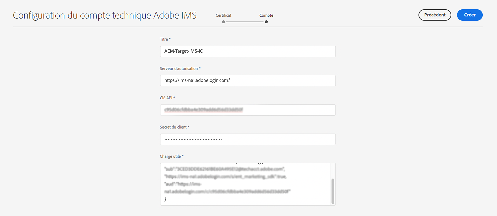

# Configuration IMS à utiliser lors de l’intégration à Adobe Target{#ims-configuration-for-integration-with-adobe-target}

L’intégration d’AEM à Adobe Target à l’aide de l’API Target Standard nécessite la configuration d’Adobe IMS (système d’Identity Management). La configuration est réalisée avec la Developer Console Adobe.

>[!NOTE]
>
>La prise en charge de l’API Adobe Target Standard est nouvelle dans AEMaaCS. L’API Target Standard utilise l’authentification IMS.
>
>La sélection de l’API repose sur la méthode d’authentification utilisée pour l’intégration AEM/Target.

## Conditions préalables {#prerequisites}

Avant de commencer cette procédure :

* L’[assistance d’Adobe](https://helpx.adobe.com/fr/contact/enterprise-support.ec.html) doit configurer votre compte pour :

   * Adobe Console
   * Developer Console d’Adobe
   * Adobe Target et
   * Adobe IMS (système d’Identity Management)

* L’administrateur système de votre entreprise doit utiliser l’Admin Console pour donner aux développeurs de votre entreprise l’accès aux profils de produit appropriés.

   * Les développeurs spécifiques disposent ainsi des autorisations nécessaires pour activer les intégrations à l’aide de la Developer Console Adobe.
   * Pour plus d’informations, consultez le document [Gestion des développeurs](https://helpx.adobe.com/fr/enterprise/admin-guide.html/enterprise/using/manage-developers.ug.html).

## Configuration d’une configuration IMS - Génération d’une clé publique {#configuring-an-ims-configuration-generating-a-public-key}

La première étape de la configuration consiste à créer une configuration IMS dans AEM et à générer la clé publique.

1. Dans AEM, ouvrez le menu **Outils**.
1. Dans la section **Sécurité**, sélectionnez **Configurations IMS d’Adobe**.
1. Sélectionnez **Créer** pour ouvrir la **Configuration du compte technique Adobe IMS**.
1. À l’aide de la liste déroulante sous **Configuration du cloud**, sélectionnez **Adobe Target**.
1. Activez **Création d’un certificat** et saisissez un nouvel alias.
1. Confirmez avec **Créer un certificat**.

   

1. Sélectionnez **Télécharger** (ou **Télécharger la clé publique**) pour télécharger le fichier sur votre lecteur local, afin qu’il soit prêt à être utilisé lors de la [configuration d’IMS pour l’intégration d’Adobe Target avec AEM](#configuring-ims-adobe-target-integration-with-aem).

   >[!CAUTION]
   >
   >Gardez cette configuration ouverte. Elle sera de nouveau nécessaire pour la [Réalisation de la configuration IMS dans AEM](#completing-the-ims-configuration-in-aem).

   

## Configuration d’IMS pour l’intégration d’Adobe Target avec AEM {#configuring-ims-adobe-target-integration-with-aem}

Créez un projet Developer Console Adobe (intégration) avec Adobe Target que AEM utilisera, puis attribuez les privilèges requis.

### Création du projet {#creating-the-project}

Ouvrez la Developer Console d’Adobe pour créer un projet avec Adobe Target qu’AEM utilisera :

1. Ouvrez la Developer Console d’Adobe pour les projets :

   [https://developer.adobe.com/console/projects](https://developer.adobe.com/console/projects)

1. Tous les projets que vous avez s’affichent. Sélectionnez **Créer un projet** - L’emplacement et l’utilisation de celui-ci dépendent de :

   * Si vous n’avez pas encore de projet, l’option **Créer un projet** sera au centre, en bas.
     
   * Si vous disposez déjà de projets, ceux-ci sont répertoriés et l’option **Créer un projet** sera en haut à droite.
     

1. Sélectionnez **Ajouter au projet**, puis **API** :

   

1. Sélectionnez **Adobe Target**, puis **Suivant** :

   >[!NOTE]
   >
   >Si vous êtes abonné à Adobe Target, mais que vous ne le voyez pas répertorié, cochez la case [Conditions préalables](#prerequisites).

   

1. **Chargez votre clé publique**, puis, une fois l’opération terminée, choisissez **Suivant** :

   

1. Vérifiez les informations d’identification et continuez avec **Suivant** :

   

1. Sélectionnez les profils de produit requis et continuez en sélectionnant **Enregistrer l’API configurée** :

   >[!NOTE]
   >
   >Les profils de produits affichés dépendent si vous disposez des éléments suivants :
   >
   >* Adobe Target Standard - Seul l’**espace de travail par défaut** est disponible.
   >* Adobe Target Premium - Tous les espaces de travail disponibles sont répertoriés, comme illustré ci-dessous.

   

1. La création sera confirmée.

<!--
1. The creation will be confirmed, you can now **Continue to integration details**; these are needed for [Completing the IMS Configuration in AEM](#completing-the-ims-configuration-in-aem).

   
-->

<!-- could not verify - only saw Adobe Target Classic -->

### Attribution de privilèges à l’intégration {#assigning-privileges-to-the-integration}

Vous devez maintenant attribuer les privilèges requis à l’intégration :

1. Ouvrez l’**Admin Console** d’Adobe :

   * [https://adminconsole.adobe.com](https://adminconsole.adobe.com/)

1. Accédez à **Produits** (barre d’outils supérieure), puis sélectionnez **Adobe Target - &lt;*your-tenant-id*>** (dans le panneau de gauche).
1. Sélectionnez **Profils de produit**, puis l’espace de travail requis dans la liste présentée. Par exemple, Espace de travail par défaut.
1. Sélectionnez **Informations d’identification de l’API**, puis la configuration d’intégration requise.
1. Sélectionnez **Éditeur** comme **Rôle de produit**, au lieu d’**Observateur**.

## Informations stockées pour le projet d’intégration de la Developer Console Adobe {#details-stored-for-the-ims-integration-project}

Dans la console Projets de la Developer Console Adobe, vous pouvez voir la liste de tous vos projets d’intégration :

* [https://developer.adobe.com/console/projects](https://developer.adobe.com/console/projects)

Sélectionnez **Affichage** (à droite d’une entrée de projet spécifique) pour afficher des détails supplémentaires sur la configuration. Ces informations comprennent les éléments suivants :

* Présentation du projet
* Insights
* Informations d’identification
   * Compte de service (JWT)
      * Détails sur l’identification
      * Génération du JWT
* Les API
   * Par exemple, Adobe Target

Pour certains d’entre eux vous devrez terminer l’intégration d’Adobe Target à AEM basée sur IMS.

## Réalisation de la configuration IMS dans AEM {#completing-the-ims-configuration-in-aem}

En retournant sur AEM, vous pouvez terminer la configuration IMS en ajoutant les valeurs requises pour l’intégration IMS pour Target :

1. Retournez dans l’instance de [Configuration IMS ouverte dans AEM](#configuring-an-ims-configuration-generating-a-public-key).
1. Sélectionnez **Suivant**.

1. Ici, vous pouvez utiliser les [informations de la configuration du projet dans la Developer Console Adobe](#details-stored-for-the-ims-integration-project) :

   * **Titre** : votre texte.
   * **Serveur d’autorisation** : copiez/collez cette information à partir de la ligne `aud` de la section **Payload** ci-dessous, par exemple `https://ims-na1.adobelogin.com` dans l’exemple ci-dessous
   * **Clé API** : copiez cette clé à partir de la section [Présentation](#details-stored-for-the-ims-integration-project) du projet.
   * **Secret du client** : générez-le dans la section [Présentation](#details-stored-for-the-ims-integration-project) du projet et copiez-le.
   * **Payload** : copiez-le à partir de la section [Génération de JWT](#details-stored-for-the-ims-integration-project).

   

1. Confirmez avec **Créer**.

1. Votre configuration Adobe Target s’affichera dans la console AEM.

   

## Confirmation de la configuration IMS {#confirming-the-ims-configuration}

Pour vous assurer que la configuration fonctionne comme prévu :

1. Ouvrez :

   * `https://localhost<port>/libs/cq/adobeims-configuration/content/configurations.html`

   Par exemple :

   * `https://localhost:4502/libs/cq/adobeims-configuration/content/configurations.html`

1. Sélectionnez votre configuration.
1. Sélectionnez **Contrôle de l’intégrité** dans la barre d’outils, puis **Vérifier**.

   

1. En cas de réussite, un message de confirmation s’affiche.

## Fin de l’intégration avec Adobe Target {#complete-the-integration-with-adobe-target}

Vous pouvez maintenant utiliser cette configuration IMS pour terminer l’[intégration avec Adobe Target](/help/sites-cloud/integrating/integrating-adobe-target.md).

<!--

## Configuring the Adobe Target Cloud Service {#configuring-the-adobe-target-cloud-service}

The configuration can now be referenced for a Cloud Service to use the Target Standard API:

1. Open the **Tools** menu. Then, within the **Cloud Services** section, select **Legacy Cloud Services**.
1. Scroll down to **Adobe Target** and select **Configure now**.

   The **Create Configuration** dialog will open.

1. Enter a **Title** and, if you want, a **Name** (if left blank this will be generated from the title).

   You can also select the required template (if more than one is available).

1. Confirm with **Create**.

   The **Edit Component** dialog will open.

1. Enter the details in the **Adobe Target Settings** tab:

    * **Authentication**: IMS

    * **Client Code**: See the [Tenant ID and Client Code](#tenant-client) section.

    * **Tenant ID**: the Adobe IMS Tenant ID. See also the [Tenant ID and Client Code](#tenant-client) section.

      >[!NOTE]
      >
      >For IMS this value needs to be taken from Target itself. You can log into Target and extract the Tenant ID from the URL.
      >
      >For example, if the URL is:
      >
      >`https://experience.adobe.com/#/@yourtenantid/target/activities`
      >
      >Then you would use `yourtenantid`.

    * **IMS Configuration**: select the name of the IMS Configuration

    * **API Type**: REST

    * **A4T Analytics Cloud Configuration**: Select the Analytics cloud configuration that is used for target activity goals and metrics. You need this if you are using Adobe Analytics as the reporting source when targeting content.   

      <!--
      If you do not see your cloud configuration, see note in [Configuring A4T Analytics Cloud Configuration](/help/sites-administering/target-configuring.md#configuring-a-t-analytics-cloud-configuration).
      -- >

    * **Use accurate targeting**: By default this check box is selected. If selected, the cloud service configuration will wait for the context to load before loading content. See note that follows.

    * **Synchronize segments from Adobe Target**: Select this option to download segments that are defined in Target to use them in AEM. You must select this option when the API Type property is REST, because inline segments are not supported and you always need to use segments from Target. (Note that the AEM term of 'segment' is equivalent to the Target 'audience'.)

    * **Client library**: Select whether you want the AT.js client library, or mbox.js (deprecated).

    * **Use Tag Management System to deliver client library**: Use DTM (deprecated), Adobe Launch or any other tag management system.

    * **Custom AT.js**: Leave blank if you checked the Tag Management box or to use the default AT.js. Alternatively upload your custom AT.js. Only appears if you have selected AT.js.

   <!--
   >[!NOTE]
   >
   >[Configuration of a Cloud Service to use the Target Classic API](/help/sites-administering/target-configuring.md#manually-integrating-with-adobe-target) has been deprecated (uses the Adobe Recommendations Settings tab).
   -- >

1. Click **Connect to Adobe Target** to initialize the connection with Adobe Target.

   If the connection is successful, the message **Connection successful** is displayed.

1. Select **OK** on the message, followed by **OK** on the dialog to confirm the configuration.

1. You can now proceed to [Adding a Target Framework](/help/sites-administering/target-configuring.md#adding-a-target-framework) to configure ContextHub or ClientContext parameters that will be sent to Target. Note this may not be required for exporting AEM Experience Fragments to Target.

### Tenant ID and Client Code {#tenant-client}

With [Adobe Experience Manager as a Cloud Service](/help/release-notes/release-notes-cloud/release-notes-current.md), the Client Code field had been added to the Target configuration window.

When configuring the Tenant ID and Client Code fields, please be aware of that for most customers, the **Tenant ID** and the **Client Code** are the same. This means that both fields contain the same information and are identical. Make sure you enter the Tenant ID in both fields.

>[!NOTE]
>
>For legacy purposes, you can also enter different values in the Tenant ID and the Client Code fields.

In both cases, be aware that:

* By default, the Client Code (if added first) will also be automatically copied into the Tenant ID field.
* You have the option to change the default Tenant ID set.
* Accordingly, the backend calls to Target will be based on the **Tenant ID** and the client side calls to Target will be based on the **Client Code**.

As stated previously, the default case is the most common for AEM as a Cloud Service. Either way, make sure **both** fields contain the correct information depending on your requirements.

>[!NOTE]
>
> If you want to change an existing Target Configuration:
>
> 1. Re-enter the Tenant ID.
> 2. Re-connect to Target.
> 3. Save the configuration.
-->
