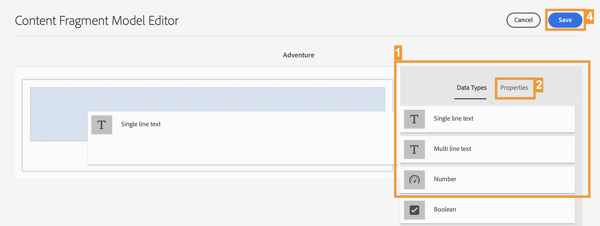

# Créer la structure de contenu pour votre application {#content-structure}

>[!CONTEXTUALHELP]
>id="aemcloud_sites_trial_admin_content_fragments_overview"
>title="Créer la structure de contenu pour votre application"
>abstract="Avec notre série de guides interactifs, vous apprendrez à créer une structure (également appelée Modèle de fragment de contenu) qui sert de base à tout votre contenu découplé."

>[!CONTEXTUALHELP]
>id="aemcloud_sites_trial_admin_content_fragments_overview_guide"
>title="Lancer la console de modèles"
>abstract="Découvrez comment créer un schéma réutilisable, appelé modèle de fragment de contenu, pour votre contenu dans Adobe Experience Manager as a Cloud Service. Regardez la vidéo pour comprendre pourquoi cette étape est importante.   Dans ce module de formation, vous utiliserez un site de voyage comme exemple et nous vous guiderons pour créer un modèle de séjour.  Lancez ce module dans un nouvel onglet en cliquant sur le bouton ci-dessous, puis suivez ce guide."
>additional-url="https://video.tv.adobe.com/v/3413261/?captions=fre_fr" text="Vidéo d’introduction à la structure de contenu"

>[!CONTEXTUALHELP]
>id="aemcloud_sites_trial_admin_content_fragments_overview_guide_footer"
>title="Félicitations ! Vous avez appris à créer un modèle de fragment de contenu pour représenter la structure de vos données découplées et vous avez réalisé la première étape de la diffusion de contenu omnicanal à l’échelle et de manière standard."
>abstract=""

## Créer un modèle {#create-model}

La console de modèles de fragments de contenu s’ouvre dans un nouvel onglet. Considérez la console de modèles de fragments de contenu comme votre bibliothèque de modèles, dans laquelle vous créez de nouveaux modèles et gérez les modèles existants.

Dans cet exemple, vous allez créer un modèle qui représente la structure de données d’un voyage présenté sur un site web de voyage. Un voyage utilisant ce modèle est appelé **Aventure**.

1. Dans le coin supérieur droit de l’écran, cliquez sur **Créer** pour commencer à créer un modèle de fragment de contenu.

1. L’assistant de création de modèles vous guide tout au long du processus de création. Fournissez les informations requises.

   * **Titre du modèle** : libellé court du modèle indiquant généralement l’objectif du modèle. Vous pouvez appeler le nouveau modèle `Adventure`.
   * **Activer le modèle** : cette option est activée par défaut et doit être cochée pour pouvoir créer des fragments de contenu basés sur ce modèle.

1. Une fois les champs obligatoires remplis, cliquez sur **Créer** en haut à droite pour créer le modèle.

1. La boîte de dialogue **Succès** confirme la création du modèle. Cliquez sur **Ouvrir** dans la boîte de dialogue pour ouvrir votre nouveau modèle de fragment de contenu dans l’éditeur, dans un nouvel onglet. Passez ensuite à l’étape suivante qui consiste à ajouter des champs de données à votre modèle.

## Utilisation de l’éditeur de modèles {#configure-model}

Nous avons maintenant un modèle appelé **Aventure**, mais il ne contient aucun détail, tel que la durée, la destination ou les activités. Avant de pouvoir utiliser votre modèle, vous devez définir la structure de ses données.

L’éditeur de modèles de fragments de contenu vous permet de configurer les types de données et les propriétés qui définissent le contenu de votre modèle.

>[!TIP]
>
>Il est important de suivre les schémas de dénomination dans les instructions suivantes, car nous allons nous référer à ces noms spécifiques dans les modules ultérieurs.

1. Faites glisser un **champ de texte monoligne** depuis le panneau **Types de données** à droite de l’éditeur et déposez-le sur votre modèle de fragment de contenu.

1. Une fois un type de données placé, la colonne **Types de données** est automatiquement remplacée par l’onglet **Propriétés** vous permettant de définir les détails du type de données que vous venez de placer. Pour ce premier champ, nous allons stocker le titre du voyage ou de l’aventure. Saisissez les propriétés suivantes :

   * **Rendre en tant que :** **Champ de texte** - Lorsque vous créez une aventure, ce champ stocke le titre de l’aventure.
   * **Libellé du champ :** `Title` - Le libellé affiché pour ce champ lors de la création d’une aventure.

1. Une fois les propriétés du champ définies, vous pouvez revenir à l’onglet **Types de données** dans le panneau de droite et ajouter des champs supplémentaires en procédant par glisser-déposer.

Ainsi, vous pouvez ajouter autant de champs que nécessaire à votre modèle pour prendre en charge le type de structure de données dont vous aurez besoin. Les types de champs de données varient, mais le processus de leur ajout à votre modèle reste le même.

Passez à la section suivante pour ajouter les champs nécessaires pour compléter et enregistrer le modèle **Aventure**

## Ajouter des champs au modèle {#additional-fields}

Vous avez déjà un champ pour le titre de l’aventure. Vous devez maintenant ajouter des champs pour capturer la description, le prix et une image représentative de l’aventure.

>[!TIP]
>
>Le modèle **Aventure** est basé sur l’exemple de site WKND pour AEM. Vous pouvez [visiter le site WKND ici](https://wknd.site/us/en/adventures/yosemite-backpacking.html) pour voir le contenu qui utilise le modèle **Adventure**.

Suivez les mêmes étapes que ci-dessus pour ajouter ces champs supplémentaires. La seule différence réside dans les propriétés que vous devez définir.

1. Ajoutez un champ pour stocker la description de l’aventure en faisant glisser et en déposant un champ de **texte multi-lignes** et saisissez les propriétés suivantes :

   * **Rendre en tant que :** **Zone de texte** - Lorsque vous créez une aventure, ce champ stocke une brève description du voyage.
   * **Libellé du champ :** `Description` - Libellé affiché pour ce champ lors de la création d’une aventure.

1. Ajoutez un champ pour stocker le prix de l’aventure en faisant glisser et en déposant un champ de **texte monoligne** et saisissez les propriétés suivantes :

   * **Rendre en tant que :** **Champ de texte** - Lorsque vous créez une aventure, ce champ stocke le prix du voyage.
   * **Libellé du champ :** `Price` - Le libellé affiché pour ce champ lors de la création d’une aventure.

1. Ajoutez un champ pour stocker une image représentant le voyage. Les images dans AEM sont stockées sous la forme d’un autre type de contenu appelé **Ressources**. Pour créer un champ à leur intention, vous devez faire glisser et déposer un champ de **référence de contenu** qui fait référence à la ressource de l’image.

   * **Rendre en tant que :** **Référence de contenu** - Lorsque vous créez une aventure, ce champ pointe vers la ressource de l’image qui représente ce voyage.
   * **Libellé du champ :** `Image` - Le libellé affiché pour ce champ lors de la création d’une aventure.
   * **Chemin racine :** `/content/dam/aem-demo-assets/en` : indique un chemin de point de départ lors de la recherche de ressources avec le sélecteur de ressources.

1. Après avoir ajouté les champs nécessaires au modèle de fragment de contenu, dans le coin supérieur droit de la fenêtre, cliquez sur **Enregistrer**.

1. Le modèle est enregistré et vous revenez à la console du modèle de fragment de contenu.
