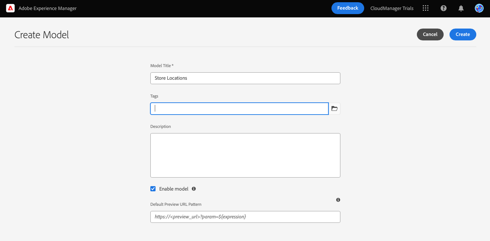

# Création de la structure de contenu pour votre application {#content-structure}

Les fragments de contenu permettent de concevoir, créer, organiser et publier du contenu indépendant des pages. Grâce à elles, vous pouvez préparer du contenu prêt à être utilisé à plusieurs emplacements et sur plusieurs canaux, idéal pour une diffusion sans interface. Les modèles de fragment de contenu sont utilisés pour définir la structure de ce contenu et sont la première chose que vous devez créer pour gérer votre contenu sans affichage.

Pour vous aider à comprendre comment cela se fait, ce module d’AEM Trials vous guide tout au long du processus avec une visite rapide et interactive, en créant d’abord le modèle, puis en ajoutant sa structure. Ce document complète la visite guidée intégrée au produit, couvrant les mêmes étapes et la liaison à des ressources supplémentaires, le cas échéant.

>[!CONTEXTUALHELP]
>id="aemcloud_sites_trial_admin_content_fragments_overview_guide_br_test"
>title="Lancement de l’éditeur de modèles"
>abstract="La création d’un modèle de fragment de contenu commence par la création d’un élément de modèle dans le workflow d’administration du modèle, puis l’ajout d’éléments de structure à l’aide de l’éditeur de modèle de fragment de contenu.  Cliquez ci-dessous pour lancer la fonctionnalité dans un nouvel onglet et suivez ce document d’apprentissage pour créer votre premier fragment de contenu."

>[!CONTEXTUALHELP]
>id="aemcloud_sites_trial_admin_content_fragments_overview_guide_newline_test"
>title="Lancement de l’éditeur de modèles"
>abstract="La création d’un modèle de fragment de contenu commence par la création d’un élément de modèle dans le workflow d’administration du modèle, puis l’ajout d’éléments de structure à l’aide de l’éditeur de modèle de fragment de contenu.\n\nCliquez ci-dessous pour lancer la fonctionnalité dans un nouvel onglet, puis suivez ce document d’apprentissage pour créer votre premier fragment de contenu."

>[!CONTEXTUALHELP]
>id="aemcloud_sites_trial_admin_content_fragments_overview"
>title="Création de la structure de contenu pour votre application"
>abstract="Lorsque vous suivez notre série de guides interactifs, vous apprendrez à créer la structure (également appelée modèle de fragment de contenu) qui sert de base à tout votre contenu sans interface."

## Console du modèle de fragment de contenu {#content-fragment-model-console}

Vous démarrez sur la console de modèles de fragments de contenu. La console de modèles de fragments de contenu peut être considérée comme votre bibliothèque de modèles. Vous utilisez la console pour créer des modèles et gérer les modèles existants. Votre console commence vide, alors créons un nouveau modèle !

Si vous souhaitez accéder vous-même à la console de modèle de fragment de contenu en dehors des instructions in-app, elle se trouve à l’aide de l’icône d’Adobe située en haut à gauche de la page. Cela ouvre la navigation globale d’AEM. À partir de là, vous choisissez la variable **Outils** puis **Général** -> **Modèles de fragment de contenu**.

>[!TIP]
>
>Si vous souhaitez en savoir plus sur la navigation dans AEM, reportez-vous à la section [Section Ressources supplémentaires](#additional-resources) de ce document pour plus d’informations sur AEM gestion de base.

## Création d’un modèle {#create-model}

Une fois que vous êtes dans la console de modèle de fragment de contenu, vous pouvez créer un modèle pour représenter votre propre contenu sans affichage.

1. Dans la console du modèle de fragment de contenu, cliquez sur le **Créer** en haut à droite de l’écran pour commencer à créer un modèle de fragment de contenu.

1. L’assistant Créer un modèle démarre et vous guide tout au long de la création d’un modèle de fragment de contenu.

   

   Fournissez les informations obligatoires.

   * **Titre du modèle** - Il s’agit d’une brève description du modèle et indique généralement son objectif.
   * **Activer le modèle** - Cette option est cochée par défaut et doit être cochée pour pouvoir créer des fragments de contenu ultérieurement sur la base de ce modèle.

   Vous pouvez également choisir d’ajouter une **Description** au modèle ainsi que **Balises** pour le classer et le différencier pour vos utilisateurs ultérieurement dans la console de modèles de fragments de contenu.

   >[!TIP]
   >
   >Si vous souhaitez savoir comment les balises peuvent organiser votre contenu, reportez-vous à la section [Section Ressources supplémentaires](#additional-resources) de ce document pour plus d’informations sur le balisage dans AEM.

1. Une fois les champs obligatoires renseignés, cliquez sur **Créer** en haut à gauche pour créer le modèle.

1. Le **Succès** confirme la création du modèle.

   

1. Avant de pouvoir utiliser le modèle, vous devez également définir la structure de ses données. Cliquez sur **Ouvrir** dans la boîte de dialogue pour l’ouvrir et continuer à définir le modèle.

## Ajouter des champs au modèle {#configure-model}

Le modèle de fragment de contenu est essentiellement un schéma pour vos fragments de contenu. C’est-à-dire qu’il définit les champs/types de données contenus dans le modèle.

À l’aide de l’éditeur de modèle de fragment de contenu, vous pouvez définir des champs pour le modèle de fragment de contenu à l’aide d’une interface par glisser-déposer.

1. Faites glisser un champ depuis le **Types de données** à droite de l’écran et déposez-le sur votre modèle de fragment de contenu. Il existe plusieurs types de données à choisir, tels qu’une seule ligne de texte, un texte multiligne, un nombre et des références à d’autres fragments.

   

   >[!TIP]
   >
   >Si vous souhaitez plus d’informations sur les types de données disponibles, reportez-vous à la section [Section Ressources supplémentaires](#additional-resources) de ce document pour consulter la documentation détaillée sur les modèles de fragments de contenu.

1. Une fois un type de données placé, la variable **Types de données** remplacée automatiquement par **Propriétés** vous permettant de définir les détails du type de données que vous venez de placer.

   

   Les propriétés du modèle peuvent inclure le nom du champ, le type du champ, la longueur du champ, s&#39;il est obligatoire, etc.

1. Utilisez la variable **Propriétés** de l’onglet du type de données sélectionné pour définir des propriétés telles que la valeur par défaut, la longueur maximale, s’il s’agit d’un champ obligatoire, etc.

   >[!TIP]
   >
   >Si vous souhaitez plus d’informations sur les propriétés disponibles, reportez-vous à la section [Section Ressources supplémentaires](#additional-resources) de ce document pour consulter la documentation détaillée sur les modèles de fragments de contenu.

1. Une fois que vous avez ajouté tous les champs nécessaires au modèle de fragment de contenu, cliquez sur **Enregistrer** en haut à droite de la fenêtre.

1. Cela enregistre le modèle et vous renvoie à la console de modèles de fragments de contenu dans laquelle vous pouvez ajouter d’autres modèles nécessaires.

## Vous avez appris à créer un modèle de fragment de contenu {#conclusion}

Dans ce module, vous avez appris à créer un modèle de fragment de contenu pour représenter la structure de vos données sans interface utilisateur graphique. Vous avez tout d’abord créé le modèle, puis vous l’avez renseigné avec les types de données et leurs propriétés associées, définissant ainsi un schéma pour votre contenu sans interface utilisateur.

Maintenant que vous disposez de votre propre modèle de fragment de contenu, vous pouvez utiliser ce modèle pour créer des fragments de contenu. Le module [Créer un contenu](create-content.md) détails pour utiliser votre nouveau modèle de fragment de contenu afin de créer du contenu sans interface utilisateur.

Vous pouvez revenir à l’écran d’accueil de votre évaluation en cliquant sur **Solutions** en haut à droite de la barre de navigation et en sélectionnant **Experience Manager**.

## Ressources supplémentaires {#additional-resources}

Pour plus d’informations sur les fragments de contenu et les AEM, consultez cette documentation supplémentaire.

* [Manipulation de base](/help/sites-cloud/authoring/getting-started/basic-handling.md) - Documentation sur la navigation et l’utilisation d’AEM pour les nouveaux utilisateurs
* [Utilisation des balises](/help/sites-cloud/authoring/features/tags.md) - Documentation sur l’utilisation des balises dans AEM pour organiser le contenu
* [Fragments de contenu](/help/assets/content-fragments/content-fragments.md) - Présentation des fragments de contenu et des liens pour obtenir une documentation complète sur les fragments de contenu
* [Modèles de fragment de contenu](/help/assets/content-fragments/content-fragments-models.md) - Documentation complète sur les modèles de fragments de contenu
* [Modèles de fragment de contenu - Types de données](/help/assets/content-fragments/content-fragments-models.md#data-types) - Détails sur les différents types de données disponibles pour les modèles de fragment de contenu
* [Modèles de fragment de contenu - Propriétés](/help/assets/content-fragments/content-fragments-models.md#data-types) - Détails sur les différentes propriétés disponibles pour les types de données des modèles de fragments de contenu
