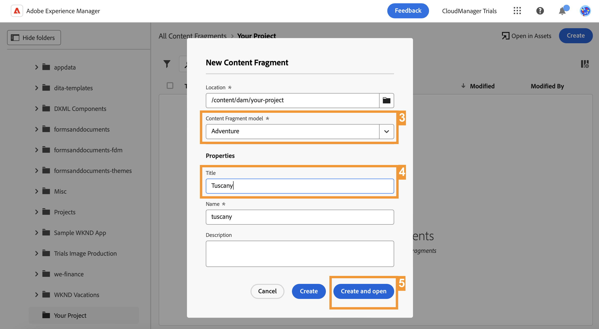

# Créer du contenu découplé {#create-content}

>[!CONTEXTUALHELP]
>id="aemcloud_sites_trial_admin_content_fragments_create_content"
>title="Créer du contenu"
>abstract="En utilisant le modèle que vous avez créé dans le module précédent, vous apprendrez à créer du contenu qui peut être utilisé pour la création de pages ou comme base à votre contenu découplé."

>[!CONTEXTUALHELP]
>id="aemcloud_sites_trial_admin_content_fragments_create_content_guide"
>title="Démarrer la console Fragments de contenu"
>abstract="La création de contenu cohérent et de haute qualité qui fonctionne en toute simplicité sur vos applications et sites Web vous permet d’offrir de superbes expériences client. Ce module vous guide tout au long de la création de votre premier fragment de contenu et vous montre comment procéder.<br><br>Lancez ce module dans un nouvel onglet en cliquant sur le bouton ci-dessous, puis suivez ce guide."

>[!CONTEXTUALHELP]
>id="aemcloud_sites_trial_admin_content_fragments_create_content_guide_footer"
>title="Très bon travail ! Dans ce module, vous avez appris à créer un fragment de contenu en fonction du modèle que vous avez créé précédemment. Vous comprenez désormais comment les équipes de contenu peuvent créer et gérer du contenu pour les applications et les sites Web, indépendamment des cycles de développement."
>abstract=""

## Créer un fragment de contenu {#create-fragment}

Les fragments de contenu représentent votre contenu découplé et sont basés sur des structures prédéfinies, appelées modèles de fragment de contenu. Vous avez déjà créé un modèle dans un module précédent.

Dans ce module, vous allez créer un fragment de contenu basé sur ce modèle à l’aide de la console Fragment de contenu . Envisagez la console Fragment de contenu comme votre bibliothèque de contenu découplé. Utilisez-la pour créer des fragments de contenu et gérer des fragments existants.

1. Appuyez ou cliquez sur le bouton **Créer** en haut à droite de la console.

1. La boîte de dialogue **Nouveau fragment de contenu** s’ouvre et vous pouvez commencer à créer un fragment de contenu. Le champ **Emplacement** est automatiquement renseigné avec l’emplacement où le nouveau contenu sera enregistré.

1. Dans le **Modèle de fragment de contenu** , sélectionnez la variable **Adventure** Modèle de fragment de contenu que vous avez créé précédemment.

1. Ajouter `Tuscany` en tant que description **Titre** pour le fragment de contenu. Cela permet d’identifier votre fragment dans la console.

1. Appuyez ou cliquez sur **Créer et ouvrir**.



>[!TIP]
>
>Selon les paramètres de votre navigateur, le nouvel onglet du navigateur peut être supprimé par un bloqueur de fenêtres contextuelles. Si votre nouveau fragment ne s’ouvre pas après avoir cliqué sur **Créer et ouvrir**, vérifiez les paramètres de votre navigateur.

## Ajout de contenu à votre fragment de contenu {#add-content}

Une fois que vous avez enregistré et ouvert votre nouveau fragment de contenu, l’éditeur de fragment de contenu s’ouvre dans un nouvel onglet. Vous pouvez y ajouter le contenu de votre nouveau fragment.

1. L’éditeur de fragment de contenu affiche les champs que vous avez définis dans le modèle sélectionné. Vous pouvez ajouter du contenu à chaque champ pour compléter votre fragment de contenu. Votre progression est enregistrée automatiquement.

1. Fournissez une **Titre** pour votre fragment en saisissant `Tuscan adventure`.

1. Fournissez une **Description** pour votre fragment en collant dans le texte suivant.

   ```text
   Visiting Tuscany on a bicycle is about experiencing the old world charm of Italy on your own terms. Your efforts on the climbs of Italy's rolling hills during this tour will be rewarded with sunny Mediterranean landscapes and unmatched Italian hospitality.  Tuscany’s natural wonders have always been a well of inspiration for arts and culture. Find out why as you explore the Italian countryside and coastline on bicycle.
   ```

1. Fournissez une **Prix** pour votre fragment en saisissant `$700`.

1. Fournissez un **Image** qui représente le déplacement en appuyant ou en cliquant sur **Ajout d’une ressource** dans le **Image** champ .

1. Dans la fenêtre contextuelle de la ressource, appuyez ou cliquez sur **Parcourir les ressources** pour effectuer une sélection à partir d’une ressource existante dans la bibliothèque de ressources.

   

1. Le **Sélectionner une ressource** s’ouvre. À l’aide du navigateur d’arborescence dans le panneau de gauche, accédez à **Toutes les ressources** > **aem-demo-assets** > **en** > **aventures** > **cycling-tuscany**.

1. Le contenu de la variable **cycling-tuscany** s’affichent à droite. Sélectionner l’image `ADOBESTOCK_141786166.JPEG`.

1. Appuyez ou cliquez sur **Sélectionner**.

   

1. L’image sélectionnée s’affiche dans le fragment de contenu. L’éditeur enregistre automatiquement les modifications.

1. Une fois que vous avez terminé d’ajouter du contenu, appuyez ou cliquez sur le bouton **Publier** en haut à droite de l’éditeur. Votre fragment de contenu peut ainsi être utilisé par des applications externes. Sélectionnez **Maintenant** dans la liste déroulante. Vous pouvez également planifier sa publication pour plus tard.

   

1. La boîte de dialogue **Publier des fragments de contenu** s’affiche. AEM effectue automatiquement une vérification des références pour s’assurer que toutes les ressources nécessaires sont publiées pour votre fragment de contenu. Dans ce cas, vous devrez également publier le modèle que vous avez créé. Cliquez ou appuyez sur **Publier**.

   

1. La publication est confirmée dans une bannière.

Votre contenu est publié et prêt à être diffusé sur votre application ou votre site Web sous la forme d’un fragment de contenu.
