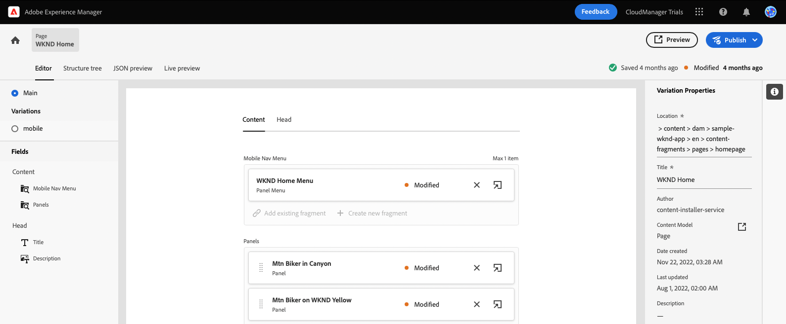
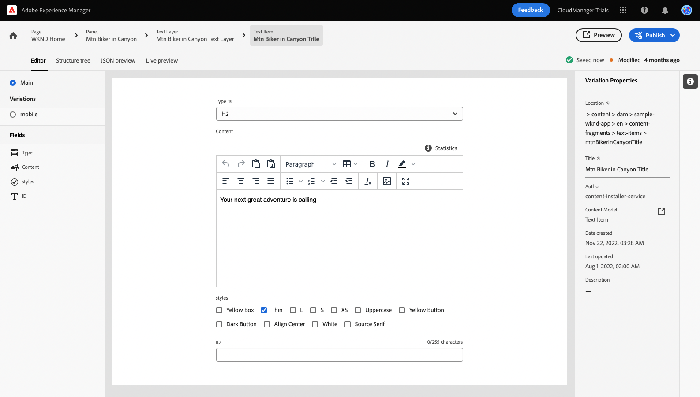
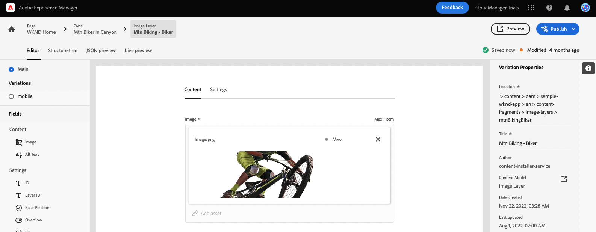

# Personnalisation du contenu d’un exemple d’application React {#customize-app}

AEM Essais pour les sans-tête est préchargé avec une simple application React pour présenter du contenu sans-tête. Dans ce module, vous apprendrez à prévisualiser cette application et à modifier son contenu en permutant une image et en créant un moment Shoppable pour elle.

L’application elle-même est basée sur la structure des fragments de contenu. À l’aide de l’éditeur de fragment de contenu d’AEM, vous pouvez modifier le contenu de vos applications. Pour vous aider à comprendre comment cela se fait, ce module d’AEM Trials vous guide tout au long du processus avec une visite rapide et interactive. Ce document sert de complément à la visite interactive, couvrant les mêmes étapes et la liaison à des ressources supplémentaires, le cas échéant.

>[!CONTEXTUALHELP]
>id="aemcloud_sites_trial_admin_content_fragments_react_app"
>title="Personnalisation du contenu dans un exemple d’application React"
>abstract="Nous avons configuré une application React moderne que vous pouvez utiliser pour apprendre à personnaliser le contenu à l’aide de l’ensemble de fonctionnalités sans interface."

>[!CONTEXTUALHELP]
>id="aemcloud_sites_trial_admin_content_fragments_react_app_guide"
>title="Lancement de l’éditeur de fragment de contenu"
>abstract="AEM Essais pour les sans-tête est préchargé avec une simple application React pour présenter du contenu sans-tête. L’application est basée sur la structure des fragments de contenu. À l’aide de l’éditeur de fragment de contenu d’AEM, vous pouvez modifier le contenu de votre application.  Lancez la fonctionnalité dans un nouvel onglet en cliquant ci-dessous, puis suivez ce guide."
>additional-url="https://video.tv.adobe.com/v/328618" text="Espace réservé pour la vidéo d’introduction"
>additional-url="https://experienceleague.adobe.com/docs/experience-manager-cloud-service/assets/home_c1.png" text="Miniature vidéo : Modification du contenu d’une application en un flash"

## Éditeur de fragment de contenu {#fragment-editor}

Vous commencez à utiliser l’éditeur de fragments de contenu pour l’exemple d’application.

Si vous souhaitez accéder vous-même à l’éditeur de fragment de contenu en dehors des instructions in-app, il se trouve à l’aide de l’icône d’Adobe située dans le coin supérieur gauche de la page. Cela ouvre la navigation globale d’AEM. À partir de là, vous choisissez la variable **Navigation** puis **Fragments de contenu**.

La console Fragment de contenu s’ouvre alors. De là, vous utilisez l’arborescence de contenu dans le panneau de gauche pour accéder à l’emplacement du contenu de l’application. Dans ce cas, sous **Fragments de contenu** -> **Exemple d’application WKND** -> **Anglais** -> **Fragments de contenu** -> **pages**.

Appuyez ou cliquez sur le bouton **Accueil WKND** fragment de page affiché dans la console à droite de l’arborescence de contenu pour lancer l’éditeur pour le contenu de l’application.

>[!TIP]
>
>Si vous souhaitez en savoir plus sur la navigation dans AEM, reportez-vous à la section [Section Ressources supplémentaires](#additional-resources) de ce document pour plus d’informations sur AEM gestion de base.

## Aperçu de l’application {#preview}

Avant de commencer à modifier l’application, vous devez d’abord vous y familiariser en prévisualisant son état actuel. Appuyez ou cliquez sur le bouton **Aperçu** en haut à droite de l’écran de l’éditeur.

L’application de démonstration s’ouvre dans un nouvel onglet.

L’application elle-même est une simple application de commerce électronique pour la marque fictive de style de vie en plein air WKND mise en oeuvre dans React. Cliquez pour parcourir l’exemple de contenu.

Revenez à l’onglet de l’éditeur de fragment de contenu pour continuer.

## Modifier le texte dans l’application {#edit-app}

Comme mentionné précédemment, l’application elle-même est composée de fragments de contenu. Ces fragments sont liés ensemble dans une structure pour créer l’application.

L’éditeur de fragment de contenu affiche la disposition de base de l’application sous la forme d’une page. Cette page est un fragment de contenu, qui est lui-même une collection d’autres fragments. Le **Panneaux** représentent différentes pages de l’application, chacune d’elles étant son propre fragment de contenu. En modifiant ces fragments, vous pouvez modifier le contenu de l’application.

1. Appuyez ou cliquez sur **Mtn Biker à Canyon** dans le **Panneaux** .

   

1. L’éditeur ouvre le panneau d’en-tête du VTT. Chaque panneau est constitué de calques représentant un contenu différent dans une page de l’application.

   

1. Sélectionner le calque de texte **Moker Mtn dans la couche de texte de canyon**. Le détail du calque s’affiche alors dans l’éditeur. Le calque est constitué de plusieurs fragments de contenu.

   

1. Sélectionnez la **Mtn Biker dans le titre du canyon** élément de texte. L’éditeur de fragment de contenu s’ouvre alors, affichant le contenu de ce fragment et vous permettant de le modifier.

   

1. Modifier le texte à partir de `Your next great adventure is calling` to `Choose your own adventure`. La modification est enregistrée automatiquement par l’éditeur.

1. Cliquez sur Aperçu pour afficher vos modifications. L’application de démonstration s’ouvre dans un nouvel onglet.

   

Revenez à l’onglet de l’éditeur de fragment de contenu pour continuer le module.

## Modification de l’image principale de l’application {#change-image}

Maintenant que vous avez modifié du texte dans l’application, essayez de modifier l’image principale de l’application. Tout d’abord, vous devez localiser ce contenu.

Les chemins de navigation situés en haut à gauche de l’éditeur indiquent où vous vous trouvez dans la hiérarchie du contenu.

1. Appuyez ou cliquez sur **Mtn Biker à Canyon** dans les chemins de navigation pour revenir à cette page.

   

1. Revenez au panneau avec les différents calques de l’application. Les calques ne représentent pas seulement du contenu textuel. Elles représentent tout le contenu de votre application. Par conséquent, vous pouvez également permuter des images à l’aide de l’éditeur de fragment de contenu.

   

1. Sélectionnez la **Mtn Biking - Biker** calque d’image. L’éditeur de fragment de contenu s’ouvre alors, affichant le contenu de ce fragment et vous permettant de le modifier.

   

1. Appuyez ou cliquez sur le bouton **X** pour supprimer l’image du motard. L’image disparaît et l’éditeur affiche une erreur, car l’image est une donnée requise pour ce modèle de fragment de contenu.

   

1. Appuyez ou cliquez sur **Ajout d’une ressource** et localisez l’image de biker jaune dans **sample-wknd-app** > **en** > **image-files**. Utilisez la vue arborescente sur le côté gauche de la **Sélectionner les ressources** pour parcourir la hiérarchie du contenu.

   

1. Filtre pour le texte `yellow`. Utilisez la variable **Recherche de toutes les ressources** en haut de la page **Sélectionner les ressources** pour rechercher l’image. Saisissez le texte de la recherche et appuyez sur Entrée ou Retour pour effectuer la recherche.

   

1. Appuyez ou cliquez sur pour sélectionner la variable `biker-yellow.png` image, puis appuyez ou cliquez sur **Sélectionner**.

   

1. L’image du motard a été remplacée par l’image sélectionnée. L’éditeur enregistre automatiquement les modifications.

   

## Création d’un moment Shoppable {#create-moment}

Maintenant que vous avez mis à jour l’image du motard, vous pouvez ajouter un moment d’achat pour les shorts jaunes du moker.

1. Commencez par revenir à l’éditeur de fragment de contenu pour le fragment de page. Les chemins de navigation situés en haut à gauche de l’éditeur indiquent où vous vous trouvez dans la hiérarchie du contenu. Appuyez ou cliquez sur **Accueil WKND** dans les chemins de navigation pour revenir à cette page.

   

1. Sélectionnez la **Mtn Biker sur WKND Yellow** du panneau.

   

1. Vous pouvez maintenant voir les calques qui composent l&#39;image du motard. Ajoutez un moment Shoppable aux shorts jaunes du moker en sélectionnant le **Vélo Mtn - Shoppable** calque.

   

1. Pour créer un moment Shoppable, vous devez créer un fragment de contenu qui représente ce moment. Appuyez ou cliquez sur le bouton **+ Créer un fragment** pour ajouter un moment Shoppable pour les shorts de motards.

   

1. Comme les fragments de contenu représentent des données structurées sans affichage, vous devez d’abord choisir un modèle sur lequel baser chaque création de fragment de contenu. Sélectionnez la **Article d’instant Shoppable** du modèle **Modèle de fragment de contenu** menu déroulant.

   

1. Donnez un nom au fragment de contenu qui représentera ce nouveau moment Shoppable. Par exemple, saisissez `Shorts` dans la **Nom** champ .

   

1. Appuyez ou cliquez sur **Créer et ouvrir**.

1. L’éditeur s’ouvre pour votre nouveau fragment de contenu.
   * Donnez un nom au moment Shoppable dans la variable **Texte** par exemple `Yellow shorts`.
   * Définissez un X et un Y, l’emplacement où ce moment Shoppable doit être superposé.
      * **X**: `-18`
      * **Y**: `-28`
   * Les modifications apportées au fragment sont automatiquement enregistrées par l’éditeur.

   

1. Appuyez ou cliquez sur **Aperçu** pour tester ce positionnement et effectuer les ajustements nécessaires.

   

## Vous avez appris à personnaliser un exemple d’application React ! {#conclusion}

Dans ce module, vous avez appris à personnaliser un exemple d’application React. Tout d’abord, vous avez appris à modifier du texte existant. Ensuite, une image a été permutée avec une autre instance de cette image. Vous avez enfin pu voir comment un élément d’instant Shoppable est créé et positionné.

Veillez à consulter le [Section Ressources supplémentaires](#additional-resources) pour obtenir des ressources supplémentaires sur l’utilisation d’AEM et de ses fragments de contenu.

Si vous souhaitez découvrir comment les fragments de contenu et le contenu headless sont créés pour être utilisés par les applications personnalisées, vous pouvez commencer par examiner le module . [Créez la structure de contenu pour votre application.](content-structure.md)

Vous pouvez revenir à l’écran d’accueil de votre évaluation en cliquant sur **Solutions** en haut à droite de la barre de navigation et en sélectionnant **Experience Manager**.

## Ressources supplémentaires {#additional-resources}

Pour plus d’informations sur les fragments de contenu et les AEM, consultez cette documentation supplémentaire.

* [Modèles de fragment de contenu](/help/assets/content-fragments/content-fragments-models.md) - Documentation complète sur les modèles de fragments de contenu
* [Fragments de contenu](/help/assets/content-fragments/content-fragments.md) - Présentation des fragments de contenu et des liens pour obtenir une documentation complète sur les fragments de contenu
* [Manipulation de base](/help/sites-cloud/authoring/getting-started/basic-handling.md) - Documentation sur la navigation et l’utilisation d’AEM pour les nouveaux utilisateurs
