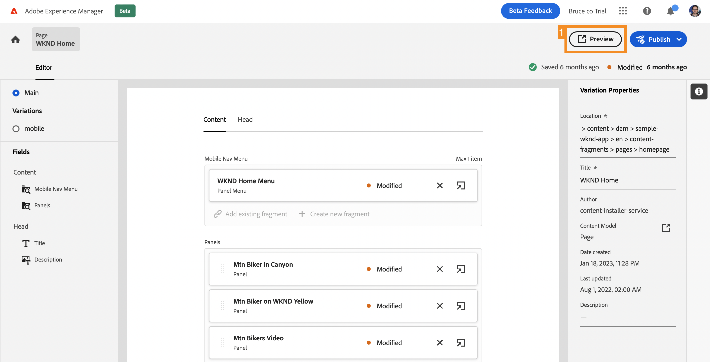
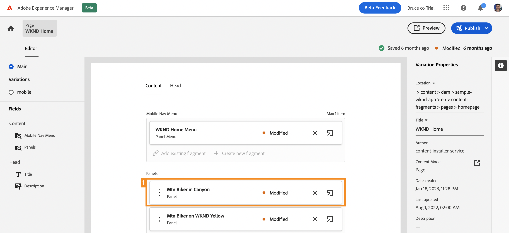

# Personnaliser du contenu dans un exemple d’application React {#customize-app}

>[!CONTEXTUALHELP]
>id="aemcloud_sites_trial_admin_content_fragments_react_app"
>title="Personnaliser du contenu dans un exemple d’application React"
>abstract="Votre essai d’AEM découplé est intégré à un exemple d’application React que vous pouvez personnaliser."

>[!CONTEXTUALHELP]
>id="aemcloud_sites_trial_admin_content_fragments_react_app_guide"
>title="Lancer l’éditeur de fragment de contenu"
>abstract="Maintenant, découvrons comment fonctionne la création de contenu sans interface. Votre essai d’AEM découplé est intégré à un exemple d’application React. Vous pouvez ainsi voir à quel point il est facile pour n’importe qui de gérer le contenu indépendamment sans avoir à passer par le temps de développement.  Lancez ce module dans un nouvel onglet en cliquant ci-dessous, puis suivez ce guide."

>[!CONTEXTUALHELP]
>id="aemcloud_sites_trial_admin_content_fragments_react_app_guide_footer"
>title="Dans ce module, vous avez appris à personnaliser un exemple d’application React.  Délai de mise sur le marché : accéléré ! Cycles de développement : réduits !  Vous comprenez maintenant à quel point la gestion du contenu découplé est facile pour les sites web et les applications gérés par les fonctionnalités découplées d’AEM."
>abstract=""

## Aperçu de l’application {#preview}

Commencez dans l’éditeur de fragment de contenu avec l’exemple d’application fourni avec votre essai d’AEM découplé déjà chargé. L’exemple d’application est optimisé par les fragments de contenu fournis via GraphQL. Utilisez l’éditeur de fragment de contenu pour vous familiariser avec l’éditeur en prévisualisant l’exemple d’application.

1. Appuyez ou cliquez sur le bouton **Aperçu** en haut à droite de l’écran de l’éditeur.

1. L’application de démonstration s’ouvre dans un nouvel onglet. L’application est pour la marque fictive de plein air WKND. Faites défiler la page vers le bas pour parcourir l’exemple de contenu.

1. Revenez à l’onglet du navigateur de l’éditeur de fragments de contenu pour continuer.

## Modifier un en-tête dans l’application {#edit-app}

L’éditeur de fragment de contenu affiche la disposition de base de l’application sous la forme d’un fragment de contenu de page. Les **Panneaux** représentent différentes pages de l’application, chacune d’elles étant son propre fragment de contenu. En modifiant ces fragments, vous pouvez changer le contenu de l’application.

1. Appuyez ou cliquez sur **Mtn Biker in Canyon** dans la section **Panneaux**.

   

1. L’éditeur ouvre le panneau d’en-tête de l’application pour le cycliste VTT. Chaque panneau est constitué de calques représentant différentes images et différents textes qui composent l’expérience.

1. Sélectionnez le calque de texte **Mtn Biker in Canyon Text Layer** pour ouvrir le détail du calque dans l’éditeur. Le calque est constitué de plusieurs fragments de contenu qui contrôlent le texte affiché dans ce panneau de l’application.

1. Sélectionnez l’élément de texte **Mtn Biker in Canyon Title**. L’éditeur de fragment de contenu s’ouvre, affichant le contenu de ce fragment et vous permettant de le modifier.

1. Remplacez le texte `Your next great adventure is calling` par `Choose your own adventure`. La modification est enregistrée automatiquement par l’éditeur.

1. Appuyez ou cliquez sur **Aperçu** en haut à droite de la fenêtre pour voir vos modifications. L’aperçu de l’application de démonstration s’ouvre dans un nouvel onglet.

   

C’est aussi simple que cela de mettre à jour le contenu d’une application React lorsqu’elle est intégrée à un CMS AEM découplé.

## Changer une image dans l’application {#change-image}

Maintenant que vous avez modifié un titre dans l’application, essayez de changer une image.

1. Revenez à l’onglet du navigateur de l’éditeur de fragments de contenu à partir de l’aperçu.

1. Vous devez revenir au bon endroit dans l’éditeur de fragment de contenu. Les chemins de navigation situés en haut à gauche de l’éditeur indiquent où vous vous trouvez dans la hiérarchie du contenu. Sélectionnez **Mtn Biker in Canyon** dans le chemin de navigation pour revenir à cette page.

   

1. Sélectionnez le calque d’image **Mtn Biking - Biker**. L’éditeur de fragment de contenu s’ouvre alors.

1. Sélectionnez la variable **X** pour supprimer l’image du motard. L’image disparaît et l’éditeur affiche une erreur, car l’image est une donnée requise pour ce modèle de fragment de contenu.

   

1. Sélectionner **Ajout d’une ressource** puis **Parcourir les ressources** dans le menu contextuel.

1. La boîte de dialogue **Sélectionner une ressource** s’ouvre et le chemin d’accès **sample-wknd-app** > **en** > **image-files** est automatiquement sélectionné.

1. Sélectionner l’image `biker-yellow.png` puis sélectionnez **Sélectionner**.

1. L’image du cycliste est remplacée par l’image sélectionnée. L’éditeur enregistre automatiquement les modifications.

1. Appuyez ou cliquez sur **Aperçu** en haut à droite de la fenêtre pour voir vos modifications. L’aperçu de l’application de démonstration s’ouvre dans un nouvel onglet. Cliquez sur Actualiser dans le navigateur pour afficher votre nouvelle image du cycliste avec un short jaune dans l’application.

Mettez à jour facilement les images et les ressources de vos applications avec le CMS découplé d’AEM.

## Ajouter une référence à un nouveau fragment de contenu dans l’application {#create-moment}

Maintenant que vous avez mis à jour l’image du cycliste, nous allons découvrir comment ajouter du nouveau contenu à une application en créant et en référençant un nouveau fragment de contenu. Vous allez ajouter un appel de produit géré par un fragment de contenu « moment d’achat » au deuxième panneau de l’application.

1. Revenez à l’onglet du navigateur de l’éditeur de fragments de contenu depuis l’onglet Aperçu.

1. Vous devez revenir au bon endroit dans l’éditeur de fragments de contenu. Les chemins de navigation situés en haut à gauche de l’éditeur indiquent où vous vous trouvez dans la hiérarchie du contenu. Appuyez ou cliquez sur **Accueil WKND** dans les chemins de navigation pour revenir à cette page.

1. Sélectionnez le panneau **Mtn Biker on WKND Yellow**.

1. Sélectionnez le calque **Mtn Biking - Shoppable**.

1. Pour créer un nouvel appel à l’extérieur sur ce panneau, vous devez créer un fragment de contenu de moment d’achat. Sélectionnez la variable **+ Créer un fragment** bouton .

   

1. Vous devez d’abord choisir un modèle sur lequel baser le nouveau fragment de contenu. Sélectionnez le modèle **Article de moment d’achat** dans le menu déroulant **Modèle de fragment de contenu**.

1. Attribuez un nom au fragment de contenu. Par exemple, saisissez `Shorts` dans le champ **Nom**.

1. Sélectionner **Créer et ouvrir**.

   

1. L’éditeur de votre nouveau fragment de contenu s’ouvre.

1. Attribuez un nom au moment d’achat dans le champ **Texte**, par exemple `Yellow shorts`.

1. Définissez les valeurs de **X** et **Y**. C’est à ce moment que cet appel doit être superposé sur le panneau. L’éditeur enregistre automatiquement les modifications du fragment.

   * **X** : `-5`
   * **Y** : `-10`

1. Appuyez ou cliquez sur **Aperçu** en haut à droite de la fenêtre pour voir vos modifications. L’aperçu de l’application de démonstration s’ouvre dans un nouvel onglet. Cliquez sur Actualiser dans le navigateur pour tester le positionnement et effectuer les ajustements nécessaires dans l’éditeur.

   

Vous savez à présent qu’il est possible de créer du contenu et le référencer en tant que fragment de contenu dans votre application sans cycles de développement.
