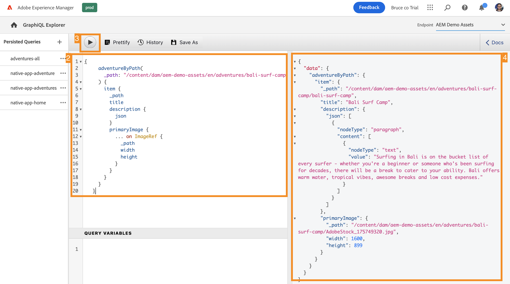

# Extraire du contenu grâce à l’API GraphQL {#extract-content}

>[!CONTEXTUALHELP]
>id="aemcloud_sites_trial_admin_content_fragments_graphql"
>title="Extraire du contenu grâce à l’API GraphQL"
>abstract="Dans ce module, vous apprendrez comment utiliser les fragments de contenu et l’API GraphQL en tant que système de gestion de contenu découplé."

>[!CONTEXTUALHELP]
>id="aemcloud_sites_trial_admin_content_fragments_graphql_guide"
>title="Lancer l’explorateur GraphQL"
>abstract="GraphQL fournit une API basée sur les requêtes qui permet aux applications clientes externes d’interroger AEM uniquement pour le contenu dont elles ont besoin, à l’aide d’un seul appel API. Dans ce module, vous apprendrez à exécuter deux types de requêtes différents. Vous découvrirez également comment récupérer le contenu du fragment de contenu que vous avez créé dans le module précédent.<br><br>Lancez ce module dans un nouvel onglet en cliquant sur le lien ci-dessous."

>[!CONTEXTUALHELP]
>id="aemcloud_sites_trial_admin_content_fragments_graphql_guide_footer"
>title="Beau travail ! Vous avez appris les deux types de requêtes de base et comment interroger votre propre contenu. Vous savez désormais comment utiliser l’API GraphQL d’AEM pour créer des requêtes efficaces qui diffusent le contenu dans un format pris en charge par votre application."
>abstract=""

## Requête pour obtenir une liste de contenu type {#list-query}

Ouvrez l’Explorateur GraphQL dans un nouvel onglet. Vous pouvez y créer et valider des requêtes sur votre contenu découplé avant de les utiliser pour alimenter le contenu de votre application ou site web.

1. Votre version d’évaluation d’AEM Headless est fournie avec un point d’entrée préchargé de fragments de contenu à partir desquels vous pouvez extraire du contenu à des fins de test. Veillez à sélectionner le point d’entrée **Ressources de démonstration AEM** dans le menu déroulant **Point d’entrée** situé dans le coin supérieur droit de l’éditeur.

1. Copiez le fragment de code suivant pour obtenir une requête de liste du point d’entrée préchargé **Ressources de démonstration AEM**. La requête de liste renvoie une liste de tout le contenu qui utilise un modèle de fragment de contenu spécifique. Les pages de stock et de catégorie utilisent généralement ce format de requête.

   ```text
   {
    adventureList {
     items {
       _path
       title
       price
       tripLength
       primaryImage {
         ... on ImageRef {
           _path
           mimeType
           width
           height
         }
       }
     }
    }
   }
   ```

1. Remplacez le contenu existant dans l’éditeur de requêtes en collant le code copié.

1. Cliquez ensuite sur le bouton **Lecture** en haut à gauche de l’éditeur de requêtes pour exécuter la requête.

1. Les résultats s’affichent dans le panneau droit, en regard de l’éditeur de requêtes. Si la requête est incorrecte, une erreur s’affiche dans le panneau droit.

   

Vous venez de valider une requête de liste afin d’obtenir une liste complète de tous les fragments de contenu. Ce processus permet de s’assurer que la réponse est bien celle attendue par votre application, avec des résultats qui illustrent la manière dont vos applications et sites web récupéreront le contenu créé dans AEM.

## Requête pour obtenir un fragment de contenu spécifique {#bypath-query}

L’exécution d’une requête byPath vous permet de récupérer le contenu d’un fragment de contenu spécifique. Les pages Détails du produit et celles qui se concentrent sur un jeu de contenu spécifique nécessitent généralement ce type de requête.

1. Copiez le fragment de code suivant pour une requête byPath du point d’entrée préchargé **Ressources de démonstration AEM**.

   ```text
    {
     adventureByPath(
       _path: "/content/dam/aem-demo-assets/en/adventures/bali-surf-camp/bali-surf-camp"
     ) {
       item {
         _path
         title
         description {
           json
         }
         primaryImage {
           ... on ImageRef {
             _path
             width
             height
           }
         }
       }
     }
   }
   ```

1. Remplacez le contenu existant dans l’éditeur de requêtes en collant le code copié.

1. Cliquez ensuite sur le bouton **Lecture** en haut à gauche de l’éditeur de requêtes pour exécuter la requête.

1. Les résultats s’affichent dans le panneau droit, en regard de l’éditeur de requêtes. Si la requête est incorrecte, une erreur s’affiche dans le panneau droit.

   

Vous venez de valider une requête byPath pour récupérer un fragment de contenu spécifique identifié par le chemin d’accès de ce fragment.

## Interroger votre propre contenu {#own-queries}

Maintenant que vous avez exécuté les deux principaux types de requêtes, vous êtes prêt à interroger votre propre contenu.

1. Pour exécuter des requêtes sur vos propres fragments de contenu, remplacez le point d’entrée du dossier **Ressources de démonstration AEM** par le dossier **Votre projet**.

1. Supprimez tout le contenu existant dans l’éditeur de requêtes. Saisissez ensuite le crochet ouvert `{` et appuyez sur Ctrl + Espace ou Option + Espace pour obtenir la liste de saisie automatique des modèles définis dans votre point d’entrée. Sélectionnez le modèle que vous avez créé et qui se termine par `List` dans les options. Si vous avez suivi les exemples des modules précédents, vous devriez trouver `adventureList` dans la liste de saisie automatique.

   

1. Définissez les éléments que la requête doit contenir pour le modèle de fragment de contenu que vous avez sélectionné. Saisissez une nouvelle fois le crochet ouvert `{`, puis appuyez sur Ctrl + Espace ou Option + Espace pour obtenir une liste de saisie automatique. Sélectionnez `items` dans le menu des options.

1. Appuyez ou cliquez sur le bouton **Enjoliver** pour mettre automatiquement en forme votre code afin qu’il soit plus facile à lire.

1. Une fois l’opération terminée, appuyez ou cliquez sur le bouton **Lecture** en haut à gauche de l’éditeur pour exécuter la requête. L’éditeur complète automatiquement les `items`, qui sont brièvement surlignées en jaune, et la requête s’exécute.

1. Les résultats s’affichent dans le panneau de droite, à côté de l’éditeur de requêtes.

   

C’est ainsi que votre contenu peut être diffusé aux expériences numériques omnicanales.

## Requêtes persistantes {#persisted-queries}

Les requêtes persistantes constituent le mécanisme privilégié pour exposer l’API GraphQL aux applications clientes. Une fois qu’une requête est persistante, vous pouvez la demander à l’aide d’une requête GET et la mettre en cache pour une récupération rapide.

Vous allez créer une requête persistante qui inclut les données que vous souhaitez consommer à partir de votre application cliente.

1. Vous allez utiliser les données que vous avez créées précédemment en tant que fragment de contenu. Assurez-vous donc que le point d’entrée **Votre projet** est sélectionné dans le menu déroulant **Point d’entrée** dans le coin supérieur droit de l’éditeur.

1. Copiez l’extrait code suivant.

   ```text
      {
      adventureList {
       items {
         title
         description {
           plaintext
         }
         price
         image {
           ... on ImageRef {
             _publishUrl
             mimeType
           }
         }
       }
     }
   }
   ```

1. Remplacez le contenu existant dans l’éditeur de requêtes en collant le code copié.

   >[!NOTE]
   >
   >Si vous n’avez pas utilisé les mêmes descriptions de champ que celles décrites dans les modules précédents, vous devez mettre à jour les noms de champ dans cette requête.
   >
   >Utilisez la fonction de saisie automatique GraphQL (Ctrl+Espace ou Option+Espace) comme décrit précédemment pour identifier les propriétés disponibles.

1. Cliquez ensuite sur le bouton **Lecture** en haut à gauche de l’éditeur de requêtes pour exécuter la requête.

1. Les résultats s’affichent dans le panneau droit, en regard de l’éditeur de requêtes. Si la requête est incorrecte, une erreur s’affiche dans le panneau droit.

   

1. Une fois la requête créée, cliquez sur le bouton **Enregistrer sous** dans la partie supérieure de l’éditeur de requêtes pour la conserver.

1. Dans le pop-up **Nom de la requête**, attribuez le nom `adventure-list` à votre requête.

1. Sélectionnez **Enregistrer comme**.

   

1. La persistance de la requête est confirmée par un message de bannière en bas de l’écran. La requête apparaît désormais également dans le panneau de gauche des requêtes persistantes dans la fenêtre.

1. Pour que la requête persistante soit disponible publiquement, vous devez la publier, tout comme pour vos fragments de contenu. Cliquez sur le bouton **Publier** en haut à droite de l’éditeur de requêtes pour publier la requête.

1. La publication est confirmée par une notification de bannière.

Vous disposez désormais d’une nouvelle requête persistante qui ne contiendra que les propriétés et les formats spécifiques que vous avez définis.
