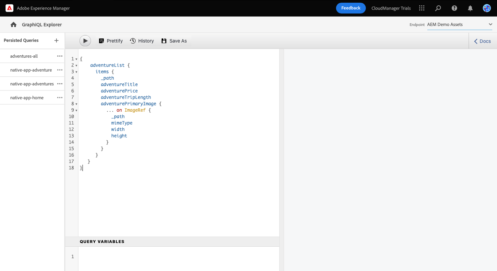
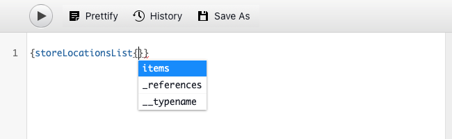

# Extraction de contenu via l’API GraphQL {#extract-content}

Jusqu&#39;à présent dans AEM procès pour sans tête, vous avez [création de vos propres modèles de fragments de contenu ;](content-structure.md) et créer votre propre contenu sans tête ; [Fragments de contenu.](create-content.md) Vous pouvez maintenant apprendre à utiliser les fragments de contenu et l’API GraphQL en tant que système de gestion de contenu sans interface pour diffuser votre contenu.

GraphQL fournit une API basée sur les requêtes qui permet aux applications clientes externes d’interroger AEM uniquement le contenu dont elles ont besoin à l’aide d’un seul appel API.

Tout d’abord, vous apprendrez à exécuter deux types de requêtes différents : **list** et **byPath** requêtes. Vous apprendrez ensuite comment récupérer du contenu à partir du fragment de contenu que vous avez créé précédemment. Ce document sert de complément à la visite interactive, couvrant les mêmes étapes et la liaison à des ressources supplémentaires, le cas échéant.

>[!TIP]
>
>Si vous souhaitez plus d’informations sur l’API GraphQL, reportez-vous à la section [Section Ressources supplémentaires](#additional-resources) à la fin de ce module pour le guide de l’API GraphQL.

>[!CONTEXTUALHELP]
>id="aemcloud_sites_trial_admin_content_fragments_graphql"
>title="Extraction de contenu à l’aide de l’API GraphQL"
>abstract="Dans ce module, vous découvrirez comment utiliser les fragments de contenu et l’API GraphQL en tant que système de gestion de contenu sans affichage."

## Explorateur GraphQL {#graphql-explorer}

Vous démarrez dans l’Explorateur GraphQL. Vous pouvez créer et exécuter des requêtes sur votre contenu sans affichage.


Si vous souhaitez accéder à l’Explorateur GraphQL vous-même en dehors des instructions in-app, il se trouve à l’aide de l’icône d’Adobe située en haut à gauche de la page. Cela ouvre la navigation globale d’AEM. À partir de là, vous choisissez la variable **Outils** puis **Général** -> **Éditeur de requêtes GraphQL**.

>[!TIP]
>
>Si vous souhaitez en savoir plus sur la navigation dans AEM, reportez-vous à la section [Section Ressources supplémentaires](#additional-resources) de ce document pour plus d’informations sur AEM gestion de base.

AEM les essais sont accompagnés d’un point de terminaison préchargé avec du contenu à partir duquel vous pouvez extraire le contenu à des fins de test.


Sélectionnez la **AEM des ressources de démonstration** point d’entrée à partir de la fonction **Point d’entrée** menu déroulant dans le coin supérieur droit de l’éditeur, le cas échéant.

## Copie et exécution d’une requête de liste {#list-query}

Commencez par une requête de liste simple afin de vous orienter sur le fonctionnement des API GraphQL d’AEM as a Cloud Service. Cet exemple de requête de liste renvoie une liste de tout le contenu qui utilise un modèle de fragment de contenu spécifique. Les pages de stock et de catégorie utilisent généralement ce format de requête.

1. Copiez le fragment de code suivant.

   ```text
   {
       adventureList {
         items {
            _path
            adventureTitle
            adventurePrice
            adventureTripLength
            adventurePrimaryImage {
              ... on ImageRef {
               _path
               mimeType
               width
               height
             }
           }
         }
      }
    }
   ```

1. Remplacez ensuite le contenu existant dans l’éditeur de requêtes en collant le code copié.

   

1. Une fois collé, cliquez sur le bouton **Play** en haut à gauche de l’éditeur de requêtes pour exécuter la requête.

1. Une fois la requête exécutée, les résultats s’affichent dans le panneau de droite, en regard de l’éditeur de requêtes. Si la requête est incorrecte, une erreur s’affiche dans le panneau de droite.

   

Vous venez de valider une requête de liste pour une liste complète de tous les fragments de contenu. Ce processus permet de s’assurer que la réponse correspond à l’attente de votre application, avec des résultats qui illustrent la manière dont vos applications et sites web récupéreront le contenu créé dans AEM.

Les différents canaux et plateformes sur lesquels votre contenu doit apparaître peuvent désormais utiliser cette requête ou similaire pour récupérer votre contenu sans interface.

## Copie et exécution d’une requête byPath {#bypath-query}

L’exécution d’une requête byPath vous permet de récupérer des ressources pour un fragment de contenu spécifique. Les pages Détails du produit et les pages qui se concentrent sur un ensemble spécifique de contenu nécessitent généralement ce type de requête.

1. Copiez le fragment de code suivant.

   ```text
    {
     adventureByPath(
       _path: "/content/dam/aem-demo-assets/en/adventures/bali-surf-camp/bali-surf-camp"
     ) {
       item {
         _path
         adventureTitle
         adventureDescription {
           json
         }
         adventurePrimaryImage {
           ... on ImageRef {
             _path
             width
             height
           }
         }
       }
     }
   }
   ```

1. Remplacez ensuite le contenu existant dans l’éditeur de requêtes en collant le code copié.

   

1. Une fois collé, cliquez sur le bouton **Play** en haut à gauche de l’éditeur de requêtes pour exécuter la requête.

1. Une fois la requête exécutée, les résultats s’affichent dans le panneau de droite, en regard de l’éditeur de requêtes. Si la requête est incorrecte, une erreur s’affiche dans le panneau de droite.

1. Une fois la requête exécutée, les résultats s’affichent dans le panneau de droite, en regard de l’éditeur de requêtes. Si la requête est incorrecte, une erreur s’affiche dans le panneau de droite.

   

Vous venez de valider une requête de liste pour une liste complète de tous les fragments de contenu. Ce processus permet de s’assurer que la réponse correspond à l’attente de votre application, avec des résultats qui illustrent la manière dont vos applications et sites web récupéreront le contenu créé dans AEM.

Les différents canaux et plateformes sur lesquels votre contenu doit apparaître peuvent désormais utiliser cette requête ou similaire pour récupérer votre contenu sans interface.

## Exécution de requêtes sur votre propre contenu {#own-queries}

Maintenant que vous avez exécuté les deux Principaux types de requêtes, vous êtes prêt à configurer et exécuter des requêtes pour le contenu que vous avez créé vous-même.

1. Pour exécuter des requêtes sur vos propres fragments de contenu, modifiez le point de terminaison à partir du **AEM des ressources de démonstration** vers le dossier **Votre projet** dossier.

   

1. Vous devez d&#39;abord sélectionner et supprimer tout le contenu existant dans l&#39;éditeur de requêtes. Saisissez ensuite un crochet ouvert. `{` et appuyez sur Ctrl+Espace ou Option+Espace pour obtenir la liste à saisie automatique des modèles définis dans votre modèle de fragment de contenu. Sélectionnez le modèle que vous avez créé et qui se termine par `List` dans la liste.

   

1. Définissez les éléments que la requête doit contenir pour le modèle de fragment de contenu que vous avez sélectionné. Encore une fois, tapez crochet ouvert. `{`, puis appuyez sur Ctrl+Espace ou Option+Espace pour obtenir une liste à saisie automatique. Sélectionner `items` dans la liste.

   

1. Définissez les champs que la requête doit contenir pour le modèle de fragment de contenu que vous avez sélectionné. Encore une fois, tapez crochet ouvert. `{`, puis appuyez sur Ctrl+Espace ou Option+Espace pour obtenir une liste de saisie automatique des champs disponibles dans le modèle de fragment de contenu. Sélectionnez dans la liste les champs de votre modèle.

   

1. Délimitez plusieurs champs à l’aide d’une virgule (`,`) ou espace et appuyez à nouveau sur Ctrl+Espace ou Option+Espace pour sélectionner des champs supplémentaires.

1. Au fur et à mesure que vous travaillez, vous pouvez appuyer ou cliquer sur le bouton **Prettify** pour formater automatiquement votre code afin qu’il soit plus facile à lire.

   

1. Une fois l’opération terminée, appuyez ou cliquez sur l’icône **Play** en haut à gauche de l’éditeur pour exécuter la requête.

   

C’est ainsi que votre contenu peut être diffusé aux expériences numériques omnicanal. Voir [Section Ressources supplémentaires](#additional-resources) pour d’autres exemples de requêtes et découvrez ce que vous pouvez faire de plus avec l’API GraphQL.

## Vous avez appris à interroger du contenu ! {#conclusion}

Très bon travail ! Vous avez appris les deux types de requêtes de base et comment interroger votre propre contenu. Veillez à consulter le [Section Ressources supplémentaires](#additional-resources) pour d’autres exemples de requêtes et découvrez ce que vous pouvez faire de plus avec l’API GraphQL.

Si vous souhaitez découvrir comment le contenu extrait est ensuite utilisé dans une application React personnalisée, veillez à consulter le module . [Personnalisation du contenu dans un exemple d’application React.](customize-app.md)

Vous pouvez revenir à l’écran d’accueil de votre évaluation en cliquant sur **Solutions** en haut à droite de la barre de navigation et en sélectionnant **Experience Manager**.


## Ressources supplémentaires {#additional-resources}

Pour plus d’informations sur les fragments de contenu et les AEM, consultez cette documentation supplémentaire.

* [Guide de l’API GraphQL](https://experienceleague.adobe.com/docs/experience-manager-learn/getting-started-with-aem-headless/graphql/multi-step/explore-graphql-api.html)
* [Manipulation de base](/help/sites-cloud/authoring/getting-started/basic-handling.md) - Documentation sur la navigation et l’utilisation d’AEM pour les nouveaux utilisateurs
* [Apprendre à utiliser GraphQL avec AEM – Exemple de contenu et de requêtes](https://experienceleague.adobe.com/docs/experience-manager-cloud-service/content/headless/graphql-api/sample-queries.html)
